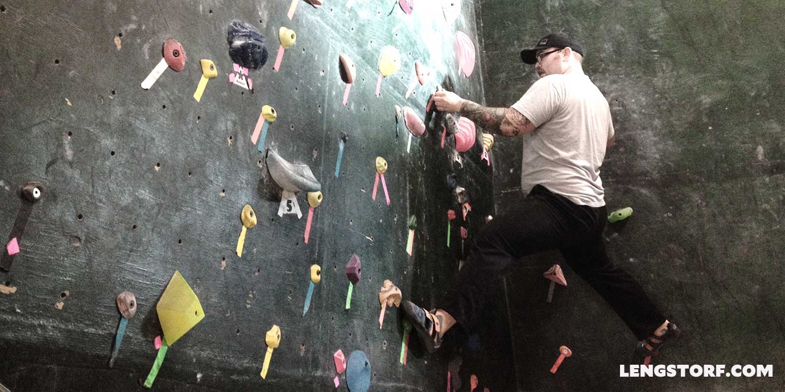

import { Image } from '$components';

Ali and I got invited to go bouldering with our friends Nate and Chris today. I
like Nate, I like Chris, and I like bouldering, but I almost turned them down.

Not because I wasn't up to it, but because I had "too much to do".

## I'm Too Busy for Fun

This Wednesday, I fly to Miami. (My Christmas gift to Ali is a week in warmer
weather, though the weather report says we may be headed directly into a
thunderstorm.)

No later than Friday, I'm on the hook for two different logos, a home page
design, and two front end builds, plus a bunch of maintenance tasks and
revisions on in-progress designs.

And somewhere in between all that I still have to do the general day-to-day work
stuff.

It's not exactly an easy week.

Knowing this, my instinct is to go _Full Metal Hermit_ and decline any and all
social invitations, opting instead for sixteen-hour coding binges fueled by
espresso and pizza delivery.

Just crank until it's done, right?

## Rush, Binge, Repeat

Two years ago, that's exactly what I would have done. I would have buried myself
in my todo list — at the expense of my physical and emotional health — for the
sake of my getting everything on my list knocked out.

The list would get done, but I'd be burned out, and **I'd spend a week
recovering from the marathon.** Meanwhile, my todo list would keep growing, and
I'd find myself fully recovered just in time for the next marathon.

Something was broken.

## Less Time to Work Inspires Higher-Quality Work

In the aftermath of one of these binges, I made the decision to try something
different the next time: instead of cutting off my social life, _I'd accept
every invitation_[^within-reason] and try to actually enjoy my life.

[^within-reason]:
  Within reason. If I had two or three invitations on the same day, I would sometimes pass.

So I started going to happy hours, and watching football games, and lots of
other things that were fun for me.

The weird part, though, was that I wasn't falling behind. In fact, **_I was
getting more done._**

## All Work and No Play

I haven't officially measured this, but I think the reasons being more social
led me to get more done are twofold:

1. There was a finite window of time in which I could get work done, which
   prevented me from screwing around _pretending_ to work
2. I was taking breaks, which prevented the burnout that work binges would cause

## If It's Important, Make Time

<Image
  caption="I put on a tough act, but I'm only about 10 inches off the ground in this photo."
  creditType="Credit"
  credit="Alison Porter"
>

  

</Image>

So today, I went bouldering. I had breakfast with my friends afterward. And you
know what? **I'll still get my list finished.**

I'm even hopeful that, with my upcoming [No Distractions Experiment](/no-distractions-experiment) on
Tuesday, I might actually catch up for one fleeting, glorious afternoon.

_Building a work-life balance has helped me strengthen my social life **and
boosted my productivity**,_ but if I hadn't questioned my instinct, I might
still be lonely and burned out.

How's your work:life balance? Let me know on the popular social networking site
known as Bookface.[^office]

[^office]:
  Quote lifted without a hint of shame from _The Office_.
