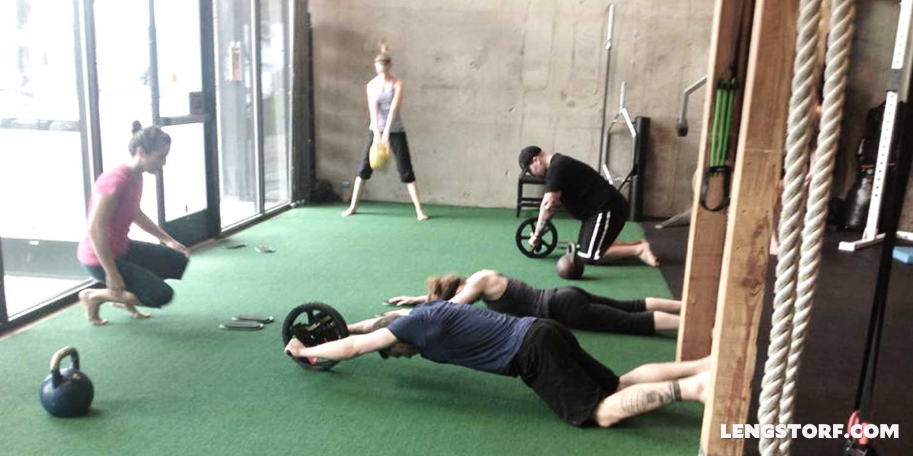

import { Image } from '$components';

When I fail, I'm presented with a choice: do I learn nothing, learn one thing,
or learn a life lesson?

Maybe that sounds ridiculous. Of _course_ I should learn a life lesson, right?

Unfortunately for me, at least, learning something valuable from failure hasn't
always been easy.

## The Treadmill Treadmill

Let me try to explain with a story:

I struggled for years to stay consistent with my trips to the gym. I would get
inspired, find a workout program, pick a diet plan, write a detailed daily
fitness agenda, and start planning how I'd handle the dozens of beautiful women
who would undoubtedly be throwing themselves at me in the coming
weeks.[^new-life]

[^new-life]:
  I had this all worked out: there would be a reality show where these women would showcase their intelligence, strength, and wit through a Billy Madison-esque decathlon featuring such events as "Carry Me Up the Stairs as if I've Been Injured" and "Write Me a Haiku About Bears". There would be laughter, tears, strategy, and a Final Challenge that probably involved the Nerf guns from _American Gladiators_. The series would be met with lackluster reviews, but a strong cult following.

But, despite my initial optimism, I'd find myself feeling discouraged, making
excuses, and eventually abandoning the whole idea.

I was failing. And I was being presented with a choice.

## The First Five Times I Failed In Exactly the Same Way

At first, I made the choice to learn nothing.

I made excuses. I blamed external circumstances. I tried to convince myself that
I was just better off ignoring my health.

I'd brush it off, the memory would fade, and eventually I'd start the cycle over
again -- only to fail in exactly the same way.

I was learning nothing, and it showed in my embarrassing lack of progress.

## The Next Five Times I Failed Creatively

After I recognized that I was stuck in a loop, I started choosing to learn one
thing.

First, I learned that I wasn't very good at working out first thing in the
morning. Then I learned I couldn't always make the afternoons work. After that I
discovered that I couldn't sustain a chicken-and-steamed-broccoli diet like my
bodybuilder friends.

Each time I failed again, I was learning one thing -- one precise set of
circumstances -- that led to my failure.

## The Last Time I Failed, I Learned

After repeating this cycle maybe a dozen times, I finally took a step back and
thought about my situation.

Here I was, trying to stay consistent with a plan to make myself healthier --
what better motivation is there? -- and somehow _I was failing every time._

I'd learned lots of "one thing" lessons, but I'd never taken the time to examine
the root of the issue.

**I was treating the symptoms instead of the disease.**

So I analyzed, and I ultimately came to the conclusion that the common thread in
all my failures was that I gave up after I started to fail: if I missed a
workout or had some ice cream, I felt like I'd ruined everything and just gave
up.

I'm an "all or nothing" type. So when I made a plan, I had to execute it
flawlessly or I was wasting my time.

So I learned a life lesson: **I need to set my bar low enough that I can always
hit my goal.**

My plans started out as, "I'm going to do this huge workout and eat exactly
these things." The simple lowering of that bar to, "I'm going to do something
active every day and make sure I eat vegetables with every meal," has made it
possible for me to always hit my goal, and as a result I've stayed consistent
for nearly a year now.

To clarify, this doesn't mean that I set low expectations that allow me to skate
by. I'm just adjusting the definition of "success" so that I can sustainably hit
my goals. If my goal is "just get to the gym, even if you show up, turn around,
and go back home," I've set the bar really low. However, while I've been to the
gym and done a less-than-stellar workout, I've never showed up to the gym and
done _nothing_.[^starting]

[^starting]:
  The big difference here is _framing_. Before, when I was failing, doing a quick workout because I wasn't feeling 100% would constitute a failure; now, I look at _any_ workout being better than no workout. Get it?

I'm no picture of perfect human health or anything, but I _can_ climb stairs
without wheezing and I don't have any aches or pains -- that's all I really need
to feel like I'm taking care of myself.

<Image
  caption="One of my “get moving” activities: conditioning classes."
  creditType="Credit"
  creditLink="https://www.elementalfitnesslab.com/"
  credit="Elemental Fitness Lab"
>

  

</Image>

## Finding the Source

Aside from the obvious benefit to my physical well-being, dealing with my
failures taught me one of the most useful life skills I've come across yet:

**When you fail, try to [understand _why_ you failed](/find-the-why) instead of just learning how to avoid repeating this one mistake.**

If I run into a tree, I shouldn't just glare at the tree and then go about my
day.

I shouldn't just make a note of where the tree is so I can avoid it next time I
pass this way.

Instead, I should try to understand why I didn't see the tree coming in the
first place.

## In Practice

Beyond my fitness goals, this approach to failure has helped me in every area of
my life.

It's helped me understand that when I lose clients, it's not because that client
is beyond help or because I worded something incorrectly; it's because I
violated their expectations, which put them on edge and started a downward
spiral.

It's helped me understand that when I end up fighting with my girlfriend, it's
not because she's irrational or because I'm too detached; it's because I made
her feel attacked, or unimportant, or a similarly unsavory emotion.

This applies to dozens of other examples that I could have brushed past as
one-off incidents (or worse, forgotten entirely). Each failure gives me a little
window into how I'm perceived by others, or how I'm wired, and it allows me to
"hack" my personality -- I can see certain trees coming and avoid them.

I'll hit hundreds more trees -- thousands even -- as I continue to grow and
learn and fail, but if I'm doing this right, they won't be the same trees all
that often.
