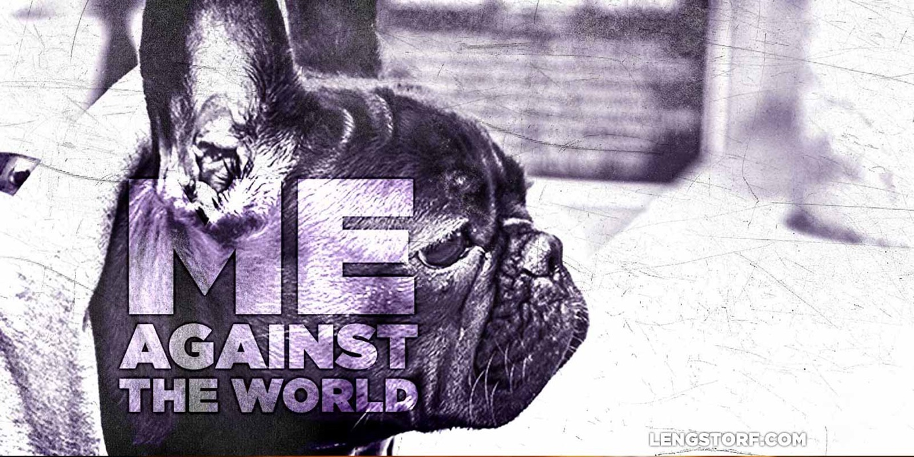

import { Image } from '$components';

The idea of "me against the world" is strange. It implies that, for whatever
reason, I pose a threat to The World and, therefore, must be stopped.

The World will strike at me with weather and illness; with fairweather friends
and canceled flights; with unrequited love and full seasons of _Entourage_ on
demand.

The World is out to get me. The World wants me to fail. The World is an
unstoppable current against which I have to battle.

The World is Dr. Doom, hellbent on ruining my happiness and success.

<Image caption="The World is out to get this dog, too. Look how thoughtful he is.">

</Image>

Only...

I don't think that's how it works. There's no supervillain manifested in The
World; there's just the world: at best an indifferent observer, and more likely
an inanimate object that doesn't do too much of anything except **_not_** notice
when I succeed, fail, live, or die.

## The World Is Not Against Me

**The world probably doesn't even know I'm here.**

In a sense, this is terrifying. I'm a boat on the ocean, fighting wind and
waves, and the storm would swallow me, my hopes, and dreams, all without a
thought about me.

How insignificant and small I must be, for the world to take no notice.

The world doesn't care if I fail.

## The World Also Doesn't Care If I Succeed

I can die in my parents' basement as a jobless, dreamless nobody, or I can die
as the best version of myself I can imagine.

The world doesn't care either way.

So the world won't try to hold me back.

In the game of life, I'm playing without an opponent. I can succeed or fail, and
the only person who really gives a shit is me.

This is the most hopeful, empowering phrase I can think of: **_no one but me cares about this._**

It means I can do what makes me happy. I can put myself first. I can write, or
create, try something I'm not good at, or change my ways.

It also means I'm free to avoid anything hard, scary, uncomfortable, or
unfamiliar.

Or I can charge headlong into this burning building and carry out my dreams
before there's nothing left to burn.

## I'll Go as Far as I'm Willing to Go

I only have two obstacles in life: willpower and understanding.

No one will try to stop me from learning enough to gain understanding. So
really, understanding is just another test of willpower.

So will I dig in, trust myself, and push until I get what I want in life?

Or will I give up, settle in, and tell myself The World is out to get me?
