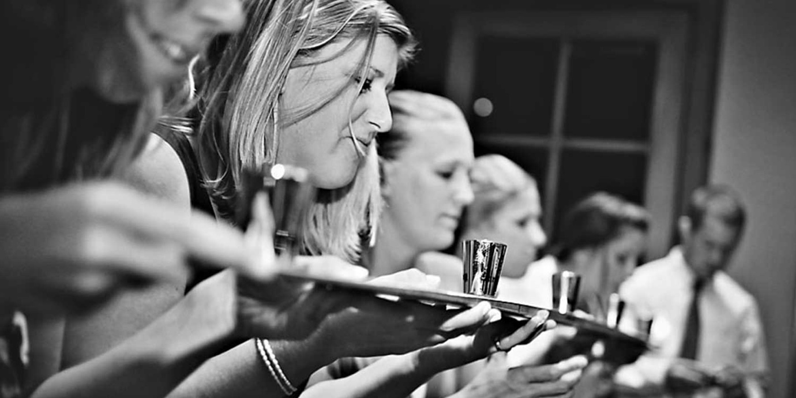

import { Image } from '$components';

In my younger days, I had mixed feelings about going out for drinks. Lately,
though, I love bellying up to the bar. Just not the way _you_ do it.

## "Let's hit the bars."

My younger, single self did bars differently.

We start at the trendy bar: watching hot girls in too-short dresses; Jameson and
PBR to build the courage to approach.[^rejection]

[^rejection]:
  We never actually approach. Rejection wasn't something our whisky-fueled egos could actually bear.

Later, the hope of a sexy jacuzzi party fades. We move to the "cool bar" and
start buying each other shots nobody wants. The smoke is thick. We choose songs
on the jukebox ironically; Lionel Richie asks the room if he's the one we're
looking for. He's not.

At closing time, we're at a bar we swore we'd never drink in again. Hammered
sorority girls wobble like baby gazelle in their six-inch heels. The guys all
circle around like hyenas, ready to pick off the ones who get separated from the
group.

The next day, we come to surrounded by fast food wrappers, nursing seventh-level
hangovers, promising ourselves we'll _never_ do this again.

## I'm Not Drinking Alone

These days, I love drinking. But I wouldn't call what I do _drinking_.

Stay with me.

I like to meet friends at bars and have a couple drinks. I do **not** like
"going drinking".

(This is a running joke between my friend [Nate][1][^similar] and his girlfriend
Chelle after he once argued, **"Look, I'm not drinking alone — _I'm having a
cocktail by myself!_"**)

[^similar]:
  Nate recently wrote [a post similar to this one][2]. We had the idea over drinks at [Expatriate][3], and apparently he's more motivated.

So while I may be heading to a bar with the intention of having a cocktail, I'm
never going with the sole purpose of getting drunk.

It's important we establish this early on, or I'll sound like an alcoholic.

## It's Not Drinking, It's Research

> I'm not drinking alone; I'm having a cocktail by myself.
>
> **Nate Green**

I like learning about the things I'm into. _Experiences mean more when we fully
grasp the complexity of what's happening._

Cocktails caught my attention because they're a lost art[^art] that's been
rediscovered in recent years.

[^art]:
  It wasn't all that long ago that bartenders enjoyed a similar level of respect as doctors and lawyers. Like any trade, a bartender who takes it seriously is on the level of an artist or chef.

Half the fun for me is learning how the Old Fashioned morphed over time to
include club soda and muddled fruit[^prohibition], or that the daiquiri wasn't
always a fruity Spring Break booze smoothie.

[^prohibition]:
  During the Prohibition they were introduced to cover the flavor of low-quality alcohol.

I could certainly learn most of this by doing online research, but half the fun
in cocktails is learning about them from smart people.

## How to Drink

When I go to a bar, I sit _at the bar_.

I want to see the drinks being made, and ask questions. I want to get the
bartender talking so I can hear about the history of the cocktail I'm about to
drink.

When I drink now, I go to [Clyde Common][4] at 5pm on a Monday and ask Junior
endless questions.

I don't go during happy hour or on Friday night when the bar is packed and the
bartenders too busy to talk.

My best experience at a bar was in [Rum Club][5] after I was stood up for a 5:30
meeting. Bartenders from [Expatriate][3] and [Broder Nord][6] were there;
otherwise, the bar was nearly empty.

I sat with a few of Portland's biggest cocktail nerds for an hour, learned about
Aquavit and [Angostura bitters][7], and even did a shotski[^shotski] with them.

[^shotski]:
  "Didn't you just spend 200 words talking about how drinking for the sake of drinking is bad?" Hey. Shut up. We were bonding.

<Image
  caption="The Shotski."
  creditType="Credit"
  creditLink="http://hillarymaybery.com/2010-09-kelly-creighton-wedding/"
  credit="Hillary Maybery"
>

  

</Image>

I didn't just have a great cocktail or two; I had an awesome time learning
something new.

## Let's All Have a Drink

The best part about learning all this is testing my knowledge by trying to make
drinks at home.

One of the first things I really learned (from Daniel at [Teardrop][9]) was the
proper way to make an Old Fashioned.

The Old Fashioned is a simple drink that dates back to before Prohibition. It
follows a simple formula: spirit, sugar, water, and bitters.

You should find a great bartender near you and learn about this drink. If you
don't have access to a great bartender, here's a video of [Jeffrey
Morgenthaler][10] showing you how it's done.

<iframe width="560" height="315" src="https://www.youtube.com/embed/LufrnOktZiA" frameborder="0" gesture="media" allow="encrypted-media" allowfullscreen></iframe>

Here's a variation I've been making at home recently:

* 2 oz [Old Overholt Rye][11]
* 1/4 oz honey simple syrup
* 2 dashes [Fee Brothers black walnut bitters][12]
* Orange twist

This is basically an Old Fashioned, but each varied ingredient makes the drink
just a little different.

You can make it with rum instead of whisky. Maple syrup instead of honey simple.
Orange bitters instead of walnut bitters.

And these are all variations on just one style of cocktail. The depth of
information here is incredible.

## I Need a Drink

Drinking is something I regularly look forward to now. Just not the way I did
when I was a teenager.

Gone are the days of pounding Irish whiskey and ogling cute college girls. I'm
too old now, anyways; it'd be creepy[^creepier].

[^creepier]:
  What I should _really_ say here is, "Even creepier than it used to be."

Instead, I'll be looking at cocktails the same way I look at code, business,
art, and philosophy: it's a fascinating world to study, with a rich history.

And it's delicious. Also, making a good cocktail makes me feel like Don Draper.

Tonight, I'll be making a drink. But remember: I'm not drinking alone; I'm
having a cocktail by myself.

[1]: https://nategreen.org/
[2]: http://nategreen.org/the-best-time-to-go-to-a-bar/
[3]: http://expatriatepdx.com/
[4]: http://www.clydecommon.com/
[5]: http://rumclubpdx.com/
[6]: http://www.broderpdx.com/
[7]: http://en.wikipedia.org/wiki/Angostura_bitters
[9]: http://teardroplounge.com/
[10]: http://www.jeffreymorgenthaler.com/
[11]: http://www.beamglobal.com/brands/old-overholt
[12]: http://www.feebrothers.com/products/bitters/black_walnut_bitters.php
