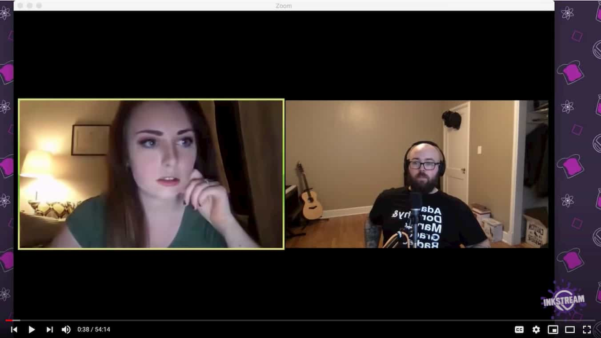

import { Image } from '$components';

When I see incredible content like [this beautiful, interactive piece on a car-free New York](https://www.nytimes.com/2020/07/09/opinion/ban-cars-manhattan-cities.html?referringSource=articleShare), I sometimes feel like I’m lagging behind and not creating cool enough experiences. If I’m not careful, I can feel discouraged and start beating myself up for not doing enough.

But an amazing piece like that wasn’t created in a vacuum. It’s built on previous content, like the groundbreaking [_Snow Fall_ article](http://www.nytimes.com/projects/2012/snow-fall/) from 2012 that introduced experiments around interactive storytelling, and dozens of pieces since then that iterated on that approach.

What may seem like a single project is, in fact, one artifact generated by a long, iterative process at _The New York Times_. And it won’t be the last one.

**Content creation is a continuous process that generates artifacts. It is _not_ a string of standalone projects.** This realization has been critical factor in unblocking my creativity and giving myself permission to ship things that don’t feel perfect. After all, there’s going to be another piece, and the next one will be even better!

## Great content is the result of repetition.

Repetition creates expertise. **Early on in any process, we have to spend all our mental energy just to do the thing we’re doing.** We aren’t able to experiment much, because we’re still trying to figure out how things work.

**With repetition, the general process becomes second nature.** We don’t have to think about how things work because we’ve developed habits and muscle memory that let us do the thing unconsciously.

That’s when we can start to get ambitious.

## Once you get in a groove, experiment.

When the process itself stops requiring all of our attention, we can use that extra mental energy to play. What’s one idea that could make this even better? What could we try to have even more fun? What feedback did we get on the last artifact that we could incorporate to improve the next one?

Each experiment evolves the process. We’re gaining experience, gaining expertise, iterating on ideas for the way things are presented, packaged, and delivered. Over time, every piece we release improves, and eventually we’re shipping incredible content like _The New York Times_ — not because we spent months planning the perfect piece, but because we continuously shipped new ideas with small improvements to each one.

**Slow, continuous improvement is like compounding interest: at first, it doesn’t seem like much, but — assuming we [stay consistent](/build-consistent-content-creation-habit/) — it pays enormous dividends.**

## A real example: livestreaming.

When I first started [livestreaming](https://www.learnwithjason.dev), I was overwhelmed by trying to remember what was on screen, reading the chat, paying attention to my guest, and trying to stream. I was barely able to get through the show — I had no mental energy available for making it look nice or thinking about how to make it more interactive.

<Image
  caption="No gear, no design, no plan — just Emma and me on a call talking about code together."
  credit="Learn With Jason"
  creditLink="https://www.learnwithjason.dev/high-performance-images-using-gatsby"
>

  

</Image>

As I got more and more episodes under my belt, I built up habits around how I organized my desktop, where I placed the chat so it was in my eye line, and how I structured discussion with guests so things flowed and I didn’t feel like I was actively managing them.

Once the basics of streaming felt more natural, I had the ability to try out experiments on the show: sound effects triggered by chat commands; a counter that keeps track of how many corgi emotes get used in chat and triggers a stampede once a certain number is hit; a boop dropper that lets the chat bury the screen in boops if they work together.

<Image
  caption="The show has come a long way: interactive chat, notifications, better lighting and design, and other improvements."
>

  <iframe
      src="https://clips.twitch.tv/embed?clip=BelovedCulturedWallabyRiPepperonis&parent=localhost&parent=lengstorf.com&autoplay=false"
      height="450"
      width="800"
      scrolling="no"
      frameborder="0"
      allowfullscreen="true">
  </iframe>

</Image>

In addition to the sillier things, I also made all sorts of small improvements to the stream: more design effort for scenes, custom transitions, better automation, live captioning, and other iterative projects to make the experience better for everyone involved.

Because I stream frequently, I get the chance to try things out. Some of them work and become part of the format, like the boops and corgis. Others don’t hit and fade into the background. But over time, little improvements have stacked up to create a fairly polished experience.

There are tons of things I still want to improve, and because I know that this show is a process, I feel confident that I’ll be able to try them all . . . eventually.

## Everything is a work in progress.

**The content experiences we hold up as “the gold standard” are not created whole; they’re a snowball created from experience and small improvements applied over time.** In most cases, the people creating these experiences have been iterating on the ideas that led to this particular artifact for a long time, and they’ll continue to iterate on these ideas and processes in future creations.

We can create amazing experiences too, if we trust our own process, continually learn, and experiment. The trick is to keep creating so you have the ability to evolve and adapt over time.
