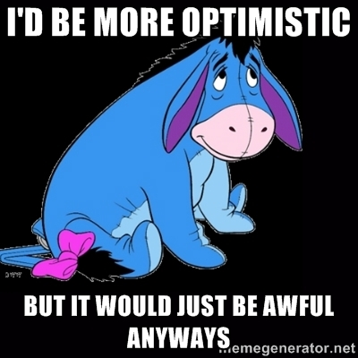

import { Image } from '$components';

Every time you talk to another person, you're affecting the way they feel. Try
not to make them feel like shit.

Imagine you're meeting two people for dinner. One sits down with a smile, making
eye contact, sitting up straight, looking pretty happy; the other is despondent,
flopped in his chair like a sack of laundry, and studying the palms of his
hands.

Now ask about their days.

## Paulie Poopypants

The schmoopy one says, "It's been a rough day. I was late getting to work, and
as soon as I showed up my boss dropped this giant project in my lap. And then —
as if my day wasn't already bad enough — it was raining after work so I couldn't
go to the park like I wanted to."

## Bobbi Brightside

The smiley one says, "Today was pretty good! I took an extra-long shower, which
was great even though I had to rush to work afterward. I just got a new project
at work that's going to be a great challenge — I think if I do well, I might get
a promotion. And since it was rainy after work I got a chance to write a letter
to a friend I've been meaning to send."

## They're Describing Exactly the Same Day

Whenever someone tells a story, they spin it. Their feelings and motives color
the narrative, and we feel — to a certain extent, at least — what they feel.

Think about that. Because it's huge: **you have the ability to control the moods
of the people around you.**

## Are You Fun to Be Around?

Everyone wants to feel happy. It's why we seek out things like music and love
and beauty; it's why [Girl Talk][1] causes spontaneous dance parties; it's why I
prefer to hear [stories with happy endings][2].

You have the ability to make me feel happy when I ask about your day. What were
the [good things that happened to you][3]? What's the bright side? **_What's the
best thing about today?_**

If you focus on the negative, I'm not going to feel great. And I'm going to
associate that feeling with you. And if it happens frequently, I'm going to
start avoiding you, because you're a downer.

## Back to Paulie and Bobbi

So, let's assume you have the option to hang out with either Paulie Poopypants
or Bobbi Brightside.

It'll probably be a lot more fun hanging out with Bobbi; positivity is
contagious, and optimism cures a lot of ills.

Think of all the people you look forward to spending time with. Are any of those
people constantly bringing you down with stories about how hard, unfair, or
hopeless things are?

## Find Your Silver Lining

Everything has a bright side.[^realtalk] **It's up to you to let the bright side
give you hope instead of letting the challenge bring you down.**

[^realtalk]:
  Okay, okay, not everything. Some things are irredeemable. But if you have time to read a blog like mine, I'm willing to bet that you and I are talking better than 95% First World Problems, here. #realtalk

<Image
  align="right"
  caption="Don’t let yourself become an emotional black hole."
  creditType="Credit"
  creditLink="http://winniethepooh.disney.com/"
  credit="Disney"
>

  

</Image>

Whether you see your glass as half-empty or half-full, **it's still your glass.** And you have to deal with that regardless of your attitude.

What you _can_ control is how you frame your circumstances in conversation.
Bringing a little sunshine to someone else's day means they'll look forward to
your company. And you might even find that projecting positivity outward makes
you more inwardly positive as well.

So ask yourself: Are you a source of positivity and happiness for other people?
Or are you the Eeyore that shits on everyone else's good time?

[1]: http://illegal-art.net/girltalk/
[2]: http://lengstorf.com/enough-sad-stories/
[3]: /how-to-be-positive
