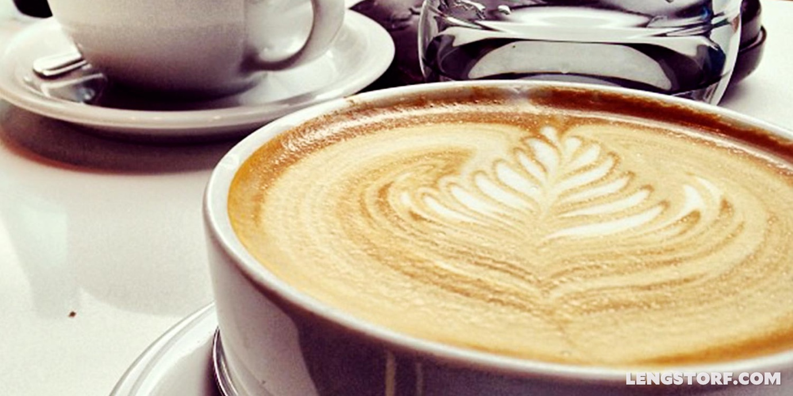

import { Image } from '$components';

Anyone who knows me knows that I love a good cup of coffee, and that my first
order of business upon arriving in a new city is to locate the best barista in
the area.

Good coffee is important to me.[^marco-arment]

[^marco-arment]:
  I spun off on a tangent and wrote this article after reading Marco Arment's article, [_Throwing K-Cups In Glass Houses_][1].

<Image credit="Jason Lengstorf">

</Image>

[My dad][2], however, doesn't give a shit about coffee.

He loves a good cup every now and then, but most of the time he drinks [K-cup
coffee][3] or — gasp! — instant Folgers.

This used to bother me.

## Fighting the Urge to "Fix" My Dad's Taste in Coffee

But here's the thing: my preference in coffee only matters to me. His preference
in coffee only matters to him. And the little bit of overlap when he drinks [my
kind of coffee][4], or when I drink his, just isn't worth the emotional effort
of caring.

When I call my dad's preferences into question, it puts strain on both of us.
He's defensive because I'm attacking something he's doing; I'm frustrated
because he can't see how unbelievably, unflinchingly _right_ I am; both of us
start thinking of excuses to leave the room.

## How Could You _Possibly_ Like That?

It's easy to lose sight of what's really important in relationships. We all have
a tendency to get caught up in a little cloud of "my way" that makes opposing
viewpoints seem scary, stupid, irresponsible, ignorant, or any combination
thereof.

But the majority of the decisions I make have zero impact on the people closest
to me. If I'm not into _Parks & Recreation_, it doesn't make any
difference[^mustache] for my friends who love that show; if I don't see the
appeal of running a marathon, it doesn't mean anything at all for the people who
embrace the challenge.

[^mustache]:
  Except that I don't understand half the [Ron Swanson][5] jokes they make about my mustache.

More importantly, the opposite is true: my friends' decisions don't actually
impact me. Yes, I would love it if all of my friends loved whisky and talking
about business development. That some of them don't means nothing within the
scope of my experience; I can still enjoy whisky, even if Chelle prefers
tequila.

Getting worked up because things that don't affect me aren't done my way is a
shortcut to an extremely frustrating and deeply dissatisfying existence.

### "You want to know how to solve all your problems? Just be a little less like you, and a lot more like me."[^attribution]

[^attribution]:
  I wish I could take credit for this little gem, but it comes from a friend of mine. I don't want it to get attributed to him as something said seriously, so I'm not going to include his name here.

I used to start a lot of monologues with the phrase, "You know what you should
do?"

I'd listen — for a few seconds, at least — to someone's experience, apply my own
tastes to it, then harangue them about all the ways they were doing it wrong. In
effect, all I was saying was, **"Do you even _know_ how much easier your life
would be if you were just _more like me?"_**

This is something I always hated in other people: they'd just start telling me
how to solve problems that didn't exist.

What I was ignoring, though, is that I'm just as annoying when I force my taste
onto others.

My taste doesn't matter. At least not to anyone but me. (And neither does
yours.)

## Just Shut Up and Drink the Shitty Coffee

I could get offended by my dad's ambivalence toward a subject I'm so passionate
about. I could try to convince him that he's wrong, and that his decision to
drink awful coffee is somehow linked to his happiness and overall wellbeing.

And when I visit my parents and my dad serves me K-cup coffee, I could throw a
fit and refuse to drink it. Or I could bring coffee with me and supplant his
morning coffee ritual with my own.

But I don't.

Instead, I drink coffee with my dad. Because as long as I’m spending time with
people I love, it doesn't matter if the coffee is terrible.

[1]: http://www.marco.org/2014/03/31/throwing-k-cups-in-glass-houses
[2]: http://wallywhitefish.com/
[3]: http://www.keurig.com/shop/k-cups/all-k-cups
[4]: http://www.heartroasters.com/
[5]: https://youtu.be/bwGat4i8pJI
