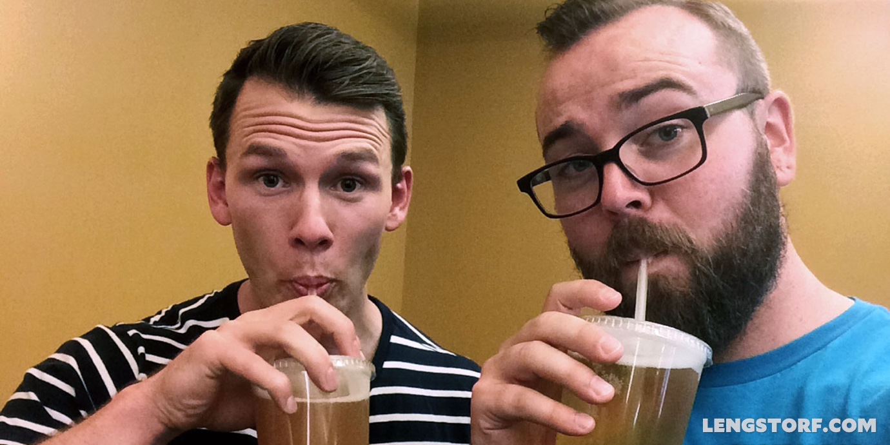

import { Image } from '$components';

I have a best friend.

To say that feels weird. I'm almost thirty; thirty-year-old men don't have "best
friends".

They have drinking/golfing/hunting buddies.

They have their wives' friends' husbands.

But they certainly _don't_ have a Bee Eff Eff.

Yesterday I read Stephen Marche's article for _Esquire_ about [the abuse of the
word "bro"][1]. I thought it was going to be a silly piece about pop culture,
but then I ran into this line:

> To mature as a female person is to mature into female friendships. To mature
> as a male person is to mature out of male friendships.

There's a sort of shyness I've felt about telling anyone that I have a best
friend. It feels roughly equivalent to admitting I still sleep with a nightlight
or that my mom still packs a lunch for me every day.

Having a best friend feels like kid stuff. It feels like something I should have
grown out of.

## Nate and Jason, the Best of Friends

<Image
  caption="Buddy selfies."
  creditType="Credit"
  credit="Jason Lengstorf"
>

  

</Image>

I've been friends with [Nate][2] since we were eleven or twelve, when his family
moved in down the street and our moms set us up on a play date.

We did all the stuff boys do: played Mortal Kombat[^fatalities], shot our little
brothers with BB guns, pretended we were the Harlem Globetrotters.

[^fatalities]:
  What I mean by "played" is that I would mash buttons while Nate and his little brother would expertly and brutally murder my character because they knew all the special moves and fatalities. **All of them.**

Nate and I were opposites in a lot of ways, but we both felt like outsiders —
Nate because he didn't quite meet the criteria of any clique, and me because I
was in the midst of several simultaneous identity crises — and that held us
together.

Our opposite tendencies were complementary: I did Nate's homework; Nate
convinced the cute girls at the beach to hang out with us.

As adults, Nate and I are still opposites. We still complement each other well
personally, and now we're able to help each other professionally.[^symbiosis]

[^symbiosis]:
  I work with Nate to help him implement a lot of his projects that have a design or tech component, and Nate helps me with marketing and networking.

## We All Need a Sounding Board

Complementary skill sets aside, Nate and I have helped each other in another,
less tangible way: over the course of nearly twenty years of friendship, we've
had hundreds of very frank, very honest conversation. The kind that most people
have to pay a psychiatrist for.

Being able to discuss the things that scared us — being able to be 100%
vulnerable, in other words — has allowed us to work through the source of many
of our fears and troubles, which has ultimately led to both of us becoming more
aware of our internal motivations and the things that trip us up. We're both
better people because of it.

**UPDATE:** In July 2015, Nate and I decided to make these conversations public
in hopes of sparking similar discussions for anyone willing to listen. We've
created a [podcast where we have deep conversations][3] called _Two Friends
Talking About Things_. You can listen to the first episode here, on [the
website][4], or [on iTunes][5].

https://soundcloud.com/2ftat/sets/what-are-we-talking-about

## I'm Going to Get So Much Shit for This

Yesterday Nate and I were discussing our most recent challenge to each other:
write for at least thirty minutes a day and post whatever comes out on our
blogs.

I shared one of Nate's posts yesterday. He mentioned that he was planning to
share one as well.

We both got uncomfortable.

Was it weird that we were publicly giving each other so much attention? Would
people make fun of us?

Why did we both feel that way? Everyone who knows us knows that we're close, and
neither of us is ashamed of being friends with the other. So where does this
apprehension over talking about our friendship on the Internet come from?

## Hollywood Hates Dude Friends

Stephen Marche argues that pop culture is poisoning the idea of male friendship:

> The splendid isolation of masculinity has emerged from so much iconography—the
> cowboy, the astronaut, the gangster—that almost every hero in the past fifty
> years has been a figure of loneliness. Current pop culture is even more
> extreme: It doesn't just celebrate the lonely man; it also despises men in
> groups.

Marche claims most movies and TV shows show groups of men being idiots. _The
Hangover_, _Dumb and Dumber_, _How I Met Your Mother_ all paint the idea of male
friendship as a way to bring out the least intelligent parts of men.

It's hard to disagree.

And it explains why I feel apprehensive talking about having a best friend.

## Do You Have a Best Friend?

I wish I had a solution, or even a suggestion for a solution to the problem. I
don't.

I do know that — despite being uneasy saying it out loud — having a close male
friend has been one of the most beneficial things in my life, both growing up
and as an adult.

Do you have a best friend? Does it feel weird to talk about?

If you don't have a best friend, does it bother you?[^honest]

[^honest]:
  I'm genuinely curious, not baiting.

[1]: http://www.esquire.com/blogs/culture/on-bro-0914
[2]: http://thenategreenexperience.com/
[3]: http://www.2FTAT.com?utm_source=best-friends&utm_medium=site-link&utm_campaign=lengstorf-com
[4]: http://www.2ftat.com/episode/00-what-are-we-talking-about/?utm_source=best-friends&utm_medium=episode-link&utm_campaign=lengstorf-com
[5]: http://bit.ly/hear2FTAT
