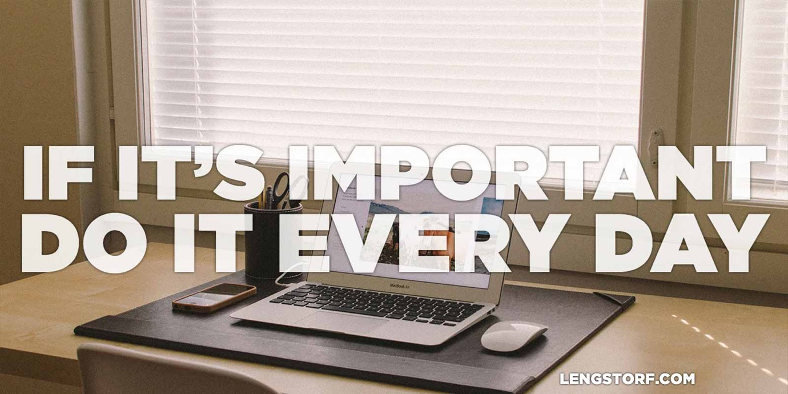

import { Image } from '$components';

"I'm too busy."

It's my favorite excuse.

I am a very lucky guy because I truly enjoy my job. I work for fun, so it never
really feels like work to me.

The dark side of this, however, is that I tend to prioritize work over
everything that I don't consider essential.

"I'm too busy to go to a movie."

"I have too much work to do to head out to the coast."

By default, I bury myself in work. I developed that habit in my early twenties
to keep my nascent business afloat. And for all the good it did for me — I have
a career, income, freedom — it also had some negative side effects: I neglected
my emotional and physical health in favor of progress, and I cultivated a little
bit of anxiety around _not_ working.

If I give myself a choice between work and "something for me", I will choose
work every time.

I'm finally starting to realize I need to [spend less time working][1], but that
doesn't make it easier to walk away from my half-finished todo list.

## The Things I Should, I Won't

Everything that I tell myself I _should_ do, I rarely do.

I _should_ practice the guitar. But I usually only pick up my guitar for a few
minutes a week, if that.

I _should_ start learning Italian. But I haven't even looked into starting, let
alone actually learning.

It's not that I don't enjoy playing guitar, or that learning Italian doesn't
interest me. It's that I weigh activities in my head on a cost-benefit basis.

Learning guitar is fun, but it provides no practical benefits. The emotional
satisfaction I get from playing a song is the same kind of payoff that I get
when designing a website[^creative-rush], so my brain tells me to prioritize
work on the site: I get the emotional payoff _and_ it pays the bills.

[^creative-rush]:
  For me, it's the creative rush. Stringing notes together on a guitar and stringing pixels together on the screen both feel great when they come together.

Learning Italian is going to be necessary soon — I'm going to Italy at the end
of this year — but my brain tells me other projects are more pressing.

## The Things I Must, I Do

<Image>

  

</Image>

> If it's important, do it every day.

I've read this quote from Dan Gable[^dan-gable] dozens of times without ever
actually _hearing it_. At least not until recently.

[^dan-gable]:
  He's an Olympic gold medalist and a wrestling coach. I think this quote was made famous by [Dan John's article on the Gable Method][2].

### I Must Work Out

I used to struggle to get to the gym. I can always make an argument that some
project or another is too important for me to take an hour and a half to work
out.

However, I've realized spending that time at the gym helps me clear my head,
improves my sleep, and boosts my confidence[^fat-shit] — that's worth the
interruption.

[^fat-shit]:
  Because I don't feel like a fat shit who lives in an office chair.

**It's actually so valuable that I've stopped looking at it as optional.** I
have a personal trainer now, who waits for me at 9am on Tuesdays and Thursdays,
and who will be disappointed and inconvenienced if I don't show up. **It's an
obligation. A thing I _must_ do.**

### I Must Write

I have a love/hate relationship with writing.

I tend to go in fits and starts; I'll blog consistently for a month, then drop
off the face of the planet for months — sometimes years – while "more important
things" dominate all of my time.

But I love writing. It's therapeutic for me, and something that I truly enjoy. I
just feel guilty spending hours writing a post that's more or less a public
diary entry for me when I have client projects to work on.

My [best friend][3] Nate was feeling the same strain, so we made a friendly bet:
we would write for 30 minutes a day and publish whatever came out. No matter
what.

Knowing I only have to write for 30 minutes removes the guilt around writing,
and allows me to make writing something I _must_ do. It's part of my morning
ritual now: wake up, coffee, write for 30 minutes.

## Take Away the Option

**The important shift that's taken place with each of the habits I've
successfully adopted is that they're not optional.** Each "must do" item is just
a thing that has to happen. Like eating, or paying bills.

In reality, nothing has changed. I still have the same number of hours in the
day, and the same list of things I want to accomplish. But I've thought about
[why I've failed before][4], and used those lessons to adjust my approach. **I
changed my perception of the things I want to accomplish from "desirable" to
"mandatory".**

With the gym, I'm going on a year and a half with consistent workouts: I haven't
missed a session unless I was out of town.

Writing is still too new to know for sure, but so far I've put in at least 30
minutes of writing a day, and only failed to publish once. Compared to the
once-every-month-or-three pattern from before, I'm pretty happy with the
results.

## What's on Your "Must Do" List?

Do you have anything you've been putting off because it's optional?

Have you made something non-optional and seen success similar to mine? Or,
better, have you seen longer-term success?

I'd love to hear about it; hit the discussion link and share!

[1]: /better-productivity-work-less
[2]: http://www.t-nation.com/free_online_article/sports_body_training_performance/the_gable_method
[3]: /best-friends
[4]: /see-tree-coming
