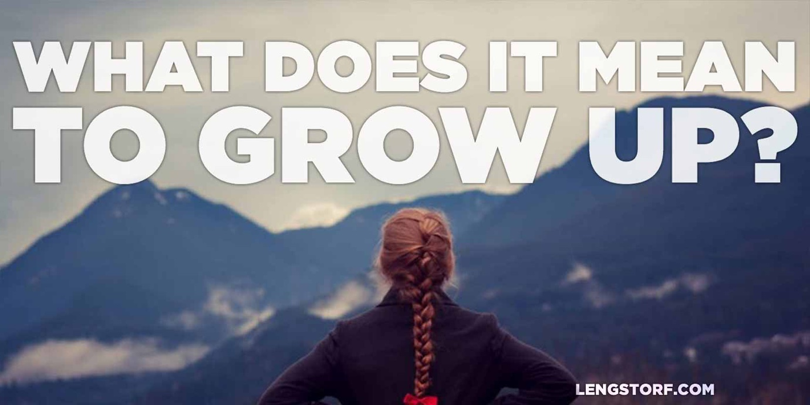
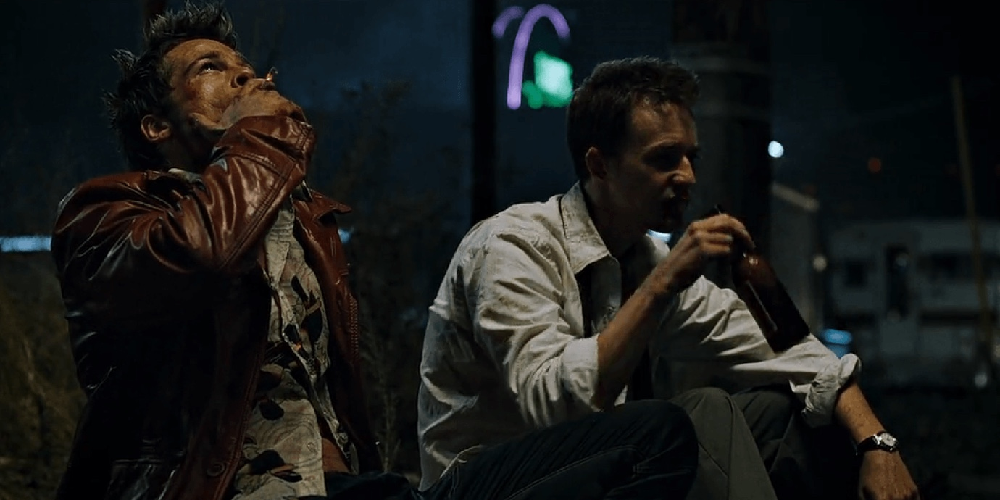

import { Image } from '$components';

I've spent a lot of time in the last few months thinking about adulthood.

Not the idea of growing older — the actual act of growing up.

**How does a boy know he's become a man?**

## Growing Up the Old Fashioned Way

In some other cultures around the world and throughout history, **there's a rite
of passage from childhood into adulthood.**

Some of them seem silly and cruel,[^circumcision] but others pose some very real
questions about growing up.

[^circumcision]:
  The Mardudjara Aborigines circumcise boys at 15 or 16 years old, then make the boys eat the foreskin.

<Image>

  

</Image>

### Into the Wilderness

For example, many Native American tribes would send teenage boys on a [vision
quest][1]. Aborigine tribes have a similar ritual, called a walkabout.

In both cases, the idea is that **the child spends time alone in the wilderness, learns to get by unassisted, gets in tune with life's purpose, and comes back a full-fledged adult.**

## Growing Up Today (or the Lack Thereof)

In my family, growing up wasn't really a thing we cared about. I don't think
that's all that uncommon an experience in the United States, or really in most
of the Western world.

**As far as I can tell, there is no rite of passage for children in modern culture.**

I became an adult when I turned 18. At least that's what the legal system and
the military said.

I was headed off to college, which meant leaving home, but otherwise I did the
same shit on day 1 of year 18 that I did on day 365 of year 17. Except now I
could legally buy cigarettes and play Keno in the gas station.

### Failure to Launch

The lack of any clear distinction between being a teenager in high school and an
"adult" out of high school leaves a lot of us — myself included — feeling like
we're still not in control of our lives.

There's an authority figure somewhere with a plan: your parents, your boss, your
teachers, anyone who isn't you that has more experience and a real plan.

We look to our parents and friends to make our decisions for us. **We're not
ready to be the one holding the bag just yet.**

We grow older, but we remain children.

## What Makes a Man?

There's a scene in [_Fight Club_][2] that has always stuck with me:

<Image
  align="center"
  creditType="Credit"
  creditLink="http://www.imdb.com/title/tt0137523/"
  credit="Fight Club"
>

  

</Image>

> **Tyler Durden:** My dad never went to college, so it was real important that
> I go.
>
> **Narrator:** Sounds familiar.
>
> **Tyler Durden:** So I graduate, I call him up long distance, I say "Dad, now
> what?" He says, "Get a job."
>
> **Narrator:** Same here.
>
> **Tyler Durden:** Now I'm 25, make my yearly call again. I say Dad, "Now
> what?" He says, "I don't know, get married."
>
> **Narrator:** I can't get married, I'm a 30 year old _boy_.

This is a man with all the right boxes checked for adulthood: college, condo,
career.

And yet he's still looking to external sources for guidance. Still wondering
what he should be when he grows up. **He's rudderless.**

### Fifty-Year-Old Children

My mother has just recently — in her fifties — started looking at what her life
means to her.

She's always had external meaning: her parents; her teachers in high school and
college; my dad's career and the need to relocate to support it; raising her
children.

Now it's all done. My dad's career is established, her kids are grown, and she's
feeling a little lost.

**There's no one left to tell her what to do.**

So she's starting to answer big questions for herself. What makes _her_ happy?
What does she _really_ want to do with her time?

In a lot of ways, _she's still a kid._

And she's just one of many people I know who are in similar situations.

## Looking Inward

I don't claim to know the proper way to bring a child into adulthood.

Let me say that again, so we're clear: **I do not have the answers.**

But I have some ideas.[^outline]

[^outline]:
  Maybe just the general outline of a few ideas. Based on conjecture and anecdotal evidence. That probably only work for me. (And they only work for me _most_ of the time.)

At the most basic level, _adulthood is not reaching a certain age,_ ticking off
boxes on a checklist, or even things that seem quintessentially adult like
having children or getting colonoscopies.

Adulthood is confidently approaching unfamiliar situations, not because you have
a solution, but because you trust that you'll be able to fumble your way to a
satisfactory outcome.

Adulthood is the understanding that there are no authority figures. There is no
one who has this all figured out. We're all just making best guesses and doing
what we think is right, based on the limited information and experience we have.

**Adulthood is the knowledge that — no matter what you're facing — you can handle it.**

## My Vision Quest

When my parents sent me off to college in Denver, I'm sure they had high hopes
that I'd grow up, stop wearing my all-black band t-shirts, get a degree, and
embark on some storybook American Dream™ career path with a wife and kids and
pets and a house and whatever else it is that signifies a successful life.

Instead, I dropped out after a few months, moved back into their basement,
joined back up with my band, and embarked on what ended up being my vision
quest: I jumped in a van with four other dudes and drove around the country
playing music for two years.

<Image
  align="center"
  caption="Don’t we look ready to face grown-up issues?"
  creditType="Credit"
  creditLink="http://tysonvick.com"
  credit="Tyson Vick"
>

  

</Image>

### Into the Wilderness (or Van, in My Case)

The band barely made enough money to pay for gas. We made our way by asking
concertgoers to let us crash on their floors, or by sleeping in our van in the
Walmart parking lot.[^protip]

[^protip]:
  Transient #ProTip: Walmart has a policy that allows travelers to park overnight in their lot without being harassed. They also usually have a security guard in a golf cart doing slow laps. When all else fails, it's a place to crash without getting harassed.

I was faced with a wide variety of unfamiliar circumstances. My parents — though
they weren't going to let me die on the streets of Tucson if the van broke down
— weren't wholly supportive of my rockstar lifestyle.[^parents] My bandmates
were no more capable of solving problems than I was.

[^parents]:
  My dad liked that I was in a band. I think he was watching me with the same kind of amusement with which he might watch a puppy trying to climb the stairs for the first time. My mom just thought I was going through a phase and hoped that not too many of her friends saw my eyeliner.

**I was on my own for the first time.**

### This Is Within Your Reach

The band needed shows booked, merchandise designed and ordered, guarantees
negotiated and collected, promotion, website design, and a whole bunch of other
things ranging from the minutia to long-term strategy that were critical if we
wanted to keep touring.[^safety-net]

[^safety-net]:
  I should mention that I wasn't the only member of the band who did this stuff. Everyone pitched in. But what I said I would do, I was on the hook for. There was no safety net or backup plan.

When I realized that no one was going to do any of this for me, I [set myself on
fire][3] and figured it out.

The short-term gain of all this was that our tour was a relative success. The long-term benefits, though, I didn't realize for years: **I had learned to trust myself in unfamiliar, uncertain scenarios.**

My minor successes as a member of an anonymous, marginally successful band
planted the seeds of confidence that would grow to power nearly all of my adult
accomplishments.

## Should We Send Teenagers into the Woods?

Admittedly, my situation was pretty unique.

Do I think every kid should join a band and make slow laps around the western
United States for two years while sleeping in a van?

No. Well, maybe. But it's not practical.

So what do we do? It's not really feasible to send teenagers into the woods. We
certainly can't adopt older rites of passage like circumcising high school
sophomores or sending girls into seclusion when they start menstruating.

But there's something missing in the way children enter adulthood now. **We're letting children drift into their twenties and even thirties without any sense of independence or self-reliance.**

How do we nudge children into adulthood?

_Should_ we nudge children into adulthood? Or does the act of pushing them
negate the benefits?

Where do you stand on children becoming adults? Modern rites of passage?

Do we need them? Do we already have them and I'm just not paying attention?

**What was your journey into the wilderness?**

[1]: http://en.wikipedia.org/wiki/Vision_quest
[2]: http://amzn.to/1qUidwZ
[3]: /set-yourself-on-fire
