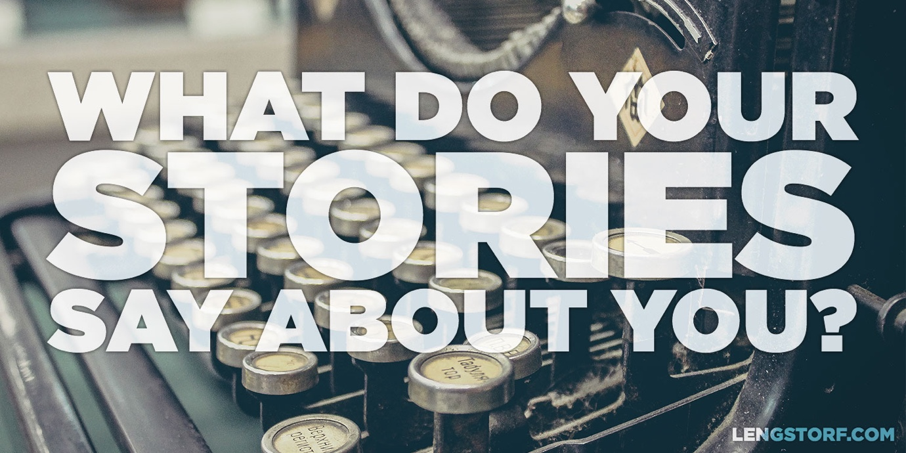

import { Image } from '$components';

I don't regret anything I've ever done that I saw through to the end. I only
regret things I left unfinished, or never started at all.

## The Journey Is the Story

If I tell you that a guy named Billy Ray Valentine was a successful investor and
made a killing in the commodities market, you probably won't bat an eye.

Whatever, right? Lots of people are good at their jobs.

But if I tell you that Mr. Valentine came from the gutter and _got his job on a
bet_, things get a little more interesting.[^trading-places]

[^trading-places]:
  If you want to know Billy Ray's full story, [watch the documentary][1].

<Image>

  

</Image>

## A Good Story Isn't About the Ending

We all love a good story. _But it's too easy to mistake the ending for the whole story._

**The journey is what makes a story good.** It's the details. The twists.

Because of this, stories don't have to end well. Heroes can lose. Main
characters can die.

**We'll allow any ending, as long as the story is good.**

## Our Lives Are a Collection of Short Stories

Even if we don't sit around at dinner telling tales, **our lives exist as a series of stories.** We tell these stories to ourselves, to our friends, to potential employers.

We [spin our stories][2] and use them to create little vignettes of who we are
and what we value.

Strangers use them to make us real.

**Our stories become the only part of us that anyone else really touches.**

## Every Good Story Has a Follow-Through

But, even though the guts of a story lie in the journey, every story still needs
to end.

And it needs to _really end._

If the plot of [_Cool Runnings_][3] was the story of that time Derice Bannock
was accidentally tripped by an opponent in the 1988 Summer Olympics qualifier
before giving up on his Olympic dreams, the story would have felt incomplete.

Instead, Derice took his failure and pushed onward — and ultimately [failed
again, sort of][4] — and it makes for a great story.

## It's Up to Us to Make Our Stories Good

We have a choice with every story we begin: "Am I going to see this through to
the end, or am I going to give up and leave the story unfinished?"

When things get difficult, we can always bail and walk away. And sometimes
that's how a story needs to end.

But for every story we leave unfinished, we're building a narrative around
ourselves. Are we leaving more stories unfinished than we're seeing through to
the end?

## What Do Your Stories Say About You?

**When you play back your stories in your head, do you feel good about them?**
Or do they feel like a collection of half-finished anecdotes?

The good news is that — regardless of how your stories read so far — you're in
the middle of a few stories right now. And you'll start new stories in the
future.

Try to make them good ones.

[1]: http://amzn.to/X7sjiL
[2]: /bright-side
[3]: http://amzn.to/WTy0QP
[4]: https://youtu.be/31M_MdSVxV8
