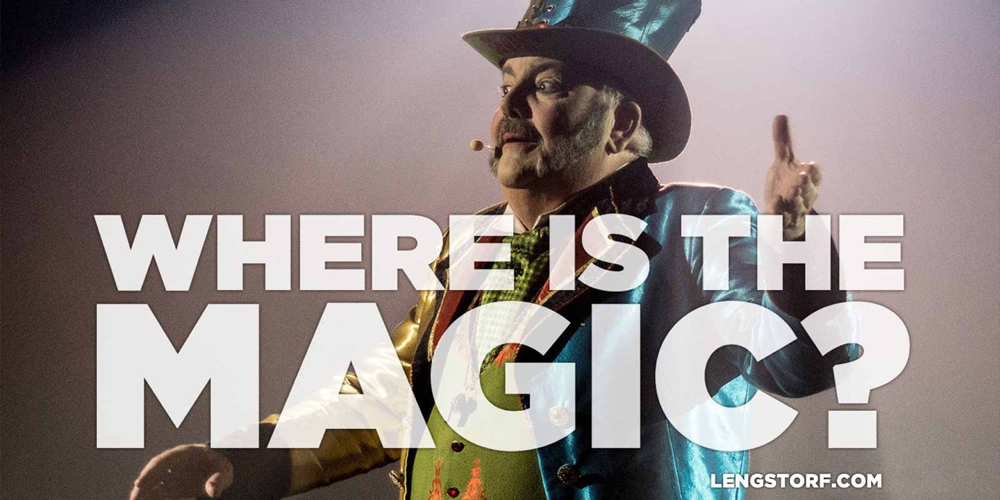
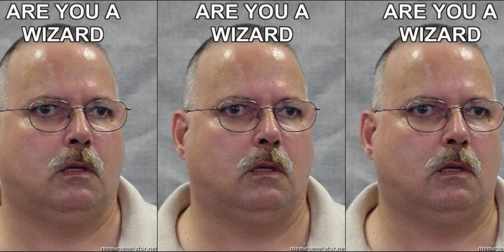
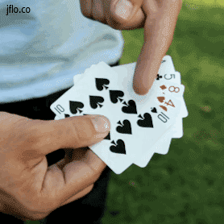

import { Image } from '$components';

As kids, we see a lot of the world around us as magical. Then, as we get older,
the magic gives way to understanding. **But is losing the magic a good thing?**

<Image
  creditType="Credit"
  creditLink="https://www.flickr.com/photos/bobjagendorf/"
  credit="Bob Jagendorf"
>

  

</Image>

## The Curse of Knowledge

When I was first starting out in business, I read a book called [_Made to
Stick_][1]. Among other things, I was introduced to The Curse of Knowledge,
which is the idea that — as we become more familiar with a given topic — we are
unable to explain an idea well to someone who doesn't know.

Think about any time you've played charades, and by the end you're ready to
scream at your team, "How could you _not_ get that?!"

In your head you were perfectly pantomiming _Gone with the Wind_.

What your team saw was you riding an imaginary horse and waving your fingers
like you were casting a spell.

**Once you _know_ something, it's extremely difficult to see it from the
perspective of someone who doesn't.**

## The Other Curse of Knowledge

There's another curse of knowledge, though, and it's a little sneakier. _The
Revenge of the Curse of Knowledge_, if you will.

<Image align="right">

  

</Image>

When I was young, I thought my dad was basically a wizard because he could tie
shoes.

I thought my mom was conjuring up cookies through some dark art or another.

Tiny people lived in my television to entertain me.

A rabbit and a fat man broke into my house to leave candy and gifts every so
often.

My closet was a portal to the worst place imaginable.

**The world was full of magic, and I was awestruck.**

## Disillusionment, or How the Magic Died in a Book

Eventually, I learned how to tie my shoes. I added the ingredients my mom had
measured out into a bowl and watched cookies take shape. I learned enough about
TV signals to know there weren't actually tiny people in there. Dad spilled the
beans about Santa and the Easter Bunny.

(The closet still creeps me out, though.)

**Bit by bit, the magic was stripped away and the simple truth about how things worked was laid plain.**

I was no longer awestruck. Instead, I was condescending to the people around me
who hadn't learned yet.

## A World without Magic

Every time I see something amazing, it feels like magic. I'm blown away. I tell
my friends. If there's a YouTube clip, I'm sharing it.

<iframe width="560" height="315" src="https://www.youtube.com/embed/8F6EoMdn95E" frameborder="0" gesture="media" allow="encrypted-media" allowfullscreen></iframe>

I saw this guy — [Dub FX][2] — on the streets of Amsterdam, and I was
_convinced_ he was a sorceror.

It's just a dude with a microphone. He starts singing. Then... _holy shit what just happened? **It must be magic!**_

But it's not. It's a talented musician who can beatbox and operate a looping
station.

Impressive? Absolutely.

Magic? Not at all.

## Losing My Sense of Wonder

But it's not just entertainment and childhood stories that have lost the soft
glow of pixie dust; I've felt a similar sense of disillusionment with my own
life.

When I first started [building websites][3], code was still fairly mystical to
me. I could do a few things, but most of what I saw was beyond my grasp;
otherworldly manifestations brought forth by the legendary Mystics of Nerd.

Successful freelancing was a dark art. Saving money required an incantation from
a book bound in human skin. If I wanted to be any good at sex, I needed to
sacrifice a goat at Kilauea.

But the more I learned, the more I realized that none of this is sacred,
supernatural, or even secret. There are no shortcuts. No "weird tricks" to make
someone suddently good at a skill.

**There is no magic. It's all just hard work, practice, actually giving a
shit.**

## Does Magic Matter?

<Image
  align="right"
  creditLink="http://www.justinflom.com/"
  credit="Justin Flom"
>

  

</Image>

Well, who cares if there's no magic? We're adults, dammit, and magic is for
children. And David Blaine.

Sure. That's fair.

But I'm not ready to give up my sense of wonder. I like being blown away by
something that I don't understand.[^at-first] I want to be surrounded by wizards
and fairies and sorceresses who are making impossible things happen all around
me.

[^at-first]:
  At least at first; eventually I want to know how it works.

**If I lose my sense of wonder, then I'm resigning to a life of familiar, comfortable tasks. I'm assuming that there's nothing left to surprise me.** Giving in to the part of me that's jaded and pessimistic that beleives there's nothing new anyways and why bother at all.

I'm not sure I'd like myself without the hope for magic.

## So How Can We Bring the Magic Back?

The problem with The Revenge of the Curse of Knowledge is that once you've seen
behind the curtain, you can't unsee it. The wizard is just a dude with a killer
pyrotechnics setup.

So there's no going back to the kind of awe and wonder we felt as children. And
that's probably okay; I lost a lot of sleep wondering if my uncle would ever
give my nose back, and I just couldn't afford that today.

But we can find new magic, and remember to _actually feel_ that amazement that
comes along with seeing something new and wonderful.

It can be big stuff, like learning that there were [shark-eating dinosaurs][4]
or that scientists are working on [tiny robots that fight cancer][5].

Or it can be the little things we might completely dismiss if we're not paying
attention: when the new project you're working on falls into place for the first
time; when the outfit you chose today gets compliments from everyone you meet;
when you think to yourself, "I really wish I had a blueberry muffin," and then
someone from the office lets you know there are muffins in the break room and
should they save you one.

**Our lives are full of small, magical moments.** If we're looking for them,
that is.

## What's Magical in Your Life Right Now?

Think back over the last few days. _What's happened that felt like magic?_

I wanted cheesecake the other night, and a local bar had a cheesecake special
that night. I toured the Willett Distillery, saw how some of my favorite bourbon
is made, and sampled some of the very rare, expensive labels. I [discovered a
band][6] that makes my hair stand on end.

It's not quite Santa Claus, but it's enough.

**Where have you felt a little bit of magic in your life lately?**

[1]: http://cptr.me/XoBEmg
[2]: http://dubfx.com/
[3]: http://copterlabs.com/
[4]: http://www.iflscience.com/plants-and-animals/first-ever-swimming-dinosaur-ate-sharks
[5]: http://www.nature.com/ncomms/2014/140826/ncomms5712/full/ncomms5712.html
[6]: https://www.youtube.com/watch?v=Gsnrzr0Bm80
