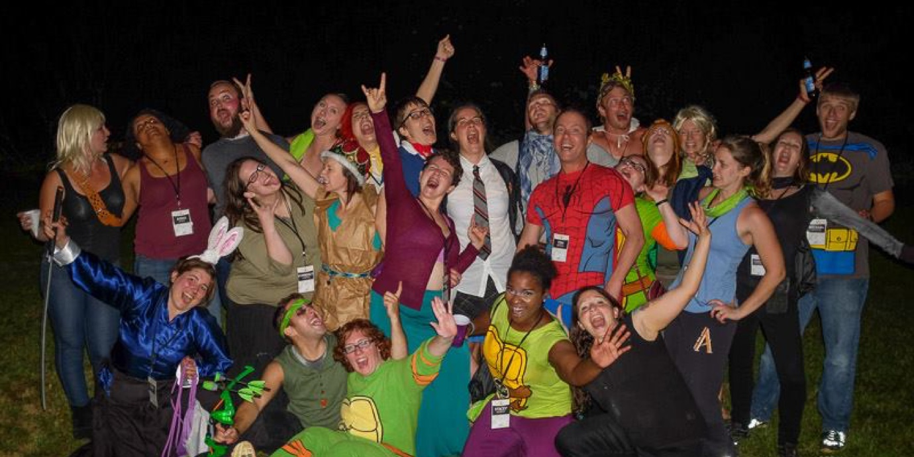

import { Image } from '$components';

"You should come, too!"

It's easy to brush an invite off as an empty courtesy, or to decline for any
number of arguably legitimate reasons. _It feels safe to turn down an
invitation._

**But what are we missing out on by being safe?**

## Wanna Hang Out in the Forest with a Bunch of Sweaty Nerds?

A couple weeks ago, I found myself in Nashville, TN as part of a trip to
Kentucky and Tennessee that I'd planned with [my friend Nate][1]. While we were
there, Nate called his friend Steve Kamb, the creator of [Nerd Fitness][2], and
we all met up for dinner.

At one point during the conversation, Steve started talking about [Camp Nerd
Fitness][3] — a weekend out in a remote area of Georgia with a bunch of
healthy-minded nerds.

He wrapped up his description of the event with, "You should come!"

This was September 5. Camp Nerd Fitness started September 18. As far as notice
goes, it doesn't get much shorter than that.

Nate already had travel planned, so he couldn't make it. But I had no plans at
all.

My immediate impulse was to decline. _Two weeks isn't enough time. I'm traveling
right now; it would be insane to take another trip so soon. I have too much
going on at work._

## Just Take the Trip

One of the best pieces of advice I've ever received was from [Craig Weller][4];
we were discussing travel and happiness one evening, and he told me, _"Just take
the trip."_

The way Craig sees things, if there's an opportunity to do something, and that
opportunity doesn't create _actual_ problems,[^actual-problems] he will
absolutely take the trip. No questions asked.

As a result, Craig has been all over the world in circumstances ranging from a
comfortable family-style getaway in Italy to living with a monkey in a tent in
Africa. His stories are incredible, and **none of them would have happened if
"too busy" was an excuse.**

## What's Really at Stake, Here?

Thinking a little harder about Steve's offer, I realized I wasn't risking
anything if I chose to go.

I had plenty of airline miles; I could book the plane ticket without spending
any money. I was mostly caught up on projects, and two weeks is a good amount of
time to crank on things and get a bit ahead to cover the day and a half I'd miss
for the camp. Steve seemed like a really smart guy — someone who could bring a
lot to the table both as a friend and as a business contact.[^call-me]

**My first reaction was to think of everything that might go wrong if I took the trip; what I needed to consider was all of the opportunities I'd miss by staying home.**

## You'll Only Regret the Trips You Don't Take

It can be tempting to [let fear hold you back][5], but — when I really think
about it — I only regret the trips I _don't_ take.

I had a chance to see [George Carlin][6] in 2007, but I decided I was too busy
to go. "I'll wait until his next tour," I said. Now I'll never get the
chance[^george-carlin] to see one of the greatest comedians of all time, all
because I couldn't [take a break][7] to go see a show.

I can't recall a single trip I've taken that I actually regret. I can think of
things I wouldn't do again, but **the experience and lessons I took away from
the "bad" trips were worth taking the trip.**

## Are You In?

A day or so after we got home from Kentucky, Nate connected Steve and I via
email, and Steve sent the question:

> Are you in?

I still had reservations, but I couldn't think of any _real_ excuses. **I took the trip.**

<Image creditLink="http://www.willbyington.com/" credit="Will Byington">

  

</Image>

I spent the last weekend playing ultimate frisbee, reliving my mid-20s in an
informal powerlifting competition,[^powerlifter] and not understanding all the
comic book, anime, and video game references that were being made.

Because I decided to take the trip, I met a whole new group of people I never
knew existed, made some new friends, learned some new tricks,[^new-tricks] and
had a really unique experience.

And — perhaps more importantly — because I took this trip, _nothing went wrong
in my life personally or professionally._

## Are You Ready to Take the Trip?

What trips have you taken, even when you felt nervous?

What trips have you turned down for artificial reasons?

**Of the two, which do you feel better about?**

[^actual-problems]:
  The "actual" is paramount, here. "Too busy" is not an actual problem. "Too short of notice" is not an actual problem. They're inconveniences. An _actual_ problem is something like, "I'm in my friend's wedding that weekend," or, "My parents are in town that day."

[^call-me]:
  Steve, have your people call my people. We'll do lunch. I'll fax you the details.

[^george-carlin]:
  George Carlin passed away in June of 2008.

[^powerlifter]:
  And then, as I hobbled around on my aching joints, remembered why I stopped training like a powerlifter.

[^new-tricks]:
  Parkour! Handstands!

[1]: http://lengstorf.com/best-friends/ [2]: http://www.nerdfitness.com/ [3]:
http://camp.nerdfitness.com/ [4]:
http://barefootfts.com/instructors/craig-weller [5]: http://lengstorf.com/fear/
[6]: https://www.youtube.com/watch?v=14tBBSFF90c [7]:
http://lengstorf.com/better-productivity-work-less/
