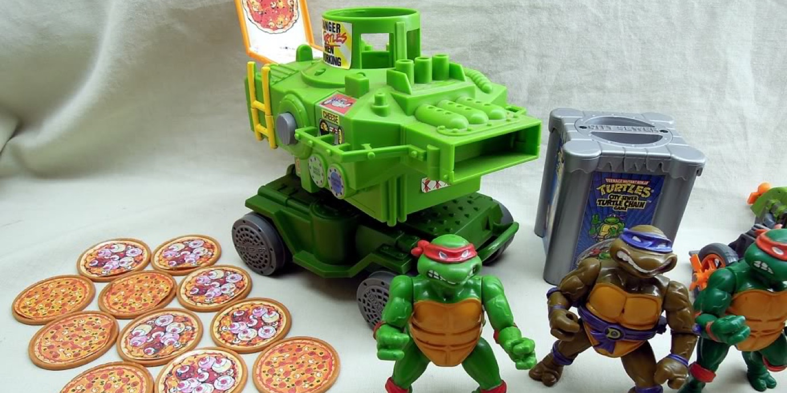
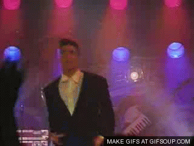
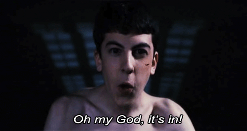
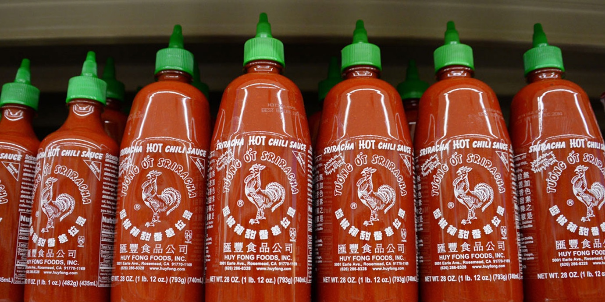

import { Image } from '$components';

"I’ll be happy once I solve this problem." But with the solution comes new
problems. Can we ever be happy? Or do we only pursue happiness and never feel
it?

## ...I Get This Toy

In 1989 I was obsessed with the Teenage Mutant Ninja Turtles.

I dressed up as a Ninja Turtle for something like four straight Halloweens,
watched a VHS tape with a few cartoon episodes until I literally wore it out,
and owned dozens of TMNT toys.

<Image
  caption="The epitome of combat effectiveness and practicality."
  creditLink="https://playmatestoys.com/brands/teenage-mutant-ninja-turtles/"
  credit="Playmates"
>

  

</Image>

So when the [pizza thrower][1] came out, _I had to have it._

<Image
  align="right"
  caption="Go ninja! Go ninja! Go!"
  creditLink="http://amzn.to/1O1Ldwi"
  credit="TMNT II: The Secret of the Ooze"
>

  

</Image>

I begged. I bargained.[^next-birthday] I threw tantrums.

And on Christmas morning, 1989, I found a gift just the right size under the
tree. The clouds parted, an other-worldly glow illuminated the box, and an
angelic Foot Clan choir burst into [_Ninja Rap_][2] as I unwrapped the pizza
thrower.

I had imagined this moment for months.[^reality] It was going to _change
playtime forever_ — all of my friends would be _so_ jealous. I would _never_ get
sick of this toy.

**I'd be so happy once I had this toy.**

Within days — maybe even hours — I had lost all the pizzas. And besides, I could
never hit my target anyways because the pizzas were stupid and probably broken
or something.

I lost interest before the batteries died.

## ...I "Get Some"

In 1999 I was obsessed with getting a girlfriend.

I — like every other kid my age — was the only one who was single, and I was
_definitely_ the only virgin left in the world.

In my room, listening to [Korn][3] and writing poetry, I'd imagine how different
life would be for me once I had a girlfriend. I'd be popular. Better-looking.
I'd get invited to parties.

**I'd be so happy once I had a girlfriend.**

In history class I sat next to Tammy West.[^fake-name] We were both weird kids,
but in different ways.

Tammy had grown up fast, and tried to dress and act the part — except she'd
built her entire model of how a sexy, adult woman acted from _Sex and the City_
and various James Bond films.

She wore pleather bodysuits. Vinyl miniskirts. Knee-high boots. Crimson
lipstick.

I wore heavy metal t-shirts, glow-in-the-dark sneakers with a hidden compartment
for drugs in the soles, and black nail polish.

Both of us stood a little outside the group, and our mutual lack of belonging
helped us form a bond.

Tammy — despite her efforts to appear grown-up and sexy — was a virgin, just
like me.[^clever]

And — despite my attempts to end my sex life before it began with my fashion
choices — Tammy had a crush on me.

We became an odd couple. My friends teased me. I imagine her friends teased her.
But we didn't care.

A few weeks into our strange relationship, Tammy rented a hotel room[^pervert]
and she took me upstairs.

We didn't know about foreplay. We didn't know about "being sexy". We just
awkwardly undressed in front of each other and climbed into the bed.

In the time it took me to say, "Oh my god, it's in!" — it was over.

<Image creditLink="http://amzn.to/1LLT6IK" credit="Superbad">

  

</Image>

I was a man now. I had a girlfriend. I was no longer a virgin.

But I didn't feel any different. I certainly wasn't any cooler. My locker wasn't
flooded with notes inviting me to parties.

I was just a weird kid who had a weird girlfriend. We didn't last a month.

## ...I'm Free

In 2009 I was obsessed with independence.

I had just ended a serious relationship, and I had a job at FedEx Office to keep
the lights on while I pursued a full-time freelancing career in web design.

I had imagined self-employment for years. No boss! No office! No pants!

**I'd be so happy once I worked for myself.**

Toward the end of the year, I had landed one client. He agreed to pay me an
amount that would _just_ cover my rent and phone bill. The contract would last
three months.

I put in my notice at FedEx, bought a pallet of Top Ramen, and took the plunge
into working for myself.

<Image creditLink="http://www.huyfong.com/" credit="Huy Fong Foods">

  

</Image>

My business grew, and soon I was able to buy a bottle of sriracha to add a
little excitement to my ramen.

And then I needed to pay taxes. And decide if I was going to be a
sole-proprietor, and LLC, or an S-corporation. And figure out how billing works.
And come up with an agreement to sign with new clients.

The list grew so quickly that I went to bed most nights feeling that I'd made a
huge mistake and that I needed to find a new job immediately.

## ...Ever I'm Moving Forward

In 2014, I'm obsessed with the journey.

I've realized that I won't find happiness in a goal: not a toy, not an act, not
an event.

Those goals are all milestones. Progress markers to let me know that I'm moving
in the direction I want to move in.

_But they're not the end of the journey._

Happiness is a continuum, not an possession. I've realized that I was looking at
happiness as a prize that I'd receive once I'd solved "the right problems".

I hadn't thought all that hard about it, but I was imagining a finish line,
where I'd cross the threshold, be greeted by [insert current celebrity crush
here] with a bouquet of flowers and a magic amulet that granted me happiness
henceforth, and I'd just be...done. With being alive.

I win, your princess is in this castle, game over, congratulations.

Which is the entire problem: **I was looking at happiness as a destination.**

Like, "Oh, I know I'll be happy once I get to the top of this mountain. I just
have to suffer through the climb and then all my problems will be solved!"

Then, upon reaching the summit, I'd think, "It's awful cold on this mountaintop.
What a fool I've been! Clearly, the answer is to make my way to that valley —
once I get there, all my problems will be solved!"

Now, climbing the mountain was necessary, because I couldn't see the valley
until I reached the summit. But I was looking at it all wrong: I was looking at
the mountain as the end of the journey instead of simply the next step in a
journey that only ends when I die.

**I was assigning all of the happiness to _completing_ the task, rather than finding joy in the process of learning, of working toward a goal, of improving bit by bit.**

I wasn't allowing myself to enjoy the fun part.

When I'm working toward a goal, I'm challenged. I'm out of my comfort zone and
learning new things.

But when I've achieved the goal, all of those challenges are gone (momentarily)
and I feel a sense of loss. Loss of purpose. Loss of a challenge.

**It's not until I find the next milestone to work toward that I'm happy again.**

## Changing the Conversation

I no longer say, "I'll be happy when..."

Instead, I say, "I'll be happy as long as..."

...as long as there's a new adventure ahead of me.

...as long as there's a challenge to overcome.

...as long as I'm surrounded by people who are smarter than me in the areas
where I want to improve.

...as long as I am doing the things that I've decided are important to me (and
not putting them off for the sake of obligations or laziness).

Because I don't know what I want tomorrow. I don't know what I'll see from the
top of the next mountain that I climb.

**But I know that I'll be happy as long as I'm climbing.**

[^next-birthday]:
  "No, Mom, I promise! If you get me this you don't have to get _anything_ for my next birthday! Honest," he said, for the third straight year.

[^reality]:
  In fairness, I was four years old, so it was probably only a few days.

[^fake-name]:
  Not her real name, for reasons that will become apparent.

[^clever]:
  I discovered this through masterfully surreptitious methods: "Are you a virgin?"

[^pervert]:
  Tammy was able to rent a hotel room at 16 because a middle-aged man ogling a teenage girl doesn't want to look at her ID to learn exactly how big a pervert he is.

[1]: https://www.youtube.com/watch?v=lQOo17fHTKE
[2]: https://www.youtube.com/watch?v=R_K6971WmAs
[3]: https://www.youtube.com/watch?v=2s3iGpDqQpQ
