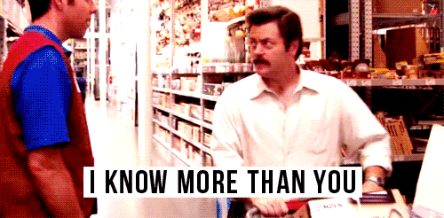

import { Image } from '$components';

One of my early jobs was at a local publishing house, where I did typesetting
and rudimentary layout work for field guides. There was a guy there — we'll call
him Carl — who handled the still-new digital aspect of the business.

I had built a website or two at this point. My work was total amateur hour, but
I could tell that this kind of work was something I enjoyed.

Carl was the first person I'd met who worked on websites for a living.[^montana]
At the time, he represented all of the things I wanted in my career. So I looked
up to him as a mentor.

> Hey, Carl, can I ask you a question? How can I get to where you are? What
> should I do?

Carl looked at me, sizing me up. He had a smirk on his face. His condescending
gaze was amused, like, "Who the fuck does this kid think he is?"

<Image
  align="right"
  caption="I want to make sure you feel like a complete idiot."
  creditLink="http://www.imdb.com/title/tt1266020/"
  credit="Parks and Recreation"
>

  

</Image>

I felt ashamed. I wanted to take my question back. I wanted to hide under the
desk until Carl left for the day so I could slink home.

He looked at me for a long time. I shriveled under his stare, questioning
everything about myself.

"Can you tell me the difference between cell padding and cell
spacing?"[^perspective]

I was pretty sure I knew the answer. I thought maybe it was a trick question. I
second-guessed myself. I hesitated.

He chuckled and shook his head, disappointed.

"You're not ready to handle the kinds of work I do."

## Carl Was an Asshole

Carl was forty-something years old, working a job that — in retrospect — was
entry-level at best. His skill level was nothing to brag about; he could get the
job done, but no one was going to knock any doors down to hire him.

But Carl was a big fish in a small pond. There was no competition for his job,
because no one in Montana at the time was taking digital media very seriously.

<Image
  caption="Pay no attention to the dickhead lording his junior-level skill set over your head."
  creditLink="http://amzn.to/1JF0EdZ"
  credit="The Wizard of Oz"
>

  

</Image>

This made Carl a lot like the Wizard of Oz: he was mysterious and powerful,
dealing in forces that few people really understood.

And I was Dorothy, lost on this brand new career path, looking for someone to
guide me.

I was an eager student. Carl was in a position to help me out.

Instead, he chose to be an elitist asshole and made me feel stupid for not
knowing the things I'd just asked him for help with.

## Fear of Becoming Irrelevant

I used to think that Carl just didn't like me. He thought I was some dumb kid
who wouldn't amount to much and who was probably just on his hobby of the week.
Why waste time on the likes of me?

But I think something else may have been at play: Carl might have seen me as a
threat.

Not directly. Carl wasn't thinking, "Oh no! This kid's about to take my job!"

On some level, though, I think Carl may have seen my questions as a threat to
his job security. After all, if enough people learned this stuff, it'd be a lot
more difficult for him to remain the big fish.

Carl wanted to be indispensable. He wanted to be the lynchpin in the
organization, without which everything would go off the rails.

That meant treating his knowledge like a trade secret, and boxing out anyone who
might weaken his grip on this job.

But it didn't excuse humiliating a teenager for showing interest in his field of
expertise.

## "Don't Be Like Carl"

Last week I was in Boston speaking at an event.

On one of the evenings there was a cocktail mixer at a bar called Lucky's, a
basement bar in South Boston. It was the sort of dimly lit, brick-walled dive
where you imagine finding disreputable people discussing unsavory acts, but
actually find disinterested twenty-somethings discussing undiscovered bands.

<Image align="left">

  

</Image>

As the night wound down, the group I was standing with was approached by this
kid, [Jake][1], who looked like he was about 12 years old. He was 20, in
college.

For a moment, I was dismissive. _He's probably out of his depth,_ I thought. _I
hope he doesn't start asking a bunch of dumb questions._

And then I was angry with myself for letting thoughts like that into my head. I
remembered how it felt when I asked Carl for advice, and how humiliated I was
when he talked down to me and made me feel like I was too dumb to play on his
level.

_Don't be like Carl,_ I reminded myself.

Jake was outgoing, curious, personable. He asked a ton of questions, and the
whole group joined in to answer them as best we could.

At one point I started giving him shit because he kept pulling his phone out.

"I'm taking notes on what you're saying," he told me.

This was both flattering and terrifying. _This kid is listening to me? Is
that... Should he be doing that?_

But it felt good. Here was this kid: excited to learn, passionate about building
a career, and looking to me for a little guidance.

Jake was an eager student. I was in a position to help him out.

I could have been an elitist asshole. I could have done my best to assert my
superiority and make him feel dumb.

But it felt way better to help him out.

And Jake felt good about things, too; later that evening, I got a note from him:

https://twitter.com/thejakepruitt/status/527644976113803265

## There's Room for All of Us

Jake will end up being pretty successful. He's smart, ambitious, and he's got a
head start on his career. He's years ahead of where I was at his age.

So should I worry about Jake replacing me?

Maybe. But at least now I can remind him that I was a helping hand on his way
up, and hope that he'll give me a job when he does.

[^montana]:
  During the early 2000s in Montana, there were approximately seven people who knew what the internet was.

[^perspective]:
  For the non-nerds in the room, let me try to put this question into perspective. Imagine you're curious to know more about engines, and you ask a mechanic how what you should do to learn more about cars. In response, he says to you, "What's the difference between using a horse to pull your carriage, or using a donkey?"

[1]: http://javascriptjake.com/
