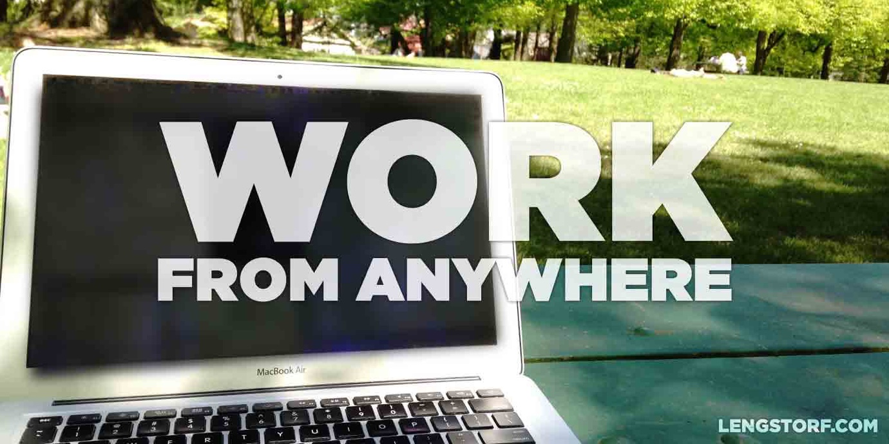

import { Image } from '$components';

_Holy shit,_ I thought, _I'm actually about to do this._

My heart was pounding. The room was dark. I wanted to sprint around the block or
do pushups or scream — anything but sitting still in this moment.

I had told my friends about this plan. I'd even mentioned it to some colleagues.
But now — staring at the computer, at the last step, ready to finalize
everything — I was hesitant.

I felt [The Fear][1] creeping up my spine, wrapping around my throat.

_This is where you find out if you're a liar._

Deep breath. Self-assured nod to [my imaginary audience][2].

I booked the ticket.

## The Experiment: Live an Entire Year without a Home Address

If I imagine my perfect week, it's built around travel.

I love exploring a new city, trying new food, meeting people with different
backgrounds and perspectives, and learning about the culture and history of
another corner of the world.

I also work remotely. This means — as long as there's a decent wifi connection —
I can do my job from anywhere.

I don't want to take my situation for granted, so I'm ready for a new adventure.

The lease on my apartment in Portland expires at the end of this year, and I'm
not going to renew it. I won't be taking on a new lease, either.

Instead, I'll spend the holidays this year selling off everything I own and
putting a few things I can't bear to part with into a small storage unit.

Then, on December 30, 2014, I board a one-way flight to Milan, Italy, with the
intention of wandering around Europe, living month-to-month in places I'll rent
on [Airbnb][3]. The primary objective of this trip is to spend a full year
living and working abroad.

## What I Hope to Accomplish by Spending a Full Year Outside the US

There are myriad reasons I want to take this trip. At the root of it all, more
or less, is my interest in learning what I'm made of — a [rite of passage][4],
so to speak.

In addition to my general curiosity about whether or not I can handle it, I've
also made a lot of big claims to my friends and family.[^strangers] This trip is
a way for me to test these hypotheses.

<Image caption="When I go to Paris, I don’t want to eat my dinner at 4pm.">

  

</Image>

### Hypothesis 1: We Don't Have to Wait Until We Retire to Travel

Since I travel often, a lot of conversations over drinks end up centering around
travel. And for the people who like the idea of travel, I tend to hear a lot of
the same reasoning for why they don't do enough of it:

> "I'd love to travel, but it's just too hard with how busy I am. I'm planning
> to do a lot of traveling once I retire, though."

I've never been a big fan of this line of reasoning. Why should I have to wait
until I'm 65 to start doing the things I want to do? **I don't think it's
necessary to wait until retirement to start enjoying life and knocking items off
my bucket list.**

Waiting for retirement is a gamble, and I'm not sure I want to take the risks.

For example — let's get morbid for a second — you might die before you ever
reach retirement. And the idea of deferring happiness to a future you may not
live to enjoy[^too-old-for-this-shit] is just about the saddest thing I can
imagine.

<Image align="right" caption="Not exactly a casual stroll.">

  

</Image>

There's also that whole problem with getting older: if your bucket list includes
physically taxing adventures — like walking the Great Wall of China or running
with the bulls in Spain — there's a reasonably good chance your 70-year-old self
won't be up to the task and you'll just... never do that.

I don't have the same goals I had ten years ago.[^change] I don't want to place
bets that the guy I'll be 35 years in the future will still want the things I
want today.

I may not always want to learn to surf in Costa Rica. But I want that now, and I
don't see any reason why I shouldn't go out and do it.

### Hypothesis 2: It's Possible to Be Productive During Sustained Periods of Travel

<Image
  align="left"
  caption="All I need’s a song in my heart and some juice in my battery."
  credit="Jason Lengstorf"
>

  

</Image>

**Can I manage to stay productive while constantly exploring new places?** I aim
to find out.

In the past, I've seen a steep drop-off in productivity when I travel. I have a
big list of things I want to explore, and a limited amount of time in which to
do the exploring.

On a vacation, this is fine: I shouldn't be working on my vacation anyways. But
if the idea is to be traveling _semi-permanently,_ it becomes a much bigger
issue if I'm not getting anything done.

Through my work [speaking at conferences][5], I've learned to block out my time
and get things done without locking myself in a hotel room and missing the whole
point of travel.

What I'm hoping to do with this year abroad is to refine my approach to
work-life balance, figure out the minimum amount of hours required to meet my
productivity goals, and spend the rest of the time out in these new places
guilt-free.

### Hypothesis 3: It's Just as Cheap (or Cheaper) to Live Abroad

<Image align="right">

  

</Image>

Let's do a quick math problem: how much is your rent?

Now add your utilities. Cable. Internet. Renter's insurance. Do you have a
cleaning service? Add that.

The sum of all those bills is what you're _actually_ paying to live where you
live.

Now go look at [all the places on Airbnb][6] that cost less than that per month.
And remember: Airbnb includes the wifi, cable, and utilities.

**Without any other changes in lifestyle, it should cost me less overall to rent apartments month-to-month overseas than I pay right now to live in Portland.**[^location]

<Image>

  

</Image>

### Hypothesis 4: It's Healthier to Live Abroad than It Is to Live in the US

First, let me remind everyone that _I am not a scientist, a dietician, a fitness pro, or any other form of expert_ on the subject of health, so let's make sure we're all taking this with a grain of salt, okay?

I believe I will be healthier just by living in Europe instead of the US.

To start, I know that I will be walking more while I'm there. I probably won't
have time to get a driver's license in many of the countries I visit, and I
don't necessarily want to spend a fortune on taxis. This will mean a lot of
walking and public transit.[^walking]

Additionally, a lot of the terrible, fake shit that ends up in food in the US —
stuff like artificial coloring and synthetic hormones — is outright illegal in
Europe. Plus, even though it's not banned, there's a _lot less_ high fructose
corn syrup in food over there.

At the risk of sounding a little _woo woo_ about it all, I'm pretty convinced that **I'll be eating healthier in Europe without making any changes to my diet,** simply because the food is made from, y'know, _food._

### Hypothesis 5: Living Abroad for an Extended Period of Time Means Big Tax Breaks

This is the one I'm least certain about. However, as far as I'm capable of
comprehending the US tax code, it should be possible — and perfectly legal — to
claim the [Foreign Earned Income Exclusion][7], which basically means that _I
don't pay income tax on any money I make during the year._

Here's my understanding of how this works: if I don't have a home in the US and
I'm outside the United States for [a minimum of 330 days in a 12-month
period][8], I can claim the exclusion. That means up to roughly $100,000 of
income becomes tax-deductible.

<Image align="left">

  

</Image>

The deduction exists because income tax pays for a lot of infrastructure —
healthcare and emergency services, highways, and such — that I won't be in the
country to use, and therefore won't be paying for while I'm gone.

So if I make the full hundred grand, **I could save nearly $25,000 in taxes.**

I know. Holy shit, right?

There's a requirement that your "tax home" needs to be in a foreign country, but
for those of us who are working remotely, that's not an issue because we don't
have a "main place of business":

> If you have neither a regular or main place of business nor a place where you
> regularly live, you are considered an itinerant and your tax home is wherever
> you work. <small>Excerpt from
> <a href="http://www.irs.gov/Individuals/International-Taxpayers/Foreign-Earned-Income-Exclusion---Tax-Home-in-Foreign-Country">"Tax
> Home in a Foreign Country"</a></small>

The only other thing I was worried about is that my employer, Copter Labs, is A)
my company, and B) based in the United States. But this line from the tax code
seems to imply that's not an issue:

> Foreign earned income is income you receive for performing personal services
> in a foreign country. [...] For example, income you receive for work done in
> France is income from a foreign source even if the income is paid directly to
> your bank account in the United States and your employer is located in New
> York City. <small>Excerpt from
> <a href="http://www.irs.gov/Individuals/International-Taxpayers/Foreign-Earned-Income-Exclusion---What-is-Foreign-Earned-Income">"What
> Is Foreign Earned Income"</a></small>

I'm still wary that there will be a gotcha in the tax code somewhere, but I'm
cautiously optimistic that I will be able to claim the Foreign Earned Income Tax
Exclusion for every penny I make in 2015.[^cautious]

_**[UPDATE — December 31, 2014]** After consulting with Steve Barkley (my
accountant) and [Roz at Tax Warriors][9] (an incredibly generous accountant who
helped me out with research in her spare time), I'm now 100% certain that I'm
interpreting the tax law correctly, and that I won't pay federal income tax as
long as I meet the requirements laid out above._

_However, I did find out that state taxes aren't set up the same way. Oregon, for example, doesn't consider your residency terminated until you've established a permanent residence elsewhere, and they're apparently pretty aggressive about collecting. If you're considering taking a similar move, it would be wise to plan ahead and establish residency in a [state without income tax][10]._

_Part of getting ready to leave, in my case, included changing my address to my parents' place in Washington. They're receiving my mail while I'm away, and if anything happens to me I'd like to be returned to my parents. Plus, when I_ do _return to the United States when this whole thing is over, I'll be moving in with my folks for a bit while I reestablish myself._

_This, of course, has the additional benefit of making me a Washington resident. Before leaving, I got a WA driver's license and registered to vote. The tax benefits, while certainly not unappreciated, are a secondary bonus to knowing that — should something bad happen to me — my address on record will put me at my dad's front door._

## I Will Sink or Swim in Public

I gave a lot of thought to whether I should talk about this before I left, or if
I should wait until 2016 and post a recap (or, if everything failed, just do
nothing).

I've decided that I want to give the most honest account I can of learning how
to be an expatriate. In order to do that, I need to write about the things I'm
thinking _as I'm thinking them_ — if I come back and do a "here's what I
learned" post, it'll skew the details because I'll be writing from a place where
I know the answers.

**Right now I don't know how this will work.** I might find out six weeks in
that I really, _really_ hate not having my own apartment and just bail
altogether. I might be horribly mistaken about how much it will cost me to live
abroad, and I'll have to come back to the US with my tail tucked to avoid
bankruptcy. I might get audited by the IRS and end up totally screwed.

Because I don't _actually_ know how this will all go down, this post is naïve in
a lot of ways. I'll look at it in the future and cringe.

"What a fool I was!" I'll cry to the heavens.

I want to collect all of the ignorance and obstacles I'm facing, and the
subsequent realizations and strategies to overcome those obstacles. I want to
document the path from zero to "I can hang".

And at the end, **I hope to have compiled a reference manual that will help me
succeed as a remote worker and vagabond.** (And you, if you're into taking the
plunge.)

Or, at the very least, I'll have a charming story about that one time I went to
tax jail.

P.S. If you want to follow along as I go on this adventure, make sure to
[subscribe for updates][11] so new posts go straight to your inbox.

[^strangers]:
  And anyone who was unfortunate enough to ask, "So what's next for you?"

[^too-old-for-this-shit]:
  Especially if [you're a cop][13].

[^change]:
  Some of my goals — doing projects for Fortune 500 companies, getting strong enough to do bodyweight chin-ups — were met. Others — working as a touring musician, building the next hot app startup company — just don't match up with what I want anymore.

[^location]:
  Portland isn't even all that expensive a place to live; for those living somewhere like San Francisco or Manhattan, the difference could be huge. If you're living in Montana, though, this probably doesn't hold true for you; I still fantasize about my $600/month, two-bedroom apartment in Missoula.

[^walking]:
  I've already seen the benefit of walking: I got rid of my car earlier this year and started walking a lot more around Portland. Since February, I've lost 30 lbs. I've done other things beyond just walking more, but the walking certainly didn't hurt.

[^cautious]:
  I'm not entirely convinced this will actually work, so I'm going to keep all the money for taxes in a separate account that I won't touch until I get confirmation from the IRS that I didn't screw anything up.

[1]: /fear
[2]: https://medium.com/project-grownup/the-real-life-truman-show-1cd6b2aa9c34
[3]: http://www.airbnb.com/c/jlengstorf "Get a $50 Airbnb credit if you sign up with this link"
[4]: /growing-up-vs-growing-older
[5]: /speaking
[6]: http://cptr.me/1oNJ4N0
[7]: http://www.irs.gov/Individuals/International-Taxpayers/Foreign-Earned-Income-Exclusion
[8]: http://www.irs.gov/Individuals/International-Taxpayers/Foreign-Earned-Income-Exclusion---Requirements
[9]: http://www.taxwarriors.com/rosalind-w-sutch/
[10]: http://en.wikipedia.org/wiki/State_income_tax#States_with_no_individual_income_tax
[11]: /newsletter
[12]: http://portland.craigslist.org/search/sss?userid=247646546
[13]: http://tvtropes.org/pmwiki/pmwiki.php/Main/Retirony
