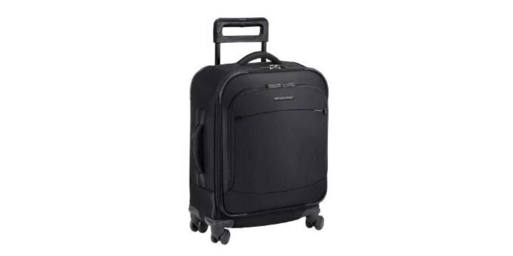
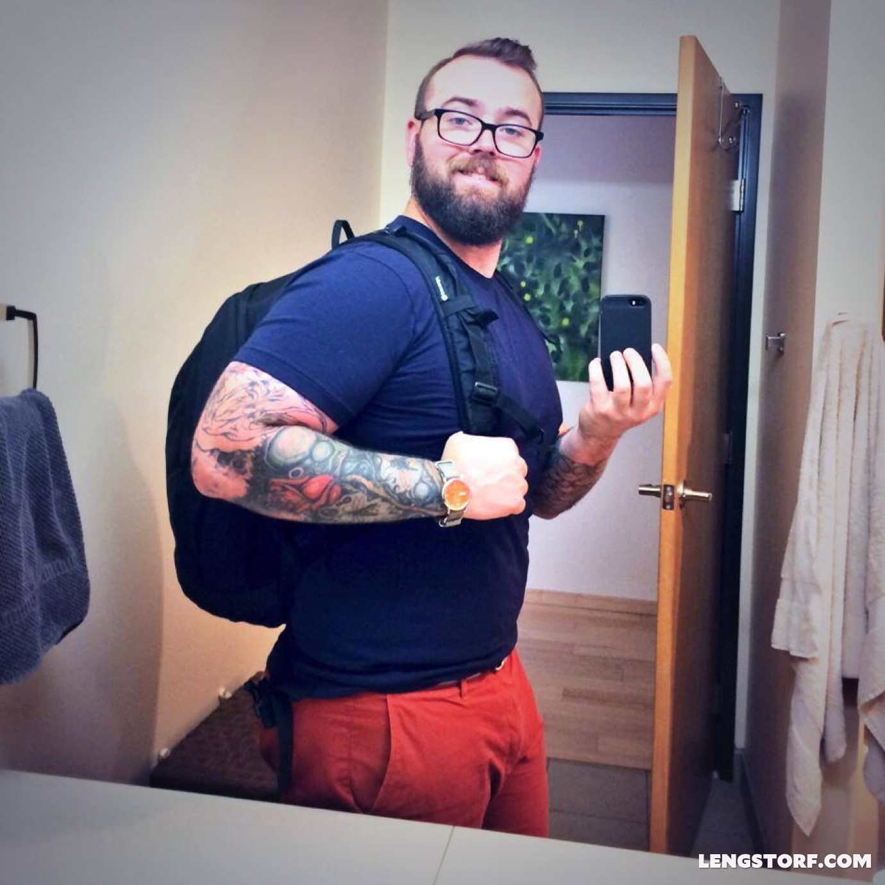
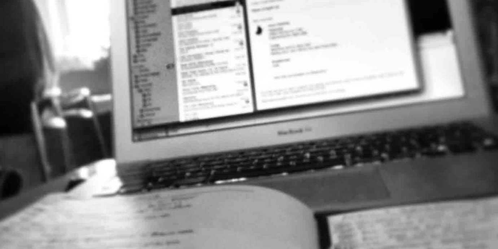
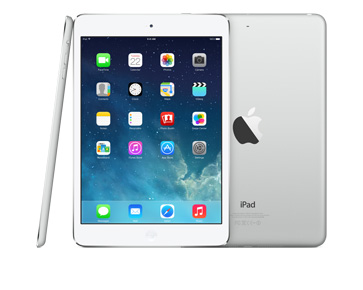
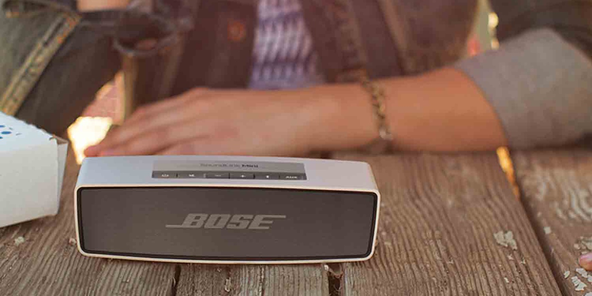
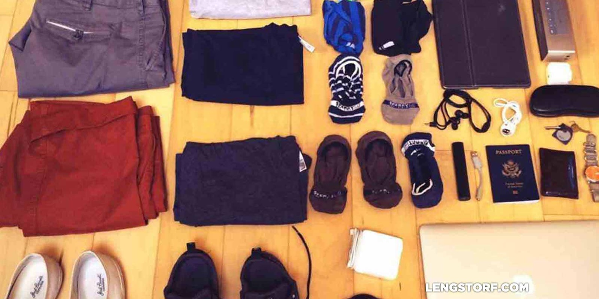

import { Image } from '$components';

"You do realize you're very late," he said.

I was in the Dublin Airport, heading back to Portland, Oregon. I'd shown up
ninety minutes before my flight was scheduled to take off — plenty of time, I
had assumed, unaware that US Customs was handled on the Dublin side of this
flight — and the guy behind the ticket counter advised me that I "may want to
run."

I lugged my duffel up onto my right shoulder, clutched my computer bag to my
left side, and started jogging toward security. I was winded almost immediately;
I reached the security line panting and miserable.

By the time I got to the US Customs line, I was drenched in sweat, and my right
shoulder was on fire from hauling the duffel.

<Image
  align="right"
  caption="Artist’s depiction of me in the Dublin airport circa 2013."
  creditLink="http://mickey.disney.com/donald"
  credit="Disney"
>

  

</Image>

During the agriculture inspection, I heard the final boarding call for my
flight. I snatched my bags from the belt and sprinted for the gate, breathlessly
waving my boarding pass at the gate agent as she was about to close the boarding
door.

I spent the next seven hours feeling my muscles knot up and wondering just how
bad I must have smelled.

_There's gotta be a better way to travel,_ I thought to myself.

## Traveling Well Is an Art

My experience in Dublin helped me realize I was making a lot of mistakes in my
travel, and nearly all of them were related to the gear I was using. I had the
wrong bag — a big, awkward duffel — and a lot of junk in it that added too much
weight and too little value.

Since then, I've worked to **refine my travel gear to just the essentials:** all
the right luggage, clothing, and accessories to ensure I'm set up for remote
work and extended travel _without making travel days miserable._

## Part I — Choose the Right Luggage

After putting in a lot of miles with several different bags, I've developed some
strong preferences based on my experience with each.

Since I travel with a carry-on only, I get two bags on each trip:

1. A suitcase or duffel bag for the overhead bin
2. A smaller bag that I can stuff under the seat in front of me

### 1. A Carry-On Suitcase or Duffel for the Overhead Bin

When I first started traveling heavily, I was pretty judgmental about rolling
bags. I thought they were for the lazy and spoiled, so I bought a [big
traveler's backpack][1] without wheels[^womens-bag] and put on a smug face as I
lugged it through the airport, wearing the sweat stain growing on my back as a
merit badge; I was a _real_ traveler — these other lazy bastards were just
tourists.

Then, later, I realized I was being an idiot because having a bag that doesn't
roll _sucks._ I decided to upgrade to a better carry-on bag.

After reading a lot of reviews, I decided I didn't want the _fancy_ fancy bags —
no need to blow a ton of cash on something just for the brand name. (And, if you
swing toward the alarmist end of the spectrum, a thief would likely target a
traveler dragging around a thousand-dollar suitcase: there's a far better chance
that the things inside are similarly high-priced compared to a traveler with
cheap luggage.)

That being said, I also didn't want a piece of crap bag that I'd need to replace
after a year or so of heavy use.

So I opted for something in the upper-mid range that had everything I needed:
[**the Briggs & Riley Transcend Carry-On Bag**][2].

<Image
  align="right"
  creditLink="http://amzn.to/1FPbZW3"
  credit="Briggs & Riley"
>

  

</Image>

I love this bag for a few reasons.

First, _the construction is sturdy._ The handle doesn't feel like it's going to
snap off, and the wheels are still rolling true after about 40 flights.

Second, it has _exactly the right amount of storage_ for what I travel with. The
pockets inside fit my two toiletry bags perfectly, and the front pockets are
good for cables that don't need to go in my small bag. There's also a skinny
pocket between the handle supports on the back that's perfect for a sunglasses
case.

Finally, it has a separator that clips together so I can put socks, underwear,
and shoes at the bottom, strap 'em down, then put my shirts and pants on top.
Or, after a few days, my dirty clothes and shoes at the bottom and the clean
stuff on top.

Nowadays, rolling my bag next to me with one hand, backpack set nicely on top,
coffee in my free hand, I don't feel like a sellout. I feel like a man who will
arrive at his destination clean and ready to go, rather than disheveled and
soaked in sweat.

### 2. A Small Bag to Put Under the Seat

I've never been a huge fan of backpacks. Even the big traveler's backpack I used
to travel with before I got the Briggs & Riley was always carried as a duffel
with the straps zipped away.

Instead, I've always leaned toward the shoulder bag.[^murse] It felt more
grown-up against the schoolboy look of a backpack.

But my bag is fairly heavy when it's loaded with my computer, chargers, and
miscellaneous electronics I need or want to have with me. And after carrying
around a messenger bag for a good number of years, I ended up with a noticeable
imbalance between my shoulders.[^thriller]

Deep tissue massages hurt like hell, so I made the decision to get over my
aversion to backpacks. In the beginning of 2014 I switched to using a [**Pacsafe Venture Safe 25L GII Backpack**][3], and I haven't once regretted the decision.
I even (kind of) feel cool wearing it.

<Image
  align="left"
  caption="I feel pretty cool wearing this bag."
  creditLink="http://www.pacsafe.com/venturesafe-25l-gii-anti-theft-travel-pack/60300.html"
  credit="Pacsafe"
>

  

</Image>

This is a backpack specifically designed for travel, and while some of its
features strike me as paranoid — slash-proof straps and locking closures so you
can strap it down to a chair, for example — others seem pretty damn smart.

The one that I really like is the _RFID-blocking passport pocket in the front._
It's big enough for me to fit both my passport and wallet inside, and it adds a
little peace of mind in an age where stealing someone's identity is as simple as
joining an open wifi network or carrying an RFID reader in your bag.

_There's a laptop sleeve inside the big zippered section,_ and an additional
pocket next to the RFID pocket in the smaller front zippered section. I'm able
to fit my laptop, a Bluetooth speaker, all my charging cables, my passport and
wallet, headphones, gum, a neck pillow, a hat — and there's still plenty of room
to throw in a change of clothes and a towel.

<Image credit="Jason Lengstorf">

  

</Image>

## Part II — Assemble Essential Working Gear

Even on trips that I might call "vacations", I still end up doing a little bit
of work. I really enjoy what I do for a living, so it's nice to have a full day
of exploring and playing, then spend part of the evening with a drink getting
something productive done.

For that reason, I never travel without my essentials for getting work done
while traveling.

### 3. Laptop Computer

Everything I do requires a computer, so I always have one available. Currently
I'm using a [**15" MacBook Pro**][4].

I've previously worked on a 17" MacBook Pro, but I found it to be way too big
for use on an airplane. I had an 11" MacBook Air for a long time, but the work I
do in Photoshop was a little too taxing and it started to drag on me.

If I were to purchase a new computer right now, it would probably be a 13"
MacBook Pro, upgraded as far as it can go with RAM and processing power. That's
small enough to use on a cramped airplane tray table, and it still provides
plenty of screen real estate for working (especially with an external display).

### 4. Headphones

In some circumstances, I really like to sit and listen to the world around me. A
coffee shop can be great for focus,[^research] and the sound of the ocean makes
even the most tedious tasks feel a lot less like work.

Most times, though, throwing on headphones and a [good working playlist on
Spotify][5] is the best way for me to keep my productivity really high so I can
get things done and shut down so I can eat my way across Europe.

I've never been big on over-the-ear headphones because they're just too bulky
for my taste. I know they sound better, but to me the trade-off in sound doesn't
justify the size.

For a long time I used [sound-isolating in-ear headphones][6] — basically
earplugs with holes in the middle where music is piped through — but I
ultimately settled on using the **plain old Apple headphones** for a few
reasons.

First, the sound is fine to my ears. I'm not an audiophile, and I'm typically
only wearing headphones in a space where there's a shitload of ambient noise, so
the subtleties and nuances in the music won't make it through to my ears
anyways.

Second, I like the microphone and volume control that's built into the cord.
It's as good as any Bluetooth headset or bulky wired headset I've found, and I
don't feel awkward wearing them in public.[^bluetooth]

These are definitely a simple item, but I miss few things more than headphones
if I forget them.

### 5. Tablet

I've heard of people switching to tablets and ditching laptops altogether, but
that's definitely not me. I still need an actual computer to get real work done,
at least for the time being.

<Image align="right" creditLink="http://www.apple.com/" credit="Apple">

  

</Image>

However, a tablet is a great way to add a sort of Swiss Army Gadget to your
travel kit. I use an iPad for a few purposes, each of which is very different
from the others (and extremely useful to me).

**1. A tablet is a book.** I actually prefer the Kindle's display since it's
more like paper, but to avoid carrying two gadgets I'm perfectly happy to read
on my iPad.

**2. A tablet is a TV.** Occasionally, I'll set up my iPad to play something
off Netflix, Hulu, or Amazon. This is helpful for days when I feel an
uncontrollable urge to watch the [Countdown episode of _The IT Crowd_][7].

**3. A tablet is good for killing time.** When I only have a few minutes, or if
I'm just not in the mood to read, I'll use my tablet to play sudoku or some
other casual game.

### 6. Extra Monitor

I know, I know. Packing an extra monitor sounds unnecessary. But hear me out.

I love having a little extra screen real estate to work with; having messages
and utility apps on a secondary screen helps me quickly scan what's happening
without taking my focus away from whatever I'm working on.

To that end, I picked up the **[ASUS MB168B+ monitor][8]**. It's incredibly
light, and I can fit it in the laptop pocket of my backpack along with my
laptop, so there's virtually no added bulk.

It's USB-powered, which means it's really easy to use. However, that also means
the screen's brightness and sharpness aren't on the level of bulkier monitors. I
wouldn't recommend this monitor as a place for doing graphics work, but it's
fantastic for messaging, the command line, or other text-based apps that I need
to scan as I work.

### 7. Unlocked Smartphone

These days, a smartphone is more or less essential to being alive. We've come to
rely on our phones to tell us everything from what we're doing today to who
loves us to where we should eat tonight.

Traveling abroad is no different, except it helps if your phone is "unlocked".
The difference, if you're not familiar with the term, is that an [**unlocked
phone**][9] allows you to replace the SIM card in the phone, which means you can
change it over to different providers and networks as you wander.

The primary benefit of this is that _you can continue to have a phone no matter
where you are in the world._ Things like maps and phone calls continue to work —
you just need to get a prepaid SIM card.[^phone-options]

When no reliable wifi is available, the phone can be used as a personal wifi
connection.[^hotspot]

I also use my phone to take photos. I'm not a photographer, so carrying around a
"good" camera is a waste of luggage space in my case.

### 8. Bluetooth Speaker

As a general rule, I have music playing at all times. Whether I'm having [a
shower dance party][10], putting on some folky tunes while I relax, or blasting
ridiculous hip hop for no reason whatsoever, there's always something on.

<Image  creditLink="http://amzn.to/1tXFl1e" credit="Bose">

  

</Image>

For the times when I don't need to keep my music to myself, I keep a Bluetooth
speaker with me. I've used several, but the one I like the most is the [**Bose
Mini Soundlink portable speaker**][11]. It's got solid battery life, the sound
is awesome, and it's not too big to stuff in the bottom of my small bag.

## Part III — Pack the Right Toiletries

Toiletries are definitely a given, and some of the things I bring with me —
toothbrush, comb, deodorant, fingernail clippers, etc. — aren't worth
explaining.[^toothpaste] However, a few of my toiletries might seem unnecessary
or strange at first blush; I assure you, they're not.

### 9. Your own shampoo and conditioner

Almost anywhere you would stay while traveling will supply shampoo, and most
will also have some kind of conditioner. Or at least the 2-in-1 combo stuff.

I used it for a long time. Why worry about packing extra stuff, especially when
airport security only allows you a thimbleful of anything liquid?

What I found was that bringing my own shampoo and conditioner helped me avoid
the feeling of being temporary. Using the same products that I use at home makes
me feel like I'm just having a normal day, which leads me to better productivity
and less of the "fuck it I'm on vacation" attitude.

It's worth the investment to get a set of [travel containers][12] and fill them
with your shampoo and conditioner.

### 10. Your own soap

I hate hotel soap. It's too unpredictable.

Sometimes it's really fancy, moisturizing, made-from-upcycled-angel-wings spa
soap, and other times it's more or less plastic that bubbles when it gets wet.
And — this is the worst — sometimes it's in a dispenser stuck to the inside of
the shower like the hand soap in a public restroom.

<Image
  align="right"
  caption="I keep my soap predictable."
  creditLink="http://amzn.to/1qMc6h2"
  credit="Pre de Provence"
>

  

</Image>

On top of this, I'm kind of a hippie about my soap; I like the [all-natural
soap][13] that's full of tree bark or lava rocks or whatever so I can feel it
getting the dirt off me when I scrub.

Having my own soap also helps with routine in the same way as bringing my own
shampoo and conditioner, but in this case it's more about knowing that I won't
be lathering up with pink soap from a push pump every morning.

### 11. Baby powder (or Gold Bond)

When I travel, I walk _a lot,_ and the climate usually isn't as temperate as the
Pacific Northwest. A light dusting of baby powder in a few key regions helps
ensure I don't end up feeling gross and smelly as the day wears on.

I use the [Gold Bond medicated stuff][14] because... well, honestly because it
feels fucking awesome.[^junk]

## Part IV — Know What Clothes to Pack

No one would call me fashionable. However, I _do_ care how I'm dressed, and I'm
not willing to give up what little fashion sense I have when I travel.

While traveling, I want to find a balance between wearing nothing but [Exofficio
gear][15] and packing an extra suitcase just for accessories and stylish hats.

### 12. The Uniform

The biggest improvement I've made in my style to date has been to choose "my
uniform".

This isn't a concept I came up with; people far more stylish than I, like Tom
Ford and Michael Kors, have adopted a uniform as a way of remaining fashionable
and keeping things simple.[^trends]

My uniform is extremely simple: a short-sleeve or 3/4 sleeve tee and either
jeans or chinos.[^shorts] I like this because it's casual enough to wear
anywhere, but nice enough I can wear it at a speaking gig or in most fancy
restaurants. It can be dressed up with a blazer or cardigan, or dressed down
with casual shoes.

Having a uniform allows me to pack lighter: all of the items I pack match each
other, so four t-shirts and two pairs of pants creates eight different outfits.

<Image
  caption="Choosing a uniform to wear while traveling makes it easier to pack light."
  credit="Jason Lengstorf"
>

  

</Image>

I buy my t-shirts from [American Apparel][16], and I really like the fit of both
[AG Jeans][17] and [Bonobos][18] straight leg chinos. You'll rarely find me
wearing anything else.

### 13. The Right Shoes

Packing tons of shoes is a great way to end up with a checked bag. To avoid
this, it's important to make sure you have versatile shoes that can serve a
number of purposes.

When I travel, I usually bring [Nike Frees][19] or [Jack Purcell Converse
All-Stars][20], [Ariat boots][21], [Merrell shoes with Vibram soles][22], and
flip flops.

The Nikes or Converse serve as my general-purpose shoes. They work with a "going
out" outfit, or with shorts, or with pretty much anything else I might be
wearing.

The boots are incredibly comfortable, so I like to wear them for walking. With
jeans, they actually look passable as "nice shoes" in case the sneakers are too
casual. And if the weather isn't ideal, they're good for the rain.

The Merrells are great for hiking or active stuff. I like the barefoot shoes —
the kind that _don't_ have individual toes. If you don't like that, you could
swap these out for sturdier hiking shoes or something more suited to the kind of
outdoor play you're into.

Flip flops are always good to have around in case of a beach run, a pool, or a
shared shower.[^open-toed]

### 14. 4–6 days' Worth of Socks and Underwear

No matter how long I'm gone for, **I rarely pack for more than 6 days.** Usually
I'll plan my longer stays in a place that has a washer and dryer, or I'll go to
a laundromat. As a last resort I'll pay for the hotel's laundry service.

I love [Sperry's no-show socks][23] for my sneakers, and I prefer [SmartWool
socks][24] for the boots. And — possible overshare, here — I wear [Diesel
boxer-briefs][25].[^underwear]

### Disclosure

Some of the links on this page are affiliate links. That means that if you
purchase something I've recommended here, the company sends me a little bit of
money. The cost doesn't change for you (and in some cases, it's cheaper), so
this is a win-win. If you'd rather not use the affiliate links, a Google search
will turn up any item by name.

**IMPORTANT:** I actually use every product and company I'm recommending here.
No one paid for my recommendations. If you have any questions or want to call
pics-or-it-didn't-happen, just [contact me][26].

[^womens-bag]:
  This is totally a women's bag. I didn't realize it at the time, but I really appreciated a lot of the "female-specific" features, such as the shoe compartment in the bottom. I'm not sure why this is considered a women-only bag, actually.

[^murse]:
  A.K.A. the messenger bag, man-bag, or murse. Fun fact: when I was younger, these weren't in style yet (in Montana, at least), so I taught myself to sew and made a pattern for messenger bags. I made three in total. The first one was horrible: corduroy and some kind of cheap velvet-ish liner — it looked like the inside of a club I imagine Ron Jeremy owns. The second was a somewhat passable effort made of black duck-cloth. The last one was actually awesome (I thought): I took tan, white, and black, and sewed them into a striped pattern. It had internal pockets with zippers and everything. I felt like goddamn Martha Stewart.

[^thriller]:
  Imagine a freeze-frame from the _Thriller_ music video.

[^research]:
  Apparently this is [backed by science][27]. That helps me justify the fact that I spent 10+ hours a day in the Whitefish City Brew between 2004 and 2006 while I was first building my freelance business.

[^bluetooth]:
  I really do try not to judge people who wear Bluetooth headsets in public. Despite my best efforts, though, I'm still guilty of playing the occasional game of "Bluetooth or Crazy?" when I see people walking down the street talking to themselves.

[^phone-options]:
  You can also work something out with your current provider in some cases. The costs and coverage vary, and some plans are _way_ better than others — just know that an unlocked phone isn't the only option.

[^hotspot]:
  This can get a little spendy, though, so make sure your current plan/SIM card provides enough data at a good price before you start tethering.

[^toothpaste]:
  If you _really_ want to hear why I prefer spearmint toothpaste over peppermint, I'm happy to rant about it [on Twitter][28].

[^junk]:
  Also my junk feels like an extra in [an Outkast video][29].

[^trends]:
  As an added benefit, a uniform also prevents you from trend hopping or misguided attempts to start fashion trends with [giant, lumpy hats][30].

[^shorts]:
  I also bring shorts when I'm going somewhere hot.

[^open-toed]:
  I wouldn't recommend wearing them otherwise, though, because they really suck to walk in, and some places want closed-toe shoes.

[^underwear]:
  The really colorful ones. Are you picturing it? What about now? You're welcome.

[1]: http://amzn.to/1F01AWe
[2]: http://amzn.to/1FPbZW3
[3]: http://amzn.to/10uwYxe
[4]: http://amzn.to/1y0zmIJ
[5]: http://open.spotify.com/user/spotify/playlist/2ujjMpFriZ2nayLmrD1Jgl
[6]: http://amzn.to/11MZ8V0
[7]: http://www.netflix.com/WiPlayer?movieid=70159087&trkid=3325852
[8]: http://amzn.to/1yX0wx5
[9]: http://amzn.to/1BWEIss
[10]: http://open.spotify.com/user/jlengstorf/playlist/7d16muJ9zbFlQyhqXJ4V2W
[11]: http://amzn.to/1tXFl1e
[12]: http://amzn.to/1tuz64i
[13]: http://amzn.to/1qMc6h2
[14]: http://amzn.to/1xBh1lz
[15]: http://www.exofficio.com/products/details/mens-air-strip-long-sleeve-shirt
[16]: http://bit.ly/1FbpNXJ
[17]: http://amzn.to/11Fsm7g
[18]: http://bit.ly/1Fbq0dw
[19]: http://amzn.to/1AwehIv
[20]: http://amzn.to/1514hu3
[21]: http://amzn.to/1vywB2x
[22]: http://amzn.to/1xfIu8s
[23]: http://amzn.to/1xBCcE5
[24]: http://amzn.to/1p7Uzia
[25]: http://amzn.to/1vyyyvI
[26]: /contact
[27]: http://www.jstor.org/stable/10.1086/665048
[28]: https://twitter.com/jlengstorf/status/536714574305964033
[29]: https://youtu.be/-JfEJq56IwI
[30]: http://blacksportsonline.com/home/wp-content/uploads/2014/08/pharrell-williams-grammys-hat-troll-gi.jpg
