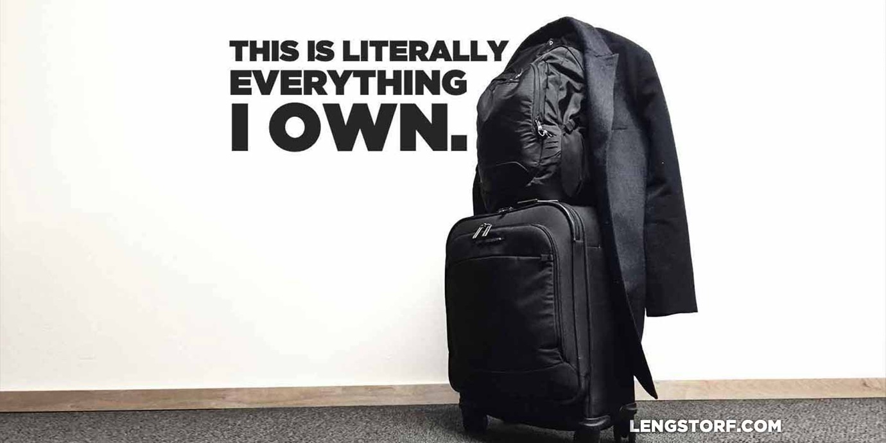

import { Image } from '$components';

I was eating leftovers over the sink with plastic silverware.

The previous morning, Marisa, her mother, and I had braved the line at Screen
Door for one last Portland brunch. I finished the remnants of my chicken and
waffles, doing my best to not to make a mess on the freshly-scrubbed counter and
floor in the kitchen.

The apartment was completely empty. The cleaning service had left it sparkling.
There was so much reverb when I spoke that it felt closer to an echo.

The giant living room I'd loved so much was bare. I'd taken the blanket and
pillows we'd slept on the night before out to the trash.[^donations] Nicole from
the cleaning service had taken nearly everything else — "I didn't bill you for
the hour I spent loading your stuff into my car," she texted me later.

Only two small suitcases, two backpacks, a box of last-minute chores, and a
couple small trash cans remained.

_This is everything I own,_ I thought to myself.

<Image credit="Jason Lengstorf">

  

</Image>

Marisa showed up around five thirty. We threw away the final few items from the
fridge and tossed the trash — cans and all — into the compactor on the
building's first floor.

We wheeled our luggage out of the apartment and I locked the door. I stopped by
the manager's office. My heart was hurling itself against the walls of my
ribcage, and I ran through the checklist for the hundred-thousandth time.

_It's all done. The apartment is empty. There's nothing left to forget._

I felt a little dizzy as I dropped the keys in the mail slot. They hit the
bottom of the container on the other side with a nauseating finality.

"That's it," I said. "I'm officially homeless."

---

Ever since I started talking about [my experiment in permanent travel][1] I've
been met with some variation on the question, "Are you excited?"

Reactions from my friends and family have ranged from excitement and
good-natured jealousy to near-panic and quiet disapproval,[^disapproval] but —
regardless of their view — everyone wants to know how I'm feeling about the
trip.

It's a question that feels like small talk. But as I went through the motions of
responding — "Yeah, it's going to be a great adventure!" "I know, I've heard
amazing things about Italy!" "There won't be any pizza left by the time I
leave!" — pointed out something disconcerting to me as the kick-off date drew
nearer: _I wasn't feeling excited._

I wasn't nervous. I wasn't afraid. I wasn't second-guessing my decision.

I wasn't... _anything._

Flight DAL418 to Milan was to me — as far as I was emotionally processing things
— just another flight. My 59th of the year. Another 3,982 miles added to my
SkyMiles balance.

The realization that I wasn't emotionally addressing this trip concerned me a
little. Was I compartmentalizing too much? Was I bottling up my excitement and
fear, wiring up an emotional booby trap that could detonate at at any moment?
Was I in for a truly spectacular breakdown in JFK, collapsed in on myself in the
Terminal 4 Starbucks, sobbing uncontrollably, feeling a year's worth of
repressed feelings all at once?

---

The night before the flight, I was restless.

All of the work was done. The tickets were purchased. All we had left to do was
show up at the airport on time in the morning.

We ate our last meal in Portland at Robo Taco around nine. We ordered burritos
and settled into a dimly lit corner. To my left, a muted television played PBS
reruns.

"Are you okay?" Marisa asked me between bites.

I was giddy. Nervous. Excited. Relieved that the work of severing my ties to
Oregon was finally done. Happy that I'd found a traveling partner. Scared that I
was jumping with both feet into a world I don't fully understand.

"This feels like the first day of school," I said. I was eating my burrito with
a fork and knife because I'd squeezed too hard and broken the tortilla, spilling
the contents out the back. "I'm happy and sad and excited and scared. It's that
feeling of 'into the unknown', you know?"

She did.

The conversation lulled as we finished eating, and we watched Bob Ross paint
some happy little trees. Then we headed for the airport hotel.

---

At four this morning, Marisa's alarm went off. She got up to shower, and I went
back to sleep.

At ten to six we were in the security line. Six fifteen we were at the gate with
coffee in hand. On the plane by seven.

As I write this, I'm somewhere over the Atlantic Ocean, getting further and
further away from a home I no longer have. All of my [former possessions](/do-more-with-less) are settling into new homes with the friends and
strangers on Craigslist who bought them. The apartment I locked up last night
has already been rented to new tenants; I imagine they'll start moving in this
weekend.

Everything I own in the world is in two bags: one at my feet, and one above my
head. I didn't leave behind a storage unit, or an attic-load of furniture for my
parents to hold onto. _This is it._ These bags. The clothes I'm wearing.

In a few hours I'll be in Milan, Italy, hauling my two bags into a stranger's
home.

I should be sleeping to ward off the imminent jet lag, but I'm still restless. I
can feel the weight of my eyelids, but I can't stop thinking about the
adventures that lie ahead — pizza! gelato! and I guess some old buildings and
stuff[^food] — and the problems I haven't solved yet.[^problems]

I still don't feel as excited as is maybe appropriate. And I certainly don't
feel as worried as my mom probably is.

But I feel a pressure building in my chest and throat that makes me want to
either burst into laughter or tears. I feel proud that I have built a career
that allows me to take this trip. I feel lucky to live in an age where
technology allows a lifestyle like this to exist. I feel hopeful that my
research and preparation will prove to be at least mostly correct.

I'm not exactly sure how I should feel about all of this. But I'm absolutely
sure that I'm ready for it.

[^donations]:
  I sold, donated, or gave away nearly everything I owned that was suitable for reuse. However, bedding is gross to share with a stranger, and my sheets had worn to the point where — a couple weeks prior to throwing them away — a hole had opened up near my (apparently) razor-sharp toenails.

[^disapproval]:
  Not disapproval in the sense of, "You shouldn't do this, it's a bad idea," but more in the sense of, "I don't understand how you're going to make this work and therefore cannot condone your actions." No one has told me I _shouldn't_ take this trip; I've just had a few people find the whole concept too big and daunting, and from them I've been met with a lot of uncomfortable silences and worried groans. ("Mom, I'm going to live in Europe for a year." _Mom emits a sound similar to_ [_Tina in_ Bob's Burgers][2].)

[^food]:
  **Marisa:** "You talk like we're only going to be eating while we're there."
  **Me:** "Well, we _are_ only going to be eating while we're there."
  **Marisa:** "We're going to see museums and architecture and stuff, too."
  **Me:** "I mean, sure — on the way to our next meal."

[^problems]:
  I still don't know for sure how this whole "unlocked phone with a SIM card" thing will work. I forgot to save the directions to the first Airbnb, so I need to find wifi access before we can get there. I don't speak Italian. I just learned that [people in Barcelona speak Catalan][3], which I didn't even know was a language until a few days ago.

[1]: http://lengstorf.com/remote-work-travel/
[2]: http://youtu.be/F_XaIuw6K6Q?t=9s
[3]: http://barcelona.de/en/barcelona-languages.html
