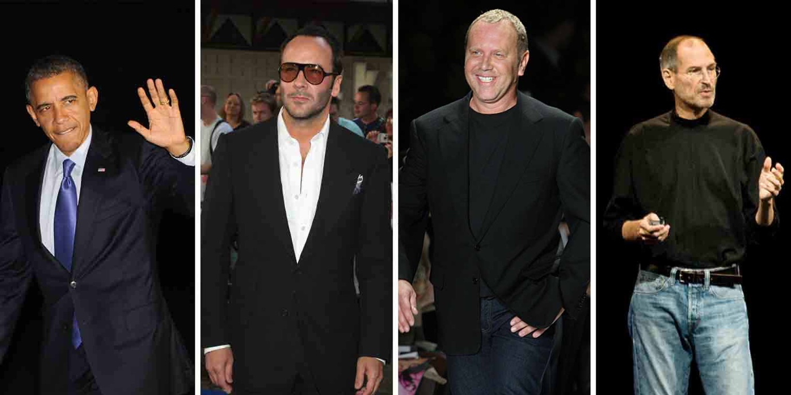
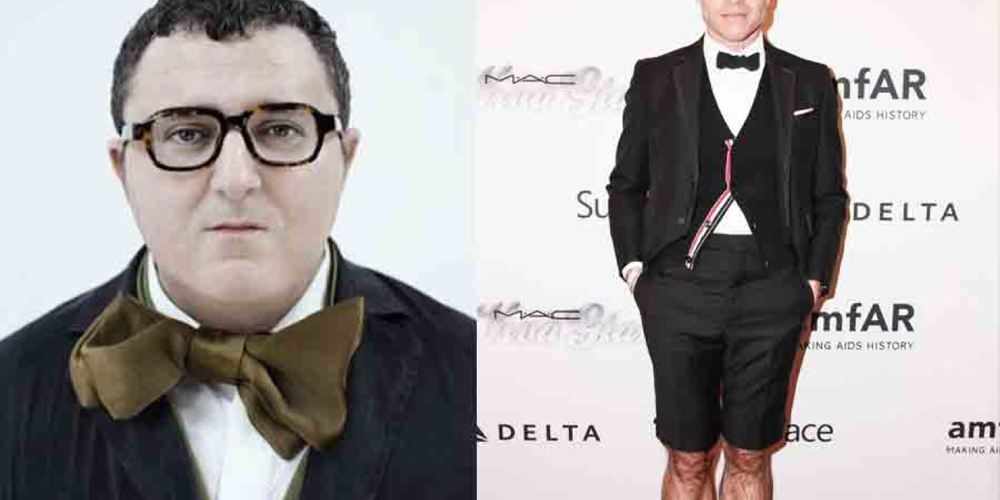
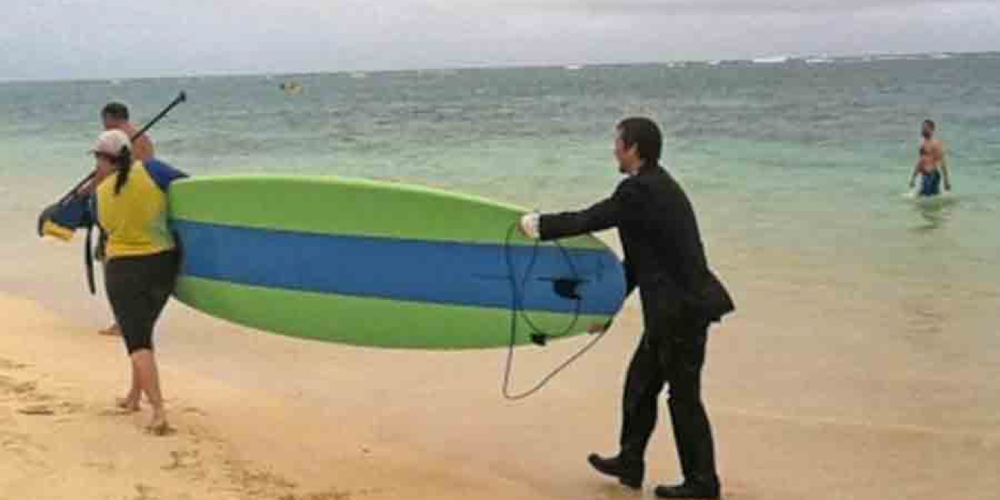
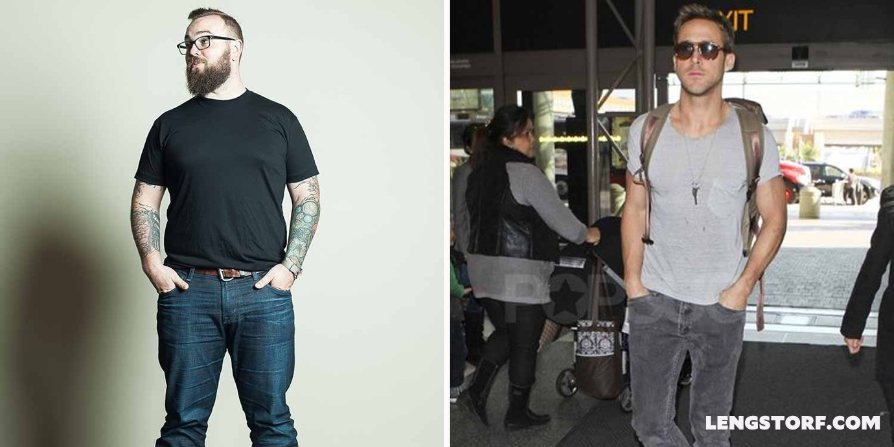
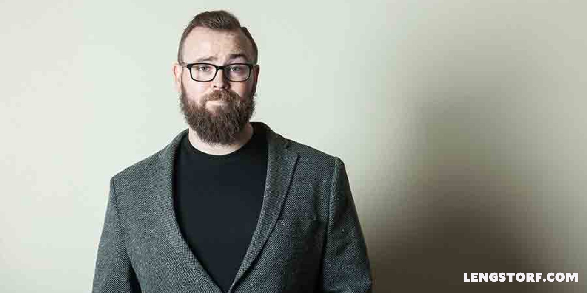
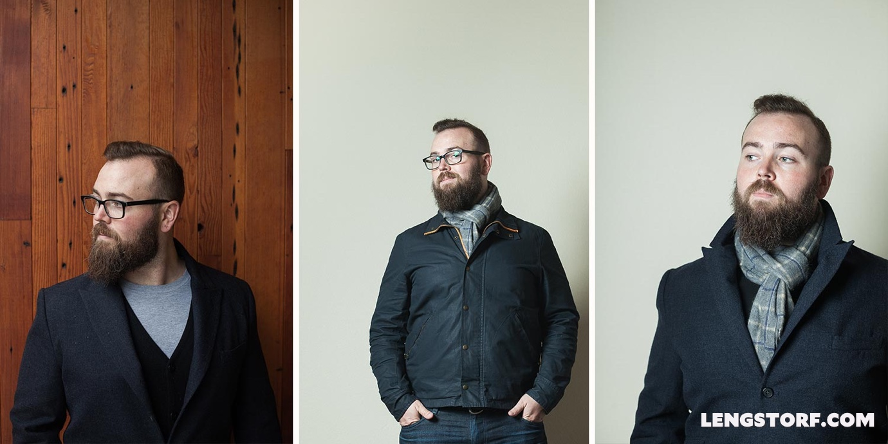

import { Image } from '$components';

One of the toughest challenges of [my experiment in long-term remote living and
travel][1] was figuring out how I was going to dress myself out of a carry-on
suitcase for an entire year.

<Image
  align="right"
  caption="I don’t captain a boat, so this look really isn’t for me."
  creditLink="http://www.exofficio.com/products/details/mens-air-strip-long-sleeve-shirt"
  credit="Exofficio"
>

  

</Image>

I've never considered myself to be fashionable,[^fashion] so my first instinct
was to cop out and buy everything from a "world traveler" type of company like
Exofficio.

Screw it: I'd look like a retired-comptroller-turned-sailing-enthusiast, and
uppity fashion snobs who would scoff at my cargo pockets and armpit air vents
could kiss my ass.

The problem with going sailboat captain, though, is that in recent years **I've really started to enjoy building my own style.** I've had a lot of help from my friends with good fashion sense, and over the last couple of years I've built up a semi-respectable wardrobe.

Wearing an outfit that's stylish makes me feel like an adult. I have a sense of
being put together, and that helps me move through my day-to-day life with a
little more confidence. It's a small detail, but one that makes a noticeable
difference.

**I don't want to forfeit my fashion sense while I travel** — this means copping
out wasn't (and isn't) an acceptable option for me.

Instead, I took a look at what some of the men in the fashion industry were
doing, and I saw something interesting: _a lot of these fashionable men wear the
same thing every day._

<Image caption="In their uniforms (left to right): Barack Obama, Tom Ford, Michael Kors, and Steve Jobs.">

  

</Image>

Tom Ford and Michael Kors wear almost the _exact_ same outfit every day. Their
uniform is a kind of trademark for them.

Once I noticed the uniform on fashion designers, I started to notice it on other
well-known people, such as Barack Obama and Steve Jobs.

(It's worth noting that a lot of fashionable women, including Vera Wang, do the
same thing. But I'm not going to pretend to have an opinion on what the ladies
should pack for long-term travel, so I'm only focusing on men's clothing. My
travel partner Marisa Morby has written a post on [how she's dressing for a year
of travel][3]; I'd recommend her post over mine for the ladies.)

This uniform thing looked promising. I could wear the same thing every day and
still look fashionable? Yes, please.

## Why a Uniform Is a Good Idea

**I carry everything I own in a bag at least once every couple months.**

This is _excellent_ motivation to pack light.

Choosing to wear a uniform _eliminates options_, which reduces the number of
items needed to put outfits together.

Additionally, the simplicity removes a decision from my morning.[^decisions] And
while I'm not making hundreds of critical decisions every day, I do want to cut
down on [decision fatigue][4] as much as possible to leave that mental space
available for the decisions I actually care about.

## How to Choose a Uniform

When it came down to actually _choosing_ the uniform, I struggled a bit. This is
what I'll wear every day, so it should be a really stellar outfit, right?

Should I try to make a statement and rock a huge bowtie like Alber Elbaz?
Suit-shorts like Thom Browne?

<Image
  align="right"
  caption="This might be more than I’m willing to commit to."
>

  

</Image>

Maybe I should go for the ultra-casual look Steve Jobs and Mark Zuckerberg are
known for?

I briefly entertained the idea of becoming The Guy In Brightly-Colored Chinos.
Maybe I'd always wear ostrich boots. Or I could give [Craig Sager][5] a run for
his money with my brightly-colored getups.

After a while, I started to feel like maybe this was all too much work and
something that only the famous and ultra-chic can pull off.

### Keep It Simple

After a brief existential meltdown — _what does fashion even mean, anyways?_ — I
realized I was horribly overcomplicating the concept. **The entire goal of a
uniform is to _simplify_ your wardrobe,** not add a bunch of extra work to it. I
should be looking at what I _already_ wear most of the time, and putting my
uniform together from there.

I looked at my closet and considered how each article of clothing was worn
through different seasons. What did I wear year round? What did I only wear for
a particular season (and was there a way to replace those items with something
less seasonal)?

Once I started thinking along the lines of simplicity, the process became far
less overwhelming, and my uniform started coming together.

### Keep It Flexible

Since I won't be traveling with a full closet, **my uniform needs to be
appropriate for _any situation_ I find myself in.** Can I wear it to a fancy
steak dinner at an upscale restaurant? A dive bar? A business meeting?

<Image align="right" caption="Not exactly a practical outfit.">

  

</Image>

I love the idea of looking sharp, but packing a tuxedo requires an awful lot of
space in my suitcase for a very small number of situations. I needed to look at
more moderate options — something that wouldn't get me barred from an upscale
venue, but that I could also wear in casual situations without looking severely
overdressed.

To that end, I looked at my wardrobe and tried to think of ways that I could
take my basic uniform and dress it up or down with a few simple (and easy to
carry) accessories.

## My Uniform

Currently, my uniform consists of:

1. A solid-colored t-shirt (usually black)
2. Jeans or dark chinos
3. Boots or sneakers

This is my base. It's casual on its own, which feels comfortable and easy to
manage. (And — truth be told — I'm pretending it makes me look like Ryan
Gosling.)

<Image caption="Hey girl, do I look like Ryan Gosling in my t-shirt and jeans?">

  

</Image>

I feel comfortable wearing this outfit to nearly any event or meeting I can
imagine myself being invited to, and it's very low maintenance.

To add a touch of "I'm a Grown Up" to the outfit, I always wear a reasonably
nice watch.[^watch] I'm not one for a lot of accessories, so a watch is usually
as far as I go.

## Dressing Up a Uniform

<Image
  align="left"
  caption="I’m ready to teach that class on postmodern economics now."
  creditLink="http://tylerdylan.com"
  credit="Tyler Dylan"
>

  

</Image>

On occasions where I need to look a little fancier, I pack one tweed blazer.
Over my jeans, it's only a little dressy; over the chinos it looks almost fancy.

If a blazer isn't right, I also have two sweaters; these dress up the outfit a
little bit without looking too dressy. (They also serve a dual purpose, which
I'll touch on a bit later.)

Originally I'd planned to bring a pair of nice (ish) shoes, but I opted to just
wear my work boots instead; they _almost_ look like dress shoes, and I wanted to
avoid taking up the extra space in my bag.

## Adapting a Uniform to Warm Weather

For warm weather, I have a pair of linen shorts and a pair of board shorts that
doubles as a swimming suit. Both are small, so I can roll them up and tuck them
into a small crevice in my bag. A t-shirt and shorts is a simple casual outfit,
and in warm weather there's not much else I'd want to wear.

I pack a pair of flip flops for warm days and beaches, which also come in handy
for shared bathrooms and showers.

## Adapting a Uniform to Colder Weather

<blockquote class="instagram-media" data-instgrm-captioned data-instgrm-version="7" style=" background:#FFF; border:0; border-radius:3px; box-shadow:0 0 1px 0 rgba(0,0,0,0.5),0 1px 10px 0 rgba(0,0,0,0.15); margin: 1px; max-width:658px; padding:0; width:99.375%; width:-webkit-calc(100% - 2px); width:calc(100% - 2px);">
 
 

 
 <a href="https://www.instagram.com/p/xZkDCoIj64/" style=" color:#000; font-family:Arial,sans-serif; font-size:14px; font-style:normal; font-weight:normal; line-height:17px; text-decoration:none; word-wrap:break-word;" target="_blank">Trying to stay warm...</a>
 
A post shared by Marisa (@marisamorby) on <time style=" font-family:Arial,sans-serif; font-size:14px; line-height:17px;" datetime="2015-01-03T17:01:20+00:00">Jan 3, 2015 at 9:01am PST</time>

</blockquote>

First, it's important to note that — assuming you're traveling for an extended
period of time and you have some control over your schedule — you can usually
control the weather for your trip by choosing locations that fall within a range
you deem comfortable.

My goal while traveling is to avoid any climate where the temperature drops
below 40°F/5°C. This eliminates the need to pack _really_ heavy winter gear and
simplifies my packing.

I currently pack a light cotton jacket and a slightly heavier overcoat. On their
own, these are both great fall weather jackets, and since I tend to be too hot
before I'm too cold, they're usually more than enough for me.

### Take Advantage of Layers

**The secret to staying warm with a uniform is layering.** Those sweaters I
mentioned earlier go a long way toward adding some warmth, and fit nicely under
my lighter-weight jackets.

<Image
  caption="A layered cardigan, a scarf, or both — as warm as you need to be."
  creditLink="http://tylerdylan.com"
  credit="Tyler Dylan"
>

  

</Image>

I also pack a scarf that looks nice under my lightweight jacket or my overcoat
and — using a sweater as a makeshift liner — makes both coats nice and warm as
long as the temperature doesn't dip below freezing.

What I _haven't_ packed — and we'll see if I regret it later — is a hat or
gloves.[^milan] I'm usually just fine with my hands in my pockets, and my ears
don't get too chilly when the temperature is above freezing.[^bear]

## Your Uniform Should Make Sense for You

My uniform makes perfect sense for my taste: I prefer weather that stays in the
sort-of-cool to warm range, where I can wear jeans and a light jacket, so I've
built a uniform around that look.

If you're into winter sports and expect to be in cold climates, your uniform
will probably look a little different[^coldweather] from mine. Likewise if all
of your travel takes you to tropical climes.

**When you start putting together your uniform, consider three factors:**

1. What do I actually feel comfortable wearing?
2. What type(s) of weather should I be expecting?
3. What kind(s) of events, venues, and situations will I find myself in?

The answers to those questions help eliminate unnecessary items until you can
assemble a uniform that meets all your different needs and maximizes the space
in your suitcase.

### Remember: This Is Not Final

If you don't bring something and you end up needing it, you can always purchase
that item while you're traveling.[^shoppingabroad] If you can't think of a
realistic, _actual_ scenario where you'll use an item, _leave it behind._ Don't
carry around crampons and a pickaxe because you _might_ go rock climbing if you
meet someone on your travels who is also a rock climber and you're invited;
leave that shit behind and rent equipment for the one or two days you'll use it.

Just because it fits in your bag doesn't mean you need it. And just because you
didn't pack it doesn't mean you can't get it later.

Plans will change. [It's probably not going to go exactly the way you're
picturing it.][7] Don't worry about it: you can adjust as you go along.

## Do You Wear a Uniform?

Would you consider wearing the same outfit every day? Or does that sound
horrible to you? Jump over to the discussion and let's talk about the finer
points of fashion.

[^fashion]:
  In high school I was the polar opposite of fashionable: I once wore a form-fitting, ribbed, stretchy, white shirt under a tan fisherman-style vest that would have looked great on a boy band, with grey vinyl pants covered in reflectors (with 45" leg openings) and glow-in-the-dark shoes. I wish I was making this shit up.

[^decisions]:
  This was one of the most common reasons the famous folks cited when asked about their uniforms. "I'm trying to pare down decisions. I don't want to make decisions about what I'm eating or wearing, because I have too many other decisions to make," President Obama told [Vanity Fair][8].

[^watch]:
  I would love to graduate to the fancy watches, but that Panerai isn't quite within my reach yet.

[^milan]:
  After a week in Milan, I decided it was the right decision not to bring gloves. It was around freezing the whole time, and while gloves wouldn't have hurt, I was also plenty warm with my hands in my pockets.

[^bear]:
  The fact that I'm about 25% bear doesn't hurt; I'm more likely to be too warm than too cold.

[^coldweather]:
  Probably not too terribly different, though. With long underwear, a winter hat, and warmer socks, I could probably handle fairly cold weather without being too miserable.

[^shoppingabroad]:
  I'm not traveling in any developing countries — my job required reliable wifi — so I'm almost always a short walk away from a clothing store.

[1]: /remote-work-travel
[2]: http://www.exofficio.com/products/details/mens-air-strip-long-sleeve-shirt
[3]: http://www.marisamorby.com/blog/2015/1/12/dressing-for-a-year
[4]: http://www.nytimes.com/2011/08/21/magazine/do-you-suffer-from-decision-fatigue.html?pagewanted=all
[5]: https://www.google.com/search?q=Craig+Sager
[7]: /jazz
[8]: http://www.vanityfair.com/politics/2012/10/michael-lewis-profile-barack-obama
