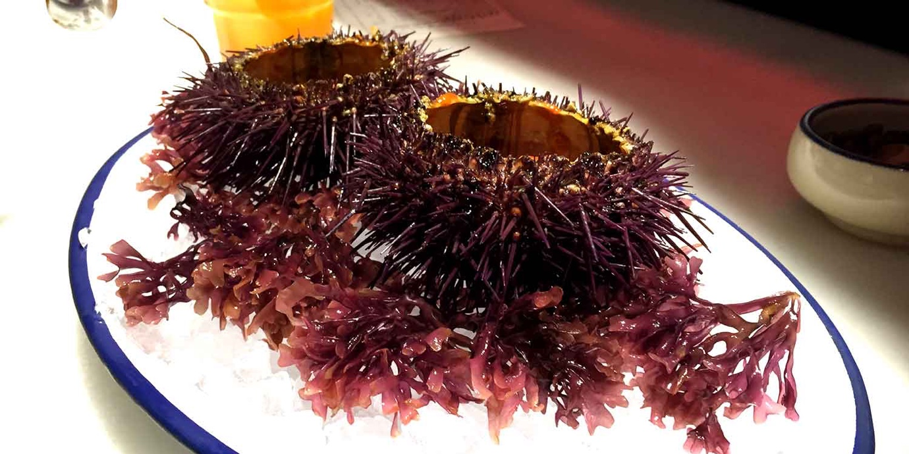

import { Image } from '$components';

I started out feeling pretty cocky. I usually do.

"I speak a little Spanish. How hard could Italian really be?"

The airport was easy; everyone spoke English. The train, too. Our taxi driver
didn't speak much English, but all he really needed was an address, anyways.

This was promising: three interactions with Italians and no issues!

The cab driver dropped us at Ripa's Cafe, where our Airbnb host, Francesco, had
left the keys to his apartment. I felt bulletproof as I wheeled my carry-on into
the bar and approached the counter.

_"Prego?"_ The man behind the counter was in a hurry, and folks from the
neighborhood were queueing up behind me for lottery tickets and cigarettes.

I opened my mouth, froze, and slowly closed it again.

_Fuck. I don't speak Italian. I don't know how to say "keys"._

I was tongue-tied. I didn't even know how to tell this poor guy I didn't speak
Italian. My cocksure attitude toward the language barrier withered, and I knew I
was defeated.

And so — my cheeks burning bright red in embarrassment — I waved the white flag.

"English?"

He shook his head and walked away. I wasn't sure if he was coming back. Were we
supposed to wait?

I felt the people behind me staring daggers into the back of my head. My body
was tying itself in knots. I was shrinking in shame.

"Can help, please?" A girl had appeared behind the counter, looking at Marisa
and I with pity. She barely spoke any English, but with a lot of miming and hand
gestures we were able to get the keys.

Once we finally found the apartment, I felt sick and helpless as I collapsed on
the bed.

_I'm in **way** over my head,_ I thought.

<Image
  caption="For how communicationally challenged I felt, I may as well have been wearing face paint."
  creditLink="http://mime.com.ua/"
  credit="Никита Капранов"
>

  

</Image>

After I came to grips with the fact I wasn't able to learn Italian by magic
and/or wishing _really_ hard, I did two things:

1. I downloaded [Duolingo][2] and started the Spanish course.
2. I made a list of phrases that I knew I would use multiple times each day.

**I had to figure out how to get by without speaking the language.**

I needed a way to acknowledge people when spoken to. I was going to need to ask
for things like food and coffee. I knew people would help me, and I needed to
know how thank them.

My emergency phrase list was born.

There was no avoiding it, really; I'm a terrible mime.

## Know Enough to Get By

For a short trip — for instance, five days in Milan — there's very little chance
I'll _really_ learn the language. So instead, I choose to **focus on the words
and phrases that meet the minimum requirements for functioning in that
country.**

So far, these are the phrases I've gotten the most mileage out of. You won't
impress the locals with your conversational skills. You'll still be lost in most
conversations.

But knowing these few key phrases will at least give you tools to feel a little
less helpless.

## Step 1: Learn How to Apologize

<Image align="right">

  

</Image>

It might not get much done, but if you learn _nothing else_ of a foreign
language, at least **learn how to apologize for showing up in someone else's
country and not speaking their language.**

It's usually just two phrases: "I'm sorry" and "excuse me".

### I'm Sorry, I Don't Speak Your Language

After the debacle in Milan, this is the first phrase I will learn in every
language. I'll know it before I enter the country, and I'll have practiced it
under my breath repeatedly as I deplane.

It's not particularly useful in the practical sense. It won't help anyone
understand what I'm trying to say. In fact, after I've said it, I'll be exactly
where I was before I said it.

With one key difference.

One _huge_ key difference.

I've let the person I'm speaking to know that — if nothing else — **I cared
enough to learn how to let them know I'm a dumbshit tourist who can't speak
their language.** I put in a tiny bit of effort to show respect, even if it
won't help us communicate any better.

And what I've seen, after trying this in both Italy and Spain so far, is that it
totally transforms my interactions.

When I said nothing and gaped helplessly at the waitress, the situation was a
stand-off: an exasperated waitress stares into my wide, uncomprehending eyes
with a look of annoyance.

By making the effort and letting her know I don't understand her, it becomes a
relatively painless situation: she smiles and says something I don't
understand,[^waitress] then calls to the back for the dishwasher, who speaks
English, and we're able to place our order.

Of course, my goal is to learn how to order in the local language as quickly as
possible to avoid the need for a translator altogether. In the time before I
learn how, this is the best solution I've come up with.

Here's why I think this is so effective: **by making an effort to learn a bit of
the local language, I'm helping avoid the perception that I'm an asshole tourist
who sees the people in the country I'm visiting as less important than I am.**
Instead, I'm a newcomer who's trying to learn, but hasn't gotten it all figured
out yet.

People like to help each other when it feels like teamwork, or when they see
someone struggling to figure something out. A few of the people we've interacted
with have actually taken extra time to help us translate menus, and it felt like
they were genuinely pleased to have helped us learn something.

<Image align="left" caption="Dad Spanish: “I WOULD LIKE EL STEAK-O!”">

  

</Image>

On the other hand, if I sit down and immediately start ordering in Dad Spanish,
I've just shown that I'm willing to make zero effort, but I expect a big effort
and a lot of help from the person I'm talking to. This is disrespectful, and it
puts me at odds with the person I'm dealing with — hardly a productive way to
handle a situation where I need help.

It's an enormous benefit for very little effort. For example, in Spanish, all
you have to say is, _"Lo siento, no hablo español."_ (I'm sorry, I don't speak
Spanish.)

### Excuse Me

When I'm walking down the street — especially in more heavily touristed areas —
I'm inevitably going to bump into people.[^pedestrians] Rather than staring at
them wide-eyed or saying something they won't understand, I **learn how to say a
polite "excuse me" in their language,** which shows respect — I'm speaking their
language — and avoids misunderstanding — they may not get my meaning when I say,
"Sorry 'bout that, pal!"

In Romance languages, these are often pretty similar to the English words you
already know. For example, in Italian you would say, _"Scuzi!"_ In Spanish,
_"Perdón!"_ French: _"Excusez-moi."_

This also helps politely get someone's attention, making it doubly useful to
learn right away.

## Step 2: Mind Your Manners

If I'm going to be an idiot, I'm at least going to be a polite idiot. **Figuring
out the basics of being polite makes every interaction more friendly.** This, I
hope, slightly eases the imminent pain[^pain] and frustration I'm about to cause
the person I'm speaking to.

### Please & Thank You

This is all you need. Learn them, and use them often.

If you're American and headed to a Spanish-speaking country, there's a good
chance you've heard these before: _por favor_ (please) and _gracias_ (thank
you).

## Step 3: Learn How to Feed Yourself

I love food.

I also need food. Y'know, to stay alive.

For me, my ability to locate good food makes the difference between having a
good time and being utterly miserable, so **I place a high priority on learning
my way around local menus.**

<Image
  caption="Sea urchin. It’s delicious, but you’ll want to know you ordered it before it arrives."
  credit="Jason Lengstorf"
>

  

</Image>

### Ham and Cheese

Europeans love ham and cheese. It's on nearly every menu I've seen.

This is all very good news to me; I love both ham _and_ cheese.

What I _haven't_ seen consistently on menus is much of anything else. Turkey,
beef, or chicken are available _sometimes,_ but not with anywhere near the
ubiquity of good ol' ham and cheese.[^vegetarians]

**My strategy to ensure I'll always be able to find something to eat is to
figure out how to translate "ham and cheese" and then pick items off the menu
that feature those words.**

When I can't understand any of the language on a menu, this is my food security
blanket: by ordering ham and cheese, there's a better-than-50% chance I've just
ordered either a sandwich or an omelet, and both are fine by me.

I do my best to figure out more as quickly as possible so I can sample the
variety of foods each city has to offer, but by starting out with ham and cheese
I can at least be sure I don't accidentally order an artichoke and tripe soup
for breakfast.

### Coffee

<Image
  align="right"
  caption="A _cortado_ at Cometa in Barcelona, Spain."
  credit="Jason Lengstorf"
>

  

</Image>

Ordering coffee is easy in almost any language — if you see an espresso machine
and say "cafe" you'll probably get the point across effectively. The trick,
though, is to **learn the way to order coffee in each language so it comes the
way you prefer.**

I like my coffee with a little milk, which means I need to figure out what it's
called locally. In Italy, this is easy (assuming any amount of time spent in or
near an American coffee shop): _cappuccino._[^cappuccino]

In Spanish, it's not quite as easy — the terminology isn't used in American
cafes. _Café con leche_ (coffee with milk) is a rough equivalent to the Italian
cappuccino, and the _café cortado_ is a rough equivalent of the _macchiato_ (a
shot of espresso with just a dollop of steamed milk and foam).

To some this may not seem like a big deal; to me, this is a non-negotiable entry
in my emergency phrasebook.

### Things I Don't Like

Since I'm not a picky eater, it's far easier for me to **figure out which food
items I'd like to avoid** than to learn all the things I might enjoy.

My list of dislikes is very short: I don't want to order fish unless I'm in a
restaurant that specializes in fish, and if I'm given a choice I'll take the
option without spinach or kale.[^spinach]

So I learn those words and pick around them on a menu.

By knowing what I want to avoid, it's far less frightening to pick something
I've never tried off the menu. This allows me to be more adventurous in my food
choices without running the risk of ordering something I know _for sure_ I'd
rather not eat.

### Ask for the Bill

Something I've noticed in restaurants is that no one will bring you the bill
until you ask for it.

<Image
  align="left"
  caption="Paying for things is harder than you might think."
>

  

</Image>

I'm not sure if it's out of politeness or something else, but after the waiter
clears our plates and confirms that we don't want anything else — if we forget
to ask for the bill — we'll spend the next fifteen minutes trying to catch his
eye again so we can pay and leave.

This proved extremely frustrating when I didn't know how to ask for it. After I
got sick of waving my credit card at people, I figured I should add this to my
must-learn phrases in every language.

In Spain, when the waiter comes to clear our plates and asks if we want anything
else, I decline politely and ask, _"¿La cuenta, por favor?"_ (The check,
please?)

## What Are Your Must-Learn Phrases?

What are the phrases you rely on most when you travel? Have you run into
frustration with communicating while abroad?

[Let me know!](https://twitter.com/intent/tweet?url=https://lengstorf.com/foreign-language-phrases&text=%40jlengstorf)

[^waitress]:
  I assume she says something like, "Okay, wait just a minute," but she could also say, "I hate you, you idiot tourist; let me go get someone who can stomach your abhorrent mother tongue."

[^pedestrians]:
  This is actually a huge pet peeve of mine. I mean, I know that there's no need to hurry when you're on vacation, but there are also some basic courtesy guidelines; are you planning to stand still, looking straight up, with your mouth hanging open and your fourteen suitcases in tow? Cool. Do your thing. But please move off to the side instead of standing _right in the fucking middle_ so no one can get around you.

[^pain]:
  The pain of listening to me butcher their native language. I'm not, like, giving people noogies here.

[^vegetarians]:
  Vegetarians, I feel for you; you'll be eating a _lot_ of croissants.

[^cappuccino]:
  I also learned — too late, unfortunately — that it's culturally frowned upon to order a cappuccino after the morning. Because it's hard on digestion, I've been told.

[^spinach]:
  Look, I eat spinach. But it leaves a weird texture on my teeth that I'm not crazy about. And kale just tastes like dry paper. Bring on the arugula and spring mix.

[2]: https://www.duolingo.com/
