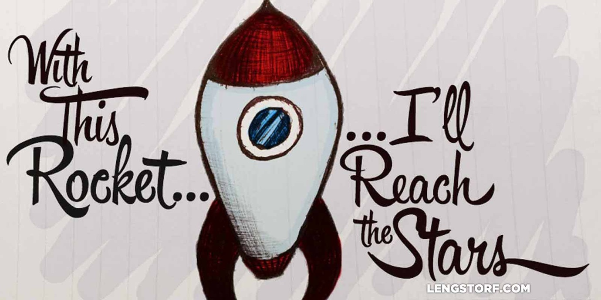
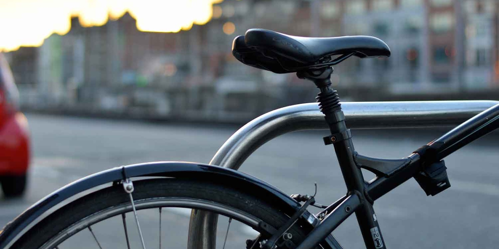
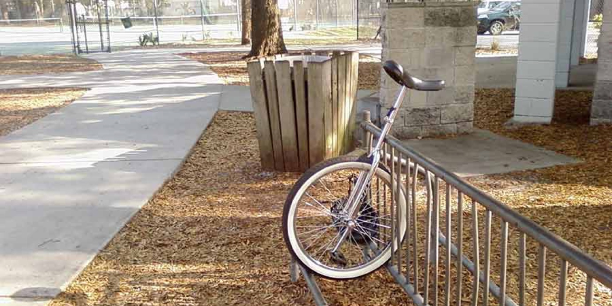
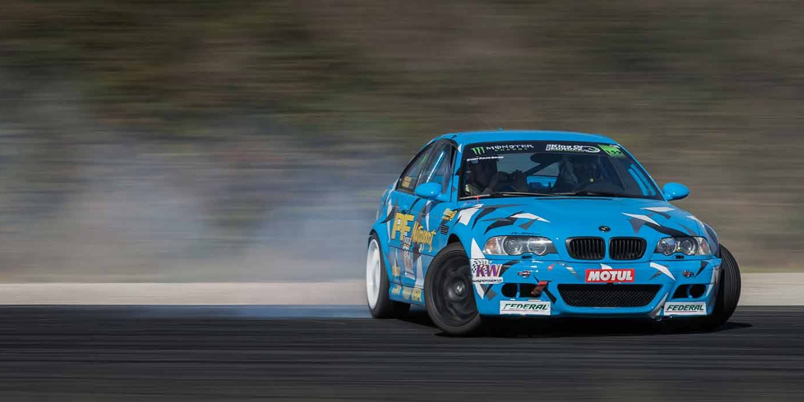
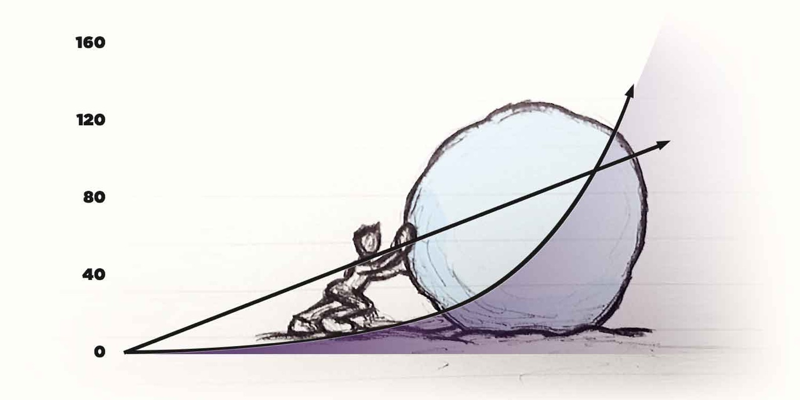

import { Image } from '$components';

I spend a lot of time with my head in the clouds. To me, the best ideas are the
ones unhindered by trifles like logistics. Or reality.

The question I always start with is: _If I had unlimited time, capital, and
resources, what would I build?_

It's impractical, sure, but to me it removes a critical barrier in my planning
process. Instead of asking, "What am I capable of?" I ask, "What's possible?"

<Image caption="Dream big." credit="Jason Lengstorf">

  

</Image>

## Start with What's Possible, Not What's Practical

If I want to get from Point A to Point B, I have a problem to solve.

When I start designing a solution, I'm not thinking about what I've built
before, or what I think I might be able to build with my current level of
knowledge; I'm only thinking of what — given unlimited resources in a perfect
world — I would _ideally_ like to see built.

To travel from Point A to Point B, _I'm going to build a rocketship._

Once the actual process of planning the rocketship build gets underway, I'll
start worrying about practicalities. Features will be stripped away until the
solution becomes feasible, and often times my rocketship will become nothing
more than a simple bicycle.

### A Real-Life Example of Setting Ideal Outcomes

I recently kicked off an experiment in permanent travel and digital nomadism.

Over the last few years, I've developed a number of theories about productivity,
work-life balance, and overall happiness that fundamentally changed the way I
look at the world. Ultimately, these theories led to me [selling off my
possessions and wandering off to see the world][1], bringing only what I could
fit in a carry-on suitcase.

https://instagram.com/p/xTidrIzK7-

I think these theories can be helpful to people other than myself, and I want to
share them. But I don't have a big audience, or any favors to call in with big
influencers. So how do I get the word out?

_This is the problem I need to solve._

Ignoring time restraints, lack of connections, and my ignorance with respect to
how to actually make any of this _happen,_ I defined my rocketship:

1. Write a book on the subject, and get it picked up by a major publisher.
2. Launch a media onslaught by publishing guest articles _everywhere._
3. Speak at conferences around the world to share my theories.
4. Continue to publish on my blog and grow my newsletter list.

This combined effort will put my theories in front of millions of people, and —
with a little luck — help improve lives around the world. **This is my "perfect
world" outcome.**

As I put the work in and figure out what's possible and practical, the goals
will get progressively more and more modest.

At the end, it may turn out that what I _actually_ do is more along these lines:

1. I read all the research I can to back up my theories with hard data.
2. I write one or two articles on my blog sharing the data in a useful way.
3. A few hundred people read what I wrote.
4. One person uses the information as a catalyst for real, positive change.

This would be my bicycle.

Will it change the world? Probably not.

But did it accomplish my original goal: to communicate what I've learned in a
clear and well-researched fashion to as many people as possible?

Yes. Even if "as many people as possible" turns out to be a smaller number than
I'd hoped.

<Image caption="A bicycle may not be a perfect solution, but progress is progress.">

  

</Image>

And while I wouldn't expect the bicycle outcome to result in a biopic about me,
I also wouldn't consider it in any way a failure.

A bicycle is not a rocketship. But a bicycle _is_ progress.

## How Are You Defining Failure?

**But if I designed a rocketship and only built a bicycle, haven't I missed my goal and failed?**

If failure to you is "any outcome that doesn't exactly match the initial plan",
then sure, the bicycle is a failure.

The problem, however, isn't with the plan or the design; the problem is an
inaccurate definition of failure.

**The rocketship isn't the goal.** The rocketship is _a proposed solution._ The
_goal_ is to get from Point A to Point B.

From this perspective, any progress is progress. By thinking big and editing
along the way, you'll probably still get further than you would have been if you
aim low.

If you design a rocketship and end up with a bicycle, you came up short of your
ideal solution — but you have a viable, practical means of getting from Point A
to Point B.

In other words, _even though you didn't build the rocketship, you still
accomplished the original goal._

<Image
  align="right"
  caption="Hedging bets can lead to impractical solutions."
  creditLink="https://www.flickr.com/photos/the1andonlycary/"
  credit="Cary Lee"
>

  

</Image>

But if you hedge your bets and design a bicycle, you don't have any wiggle room
in your proposed solution. If you end up with a unicycle (or maybe just a
wheel), you either have an impractical means of getting yourself around —
unicycles are difficult to learn to ride, after all — or, worse, a concept that
_theoretically_ moves you from Point A to Point B, but lacks some of the
required equipment to make it usable.

### How the Definition of Failure Works in Reality

I have choices when I think about sharing my experiment.

On the one hand, I could look at the goal as "get a book published" — this is a
lofty goal, and very specific.

It's also only part of what I was originally setting out to do.

On the other hand, I could look at the goal as "tell as many people as possible
about my ideas for improving our quality of life" — this is what I originally
wanted to accomplish.

If I do the work and manage to get a book published, **I've made an enormous
amount of progress** toward sharing my findings with as many people as possible.

However, if I do everything else on my rocketship list _except_ publishing a
book — guest posts, speaking gigs, and all — but I'm looking at the rocketship
as the _goal_ and not the _means to that goal_, I would still feel like a
failure because the book didn't get published.

This is a counterproductive way to look at things, because if I can do four of
the five things on my rocketship list, a _huge_ amount of people will be exposed
to my ideas. Just because I didn't tick all the boxes shouldn't — and doesn't —
mean all of my efforts were in vain.

**If I lose sight of _what_ I'm trying to do in favor of _how_ I'm going to do it, I risk setting an impossible standard and feeling like a failure, despite otherwise making good progress.**

<Image
  caption="Start simple and upgrade over time."
  creditLink="https://www.flickr.com/photos/xavier33300/"
  credit="SuperCar-RoadTrip"
>

  

</Image>

## Use Constant Improvement to Start Fast and Steadily Get Faster

Comparatively, a rocketship will complete the goal _much_ faster than a bicycle,
so it can feel hopeless to only have a bicycle.

Fortunately, if the bicycle you've built is reliable, it ceases to be something
you have to worry about. You no longer need to design the solution; you only
need to spend time on maintenance.

This leaves you free to build improvements.

Knowing that progress — albeit slow — is being made, you can add new features. A
motor. Chassis. Wings. Autopilot. Espresso machine.

**A bicycle doesn't have to _remain_ a bicycle. And in many cases, it shouldn't.**

Over time, the bicycle can become a motorcycle, which can become a race car,
then a plane, and — eventually — a goddamn rocketship.

Each of these solutions is better than the one from which it evolved: a
motorcycle is fast; a plane is faster.

It may be tempting to say, "Well, fine: I can't build a rocketship. But I will
build a race car, because I know I can do that, and altogether skip the part
where I have that slow bicycle!"

The catch is that a bicycle might take a month to build, where a race car may
take a year. How much would the slow progress of the bicycle add up in the
eleven months between?

And how much of a delay would it cause to start with a bicycle, then improve it
to become a race car?

**Starting with a simple solution creates a Progress Snowball.** The solution
allows you to quickly start making slow progress, and each subsequent
improvement improves the speed, bit by bit.

<Image
  caption="The Progress Snowball: At first it feels painfully slow, and then — suddenly — everything changes."
  credit="Jason Lengstorf"
>

  

</Image>

### A Practical Example of Steady Improvement

When I initially started planning for my experiment, I wanted to do it all at
once: launch a huge number of guest posts simultaneously, push a ton of content
out on my blog, kick off a targeted social media campaign, hit the conference
circuits hard as a speaker, and send off my book manuscript to publishers while
the online buzz was in full swing.

This would have been, if not a rocketship, at least a race car.

But when I looked at it objectively, it was too much for me to take on. I
couldn't abandon my blog for months to work on this material, and I didn't want
to spread myself thin by committing to writing for my blog _and_ keeping up with
my day job _and_ writing a book-length work plus additional articles. After all,
my whole message is to _avoid_ working long hours, and I want to make sure I'm
able to succeed while practicing what I intend to preach.

My race car design also would have required convincing a bunch of sites who
don't know me at all to both publish a guest post from me _and_ to run it on a
timeframe that was to my benefit.

I knew I'd be unhappy if I lost momentum on my blog, and I wasn't sure I'd be
able to get all — or any — of the guest blogs accepted if I didn't have at least
a little bit of supporting material up beforehand.

So I chose a bicycle: regular posts on my own blog, a few things on Medium, and
a concentrated effort to keep up my social media accounts in a way that was
engaging and mostly on-message.

This created the slow progress that I'm seeing now, while I work on researching
and creating material for the book, for guest posts, and for speaking
engagements.

Since creating the bicycle, I've been able to book a few speaking gigs on the
topic, and opened up conversations with a few of the sites I'm hoping to guest
blog for.

It's still not a race car, but it might pass for a moped.

And I'm a long way from done.

## What's Your Rocketship?

When you look at your current goals, how are you planning to achieve them? Are
you paralyzed, feeling that the goal is beyond your grasp? Are you tentative,
making modest plans that feel safe? Are you feeling hopeless, creating
impossible standards for yourself?

Trust yourself, and to keep working on a solution.

Remember:

1. Plan as if anything is possible.
2. Remember that any progress is good progress.
3. Never stop thinking of ways to improve your progress.

You may find yourself on a bicycle to start, but before long you'll find
yourself further along than you ever thought possible.

> “Shoot for the moon. Even if you miss, you'll land among the stars.”
>
> **Norman Vincent Peale**

[1]: /remote-work-travel/
