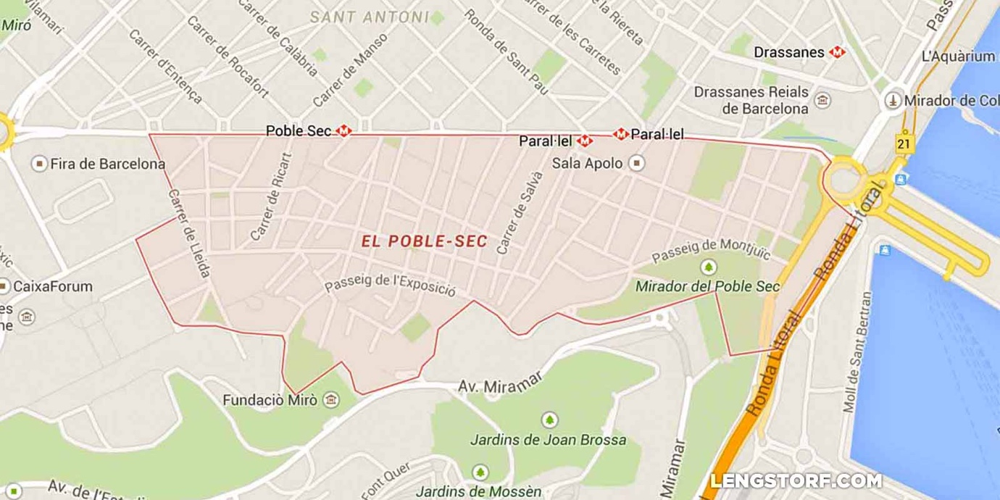
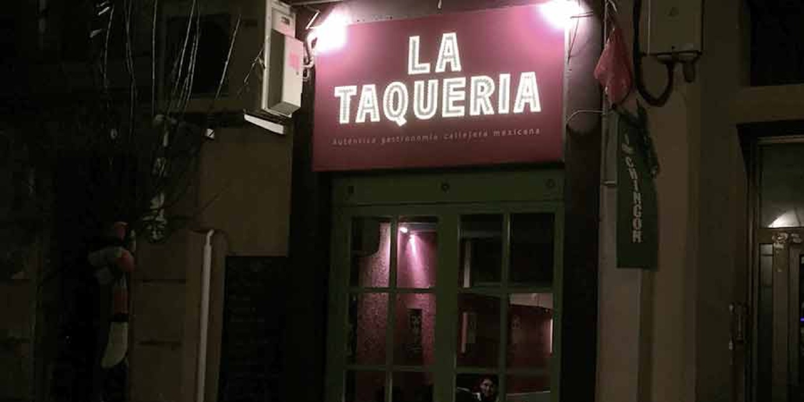
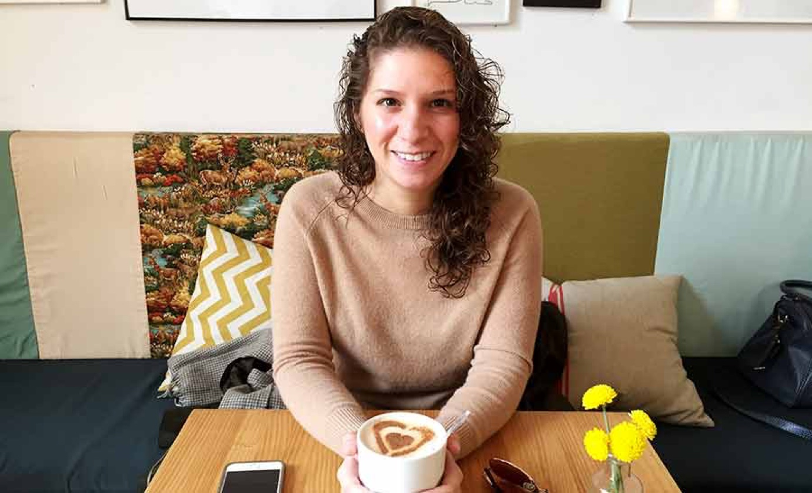

import { Image } from '$components';

In 2015, Marisa and I lived for a month in Barcelona.

We were in Poble Sec, a cozy neighborhood full of [_pintxos_][1] and tiny bars.
The location couldn't have been better; almost everything we wanted to see in
the city was less than 40 minutes away walking.

<Image
  caption="Poble Sec in Barcelona."
  creditLink="https://goo.gl/maps/RupgyetwQh32"
  credit="Google Maps"
>

  

</Image>

Our first weekend in town, we rode the Metro to Sagrada Familia.

When we emerged out of the underground, we were immediately swallowed by the
tide of slow-moving tourists. We drifted with the ambling, skyward-gazing
current, rising in waves to snap iPhone photos[^tourists] before breaking
against the outdoor seating of gelato shops charging €5 for a bottle of water.
In the center, a towering island, the church stood over us in [Antoni
Gaudí's][3] signature sorta-melted-insect-hive style.

I had no bearings. The only way out was to duck back into the Metro and flee to
the Poble Sec stop in search of familiar ground.

<Image
  caption="La Sagrada Familia."
  credit="Jason Lengstorf"
>

  

</Image>

Later, our friend Humberto from [Malamén][4], a bar near where we were staying,
invited us to join him for tacos at a restaurant called La Taqueria.

<Image
  align="right"
  caption="Really good tacos. Try the nopales."
  creditLink="http://www.lataqueria.eu/"
  credit="La Taqueria"
>

  

</Image>

Since we knew we were going to eat a heavy meal, we wanted to walk to the
restaurant. It was about 35 minutes away.

As we walked, we spotted businesses along the way that looked cool, so we noted
them for later. There was interesting graffiti everywhere. We caught
single-sentence snippets of other people's lives, and wondered at the staggering
number of dogs wearing capes.

And then, rounding a corner — a block away from La Taqueria — Sagrada Familia
loomed overhead. It was no longer an island. I knew exactly where I was. I knew
that a block behind this Holiest Hive in Europe and its swarm of sightseers,
there was a whole city full of real places, and real humans.

(And, it turns out, pretty damn good tacos.)

## What I Found by Getting Lost

For the first week or two, Barcelona seemed like a maze. Much of it was built
before grid-based cities existed, so the streets dart off at odd angles,
careening through dark alleys and opening suddenly into gorgeous hidden plazas.

Mostly because we kept getting lost, we almost never walked the same route when
we left Poble Sec.

<Image
  align="left"
  caption="Marisa sipping chai at Cometa, a café we found while lost."
  credit="Jason Lengstorf"
>

  

</Image>

We discovered [La Marmota][5], which became a regular breakfast haunt,[^marmota]
while attempting to locate a vermouth bar[^vermouth] called [Morro Fi][6].

In my quest to find a decent cocktail[^cocktail] we ended up finding several
great art installations and a hot dog shop that was _perfect_ for a late night
snack.

If we'd taken the Metro, or a cab, or even walked the same route every time, we
would have missed these places.

Barcelona is packed full of hidden treasures that won't make top ten lists. Tiny
cafés with friendly people and local art are on almost every block. Side streets
hide gorgeous architecture and interesting shops. Your favorite new spot might
be just around that corner.

But you'll never find these places if you don't get lost every once in a while.

## Don't Just Visit a City; Explore It

Here are a few things that make discovering a new city easier:

### 1. Walk unless it's absolutely necessary not to.

You can walk about three miles (4.8 kilometers) in an hour — if you're staying
in the heart of a city, that means you can cover an awful lot of ground on
foot.[^walking]

### 2. Don't visit the same places more than once or twice a week.

<Image
  align="right"
  caption="We were at Malamén so often I ended up behind the bar."
  creditLink="http://marisamorby.com"
  credit="Marisa Morby"
>

  

</Image>

Force yourself to try new places. It's okay to have a favorite hangout — I
always have a go-to coffee shop, bar, and restaurant for days when I'm in the
mood for familiar and easy — but avoid falling into the trap of treating the
first place you like as your only option.

If you want to shop, figure out which neighborhoods have shops and hit them
all.[^shops] Don't just do laps on the same streets.

After you've figured out where everything is in your neighborhood, start hitting
the next neighborhood over.

Go out and explore. Wander. Get lost and see what's out there to be found.

### 3. Figure out where the locals go.

Ask the people you meet where they go for food and fun.

I always try to get a feel for what someone is into, and ask questions relevant
to their interests: in a restaurant you love, ask the waiter where else you
should eat; at a good bar, ask where the best cocktails are.

<blockquote class="instagram-media" data-instgrm-version="7" style=" background:#FFF; border:0; border-radius:3px; box-shadow:0 0 1px 0 rgba(0,0,0,0.5),0 1px 10px 0 rgba(0,0,0,0.15); margin: 1px; max-width:658px; padding:0; width:99.375%; width:-webkit-calc(100% - 2px); width:calc(100% - 2px);">
 
 

<a href="https://www.instagram.com/p/xrG1fNzK3A/" style=" color:#c9c8cd; font-family:Arial,sans-serif; font-size:14px; font-style:normal; font-weight:normal; line-height:17px; text-decoration:none;" target="_blank">A post shared by Jason Lengstorf (@jlengstorf)</a> on <time style=" font-family:Arial,sans-serif; font-size:14px; line-height:17px;" datetime="2015-01-10T12:32:24+00:00">Jan 10, 2015 at 4:32am PST</time>

</blockquote>

People love to share the things they know, and if you ask someone who's
passionate about a subject, you'll get _far_ [better information than
TripAdvisor][8] can provide.

### 4. Take a different route every time.

A whole new world might open up just a block over from where you walked last
time. If you walk down 4th Street to get somewhere, head over to 5th on the way
back.

Who knows what you'll come across?

Even if you don't find anything, you still got home, and now you know that you
don't need to bother with that road again.

On 4th, though, you'll just find the same places you found on the way there.

## Don't Get Caught in the Tourist Trap

When I did my standard searches for things to do in Barcelona, I kept hitting
lists with the same things: go to Sagrada Familia; eat at the
[Adriá Brothers' restaurants](http://en.bcn50.org/); check out the beach; walk
along Las Ramblas.

<Image
  caption="Pakta is definitely worth the hype."
  credit="Jason Lengstorf"
>

  

</Image>

Don't get me wrong: all of those things were great, but Barcelona — and every
city I've ever visited, for that matter — is _so much more_ than a list of "10
Must-See Places" or a top 5 restaurant guide.

The well-worn paths are safe and easy, but they also carry with them a high risk
of living in the Travel Bubble. If you're looking for the best way to discover a
city, going where other tourists go just isn't going to cut it.

We travel because there's a whole lot of world out there to see and experience.

Make sure to _actually experience_ the city you're in.

## How Do You Explore?

I'm always looking for new ways to dig deeper into the local scene. How do you
find your way into local cultures? Root out the best spots?

Click through to the comments and let me know!

[^tourists]:
  I make fun of tourists with full knowledge that — from time to time — I'm the worst kind of tourist. [My Instagram feed][9] is a shameful display of food photos and skylines.

[^marmota]:
  We found ourselves ordering _café con leche_ in La Marmota on February 2nd, and one of the owners — having learned that my Spanish was more or less restricted to food-related discussions — asked, "Do you have the holiday in the United States?"

  After a few minutes of miming and a debate between Marisa and I over what the hell a marmot is, we realized that we were talking about Groundhog Day...[again][10].

[^vermouth]: In Barcelona, a bodega is a particular brand of bar that serves snacks and lighter drinks, like vermouth. Y'know, _Afternoon Drinks._

[^cocktail]:
  [Betty Ford's][11] makes the best Old Fashioned I could find, as well as a really solid burger. For delicious (but expensive) fancypants cocktails, make a reservation at Mutis — if you can figure out how to get a reservation (we got ours because David at Malamén used to work there and made a call on our behalf).

[^walking]:
  According to my phone, I've averaged about three and a quarter miles of walking every day. On some days I've walked as many as 8 miles, and on others I've barely walked to the coffee shop and back. But I've also only been on a train or in a cab (other than going to and from the airport) three times since leaving the United States — I feel pretty confident that my comfort in Barcelona was entirely due to the fact I was actually _in_ the city and not just popping in and out of transit stops.

[^shops]:
  I've never quite understood the idea of traveling to shop; from what I can tell, the shops are all the same international brands. So unless you live somewhere that doesn't have those shops, it seems a little silly to weigh yourself down with stuff you could just buy at home. But, hey — I'm not judging. Do your thing.

[1]: http://en.wikipedia.org/wiki/Pincho
[2]: http://maps.google.com/maps?ll=41.371861,2.165088&z=15&t=m&hl=en-US&gl=US&mapclient=embed&q=El%20Poble-sec%20Barcelona%20Spain
[3]: http://en.wikipedia.org/wiki/Antoni_Gaud%C3%AD
[4]: http://instagram.com/malamenbcn/
[5]: http://lamarmotacafe.com/
[6]: http://www.culinarybackstreets.com/barcelona/2014/morro-fi-mitja-vida/
[7]: http://instagram.com/p/xz0IxSojw8/
[8]: http://www.tripadvisor.co.uk/Tourism-g187497-Barcelona_Catalonia-Vacations.html
[9]: http://instagram.com/jlengstorf/
[10]: http://www.imdb.com/character/ch0140952/quotes
[11]: https://www.facebook.com/pages/Betty-Fords/343585095763369
