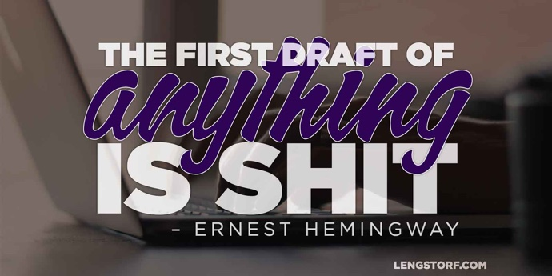
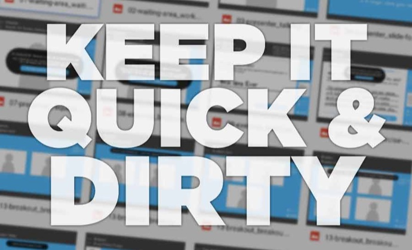
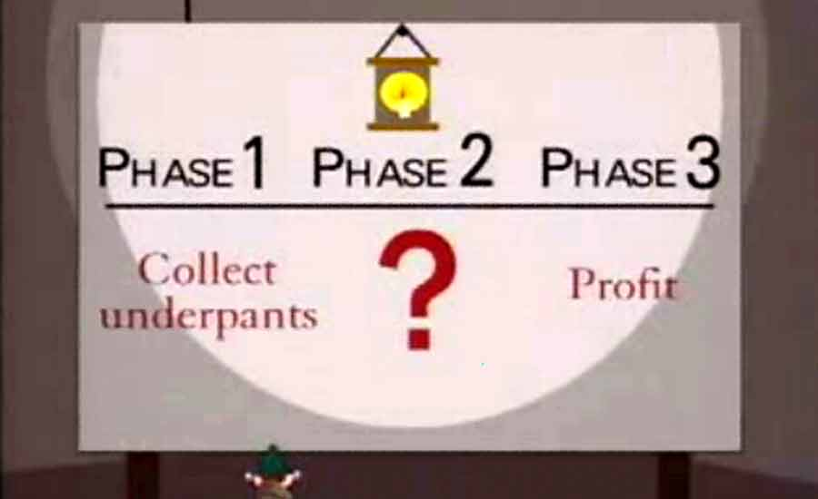
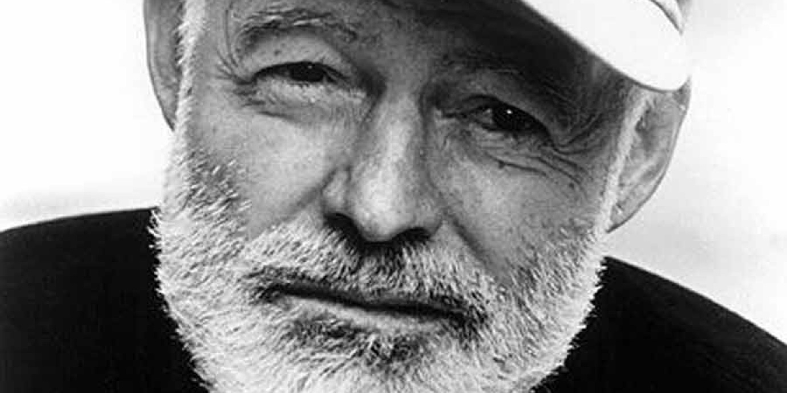

import { Image } from '$components';

At [Precision Nutrition][1], the first iteration of any project is called a
**Shitty First Draft**.[^lamott]

This isn't done to make the people producing the work feel bad about themselves;
exactly the opposite, in fact: **the goal of the Shitty First Draft is to remove
the need for polish in favor of making progress.**

<Image>

  

</Image>

## The Power of Getting Started

A blank canvas is intimidating. You have a vague idea of what you need to
create. You have a deadline. You know you have the skill to pull it off.

But there's hesitation.

What if it's not exactly right? What if people judge your work too harshly? What
if this idea isn't as good as you thought?

Small worries like these can lead to procrastination and unnecessary stress.

A Shitty First Draft is specifically designed to remove these barriers, making
it much easier to just get started:

* **A Shitty First Draft is not intended to be perfect.** It's intentionally
  imperfect and unpolished.
* **A Shitty First Draft isn't reviewed for launch-readiness.** It's intended to
  give everyone a starting point to provide real, concrete feedback.
* **A Shitty First Draft gets the ideas on paper and out of your head.** This
  makes it much easier to see the value of the idea _before_ spending too much
  time on it.

The Shitty First Draft is fast, and intended only to move the project from a
vague, project-shaped idea to a tangible, tweakable, _actual_ thing.

Moving a project from "an idea we need to start working on" to "a project that's
started but needs to be finished" has a huge psychological benefit: **forward
progress generates momentum,** and there's no question that projects with
momentum get finished faster.

## Create Something Simple to Get a "Real" Working Concept

Having something tangible to look at allows the whole team to see a real-world
application of the idea. This is far easier to tweak than a collectively
assembled mental model and/or flowchart.

With a Shitty First Draft, the time it takes to get something tangible is much
lower. The project spends far less time as a concept in the minds of the "idea
people", and far more time being shaped into a final product by the team.

<Image
  align="right"
  caption="The wireframes for our app bordered on stick figures. That’s all we needed."
  credit="Jason Lengstorf"
>

  

</Image>

For example, I'm currently building a new application that's trying to take
certain in-person interactions and — as best as possible — scale those globally.
We spent hours talking about how this could work and how to measure success, but
because nothing like this app currently exists.

We couldn't _really_ wrap our heads around how it worked, because it was only a
concept.

**We needed something real — something bound by the limits of reality — so that we could start to find and fix issues with our approach.**

Instead of trying to code anything, I started by building a Shitty First Draft:
low-quality wireframes of different screens in the app, plugged together in a
Google Presentation that we used to storyboard what a real session would look
like using the app.

This lo-fi storyboard only took a few days to put together, and having "real"
screens to look at while walking through a real use case allowed us to find
issues that we wouldn't have caught otherwise — issues that would have required
a good deal of work done over again had we jumped straight to building a
"production-ready"[^productionready] version.

## Remove Guesswork from New Projects

<Image
  align="left"
  caption="A Shitty First Draft helps avoid the Underpants Gnome problem."
  creditLink="http://southpark.cc.com/clips/151040/the-underpants-business"
  credit="South Park"
>

  

</Image>

The Shitty First Draft also takes a lot of the guesswork out of the subsequent
efforts: my first crack at coding up the app felt more like a paint-by-numbers
than a blank canvas, and that allowed me to get into a [flow state][2] quickly.

The Shitty First Draft paved the way for the real product by smoothing out all
the usual bumps that would take me out of building the app to work on its
strategy.

The Shitty First Draft has been used effectively at Precision Nutrition for
everything from web apps to coaching programs to full-length books. It doesn't
matter what kind of work you're doing: **start with a Shitty First Draft, you'll
end up with a higher-quality product sooner.**

## Give Yourself Permission to Start Shitty

I shudder to think of now many hours I've wasted trying to write something
perfect on the first try.[^highschool] How many lines of code I've deleted after
I built out a fully-functional feature that it turned out wasn't necessary at
all. How many designs I've scrapped because I started with the aesthetic before
I had all the details of how something would be used.

I felt pressure to be perfect. Most of it was internal pressure.

I didn't want to admit I couldn't get things perfect on the first try.

I wasted days of my life. Probably _months._ All because I was worried that if
every word, every line of code, every pixel of a design — if _everything_ I
produced wasn't my absolute best work, I was failing myself, my clients, my
business, my fucking _ancestors._

<Image
  align="right"
  caption="Smart guy, that Hemingway fella."
  credit="AP"
>

  

</Image>

**When I came to accept that Hemingway was right, and that the first draft is always shitty, I started working more quickly, and the work I put out into the world was better quality.**

This article started as a list of productivity tips, which was expanded to a
series of articles including a piece on planning, which was then simplified into
just this concept. From there, it went through several rounds of edits from
myself and people I trust before it came out as the post you're reading
now.[^anxiety]

Everything about my creative process improved when I started implementing the
Shitty First Draft.

What will you create when you give yourself permission to start shitty?

[^lamott]:
  I did a search for "shitty first draft" after I started writing this article and came across an excerpt from Anne Lamott's _Bird by Bird_ [on shitty first drafts.][3] It's worth a read — especially if you're a writer.

[^productionready]:
  I quote this because it still would have been a Shitty First Draft; it just would have cost far more to produce.

[^highschool]:
  In high school, I was so hellbent on this I wouldn't edit my writing assignments at all. Hell, I wouldn't even _read_ them after I finished writing. I'd sit down, write the whole thing in one sitting — it doesn't take long to fill two pages, double-spaced, after all — print it, and never look at it again. I remember saying something impossibly pretentious, like, "My writing is born whole. If I have to edit it, it wasn't worth writing in the first place."

[^anxiety]:
  The anxious part of my brain just started screaming, "No! Delete that! What if this isn't an amazing article and people say, 'This is your _edited_ stuff?'" Yes. This is my edited stuff.[^validation] That little anxious voice can suck it.

[^validation]:
  Please validate me. My sense of self-worth is bound to [my Klout score][4].

[1]: http://precisionnutrition.com/
[2]: http://goo.gl/EY6UKJ
[3]: https://wrd.as.uky.edu/sites/default/files/1-Shitty%20First%20Drafts.pdf
[4]: https://klout.com/jlengstorf
