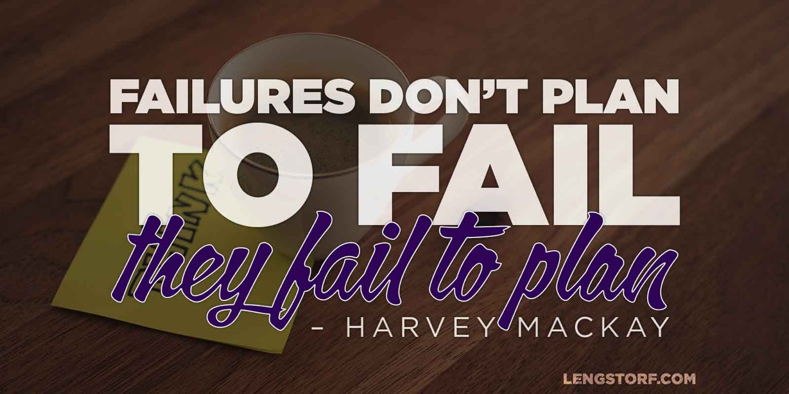
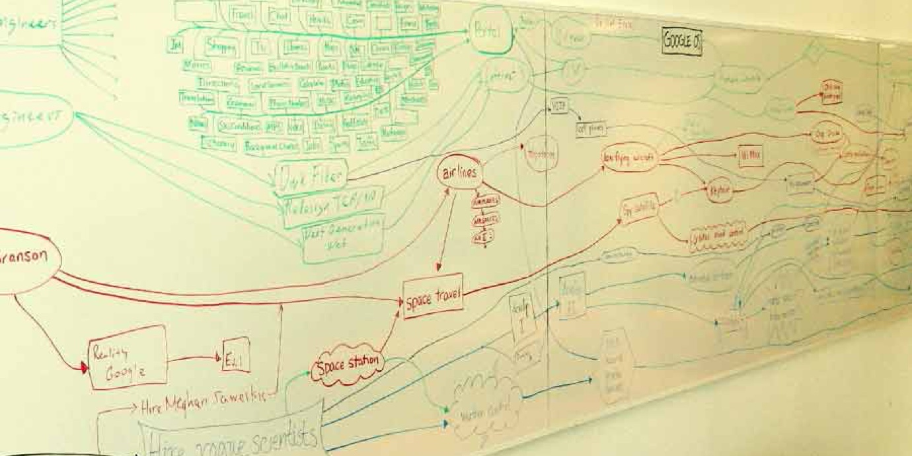

import { Image } from '$components';

I have a lot of good reasons to get my work done quickly:

* I work remotely, so the faster I get my tasks done, the faster I can call my
  workday over;
* I'm a [digital nomad][1], so having more time to explore means a more complete
  experience of the places I'm staying;
* I'm constantly staring down a long list of things I want to work on, so
  getting things done quickly allows me to tackle my passion projects without
  burning the candle at both ends.

In the past, my approach was to throw myself headlong into a new project —
working furiously for as long as I could manage, hacking and slashing toward the
finish line.

These days, I slow down, take a breath, and **make a plan for my work day.**
Then when I go hard, I go _hard._ And then I'm done for the day and I go _to
lunch._

<Image>

  

</Image>

## Do You Know the Risks of Poor Planning?

Without a plan, you're hoping. You _hope_ you understood what your boss wanted.
You _hope_ this feature is necessary. You _hope_ this is what the client meant
by "make it pop". You _hope_ you'll find a way to wrap up this article
coherently.

**Hope — for all the good it brings — is a terrible thing to rely on when you have deadlines to meet.**

You don't want to hope you're getting it right. You want to _know_ you're
getting it right.

### Lack of Direction Can Cause Lack of Motivation

**If the project isn't explicitly laid out, it's easy to spin your wheels or procrastinate.**

There's no clear first step, and that makes it hard to know if you're starting
the right way.

Moving from "to do" to "in progress" is a big mental barrier, and poor planning
can make it even bigger.

### Work Ends Up Wasted

**If you do a bunch of work under incorrect assumptions, you'll end up doing that work over again.**

A murky understanding of a project's end goals means you're likely to spend
effort in the wrong areas, wasting time and energy unnecessarily.

### You End Up Chasing a Moving Target

**Working without planning is an excellent way to waste hours.** It doesn't mean
that you don't plan at all, it just means you're forced to plan at the same time
you're working.

<Image
  align="right"
  caption="If you don't have a plan, you will end up wasting time. Guaranteed."
>

  

</Image>

In addition to the whole thing where [humans are terrible at multitasking][2],
planning on the fly means _hoping_ that the completed work meets all the
requirements — even the ones that aren't clear yet.

Defining goals late in the production schedule almost _always_ results in wasted
or duplicated efforts, and it's a great way to paint yourself into a deadline
corner.

### Interruptions Are Guaranteed

Whenever I work on a project where I don't have a clear understanding of the
goals, I'm frequently forced to stop and fire off an email asking for
clarification.

On a web design, I might know that I need to build a home page, but I have to
stop and ask if the main focus of the home page is to highlight the newsletter
list or to drive readers to the blog. That's vital to the project's outcome — if
I don't have that information beforehand, I'm hamstrung until I hear back from
the decision makers.

The same holds true for self-directed projects: **if I have to stop working to think about the strategy, I'm context switching and adding unnecessary mental fatigue.**

## How to Make Projects Easier, Faster, and Less Frustrating

Proper planning doesn't need to involve hours of meetings, flowcharts, or
Post-It notes. It really just boils down to defining what "success" means — in
quantifiable terms — _before work begins on a project._

### Make the Project's Goals Easy to Measure and Hard to Misinterpret

<Image align="left">

  

</Image>

Imagine you're helping prepare for a party, and the host asks, "Hey, can you
order pizza?"

In theory, that's enough information to move forward and complete the task.

However, without more information, you'll have to make a lot of assumptions.

For example, how many people are coming? Is anyone vegetarian or lactose
intolerant? Are we still doing the gluten-free thing? Anyone who doesn't eat
pork products?

To improve, set clear goals: get enough pizza for 20 people, including
vegetarian options. Also, order cheese sticks.[^cheesesticks]

The original goal — order pizza — was hard to measure. A single slice
technically meets the requirements. No one's happy, but, hey! you told me to
order pizza — not _pizzas_ — so this is clearly not my fault.

The second goal is easy to measure and has far less room for misinterpretation:
were all 20 people fed? Did the vegetarians have pizza to eat? Did I get my
cheese sticks?

And this is just pizza — on bigger projects, there are dozens more
clarifications needed before work starts.

**Defining clear goals with easily measurable outcomes is good for everyone.**
For the boss or client, it provides the security of being sure the person doing
the job is fully aware of what's required in order to call the project a
success. This alleviates the need for micromanagement, freeing up time for other
tasks.

For the person doing the work, measurable goals eliminate ambiguity. It gives
well-defined targets to shoot for, and creates simple check boxes that instantly
measure whether or not the project is completed.

As a bonus, it requires the boss or client[^personalprojects] to fully consider
their idea and provide clear direction — this avoids the "I'll know it when I
see it" dilemma by removing that option as a possible outcome.

### Write Down the Goals and Post Them for Everyone on the Project

In agency speak, this is a "scope of work" — a document that details everything
expected of everyone involved, agreed upon by everyone involved, to show that
everyone A) agrees on what "done" looks like, and B) feels confident that they
have what they need in order to do the job well.

<Image
  align="right"
  caption="Post plans in a public place. No secrets on a team."
  creditLink="https://www.flickr.com/photos/jurvetson/"
  credit="Steve Jurvetson"
>

  

</Image>

**Write down _everything_ required before the project is considered complete, and make sure the whole team has reviewed and approved it.**

Emphasize to the decision makers that anything not on the list of goals will not
be done, so the list needs to be complete.[^scopecreep] Emphasize to the doers
that they need to prove that tasks are completed, so the list needs to have
quantifiable tasks.

This is _extremely_ easy to blow past in early meetings, but trust me: I've
never — **_never_** — worked on a project without a clear scope that didn't run
up against some kind of confusion, delay, tension, or (most commonly) all of the
above.

Take the time to do a thorough job on the scope, and everyone will be happier.

### Make a Todo List from the Goals

After you have a clear scope, you can **break a project down into a series of
yes-or-no questions** that act as your project roadmap and todo list.

Going back to the pizza example, the project becomes three todo items:

* Order enough pizza to feed 20 people
* Make sure there are vegetarian options
* Order cheese sticks

This is incredibly clear, and — I hope — impossible to fuck up.

Did you order seven or eight pizzas? Yes. _Check._

Did you make sure three or four don't have meat? Yes. _Check._

Did you order cheese sticks? Yes. _Check._

Boom. This project is _measurably_ complete. If this isn't what the requester
wanted, it's because the project was improperly defined.

This is incredibly freeing as the person doing the work: **creating a todo list
from the project goals builds a map to completion and adds an obvious indication
of progress.**

The same benefits exist for clients, managers, and bosses: the project is either
done according to the plan or it isn't; no micromanagement or office policing
required.

### Use Low-Cost Prototypes when Necessary

If a project is complex enough, hashing out the details may require a prototype
or working draft for review.

**If work is required to flesh out an idea, keep it simple and low-cost.**

At my job, we use an approach called the [Shitty First Draft][4] to allow for
rapid, lo-fi creation of "real" prototypes that give the whole team a feel for
how something will work, but without any polish or unnecessary effort. We build
something quick and dirty, and that's usually enough to work out the rest of the
details.

## A Few Hours of Planning Can Avoid Weeks of Wasted Time

**Laying out a solid plan is vital for a project to be completed on schedule, on budget, and without unnecessary stress.**

Stated more plainly, planning is not optional. I've ignored this advice in the
past, and it's always proven to be a source of pain later in the process.

On the flip side, I've never once put together a project plan and thought later,
"Dang, I sure wish I hadn't planned so well."

It doesn't take much more than asking questions and writing things down. You'll
spend a couple (potentially boring) hours doing it.

<Image
  align="right"
  caption="I saw this sunset in Costa Rica because I planned well and got my projects done on time."
  credit="Jason Lengstorf"
>

  

</Image>

But you know what you'll gain?

**You'll gain weekends of relaxation** because you're not scrambling to complete
a late-stage feature that _has_ to launch Monday.

**You'll gain evenings off** because you aren't staying late after spending the
whole day in meetings trying to get guidance for features instead of working on
them.

**You'll gain camaraderie with your team and clients** because there's no
misunderstanding to cause resentment or tension.

Most importantly, **you'll gain all the benefits that come from completing projects** on time, on budget, and without huge hassles or setbacks.

## How Do You Plan?

Have you run up against projects where poor planning has wrought havoc? How have
you adjusted moving forward to make things easier?

How do you plan your projects? Let me know in the comments!

[^cheesesticks]:
  Hey! Cheese sticks weren't on the original work order! But now that we've thoroughly considered the goals of the project, cheese sticks were always necessary.

[^personalprojects]:
  If you're working on a personal project, you may think, "I don't need to define the scope — I can figure it out as I go." You're not wrong, but you're probably about to make your life a lot harder than you need to. I'm speaking from experience, here.

[^scopecreep]:
  This is especially important if you're working with paying clients. The scope is what keeps the price where it is — if the scope changes, the price changes. Without clearly defined, measurable scopes, you're almost guaranteed to run into [scope creep][5], and that either means you're working for free or your client is paying money they didn't expect to pay — in either scenario there's unnecessary tension and resentment.

[1]: /remote-work-travel
[2]: http://blog.codinghorror.com/the-multi-tasking-myth/
[4]: /shitty-first-draft
[5]: http://en.wikipedia.org/wiki/Scope_creep
