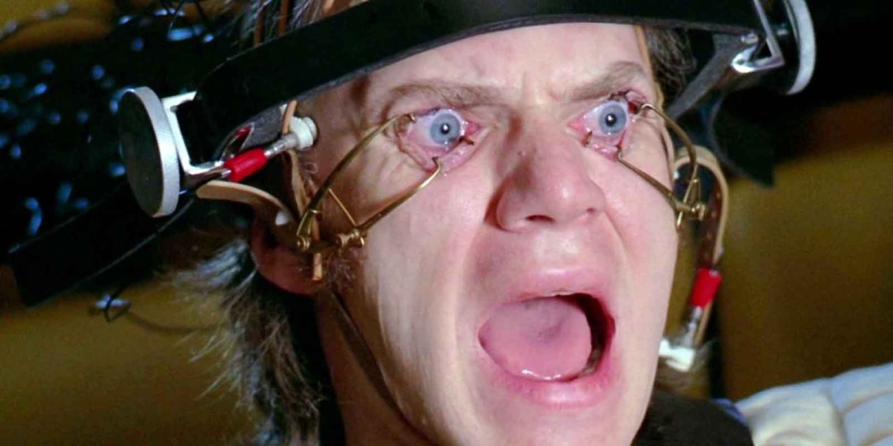
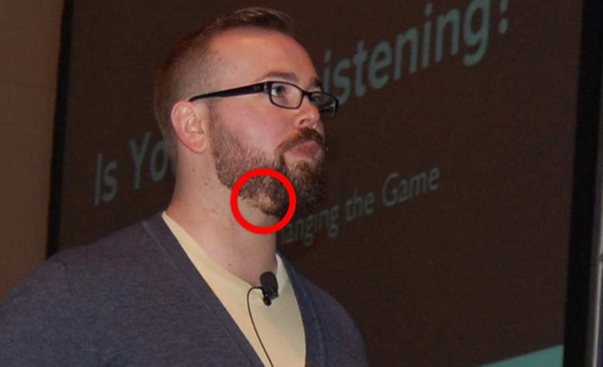
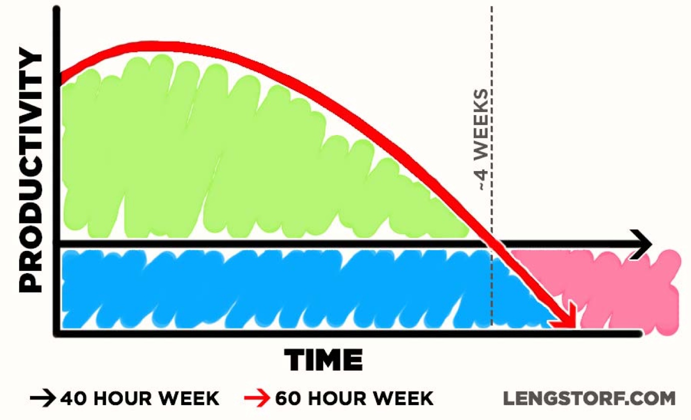
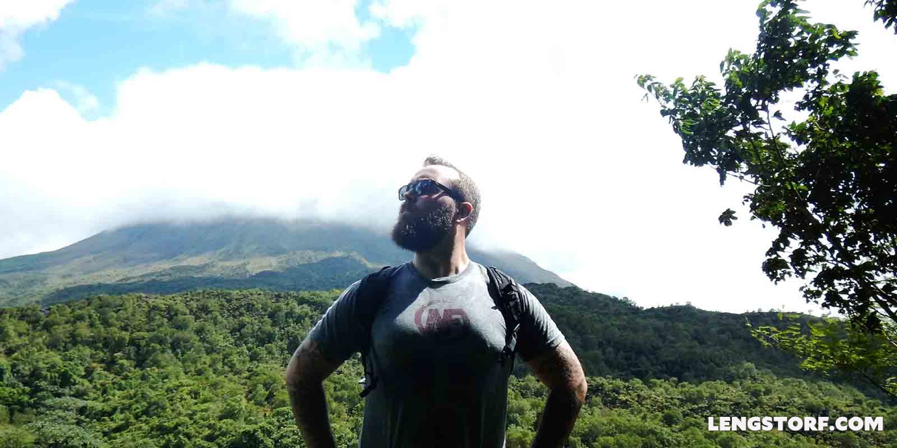

import { Image } from '$components';

You didn't mean to end up here. You didn't even see it coming.

It all started with a chance to earn a living doing something you loved. Your
dream job. Creating things instead of rotting in a cubicle. You weren't just
going to make a living — _you were going to leave your mark on the world._

At first, you loved the work; it was challenging and fast-paced. Everyone around
you was crazy smart.

You brainstormed in your off time. Took projects home with you. Put in extra
hours on weekends. It never felt like overworking because it never felt like
work.

You put in way more than 40 hours a week, but who was counting? This was _fun._

But weeks passed into months and somehow you ended up here: Working 60 hours a
week minimum, usually more. You greet your coworkers, bleary-eyed, half-joking
about needing coffee to survive.

The work is still fun, but you don't feel the same passion anymore. Whole days
slip by sometimes and you have no idea what happened; you certainly don't have
much to show for it.

Your goals outside of work are on hold. You'd love to find out if the Belgians
have anything to be cocky about waffle-wise, but you don't have time for a big
trip right now. You know you need to get into an exercise routine, but something
always comes up and you skip the gym.

"Later," you promise yourself, "I'll get around to it soon."

You're not exactly *un*happy, but something's off. You can't put your finger on
it. You've just always felt that there would be . . . _more._

<Image
  caption="You’re being force-fed an “ideal” work ethic that’s actually toxic for everyone involved."
  creditLink="http://amzn.to/1VqP36g"
  credit="A Clockwork Orange"
>

  

</Image>

## You've Been Absorbed

You're no longer a free member of society. You've been lured into the **Overkill Cult**.

**The Overkill Cult is a cultural delusion that working 60+ hour weeks at the expense of everything else in our lives is not only a necessary part of success, but that doing so is somehow _honorable._**

The insidious thing about the Overkill Cult is that it masquerades as all the
things we like most about ourselves: dedication, ambition, follow-through,
responsibility.

It tells us to push harder, stay later, sleep when we're dead. It tells us we're
never going to get ahead if we don't show up first and go home last.

Cleverly, wickedly, the Overkill Cult persuades us to hang ourselves with our
own strengths.

And if we don't break free, we're all going to die.

## The Overkill Cult Will Kill You (Like It Tried to Kill Me)

Balance is the first thing to go once the Overkill Cult has us in its grasp.

For me, it started with my health. I skipped the gym — _too busy_, I thought. I
didn't have time to cook — _too busy_ — so I ordered delivery.

My hobbies went next. Everything that wasn't work fell away — _too busy, too
busy_ — until I was on the computer constantly, working.[^worklike] **In 2012, I
was working 70–90 hours a week.**

After that, I lost my social life. Friends knew I wouldn't show up — _can't; too
busy_ — so they stopped calling. Some days my only human interaction was
ordering coffee.

Then — and this, sadly, is where I finally realized there was a problem — I lost
my beard.

### The Canary in the Coal Mine, or How I Killed My Beard

At the end of 2012, I landed the biggest project of my career at that point: a
Black Friday sales site for a Fortune 100 company.

I was thrilled and terrified. A project like this had the potential to move my
company to the next level, and I decided to do whatever it took to make this
project the best I'd ever built.

The designers had great ideas, and I sat with them to make sure they were
possible on our timeline. We came up with a slick, modern idea built on
cutting-edge technology. The client loved it.

Then bureaucracy came into play. The legal department made changes. Brand
adherence contradicted legal. Design went over schedule. _Way_ over schedule.

By the time the design was approved, I had a third of the time we'd scheduled.
And — since this was a Black Friday site — we couldn't push back the release
date. It either launched on time or I was a failure. Period.

Not to be defeated, I powered through four straight days leading up to Black
Friday, sleeping _maybe_ six hours total. On Thanksgiving Day I skipped family
get-togethers in favor of making the final push.

I was exhausted. Delirious. But, goddammit, _I finished the project._

The client was thrilled. The site won a couple Addy Awards. I assume they made a
metric fuckton in holiday sales.

Over the next few months, patches of my beard started to turn white. The
whiskers became ultra-fine. Then they fell out altogether.

<Image
  align="right"
  caption="May, 2013 — about six months after my Black Friday fiasco."
>

  

</Image>

Shortly afterward, I lost my ability to grow a beard entirely — I was left with
the unsavory choice between a clean-shaven "giant fat baby" look and a creepy
mustache.[^mustache]

I had stressed myself out so badly that my body had forgotten how to grow a
beard. And for what? So I could work 19-hour days and skip family holidays to
meet crazy deadlines?

I was exhausted. My body was failing. I was overwhelmed and unhappy and
isolated. _I had a mustache, for chrissakes._

I had been guzzling the Overkill Cult's Kool-Aid.

Something had to change.

## How to Tell If You're in a Cult

The telltale signs we've fallen prey to the Overkill Cult's influence are
subtle:

* Frequently working more than 40 hours a week
* Frequently sleeping less than 6 hours a night
* Feeling guilty about any time away from work— even if that time is with family
  and friends

We don't join overnight — this is [death by a thousand cuts][1] — and once we've
joined, we'll probably deny it.[^denial]

But we've joined. By the thousands, we've joined.

## The Lies of the Overkill Cult

The Overkill Cult's siren song seems like a healthy sense of ambition. "We have
to work hard to get ahead." It's something we've been told our entire lives.

We're doing what we think is best for the future.

But the Overkill Cult doesn't plan for survivors.

Though the symptoms of the Overkill Cult grow from good intentions, they're
short-sighted habits that ultimately do more harm than good.

Let's look at each of the Overkill Cult's telltale signs, and how each of them
is a long-term detriment disguised as a healthy work ethic.

### Frequently Working More than 40 Hours a Week

Long hours often feel mandatory — it's just part of the culture. We think, "My
boss/coworkers/cat will judge me if I'm not working the same long hours as
everyone else. I'll never get ahead if I don't go above and beyond."

This is just what it takes to make it, right?

**Wrong.** Incredibly, terribly, _spectacularly_ wrong.

Research has proven over and over again that **it's not possible to be
productive for more than 40 hours a week.** At least not for sustained periods
of time. Henry Ford introduced the 40-hour work week in 1914 because he saw —
through research — that workers on [five eight-hour shifts kept up the highest
sustained levels of productivity][2].

Despite over 100 years of research supporting shorter work weeks, many companies
still push for long hours, under the claims of a "sprint" or "crunch time"
period.

<Image
  align="right"
  caption="This diagram is loosely based on one included in Sidney J. Chapman’s <em>Hours of Labor</em>."
>

  

</Image>

The irony comes in when we look at productivity over time. After just two months
of 60-hour weeks, [productivity goes _negative_][3] compared to what a 40 hour
week would have produced.

Did you catch that? **By working 150% of the hours, you accomplish _less_ in the long run.**

### Frequently Sleeping Less than 6 Hours a Night

Somehow, sleeplessness has become a strange badge of honor. We swap "war
stories" of sleeping two hours a night with an odd, martyred pride shining dimly
in our bloodshot eyes.

_I never sleep because [sleep is the cousin of death][4],_ we murmur drowsily.
So many projects, so little time.

But this belief that burning the midnight oil somehow gets us ahead is utterly,
tragically wrong.

You're the [cognitive equivalent of a drunk driver][5] after being awake about
18 hours. But the problem compounds: if you don't get enough sleep, that level
of impairment comes faster the next day. After a few days of too little sleep,
you're a drunken zombie.

We wouldn't go to work drunk, so why the hell do we go to work on four hours'
sleep, when we're _more_ impaired than if we were hammered?

To make matters worse, sleeping less than six hours a night [may lead to an
early death][6]. The Overkill Cult is _literally_ killing you.

### Feeling Guilty About Any Time Away from Work — Even Time with Family and Friends

When we're in the clutches of the Overkill Cult, we feel a stab of guilt when
we're not working.

"I'd love to go to this holiday party, but I really shouldn't; this project
won't finish itself."

We fear that any time not spent working is wasted.

The irony is — yet again — science tells us _exactly the opposite_ is true.

Overworking leads to higher stress levels and burnout, which have been linked to
[increased health risks][7].

Conversely, time away from work is proven to [relieve stress][8] and [boost
creativity][9], among numerous other benefits.[^walking]

Besides, if we accept that the ideal is to sleep 8 hours a night and work 8
hours a day, that leaves us with 8 hours[^nonworktime] for non-work activities.

Taking time away from work gives us time to recharge. It puts distance between
us and our projects, giving us time to remember why we like doing what we do.

## Making Our Escape

While we may have been duped into joining the Overkill Cult, it's not too late
to escape.

We've been conned using our own best qualities to develop habits that — even
though it _seems_ like they'd make us better — make us worse at our jobs, less
satisfied with our work, _and_ less happy in our day-to-day lives.

Leveraging the same strengths the Overkill Cult exploits, we can break free of
its clutches and take back our happiness and passion.

After my beard died, I felt the full weight of burnout. _I was burnt to a
fucking crisp._ I realized I could either leave my career altogether, or make
some fundamental changes to my lifestyle.

For what it's worth, here are the promises I made to myself that helped me break
away from the Overkill Cult.

### I Work as Much as I Can — But Not More

Before anything else, I had to accept that **it's only possible to do 6–8 hours of quality work each day.**

Trying to work longer hours will not make me more productive. In fact, working
longer hours actually results in me getting less done as time drags on.

I chose the latter, and implemented some radical (to me) [strategies for
controlling my time][10]. **I cut from an average of 70–90 hours a week in 2013 to an average 38 hours per week over the last year.**

I expected to see less professional success in favor of better overall balance
in my life — a sacrifice I was willing to make — instead I saw _better_
productivity at work: my turn-around times went down[^turnaround] and I was more
consistently hitting my deadlines.

I was floored at the time, but in retrospect I'm not surprised at all.

### I Make Sleep a Top Priority

Getting enough sleep is beneficial on every level. Yet it's always the first
thing I would sacrifice when life got busy.

Too little sleep wreaks havoc on my ability to think clearly, and that hurts me
at work in a big, bad way.

After I cut my hours down, I started sleeping without an alarm.[^noalarm] Since
I'm not working crazy hours, I close my computer by six or seven in the evening,
and by eleven I'm usually in bed, where I read for a bit before falling asleep.
I wake up naturally between seven and eight-thirty.

This has changed my life. No bullshit.

Waking up to an alarm before I'm fully rested starts the day in a groggy,
stressful way. Waking up naturally after getting as much sleep as my body needs
leaves me much happier to be awake, and far more ready to start my day.

### I Dedicate a Reasonable Amount of Time to NOT Working

This was — and still is — the biggest challenge I faced in breaking away from
the Overkill Cult. I love what I do, and I want to get my projects finished.
It's easy to rationalize working more hours and skipping activities that keep me
from working.

But now I know that taking breaks makes me more productive: time away from work
lets my passion and excitement for the work renew itself; taking my mind off of
a project allows my subconscious to roll around abstract ideas that result in
better solutions; breaks from the job lower my stress levels and boost my
creativity.

So I make sure to do it, even if my gut (incorrectly) tells me it's a bad idea.

I take walks. I leave my phone in my pocket when I'm out with friends or eating
my meals. I spend a fair amount of time on my hobbies, like writing and hunting
for the world's best cheeseburger.

I'm happier today than I can ever remember being in my life. I feel excited to
work on my projects, to pursue my hobbies, and to spend time with people I love.

_I'm excited to be alive._

## Leaving the Overkill Cult Saved My Life

**When my beard died in 2013, I feared it was only the first sign of an impending decline in my health that would ultimately kill me.** It was a glimpse into my future, and I was terrified that if I didn't change, I was in for a life of isolation, ulcers, alopecia, and an eventual heart attack or stress-induced brain tumor.

By changing my lifestyle, I was able to turn things around. After just a year of
balancing my work with the rest of my life, my beard grew back. I lost 30 pounds
because I was actually going outside and making it to the gym. I felt more
awake, and I [became more positive][11].

**When I left the Overkill Cult, _everything_ in my life improved. Not one single thing got worse.**

<Image
  caption="Doing a superhero pose in front of a volcano in Costa Rica. (Notice my beard.)"
  creditLink="https://marisamorby.com"
  credit="Marisa Morby"
>

  

</Image>

## Are You Ready to Make Your Escape?

If you've been sucked into the Overkill Cult, know that you're not alone.

You may be facing cultural pressure to keep this crazy pace. You may be
struggling with your identity as "a hard worker" and feeling that scaling back
somehow makes you lazy or useless.

But I promise you — despite the doubts the Overkill Cult will force into your
mind — there's a better way. Better for your career. Better for your health.
Better for your relationships. Better for your happiness.

You ended up in the Overkill Cult because you're smart, ambitious, and
dedicated. But you were misled by your good qualities and turned them into bad
habits.

There's a better way, and you're smart enough to pull it off.

Dump your Kool-Aid in the sink. Take back your freedom. Find the happiness and
success you were looking for when you started this career.

Close your computer. Go outside. And call your friends; they miss you.

[^worklike]:
  Hardly any of these hours were productive. Often I'd refresh my email, or stare at a code editor in a daze before realizing I'd been sitting there with my mouth open for half an hour.

[^mustache]:
  "You'll look like Magnum," I tried to tell myself. But I knew — even then, I knew — it was all a horrible, creepy lie.

[^denial]:
  If you're currently rationalizing how you're _not_ in the Overkill Cult even though you meet all the criteria, you're definitely a member.

[^walking]:
  These studies focus on walking a few minutes a day. Not even an actual hobby or dedicated non-work activity. The negative effects of "all work and no play" are staggering, if you think about it.

[^nonworktime]:
  Or, if you want to exclude meals and such, _at least_ four hours. That's enough time to go to the gym _and_ pick up a hobby. Or even, you know, hang out with other humans or something.

[^turnaround]:
  I also made other changes that helped with turn-around times, such as [planning more effectively][12].

[^noalarm]:
  Waking up without an alarm is, by far, my favorite thing about the [digital nomad lifestyle][13] I'm so grateful to lead.

[1]: http://en.wikipedia.org/wiki/Creeping_normality
[2]: http://www.salon.com/2012/03/14/bring_back_the_40_hour_work_week/
[3]: http://www.enginesofmischief.com/makers/evan/pubs/crunch.html
[4]: http://genius.com/3012/Nas-ny-state-of-mind/I-never-sleep-cause-sleep-is-the-cousin-of-death
[5]: http://www.ncbi.nlm.nih.gov/pmc/articles/PMC1739867/pdf/v057p00649.pdf
[6]: http://news.bbc.co.uk/2/hi/health/8660373.stm
[7]: http://www.tandfonline.com/doi/abs/10.3200/BMED.31.1.18-32#.VP2vuYGsWlI
[8]: http://depts.washington.edu/hhwb/Thm_Mental.html
[9]: http://psycnet.apa.org/psycinfo/2014-14435-001/
[10]: /no-distractions-experiment
[11]: /how-to-be-positive
[12]: /effective-project-planning
[13]: /remote-work-travel
