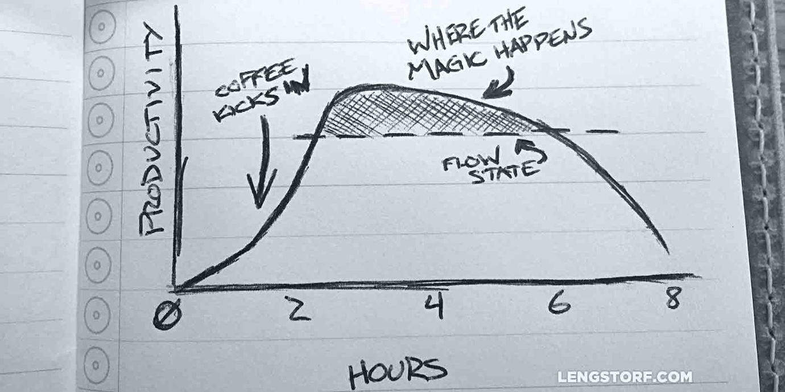
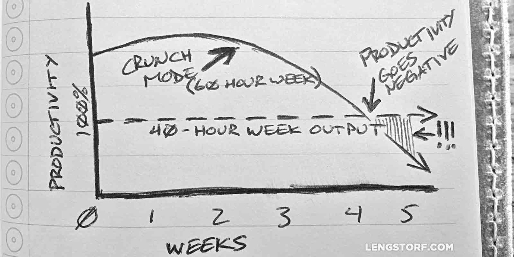

import { Image } from '$components';

The way many businesses approach pressing deadlines is terrifying.

It's also, ironically, one of the least effective ways to meet deadlines.

> The current mandatory hours are 9am to 10pm -- seven days a week -- with the
> occasional Saturday evening off for good behavior (at 6:30pm). – [ea*spouse:
> _The Human Story*][1]

This post from ea_spouse caused a huge stir in 2004, citing the slow creep of
mandatory overtime into company culture at EA Sports.

EA's reasoning, according to the post, was that engineering needed to go into
"crunch mode" to boost output and meet looming deadlines. After all, an engineer
working damn-near 90 hours a week should be at _least_ twice as productive as
the same engineer working 40 hours a week.

Right?

## Productivity Is Not Linear

The thinking behind why managers believe twice the hours results in twice the
output is short-sighted and toxic. Companies who regularly enter "crunch mode"
forget to consider that their employees are humans — susceptible to fatigue,
burnout, resentment, unhappiness — and not robots.

As a programmer starts working, her output will follow a pattern along these
lines:

<Image
  caption="After about 6 hours, things go south in a hurry. After 8, very little is getting done."
  credit="Jason Lengstorf"
>

  

</Image>

If she's asked to work extra hours, she _will_ produce extra output. But since
she's already pretty beat after 8 hours, the extra output will be pretty low,
and at a high cost.

## Working More Produces Less

After an alarmingly short period of time — just a month in some cases — "crunch
mode" productivity will drop.

And not just a little drop. Output drops so much that it would have been more
productive to work a standard 40 hours.

Let me repeat that, because this is huge: **an employee working 60 hours a week
for two months will produce _less overall_ than the same employee working 40
hours a week for the same time period.**

_But how?_ How can doing 150% of the work result in less than 100% of the
output?

## Why Does Productivity Tank During Crunch Mode?

Imagine you work a standard 40-hour week, broken into five 8-hour shifts. And,
since it's hard to imagine our minds as a muscle, let's pretend that your job is
to unload heavy shit from a truck and move it into a warehouse all day.

### A 40-Hour Week Is Sustainable

On an average day, you start out fresh, hit your stride an hour or two in, and
start to feel fatigue set in after about six hours. At the end of eight hours,
you're beat, but not exhausted.

It's hard work, but after you go home for the day[^done] you have time to eat a
nice dinner, relax with your friends and family, watch an episode of _Orange Is
the New Black_, and read a chapter of your book before sleeping a solid eight
hours.

On the weekends you take care of errands, spend time with friends and family,
and sleep in a bit to make up for when you didn't stop at just one chapter of
your book.

By the time your workweek starts again, you're fully refreshed — mentally and
physically — and ready to get back to work. You could happily keep up this pace
for years.

### Crunch Mode Starts Strong...

In contrast, when mandatory overtime is assigned, you work a 60-hour week,
broken into 6 10-hour shifts.

On day one, you start fresh, but by the end of 10 hours you're feeling _really_
worn out — two extra hours of carrying heavy objects takes a toll — but you
_did_ unload an extra truck.

### ...but It Takes a Huge Toll...

You've also lost two hours of free time to the longer shift, so you have to skip
meeting up with friends — and even with the cancellation, you only get seven
hours of sleep.

On your only day off, you can't sleep in because you have to rush through your
errands early — you're supposed to meet your friends for a barbecue at 4pm, and
it's your only chance to see them this week.

Your next shift starts with you still feeling fatigued from last week. **No matter how hard you try, you're just too tired to keep up the same pace from last week.**

### ...and It Gets Worse Over Time

As the weeks drag on, your lack of sleep is combining with the stress of your increasingly-hurried personal life and you're feeling ragged. The fatigue is showing in your output: **each week is a little less productive than the one before it.**

<Image
  caption="After as little as 4 weeks of overtime, productivity can go negative."
  credit="Jason Lengstorf"
>

  

</Image>

Despite starting strong — during week one of crunch mode your output was
noticeably higher than a standard week — over the following weeks your output
dipped a little at a time, until you ended up doing _less_ work over ten hours
than you would over eight hours.

**For 150% of the effort, you're now getting less than 100% of the results.**

## If Overtime Is Less Productive, Why Do So Many Businesses Rely on It?

Why — despite 100 years' worth of solid research, stating definitively that the
5-day, 8-hour workweek is the most sustainably productive arrangement — are so
many businesses still implementing extended, mandatory overtime?

### Lack of Effective Measurement

The most likely culprit is a lack of measured results. **If you don't measure output, then your only tool for gauging productivity is time and perceived effort:** the team has been putting in lots of extra time, and it sure _looks_ like they're working hard!

### Misunderstanding of Time vs. Output

In high school, if you finished your assignments early, you weren't let out of
class to do whatever you wanted with the extra time. In fact, you were often
given extra assignments — things like extra credit — which were, in effect, a
_punishment_ for being efficient.

Some businesses operate with the same mindset and pay for time instead of output
— you may have heard this called "butts in chairs" management.

By valuing time over output, businesses unwittingly punish their most productive
employees and reward the slackers.

### Poor Project Management

If a project isn't properly planned, companies can find themselves trying to fit
a six-week project into a four-week timeline. If managers aren't actively
working on controlling timelines, overtime may seem like the only viable option
to meet unrealistic deadlines.

The problem is usually made worse by the fact that the manager doesn't pay for
poor management nearly as much as the employees stuck working overtime will.

## How Can Companies Fix the Problem of Overtime?

Unfortunately, there's no easy answer to this question. Each company will have
its own blend of dogmatic faith in overtime, cultural dependence on long hours,
managerial incompetence/inexperience, and [buy-in to the Overkill Cult][2].

There are a few things that are worth auditing, however, that can at least help
point out if there are some major, easily-fixable problems at work.

### Output Should Be Measured

**Every company needs to be measuring output.** Where knowledge work is
concerned, employee output is _the_ most important factor in determining whether
or not the company is doing better or worse.

For some companies, employee output is easy ("how many trucks did Terry
unload?") whereas others face more challenging metrics ("how much managing did
Pat do this week?").

Before a company can see the detrimental effects on productivity, it needs to be
able to **define what "productive" means with hard data** — otherwise they're
just guessing.

### Reward the Behavior You'd Like to Encourage

On any project, each team member should be given their fair share of goals to
complete.

After that, set 'em loose. If someone finished her tasks today and they're not due until next Friday, she can leave and not show up again until the review meeting — **as long as what she's turned in is quality, _it doesn't matter how long she took to build it._**

Don't punish the stars on your team. Make sure they're challenged, but be okay
with results-oriented management — incentivizing your team ("finish ahead of
schedule and you can do whatever you want until the meeting next week!") instead
of punishing them ("finish ahead of schedule and we'll load you up with
busywork!") goes a long way toward encouraging the behavior you want to see in
employees.

### Plan Projects Effectively

When a new project is in its planning stages, **make sure to include people in the decision-making process who will be able to provide reliable time estimates.**

A system of checks and balances should be put in place before a client ever
receives a timeline to make sure the proposed deadlines are achievable without
the need to go into crunch mode.

Businesses shouldn't underestimate the value of [properly planned projects][3];
with a solid plan, projects get done faster and with fewer unpleasant surprises
— like overtime.

## Be Part of the Solution

It's tempting to pretend that we're the exception to this kind of data. Don't
fool yourself.

Working effectively — and in a way that makes us _happy_ with all aspects of our
lives — is a marathon, not a sprint. We'll feel like we have gas left in the
tank. Like we're not giving 100%.

**That's exactly the point.**

Leaving a little in the tank is vital for sustained performance. When there's a
little gas left in the tank, we're still excited to work. We're not too
exhausted to spend time with our family and friends. We still have time to pick
up hobbies and relax.

And none of that should be undervalued — it's the secret to _truly_ being
successful and productive in the long run.

[^done]:
  And remember, you're doing manual labor in this scenario. You can't just move a couple boxes real quick from your phone during dinner, or make a call to rearrange that shelf you forgot to deal with today. When you're done for the day, _you're done for the day._

[1]: http://ea-spouse.livejournal.com/274.html
[2]: http://lengstorf.com/overkill-cult/
[3]: http://lengstorf.com/effective-project-planning/
