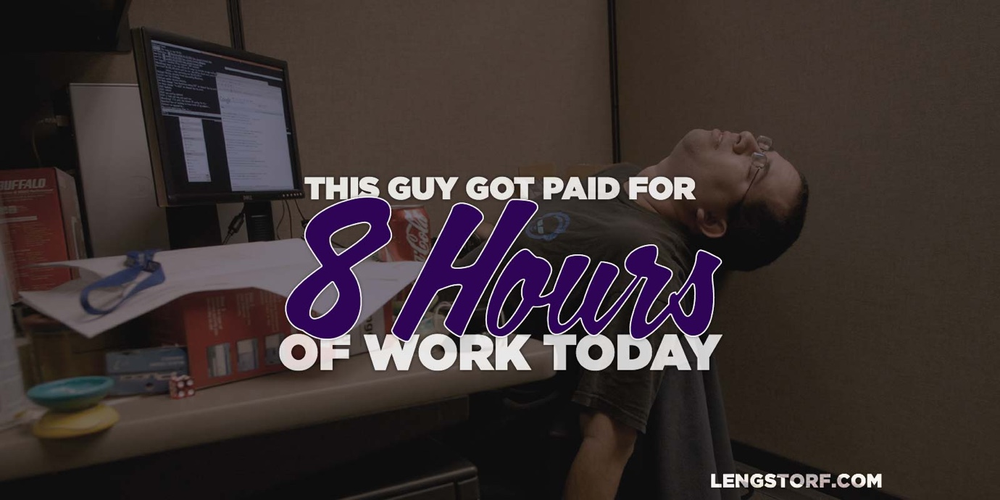

import { Image } from '$components';

Imagine that you're given a task at your salaried job: you have to write a
year-end summary of your department's most valuable projects, which will be used
to guide next year's project selection.

You get right to work and knock out the whole report in two days. Your boss is
pleasantly surprised at your speed, but nothing can happen until a coworker
finishes the report for his department.

In the meantime, there's a box of invoices that need to be audited, and since
you're ahead of schedule can you take care of it?

Meanwhile, your coworker takes a week and a half to finish the report. It's
mentioned that you finished faster, but that's about the closest thing to a
reprimand he'll hear.

**You're clearly more productive, but your coworker is rewarded: he made _way more money_ for doing far less work.**

You were both paid for time, not output.

## The Danger of Butts In Chairs

Because it's hard to measure output, many companies have reverted to a much
simpler, horribly inefficient approach to tracking an employee's worth: butts in
chairs.

**Rather than asking what someone produced, they ask how many hours he worked.**

Is it effective at telling who's a good employee? No.

Is it helpful in determining who the company's stars are? Nope.

Does it help motivated employees stay motivated? [Exactly the opposite][1], in
fact.

But it _does_ remove the need to do a little extra legwork for management, so —
despite the fact that it's arguably one of the absolute worst management metrics
available — it still gets used.

<Image
  caption="You were both here for 8 hours, right? Why <em>shouldn’t</em> you be paid the same?"
  creditLink="https://www.flickr.com/photos/johnjoh/368511463"
  credit="John Joh"
>

  

</Image>

### Time-Based Management Means Rewarding Poor Performance

**In a culture where the only deliverable is time spent at the office, the business is actively encouraging employees to do less.**

A project that should only take a day gets stretched out to two, because who cares? There's _nothing to be gained_ by working quickly.

## The Frightening Economics of Time-Based Management

For an employee, the economics look like this: that hypothetical report from the
beginning of this post took you two days to finish, or 16 hours.

Let's say your salary is $50,000/year. That means that you get paid roughly
$24/hour. So for finishing that report, you made about $385.

Your coworker, who spent a week and a half (say 56 hours) doing the same project
at the same salary was paid about $1,345 for the same job.

You, by working quickly, were punished for your efficiency. The message being
sent is, "Don't worry about how long it takes; you get paid the same salary
whether it's done today or done in a month."

## How to Stop Rewarding Failure

To solve the problem where your less-efficient coworker gets rewarded, imagine a
results-based office instead.

Your boss assigns a project to you and your coworker and sets a due date of the
following Monday, giving you six business days (48 hours) to complete the task.

Based on your salary, your boss has just valued this project at about $1,150.

Now let's assume that you still get it done in 16 hours.

Because the business is results-based, you are now free to do whatever you want
until the following Monday, and you just made $71.88/hour for creating that
report — **your efficiency was just rewarded with a higher hourly rate.**

Your coworker, on the other hand, manages to spend all of the allotted time plus
a couple late nights working on the report, and still somehow manages to take 56
hours to create the report. He's just lowered his hourly rate to $20.54.

This is far more rewarding to efficient employees.

## How Rewarding the Right Employees Helps Businesses

For a business that implements a results-based environment, [the rewards][3] are
also huge.

### Easily Spot Star Employees

A results-based company needs to spot stars in the company — the people who seem
to always get done ahead of schedule — and move them to more important,
higher-value projects. When employees are measured by their results, this is
extremely easy.

**Spotting and rewarding star employees creates an incentive for employees to work more efficiently,** which is good for morale, deadlines, and pretty much everything else businesses want to improve.

### Spot Problem Employees Quickly

Measuring results instead of time helps the company identify, coach, and — if
necessary — weed out problem employees.

It's very difficult to just coast along in a company where you're measured by results, so **employees who don't get much done are quickly identified by their low output.**

### Save a Small Fortune on Salaries

How much of a company's payroll goes toward funding Facebook and Reddit
sessions?

When a company shifts to results-based systems, measuring output and whether an
employee is earning their salary suddenly becomes not only possible, but easy.

Instead of reviews relying on a manager's memory and how many days an employee
was absent, it's suddenly possible to measure exact output:

"Pat was paid $50,000 for the year, and during that time turned in 35 projects
that we valued at a total of $50,500 — clearly Pat's salary was earned, and we
could even consider a small raise."

"Terry was paid $50,000 for the year, and during that time turned in 30 projects
that we valued at a total of $43,300. We need to coach Terry and see a marked
improvement or we'll have to consider termination."

**Terry's inefficiency may not have been caught without measuring results — a $6,700 oversight.**

## How to Make the Change

If you're caught in a business that values time over results, or if you're a manager or employer that's fallen into the butts-in-chairs trap, there's still hope.

It will take an effort, but if [industry giants][4] can implement and benefit from it, so can you.

### Start Figuring Out What Needs to Be Done

If you find that you're unable to clearly state what needs to be done in an organization, drop everything and start by defining what the result needs to be.

**Managers can't expect anyone to be effective if there's not a [clear plan][5] in place for what needs to be done.**

Employees can't do good work if they're not 100% clear on what "good work" means in the context of the company.

Before you can measure results, you need to _define the results to be measured._

### Make a Case to the Boss

If you're not at the top of your organization, you're at the mercy of higher-ups. That doesn't mean you're helpless, however.

Bring up the detriments of butts-in-chairs to your boss. Talk about the benefits to everyone of results-based work.

If the people at the top are actually interested in making the company better, they'll take what you have to say into consideration.

Be smart about it, though, because your boss won't likely change everything just because you waved this article in her face.

Instead, make a small suggestion: **as an experiment, your team could try a results-based arrangement and report back after 3–6 months with findings.** Figure out a way to measure results that will get management excited, and put a plan in place.

Once your team has demonstrated that results-based management gets results, your boss will take ownership of the idea and run it up the ladder, hopefully creating a ripple effect that helps move the whole company to a better arrangement.

And even if it doesn't, your team will likely be allowed to keep up the same arrangement — after all, you _were_ more productive.

### Vote with Your Feet

If your organization doesn't respond and insists that your only value to the company is your butt in a chair for 8+ hours a day, then **it may be time to look at other options.**

There are results-based employment options ranging from the obvious (software and copywriting) to the entry-level (customer support) to the unbelievable (accounting firms).

It's stressful to hunt for a new job, but there are [lots][6] [of][7] [options][8] for finding remote work.

If you can't change your culture, **don't let yourself be the one who's punished for someone else's incompetence.**

[1]: http://discover.umn.edu/news/arts-humanities/flexible-schedules-and-results-oriented-work-environments-reduce-work-family
[3]: http://gorowe.com/pages/about-rowe
[4]: http://www.slate.com/articles/business/psychology_of_management/2014/05/best_buy_s_rowe_experiment_can_results_only_work_environments_actually_be.html
[5]: /effective-project-planning
[6]: https://weworkremotely.com/
[7]: http://www.flexjobs.com/jobs
[8]: http://jobs.remotive.io/
