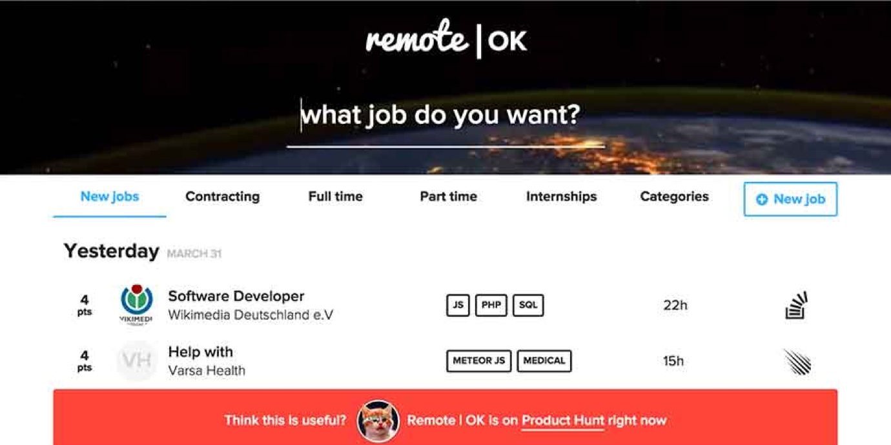
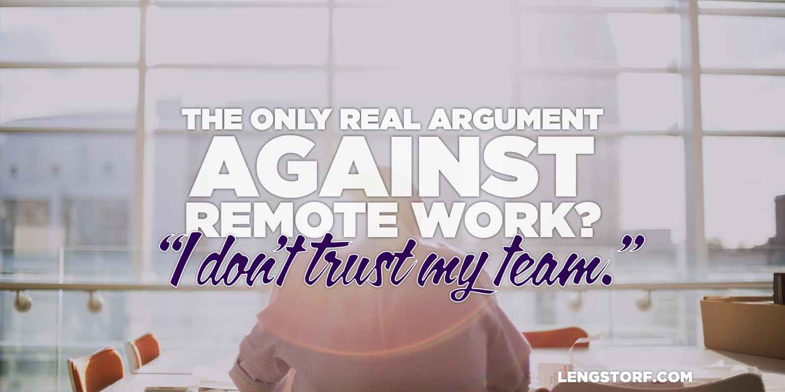

import { Image } from '$components';

The traditional office setting has its perks: community, an environment set up
for productivity, common meeting spaces for face-to-face interaction.

But with global access to reliable video meeting services and a host of other
cloud-based team management tools, remote workers have access to the same perks,
plus a host of other bonuses: fewer distractions, less micromanagement, little
or no commute, and — most importantly — location independence.

This isn't a one-sided victory, either: businesses hiring remote workers also
see lower costs, lower turnover, happier employees, and a worldwide talent pool.

## When Your Team Can Work from Anywhere, You Can Hire from Anywhere

If your team works remotely, _they don't have to be in the city where your company is based._ **You can [hire the right person][1] for the job, no matter where they are in the world.**

<Image
  align="right"
  caption="Remote job boards make it easy to find location-independent workers."
  creditLink="http://remoteok.io"
  credit="remoteok.io"
>

  

</Image>

This means a developer living in Iowa doesn't have to drop everything and move
to San Francisco or Brooklyn to have a shot at getting a cool startup job.

This means an entrepreneur in Mississippi can hire top talent from anywhere in
the world without having to convince anyone to move to Mississippi.

On a remote team, the workforce expands from whatever the population of your
home town is to approximately [4.8 billion working-age people][3] who may be
able to meet a need for your company.

## Remote Workers Are Results-Based by Default

One of the best ways to make sure employees and contractors feel empowered is to
[switch to a results-based approach][4] where employees are rewarded for
efficiency instead of just showing up.

**Moving to a results-based environment is a huge win for any company (and its employees), and adopting a telecommuting culture is a great way to kickstart the process.**

## Remote Workers Are More Productive

In a study performed at a call center, **employees allowed to work from home were [13.5% more productive][5] than those working in the call center.**

There's a psychological benefit to this as well: reciprocity.

When we grant an employee the freedom to work on their own schedule, it's a
display of trust.

Humans are [hard-wired to reciprocate][6]: **put your trust in someone and their
default response will be to reciprocate by doing good work** — repaying your
trust, so to speak.

## Remote Work Lowers Turnover

After introducing a [Results-Only Work Environment][7] (ROWE), **Best Buy saw an astonishing 45% reduction in turnover:** nearly half the people who would have quit _stayed with the company_ because they were happier with the job.

This is important, because the [cost of turnover adds up fast][8]:

> It costs upwards of twice an employee’s salary to find and train a
> replacement. And churn can damage morale among remaining employees.
>
> **[The Wall Street Journal][8]**

## Remote Work Empowers Employees

<Image align="right" caption="Employees who feel in control of their work lives love their jobs.">

  

</Image>

When we're not being micromanaged, we're able to self-direct and take ownership
of tasks.

This shouldn't be understated, because employee ownership likely plays a huge
role in the reduced turnover ROWE reported.

As an employer, the Holy Grail of creating a healthy culture is employee
engagement — this is a buzzword that, at its core, describes employees who
feel personally responsible for the success or failure of the company.

Letting employees go remote forces them to own their tasks in order to perform
well. This gives them a sense of [autonomy and reduced pressure][10].

**Personal responsibility leads to an emotional investment in the success or failure of projects — and like magic, your company has better employee engagement.**

Instead of just keeping butts in chairs, you build a family of employees who
care about the company's future.

## Remote Work Lowers Costs

For a startup in San Francisco, getting office space for 10 employees will [cost
about $6,000/month][11].

Imagine putting that money back into the operating fund. Even if you buy all 10
remote workers a [Herman Miller office chair][12], you'd still **save about $57K
over the course of a year by letting them work remotely** and push that chair up
to their desk at home.

In addition, remote workers are far less likely to call in sick: there are [63%
fewer unscheduled absences][13] for telecommuters over in-office workers.

And that's just the tip of the iceberg. There are quite a few arguments that
suggest [remote working saves money][14].

<Image caption="All the other arguments are (scientifically) invalid.">

  

</Image>

## Remote Working Just Makes Sense

According to the research, remote workers are [healthier][15], [more
productive][16], [less likely to quit][17], [less expensive][14], and even [less
likely to get divorced][18].

**_Why the hell isn't everyone already doing this?_**

[1]: https://zapier.com/blog/how-to-hire-remote-team/
[2]: http://remoteok.io/
[3]: http://www.pewglobal.org/2014/01/30/global-population/
[4]: /results-based-work
[5]: https://web.stanford.edu/~nbloom/WFH.pdf
[6]: https://sites.google.com/site/724ecialdiniwiki/chapter-1-weapons-of-influence/chapter-2-reciprocation
[7]: http://www.gorowe.com/main/what-is-rowe
[8]: http://guides.wsj.com/management/recruiting-hiring-and-firing/how-to-reduce-employee-turnover/
[10]: http://onlinelibrary.wiley.com/doi/10.1111/j.1468-005X.2012.00284.x/abstract?deniedAccessCustomisedMessage=&userIsAuthenticated=false
[11]: http://priceonomics.com/how-much-do-startups-pay-for-office-space/
[12]: http://amzn.to/1D00fzK
[13]: http://globalworkplaceanalytics.com/pros-cons
[14]: http://blog.sqwiggle.com/working-remotely-saves-money/
[15]: http://www.sciencedirect.com/science/article/pii/S0925753502000425
[16]: https://hbr.org/2014/01/to-raise-productivity-let-more-employees-work-from-home
[17]: http://www.ncbi.nlm.nih.gov/pubmed/18020794
[18]: http://www.samfak.umu.se/english/about-the-faculty/news/newsdetailpage/long-distance-commuters-get-divorced-more-often.cid160978
