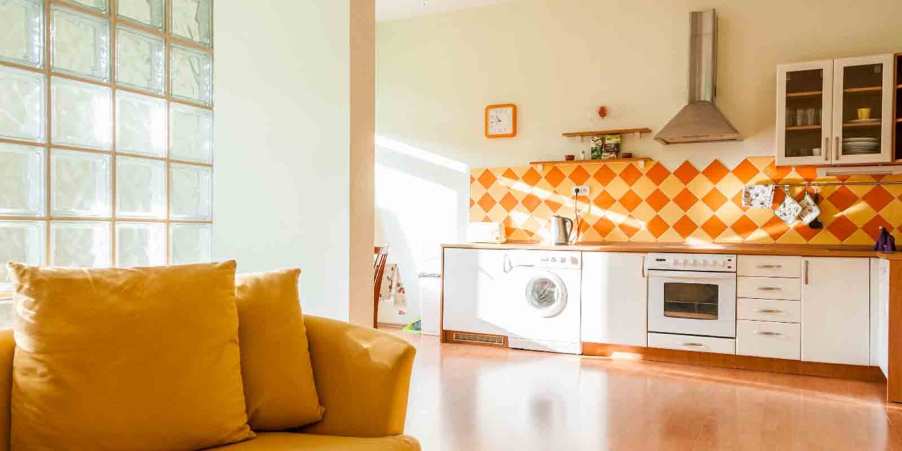
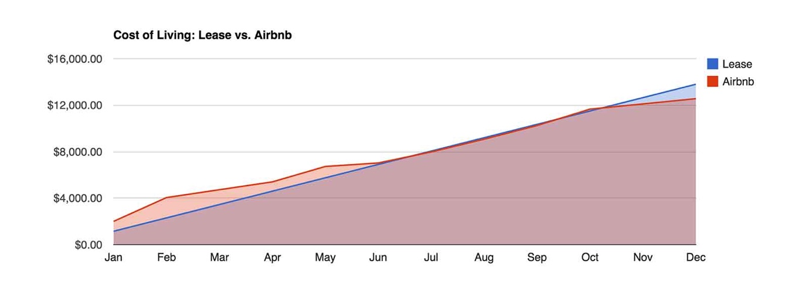

import { Image } from '$components';

If you needed to cut your expenses by, say, about a thousand dollars each year,
how would you go about it?

Most people start by cutting back on going out to eat, avoiding online shopping,
or creating a stringent budget to control expenses.

**But it turns out there's a much easier way to cut your expenses by 10% or
more: _start traveling the world_.**

<Image  credit="Jason Lengstorf">

  

</Image>

## How Living Abroad Is Cheaper than a Lease

To understand why it's cheaper to live abroad, let's do some quick math.[^math]

Start by making a list of all the bills you pay that are related to your living
arrangement.

As an example, when I lived in Missoula, Montana — which has a pretty low cost
of living — my bills looked like this:

1. Rent: $675
2. Electric: $100
3. Gas/Water/Sewer: $35
4. TV/Internet: $125
5. Renter's Insurance: $25
6. Biweekly Cleaning Service: $160[^cleaning]

So, all things included, **I spent $1,120/month to live there.**

## The Secret of the Shared Economy

When you decide to leave your lease behind and start traveling permanently,
something magical happens: **all the extra bills go away.**

<Image
  caption="This <a href='https://www.airbnb.com/rooms/4500253'>apartment in Prague</a> costs less than $700/month — wifi and utilities included."
  creditLink="https://www.airbnb.com/c/jlengstorf?s=8"
  credit="Airbnb"
>

  

</Image>

When you search for an apartment in Prague for a month on Airbnb, there are more
than 300 results under $1,120/month.

"But wait," you say, "your rent was only $675 before — isn't that _way more expensive_?"

It's cheaper,[^cheaper] and here's why:

**When you rent a place through the shared economy, all of the additional costs are included.**

Renting an apartment in Prague for $900/month _includes_ electricity, internet, utilities, and sometimes even a regular cleaning.[^airbnbcleaning]

So that $900/month means $900/month. Not $900 plus a bunch of extra living costs.

## What If I Want to Stay in Manhattan?

Some places are extremely expensive to live. If you want to spend a while in Manhattan, London, Sydney, or other cities with a high cost of living, it can be challenging to find something lower than $1,120/month.

But here's the thing: **it can still be less expensive than your lease.**

## Taking Advantage of Averages

For argument's sake, let's assume the place in London costs $2,000/month. You're out of pocket an additional $850 for the month over what you would have spent in your lease.

You can make this affordable, though: **take advantage of less expensive places to offset costs.**

For example, you can spend as little as $300/month for a [place to live in
Chiang Mai, Thailand][2] — this is a place with wifi, air conditioning, and all
the amenities.

If you were to spend half your year in low-cost cities like Chiang Mai and
Prague, and the other half in more expensive cities, you might schedule
something like this:

* January and February in London.[^london]
* March through May in Prague.
* June and July in Chiang Mai.
* August and September in Barcelona.
* October in Paris.
* November and December in Ho Chi Minh City.

Using [Skyscanner][3] to determine the cost of flights, and [Airbnb][4] to
determine the average cost of renting a place for a month, this comes out to an
average $1,040/month.

<Image caption="Over the course of a year, living expenses end up lower when traveling.">

  

</Image>

This is a savings of about $1,000 for the year when compared to my costs in
Missoula.[^sf]

And it's not just a $1,000 savings.

**You're saving $1,000 by traveling to 6 countries instead of staying in Missoula, Montana.**[^mt]

## You Can Save Tons of Money by Traveling the World

It sounds completely counterintuitive, but it's true: you can save a _ton_ of
money by giving up your lease and renting apartments from sites like Airbnb
around the world.

To recap: once you've factored in the rest of the costs of living there, **a
$675/month lease in Montana is more expensive than renting apartments around the
world for a year.**

This isn't the result of a complex scheme to save money. It doesn't even require
making sacrifices. I've been living quite comfortably in Chiang Mai for a month,
and I've spent less than a thousand dollars _total_ since I've been here.

So remember: the next time you need to save up for a big expense, consider the
traveling the world.

[^math]:
  Yay! Math!

[^cleaning]:
  I hate cleaning toilets and scrubbing floors, so I build the cost of a biweekly cleaning into my rent. If you haven't tried this, I can't recommend it highly enough — _especially if you live with someone else._

[^cheaper]:
  Also worth noting are the more than 20 listings under $675/month.

[^airbnbcleaning]:
  If the cleaning isn't explicitly covered, you can usually negotiate a small additional fee to add that in before you finalize the stay.

[^london]:
  Actually, don't go to London in January unless you like being cold and damp.

[^sf]:
  The numbers get crazier: someone living in San Francisco, where the median rent is about $3,000, would save about $28,800 each year by traveling the world. That's fucking nuts.

[^mt]:
  Montana is wonderful. . .for 3 months each year. The other 9 are something [like this][5].

[2]: https://nomadlist.com/chiang-mai-thailand
[3]: http://www.skyscanner.com/
[4]: https://www.airbnb.com/c/jlengstorf
[5]: http://i.imgur.com/iexMg46.jpg
