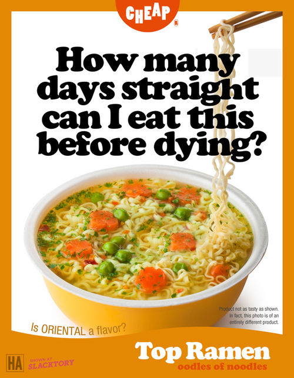
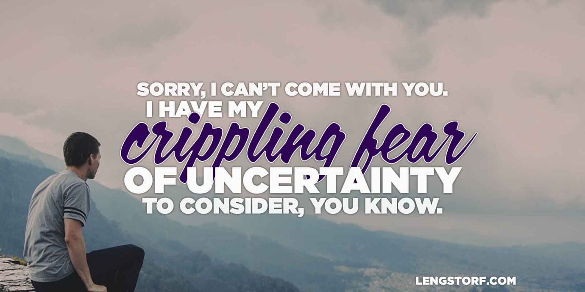

import { Image } from '$components';

There's a lot of guilt packed into our culture. We hear phrases like "hard work
and sacrifice" tossed around to describe virtuous lifestyles.

**We're trained to feel ashamed of having a good time.** We can only allowed to
enjoy ourselves for an allotted number of vacation days — any further enjoyment
is a sure sign that you don't give a fuck about The Future.

> "Hey, would you like to come on this trip to Costa Rica with us?"
>
> "Sorry, I can't. I have The Future to consider, you know."

But what good is that sacrifice, really? **Does the decision to suffer today for the sake of The Future actually result in a better future?** Or are we just depriving ourselves because we've been told it's the right thing to do?

## Sacrifices Make Sense — Sometimes

Certainly some sacrifice is a good thing. But how do we tell the difference between a sacrifice that will benefit us and a sacrifice that just makes us miserable for no reason?

<Image align="right" caption="#thestruggleisreal">

  

</Image>

When I was building my business, I took a contract that barely covered my living expenses, quit my day job, and bought a pallet of ramen.

I made the decision to sacrifice my short-term comfort for the potential to significantly improve my life in the long run. **I felt comfortable making this sacrifice because there was a concrete goal, a timeline, and a measurable outcome.**

I wanted to be self-employed (concrete goal). I had three months (timeline) on the contract to either make a livable wage (measurable outcome) — or decide I would be better off hunting for a new employer.

By making this sacrifice, I was able to make the jump from moonlighting as a web designer to working as a full-time freelancer — and this has paid me back many times over since.

## Base Decisions on Tangible Criteria

We should all be aware of what our later years will hold. But we _shouldn't_ be blindly denying ourselves enjoyment today for the sake of The Future.

In order to avoid making unnecessary sacrifices for The Future — and to avoid making decisions that could negatively affect our _real_ future — **we need to define what The Future actually looks like.**

This could be a standard of living, an [exact dollar amount][1], or whatever you decide your future will require — it just needs to be concrete. Make sure it's not, "I want to be able to live comfortably." What does "comfortably"
mean?[^comfort]

If you defined your future as requiring, say, $60,000/year for retirement, and you want to retire at 67, then you'd need to put a plan in place to save at least $1.5M between now and your 67th birthday.[^simplified]

**By creating a plan, you now have a concrete goal with a timeline and a measurable outcome.**

## Do Whatever Doesn't Interfere with the Plan

Once you have a real plan, anything that doesn't affect it is fair game.

Want to go on a trip, see a concert, or blow off work for the afternoon to visit your friends? Do it, as long as it's not to the detriment of your plans.

When we have a clear plan, the guilt and uncertainty associated with The Future goes away. We can now test the things we want now against the things we want later — and I think we'll all be shocked by how rarely the two are opposed to each other.

<Image caption="This is what we’re saying when we turn down the things we want “for The Future”.">

  

</Image>

## Keep the Future in Context

**Without context, The Future is just a foggy, looming uncertainty.** It has nothing to do with our comfort or wealth in years to come — it's just a nagging fear that we don't know what's next, so maybe we should hedge our bets.

We'd be better off calling it The Crippling Fear of Uncertainty.

> "Hey, would you like to come on this trip to Costa Rica with us?"
>
> "Sorry, I can't. I have my Crippling Fear of Uncertainty to consider, you
> know."

Living the lives we want to live today is certainly a threat to The Future. But **to a well-considered plan for the future, our happiness is no threat at all.**

So we have to ask ourselves: are we holding back because this sacrifice will have a measurable impact on our plans for the future? Or are we just scared of The Future?

[^comfort]:
  For me, that might mean a house made out of hammocks where I'll be fed various morsels of imported cheese by an extremely well-trained octopus. Your "comfortable" living situation may vary.

[^simplified]:
  This is an incredibly simplified approach to saving money for retirement, and it's most likely wrong. Please do research and talk to a professional about your own retirement plans.

[1]: http://money.cnn.com/calculator/retirement/retirement-need/
