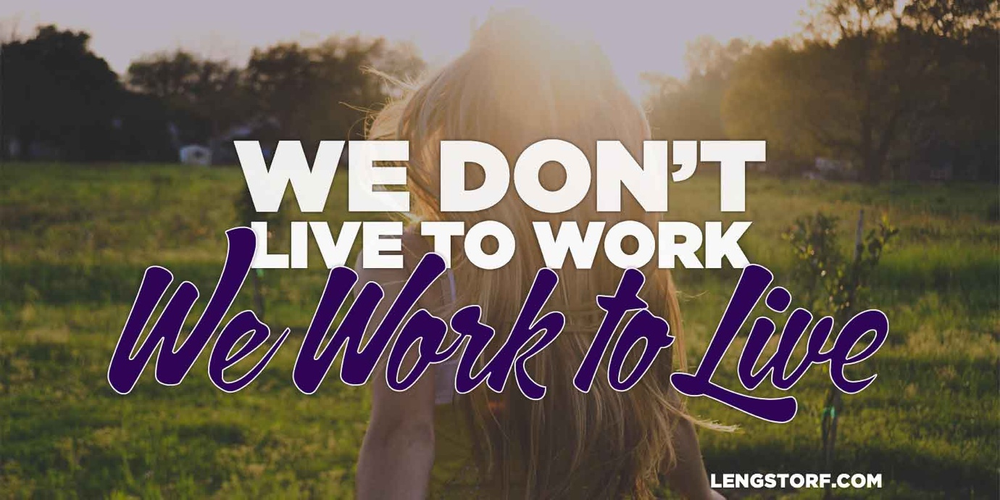

import { Image } from '$components';

It can be hard to remember that we don't live to work.

Cultural pressure is high to have a good job, and to work hard in that job to
get a better job. To make more money so we can buy more stuff. To work the
hardest and [sacrifice][1] the most.

We stigmatize leisure as the mark of someone who won't get far in life. We
furrow our brows disapprovingly at the high school graduate who wants to take a
year or two off before deciding what to study in college (or whether they should
go at all). We look down on the smart kid who works a part-time job because he's
"not living up to his potential."

But what does all that really mean? Do leisure time, taking a break to [find
yourself][2], and working just hard enough to get by really signify a problem?
Or are we uncomfortable with the idea of valuing something else over work?

It can feel a lot like the latter in most cases.

But here's the thing:

**We don't live to work.**

**_We work to live._**

<Image caption="What are you working for?">

  

</Image>

## We Work to Have Freedom

When I was eleven, I wanted a [Nintendo 64][3] in the worst way.

But at $200, my chances were slim. I got a weekly allowance of $10, so by my
estimation it would be a thousand years before I'd saved up enough to buy one.

I had to beg my parents and promise that they'd never have to buy me anything
ever again[^begging] in order to get one.

[^begging]:
  "You never have to buy me anything, ever again!" was recently ranked #14 on the _Top 100 Phrases Children Don't Fully Understand_.

When I was 14 I got my first job washing dishes at a local restaurant. My first
paycheck blew me away: I'd made over $160[^suckit] in just two weeks!

[^suckit]:
  Suck it, allowance!

When the next gaming console rolled out, I didn't have to beg anyone for it — I
could buy it with my own money.

**The freedom that I felt when I made my first big purchase with money I'd earned at my job was intoxicating.** I knew I never wanted to be stuck begging for the things I wanted again.

### Work Shouldn't Rob Us of Freedom

We work to remove the limitations that exist when we can't afford to do the things we want and need. **Income gives us the ability to choose what's best for ourselves, rather than being beholden to someone in a position of power over us.**

If we [let work become the dominant force][4] in our lives, we start to give
away that same freedom we've worked to gain. Only this time it's not a shortage
of income that shackles us, but a shortage of time.

If we're trading our freedom for higher wages, or for career advancement, or for
anything at all, really, we're actively undermining one of the core principles
of work: **we work so we have the freedom to choose.**

## We Work to Have Purpose

I recently visited the [Elephant Nature Park][5], run by Lek Chailert, a tiny
woman from a rural part of Thailand with deep reverence for elephants.

As an adult, she works hard to rescue abused, disabled, and unwanted
domesticated elephants and raise awareness about the rapidly disappearing
elephant population and mistreatment of elephants as livestock.

She's found purpose in her work — or maybe it's better to say she found work in
her purpose. It's clear that she finds her work incredibly important and
fulfilling.

**Even if our work isn't our main purpose, it provides a means to pursue that purpose.** To quote the words of modern-day philosopher Jay-Z:

> I can't help the poor if I'm one of them, so I got rich and gave back, to me
> that's the win/win.
>
> **Jay-Z, [_Moment of Clarity_][6]**

### Work Shouldn't Rob Us of Purpose

**By working, we create the opportunity for ourselves to apply time, money, and effort on the things that we think are most important in life.**

When we let work spill over into our personal lives, the means to pursue our
passions begins to diminish. We don't have the energy to go after the things
that we used to consider most important — we're too exhausted from working, too
preoccupied with meaningless metrics, or too worried about moving up the
corporate ladder.

When we let our work displace our purpose, we start to lose steam, and the
results can be disastrous: midlife crises, depression, a sense of
purposelessness.

## Work Is a Tool, Not a Burden

We work because we want to live better lives, and to do that we need to have a
way to make an income. For most of us, that means a job.

Work is a tool that gives us access to meet our needs and fulfill our various
wants. And when it's treated like a tool, we're able to control our efforts in a
way that creates a better life for ourselves and our loved ones.

But if we lose sight of what's important to us, work can become the sole focus
in our lives — it's no longer a tool, it's a burden that prevents us from doing
what we want to do.

We have to remember that we weren't put on this planet to punch a clock and die
on a pile of money; **we were put here to live.**

So repeat after me:

**We don't live to work.**

**_We work to live._**

[1]: /sacrifice
[2]: /growing-up-vs-growing-older
[3]: http://en.wikipedia.org/wiki/Nintendo_64
[4]: http://bit.ly/1OQ2Oe3
[5]: http://www.elephantnaturepark.org/
[6]: http://genius.com/9545/Jay-z-moment-of-clarity/Since-i-know-what-im-up-against-we-as-rappers-must-decide-whats-most-important-and-i-cant-help-the-poor-if-im-one-of-them-so-i-got-rich-and-gave-back-to-me-thats-the-win-win
