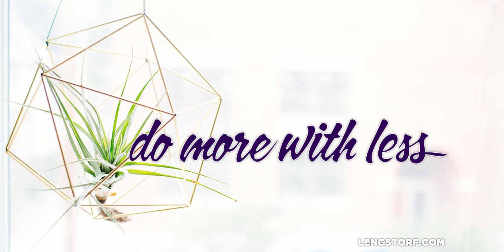

import { Image } from '$components';

"You're serious? I can just. . .take whatever I want?"

I nodded.

The pile of stuff in the corner of my apartment was huge. A drill I'd only used
once sat on top of a box full of cables I didn't realize I still had. An empty
TV stand was littered with basically-new kitchen utensils and three different
wifi routers. A full set of throw pillows I found in a closet sat on top of a
toolbox full of art supplies I hadn't opened since I dropped out of college.

My neighbor had responded to a message I sent out to the building announcing a
giveaway. I've never met this woman before. I'm assuming we live in the same
building, but I can't recall having seen her before — but then again, I'm not
usually one to notice people passing by unless they're holding food.

She picks out some kitchen utensils, a whiteboard, and a package of AA
batteries.

"You're sure? Anything?"

"Absolutely," I reassure her. "You're doing me a favor by taking this. Honest."

She leaves with her armload of booty, looking over her shoulder at me as if I'm
going to change my mind and tackle her.

Later, Marisa arrives with her own pile of stuff. A few hours later our friends
arrive at the going-away-slash-holiday party we've arranged so we can see
everyone before we leave the country the following Tuesday.

Our friends all have the same bewildered look my neighbor wore when we start
shoving our possessions into their arms.

The next day, Nicole from the cleaning service arrives to do the move-out clean.
I tell her to take anything she wants, and I'm delighted to see that she wants
pretty much everything. She borrows the hand truck from the building to take a
few loads out to her car.

We take everything that's left and load it into Marisa's trunk. At the donation
drop, a man opens the door for Marisa.

"What a lovely day it is! What a lovely day to be alive! And how are you?"

Marisa loves this guy. He's a bit disheveled and wild-looking, like James
Brown's mugshot, and has the best attitude I've ever seen.

"Wow! Look at all this great stuff! Miss, you have excellent taste in movies —
see this one right here? I _love_ this one right here!"

He runs a cheerful commentary the whole time he helps us unload the trunk.
("This is a fantastic coat! I may have to buy this coat! You think it'll fit
me?") His attitude is contagious. ("My oh my this blanket is _lovely!_ If I had
this blanket and a mugful of hot cocoa I'd be the happiest man on Earth.") As we
pull out of the lot, waving, Marisa and I are wearing wide grins.

Our next stop is a used car dealer, who buys Marisa's car. He surprises her by
offering more than she had expected for it.

Later, lying on the floor of my now-empty apartment, staring at the entirety of
my worldly possessions in two small bags against the wall, I didn't feel the way
I'd expected to feel. I thought giving away all my things — possessions I'd
carefully curated over the last few years — would feel like losing a limb. There
was the art I'd collected from local cafés that showed my aesthetic preferences.
The couch I'd had custom-built that was wide enough for four people to sit on
and deep enough for two people to spoon. The bar full of all my favorite spirits
and the proper glasses to serve drinks that announced to the world I was a
whiskey kind of guy.

**I thought I'd feel empty.** I thought the absence of my things — this stuff
that turned my insides out — would leave me hollowed out, back at Square One.

**But I felt exactly the opposite.**

I looked down on the sum total of everything I owned with an incredible feeling
of lightness.

This tiny pile of clothes and electronics was all I had to worry about. The
internal pressure I felt to make sure my actions matched up with the material
presentation I'd constructed — "is my attitude right now the attitude of a man
who owns Herman Miller furniture?" — dissolved. My external pressure was gone; I
only needed to make sure my actions matched up with the way I believed a man
like me should act.

<Image>

  

</Image>

## Minimalism, Without the Bullshit

I try pretty hard to avoid labeling myself — I don't want the actions of a group
I don't control to affect how people perceive me — so I don't call myself a
minimalist. But the core idea of the minimalist lifestyle does align with how I
see the world:

> Minimalism is a lifestyle that helps people question what things add value to
> their lives. By clearing the clutter from life’s path, we can all make room
> for the most important aspects of life: health, relationships, passion,
> growth, and contribution.
>
> [**The Minimalists**][1]

## Dropping Dead Weight

The way I see it, **every single thing we add to our lives, both physical and
psychological, adds a tiny bit of extra weight that we have to carry around.**

My operating view of the world is that my _actual_ self — the part that makes me
a free-thinking, individual entity — is very small and virtually weightless.

As I experience the world, the things I do form memories, associations, and
predictive models that help me navigate the world. These are the building blocks
of my identity. I once threw up after eating cooked spinach from a can, and now
I don't like cooked spinach at all. I learned from my dad to always try to
understand why things work, so I'm a shitty employee because I second-guess my
bosses at every step of the way.

These experiences make me into the person I am today, informing my personality
and worldview, but each one adds a little weight to my identity.

To express my identity, I build a model of the kind of person I want to be seen
as. I want to be seen as successful, so I only want to buy nice things. I want
to be seen as discerning and stylish, so I only buy clothes and furniture with
designs that have stood the test of time.

These possessions echo my experiences and reinforce them. If I thought I was a
whiskey guy before I put a bunch of effort into finding a bottle of Black Maple
Hill, I was _really_ a whiskey guy once I had that bottle in my bar.

The added weight of the material possessions and emotional biases on my
decisions made it hard to be objective. **Instead of asking, "What's best in
this situation?" I'd find myself asking, "What would a guy like me do here?"**

## Cutting the Crap

**When I pushed all of the possessions out of my life that weren't essential for my daily life, it became easier for me to make objective decisions.**

Before, my plans to travel the world came with caveats: I'll have to find a
place to keep my Dordoni Worktop Table — I love that table — and my art
collection will need a storage unit with climate control.

I could do what I wanted, but only after I'd made sure to take care of all my
crap.

Once those things were gone, I could weigh my options objectively and make
quick, agile decisions.

Do I want to go to Madrid? Well. . .sure. Let's do it.

No conditions or caveats — I can just pick up my two small bags and go with no
guilt, no worries, and no hassles.

## People Like Me

Of course, I haven't reduced my essential self back down to its weightless
state. I've only changed my view of [what "people like me" do](/no-one-is-coming-to-save-you); instead of thinking of myself as the
kind of person who owns nice things and drinks good whiskey, I've written a new
description for myself.

**I'm the kind of person who values experience over things and doesn't worry about material possessions because they add stress instead of happiness.**

I'm not enlightened, superior, or even better off; I've simply traded one
guiding philosophy for another.

However, this transition has allowed me to pursue the things I find meaningful.
My old guiding philosophy was holding me back, but I couldn't see it — the
threat to my view of "people like me" was blocking me from seeing that I could
be happier by trying a different outlook.

## Are People Like You Holding You Back?

Separating ourselves from our experiences is _hard_ — there's no denying it.
There's a reason people dedicate their whole lives to meditation.

But we don't need to reach enlightenment to try and spot our own biases.

**One of the easiest ways to catch ourselves being owned by our emotional and physical crap is to ask what we'd advise our friends to do if they were facing the same decisions.**

Imagine a friend came to you and asked, "I've got this opportunity to [travel
the world][2] while still making a living, but I'd have to sell all of my stuff
in order to do it — what should I do?"

You've known your friend has wanted to travel as long as you've been friends.
What would you tell your friend to do?

You're facing the same opportunity to travel right now. What would you tell
yourself?

**If your answers are different, you're probably letting your physical and psychological dead weight get in the way of making objective decisions.**

It's hard. You have to be really honest with yourself. You'll need to face some
uncomfortable personal demons. But think of everything you stand to gain by
freeing yourself from the useless burdens you carry around — both in the closets
you haven't opened since you jammed your box full of "just in case" shit inside,
and in the biased corners of your mind that hinder your ability to act
objectively.

[1]: http://www.theminimalists.com/pitch/
[2]: /remote-work-travel
