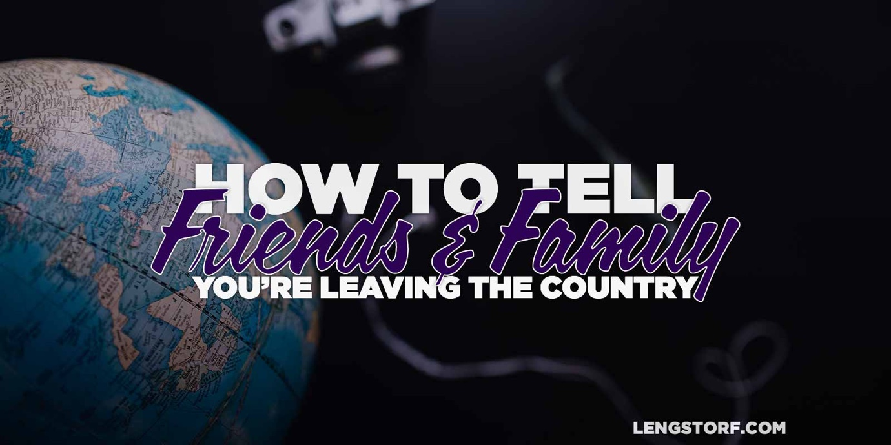

import { Image } from '$components';

Once you've made up your mind to spend an extended period of time traveling, and
figured out how to make your income location-independent, you're ready to face
one of the toughest challenges you're likely to come up against: **figuring out
how to tell your family and friends you're leaving.**

## People Are Resistant to Things They Don't Understand

The most common reaction to things we don't understand is fear. And typically,
**fear leads us to assume that the thing that scares us is bad.**

There's a very good chance that going nomadic is going to be _completely fucking
foreign_ to nearly everyone you know, and reactions will range from the
lukewarm[^lukewarm] to the outright hostile.

My mom, who has spent the majority of her life in Montana, worried that I'd be
kidnapped by terrorists, killed by food poisoning, locked up in a foreign prison
for being "too American" — her list of potential calamities was virtually
endless.[^realmom]

But really, my mom is excited[^mom] about what I'm doing.

<Image>

  

</Image>

## Educate Whenever Possible

With the people we're closest to, most of the objections are coming from a good
— albeit misguided — place. They worry we're putting ourselves at risk in some
way, and they're trying to caution us against making mistakes that could haunt
us.

**Our loved ones will likely make objections based on their fears about world travel and what other countries are like. To combat this, be ready to present evidence that proves their concerns are unfounded.**

If they're worried you can't afford to travel, show them how it's [significantly
cheaper to live abroad][1].

When they bring up safety, let them know you're about [60% less likely to get
murdered][2] anywhere in Europe or Asia as you are in the United States.

And if they talk about stability — well, you're not exactly looking for the kind
of stability they're pushing on you, so you'll just have to agree to disagree
for now.

## Remind Them that Nothing Is Forever

Because humans are [horrible at being rational][3], we tend to assume that every
decision we make will affect us forever. This, of course, is completely untrue —
but we need to remind our family and friends of this.

I'm traveling now, and I love it. At the moment I can't see an end to my
travels, because my list of places to explore seems to be getting _longer_ as I
go along.

But I remember a time not that long ago when I believed I'd be a touring
musician forever. I remember when I told myself I'd live in Portland
forever.[^portland]

And in every case, I grew and gained experience, my goals evolved, and I found
that what I thought I wanted forever was really just what I wanted for that
period in my life.

In this period of my life, I want to travel. I fully expect that in the future —
whether that's in two weeks or twenty years — I will decide that I'm ready to
stop traveling and be in once place for a while.

**Every plan, no matter how permanent it may feel at the time, will evolve over time and — most likely — change entirely as our experience shifts where we place importance in our lives.**

This decision to travel isn't you saying goodbye to your family and friends
forever. It's just you traveling for now, and — if you remind them that nothing
is forever — they should support you doing the thing that feels right to you.

## Suggest Get-Togethers in Fun Places

I don't visit my parents often. It's not because I don't love my parents — I do
— but rather because my parents live in Whitefish, Montana, which is a small
town without much to offer unless you're going fishing, hunting, or skiing.

I left Montana to get away from the snow and the boredom I was dealing with
there.

I used to love when my parents would visit me in Portland, though. I always had
a list of things to do that was too long for the few days they'd be in town, and
I'd always look forward to their next visit.

**When you're traveling, you can easily put yourself in locations that are ideal for spending quality time together with loved ones.** If you would usually take a week to hang out with your family each year, why not spend that week on a beach in Costa Rica?

### Or Plan to Visit Home

Even if you're trying to take advantage of the Foreign Earned Income Exclusion
for your taxes, you have about a month each year to be home, which is actually
more time than I usually spend with my family in an average year.

**For those of us who don't live in the same town as our parents, it's likely that we could spend _exactly the same amount of time together_ each year while traveling the world.**

## Remember That the World Is Flat

Video calling has changed the world in a way I didn't fully grasp until I was on
the road.

Apps like Google Hangouts, Skype, Facetime, and [Talky][4] have created a world
where talking to someone face-to-face is easy no matter where in the world you
are.

In addition to the odd phone call to friends and family, I usually jump on a
video call with someone I care about once a week or so to catch up. As a result,
I don't feel disconnected or lonely — it's strikingly similar to the way I used
to meet a friend for coffee when we were in the same city.

**Your loved ones won't miss you _nearly_ as much if you set up regular video chats.** If you have people in your life who struggle technically, sit with them before you leave to show them how the calls work.

## Give Them a Little Tough Love

Sometimes — despite all the pushback from those close to you — you just have to
do it anyways.

**Even if it's tough, sometime you'll just have to sit someone down and say, "I love you, and I know you're not comfortable with what I'm doing, but this is what I believe is the best thing for me. I need to see this through."**

## Trust Yourself to Know What's Best for You

**Life boils down to our pursuit of happiness, and very few people will be truly unhappy to see you doing something you love.**[^unhappy]

If you know that you want to give the digital nomad lifestyle a try, stick to
your guns and be willing to defend it to your family and friends. They don't
need to understand completely, or even to fully agree with what you're doing —
they just need to know you still want them in your lives and that you're not
going to disappear.

Once they see how happy you are in your new lifestyle, they'll be hard-pressed
not to understand your excitement.

Hell, I'm still holding out hope that my dad will be convinced to leave the
United States and visit me in Europe next year.

And if I can get my dad to entertain the idea of a trans-Atlantic flight to a
country where smoked brisket isn't readily available, well. . .I believe
anything is possible.

[^lukewarm]:
  "Oh, that's. . .great. I always wanted to travel, but, y'know, I have [The Future][5] to think about."

[^realmom]:
  I give my mom a lot of shit because she tends to worry quite a bit. She's got no problem with me traveling the world — just don't tell her I'm not wearing the flak jacket she bought me.

[^mom]:
  Jason's mom here. No I'm not. Please come home soon.

[^portland]:
  This would have been shortly after I first tasted the foie gras bon bons at Le Pigeon, I believe.

[^unhappy]:
  And, honestly, if someone is unhappy because you pursued your own happiness, how much value are they really adding to your life?

[1]: /cost-of-living-remotely
[2]: http://en.wikipedia.org/wiki/List_of_countries_by_intentional_homicide_rate
[3]: http://en.wikipedia.org/wiki/List_of_cognitive_biases
[4]: https://talky.io/
[5]: /sacrifice
