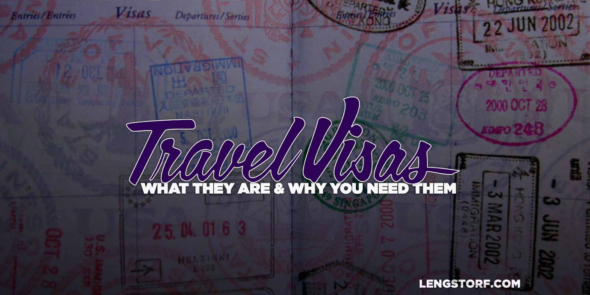

import { Image } from '$components';

If you're anything like me, travel visas haven't crossed your mind at all as
you've been preparing to leave the country.

It was only a month or two out from my flight out of the US — well after I
initially booked the ticket — that I realized I needed to worry about visas.
Since I'd never left the United States for more than a few weeks before, the
idea of what travel visas are and why anyone might need a travel visa just
hadn't occurred to me.

This article assumes you're in the same boat and have never really given much
thought to travel visas. In it, we'll discuss **what travel visas are, the
methods I'm using to travel from country to country on tourist visas, and visa
options for travelers who want to stay in a country longer than a few months.**

## What Are Travel Visas?

To hugely simplify the concept, a visa is a kind of permission slip from a
foreign government to be in the country. An international hall pass, so to
speak.

**Before you can legally enter a foreign country, you need to obtain a visa.**

<Image
  creditLink="https://www.flickr.com/photos/hjl/101443399/"
  credit="hjl"
>

  

</Image>

In some cases, this is easy: when you're getting a tourist visa, for example, an
agent from the country your entering will simply ask why you're there — maybe
asking a few questions about your reasons for being there and when you're
leaving — before stamping your passport with a tourist visa.

In other cases, it's pretty complicated: to get a [non-lucrative residence visa
in Spain][2], for example, you'll need to submit a criminal history, doctor's
note, your fingerprints, a valid passport, and an application form (and fee) —
all verified with something called an apostille.[^apostille]

Visas all carry certain restrictions on what you can and cannot do while in the
country. They're all valid for a limited period of time, which varies widely
depending on the country; some visas are only valid for a month, while others
are valid for a year or more.

You'll need to do some research before each trip to make sure you know what kind
of visa you'll need to obtain to make sure you stay out of trouble while
traveling.

## Tourist Visas Are the Way to Go

For my purposes, tourist visas are the best solution for several reasons:

1. **I am not working _in_ the countries I visit.** I make all my money from US-
   and Canadian-based companies, who pay into a US-based bank account. My
   physical location has no bearing on the work I do.[^prohelp]
2. **When I'm in Europe or Asia, I'm a tourist.** I take no money out of the
   economy, but I do put a fair amount into it by paying for short-term rentals,
   food, and entertainment.
3. **I like to move every 30–90 days.** After I've been in a city for a month or
   two, I find myself slipping into routines instead of exploring — when I hit
   this point, it's time to move on and rekindle my sense of adventure in a new
   city.

**Since I rarely want to stay in a country longer than a tourist visa would allow, tourist visas make the most sense for me.**

I'm also wary of staying in any country long enough to give them a reason to
expect me to pay taxes there. I'm confused enough by trying to pay one federal
government — if I can help it, I'd prefer not to add another to my todo list.

### Not All Tourist Visas Are Automatic

In some countries — Thailand and Vietnam, for example — you can't just show up
and get a passport stamp.

**In order to stay in Thailand for over 30 days, you'll need to [apply for a visa][3].** This is really easy, though: just find a Thai embassy in whatever country you're in and fill out the tourist visa form. There's a small fee — about $30 — and you have to leave your passport overnight. When I applied, I was in and out within 30 minutes when I applied and when I picked up the visa.

In Vietnam, you'll have to [apply for a visa][4] ahead of time as well. I
haven't done this yet, but I'm planning to head to Vietnam once it starts
getting cold in Europe. From what I've read, it's similar to the Thai visa:
**it's not hard, but you have to jump through a few hoops.** I'm thinking I'll
deal with the hassle of figuring out how to get a [visa-on-arrival arranged][5].

## Be Aware of the Schengen Area

Another surprise to me when I first left was the [Schengen Area][6], which is a
collection of 26 countries in Europe that share one entry visa.

**A tourist visa in the Schengen Area is good for 90 days in a 180-day period.**
This means you can only spend 3 of every 6 months in the Schengen Area before
you'd have to apply for a longer visa.

If you're planning to use a tourist visa in Europe, be _very_ sure you're
planning to move between countries in a way that won't get you in visa trouble.

I had originally thought that I'd fly into Italy, stay for a week, head to Spain
(new visa), then jump over to France (new visa), and so on.

In reality, Italy, Spain, and France are all part of the Schengen Area, so after
I landed in Italy, I had 90 days to spend there before I needed to head for a
country outside of it.

The Schengen Area makes European travel tricky, but not impossible. The UK and
Ireland, for example, are not part of the Schengen Area, so you could spend 90
days in Rome, then head to Dublin for three months before jumping back to Paris.

## Options for Staying Longer

If you're interested in staying longer in one place than a tourist visa allows,
there are options.

However, since I've never applied for any long-stay visas, I can't speak to the
process, cost, or difficulty of obtaining these.

Instead, I'll go over some of the methods I've heard about and share links to
articles by people who have actually gone through the process.

### Teaching English as a Foreign Language

**A common option for native English speakers who want to live in a foreign country is to teach English as a foreign language (TEFL).**

I know a couple people who are doing this, and it seems to be a great way to go abroad if you're comfortable making a reasonably large time commitment for what is generally a pretty low wage.

There's a large TEFL community on Reddit, and they've put together a pretty
[comprehensive guide to getting into TEFL][7].

### Becoming a Student

**Student visas, obviously, are for students.**

I've heard rumors of travelers enrolling at "schools" that are essentially
fronts for obtaining student visas semi-legally. That sounds like some shady
shit to me, so I never looked into it.

If you're not actually a student, this visa probably isn't the best idea. If you
are a student, look into the [programs][8] available to get set up with an exchange program (which includes a visa).

### Other Options for Long-Term Visas

If you're not interested in attending classes as a teacher or a student, you
still have a chance.

A popular long-term visa I keep hearing about is the **non-lucrative residence
visa in Spain**. This visa is for anyone who can prove they can afford to remain
in the country for an extended period of time without working — having at least
$30,000 in the bank is a good idea, I've heard. While I don't personally know
anyone who's applied for this visa, I did enjoy reading [Jed's retelling of the
application process][9].

If this seems like the right option for you, [here are the guidelines for
submitting your application][10].

Another option is the **residence permit for freelance or self-employment in Germany**. This one requires residence in Germany, so that may be a deal-breaker. If you're planning to live in Germany, however, you can [start the application process][11]. For a write-up by someone who's gone through the process, [check out Cat Noone's post on Medium][12].

If you're hoping to stay in the Schengen Area for longer than 90 days, [a few loopholes may exist][13], but it sounds like general consensus is that it's just easier to use a tourist visa in most cases.

## Do Your Own Research

As with anything you read on the internet, your results may vary.

**Make sure to verify any information you found in this article** — and any article that's not directly from a visa-issuing authority in the country you want to visit — before making travel plans.

**Visas aren't hard, but you need to know what you're getting into.** Read the official government sites to make sure you know the requirements and time limits, then speak to an expert if you're not 100% sure how to get your visas sorted out.

But don't let this intimidate you. I was nervous at first, but having gone
through the process I can assure you it's less painful than airport security can
be in the US. You'll be fine.

[^apostille]:
  When I first heard about this, I pictured walking down a drafty, torch-lined hallway toward a heavy iron door, behind which a man — sitting behind a large desk, writing with a quill that he dipped in a bottle of something frighteningly similar in color to blood, his face hidden beneath the hood of a heavy, dark cloak — would rasp at me in a voice dripping with evil, "Who dares disturb the apostille?!" The truth, unfortunately, is far less interesting. (It's like a [super-notarization][14].)

[^prohelp]:
  It's worth mentioning that this lifestyle is currently new enough to fall through cracks in the way countries define work, and this leaves a lot of room for interpretation. I'm not an accountant, so you shouldn't take my word for any of this. Talk to a professional if you're unsure; "Jason told me this would work" isn't going to hold up in court.

[2]: http://www.exteriores.gob.es/Consulados/MONTREAL/en/InformacionParaExtranjeros/Documents/Visados%20de%20larga%20duracion/Non-lucrative%20residence%20visa.pdf
[3]: http://www.thaiembassy.com/thailand/thailand-tourist-visa.php
[4]: http://vietnamembassy-usa.org/consular/visa-application-process
[5]: http://www.tripadvisor.com/Travel-g293921-c148049/Vietnam:Faq.Visa.On.Arrival.Voa.html
[6]: http://en.wikipedia.org/wiki/Schengen_Area
[7]: http://www.reddit.com/r/TEFL/wiki/gettingstarted/dummiesguide
[8]: https://exchanges.state.gov/us/find-programs
[9]: http://bucking-the-trend.com/apply-non-lucrative-residence-visa-spain-us-citizen/
[10]: http://www.exteriores.gob.es/Consulados/SANFRANCISCO/en/ConsularServices/Documents/visas/NonLucrative.pdf
[11]: https://service.berlin.de/dienstleistung/305249/en/
[12]: https://medium.com/@imcatnoone/how-to-get-your-german-freelance-visa-without-losing-your-sanity-8fa68b39431a
[13]: http://www.nomadicmatt.com/travel-blogs/how-to-legally-stay-in-europe-for-more-than-90-days/
[14]: http://en.wikipedia.org/wiki/Apostille_Convention
