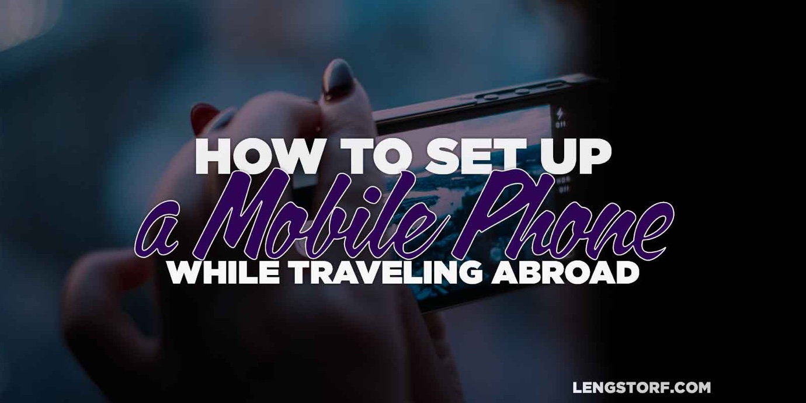

import { Image } from '$components';

Since having a mobile phone is now more or less a requirement for being a
functional member of society, it's important to find a way to get your hands on
a phone while abroad.

The key benefit to having a working phone is access to wireless data, which is
invaluable when you're trying to navigate a new city where the street signs
aren't in English, or if you need to quickly look up how to say "coconut oil" in
Thai.

In addition to the benefits of data, it's nice to be able to receive calls and
texts from your friends and family in your home country.

Through a slightly confusing setup — I'll explain thoroughly, I promise — you
can keep a local number while abroad, complete with text and picture message,
while also setting up a local phone number.

And it's all _way cheaper_ than a mobile contract in the United States.

<Image>

  

</Image>

## Buy an Unlocked Phone with a SIM Card Slot

After you've got your phone numbers and forwarding worked out, you'll need to
have a phone that works in all the countries you want to visit.

Since most US mobile carriers subsidize the cost of phones with contracts, the
phones they sell are locked — this makes them useless if they're not on that
carrier's network and plans.

**To avoid insane roaming fees, you'll have to buy an unlocked phone.** When you
see the cost of an unlocked phone, you'll probably shit your pants — just
remember that when you "buy" a phone with a contract, you're also committing to
about $1,200 in phone bills over the next year, so a $600 phone isn't actually
that expensive.

Make sure the phone you buy allows you to swap out the SIM card, and that it
will work on GSM networks. If you're not sure what that means, do a search for
the phone model you want to buy and whether or not it works in the countries you
want to visit.

I [purchased an unlocked iPhone 6][1], and it's worked in the US, Europe, and
Southeast Asia without any issues so far.

## Buy a Prepaid SIM Card Once You Land

When I found out how cheap it was to have a prepaid SIM in other countries, I
spent a half-hour ranting about how criminal the mobile carrier racket is in the
US.

**Since I've left the United States, I have spent less than $40/month on prepaid voice/text/data plans.** Usually much less.[^uk]

A quick search will point you to several discussions about the best SIM for
whichever country you're headed to.

So far we've used Three in both Italy and the UK, Yoigo in Spain, and TrueMove H
in Thailand. Italy has been the most expensive so far at €35 for a month, and I
think that was mainly because I didn't know what the hell I was doing and bought
a more expensive package than I actually needed.

The easiest way I've found to get a SIM is to **go directly to a retail store** for whichever carrier you choose, then **find the prepaid plan that suits your needs.** (We've been able to find brochures in English almost everywhere, as well as people working the counters who are able to speak English well enough to get us set up.)

A word of advice: **don't leave the store until you've verified that you can get online, make a call, and send a text message.** You probably won't run into any issues, but you don't want to find out an hour later that a step was missed — and you _definitely_ don't want to try and explain what's happened to a different employee whose English is about as good as your Italian.

### Having a Local Number Helps

A benefit that I didn't initially consider when getting SIM cards is the bonus
of having a local number wherever you are.

In Barcelona, we made friends with some locals, and being able to shoot them
texts without anyone spending a fortune was very handy.

In London, calling local businesses to ask if they had something we needed was
an enormous time-saver.

It won't come up often, but when it does, it's great to know you've got that
covered.

### The Data Plans Are Cheap — If You're Reasonable

Data usage is usually pretty cheap, and the allowances are reasonable.

For me, "normal usage" consists of getting directions and looking up places in
Google Maps, checking various social networks once or twice a day, sending a few
photos to my friends via MMS, and occasionally asking Google to settle
debates.[^debates]

If you're live-streaming everything you do through Periscope, your mileage may
vary.

## Staying Connected to Your US-Based Friends and Family

To make sure your loved ones don't have to pay international calling rates to
get in touch with you, you can leverage Google and Skype to make sure you can
still receive calls — just like you were still in the US.

### Get a Google Voice Number

If you're in the US, [Google Voice][2] is a simple option to give yourself a
US-based number that friends can call or text.

With a Google Voice number, you can call or text your friends right from the
Gmail app, as well as from the Hangouts app. **Your incoming calls and texts can
be forwarded to any US-based phone number** — I'll talk about how to work around
this a bit later — or to your email.

You're also able to set up voicemail with custom greetings, call blocking, and
more.

When you use your computer (or the Hangouts app on wifi) **you can make calls
and send texts from your Google Voice number for free.**

This is a great way to make sure your family and friends don't have to contact
you through an app — my parents, I'm sure, greatly appreciate not having to
learn what the hell a WhatsApp is.

### Set Up a Skype Number for Call Forwarding

To work around Google Voice's US-only call-forwarding restriction, **you can get
a [Skype number][3]** for $60/year, which allows you to forward the calls to
international numbers in most countries.

After you've set up the Skype number, **set your Google Voice number to forward to it.** Turn off any of Skype's extra features, like voicemail, to make sure that the call goes through to your phone and your Google Voice voicemail.

Once this is set up, you just have to remember to set the Skype number to
forward to your local number wherever you're staying.

## Staying Connected Is Easier (and Cheaper) than You Might Think

I was concerned before I left that I'd have a really difficult and expensive
time trying to stay connected abroad. I was concerned I'd need to ration my data
usage, tell my friends to stop texting me, and pay a fortune to call home.

But with a little bit of legwork up front, it turns out that **I'll actually _save a shitload of money_ this year over what I was spending to keep a phone through Verizon in the US.**

After seeing the ease of setting it up, and the savings of going prepaid, I'm a
believer; I'll be a hard sell to ever get a mobile contract again.

[^uk]:
  In London I put £15 on a SIM from Three and — after normal use — still had £5 of credit left when I headed to the airport a month later.

[^debates]:
  Recently I've been trying to stop this. Google ruins [the art of bullshit][4], which is half the reason it's fun to debate things over dinner in the first place.

[1]: http://amzn.to/1GyjrWh
[2]: https://www.google.com/googlevoice/about.html
[3]: http://www.skype.com/en/features/
[4]: https://medium.com/funny-stuff/the-fine-art-of-bullshit-c09f7bbb391e
