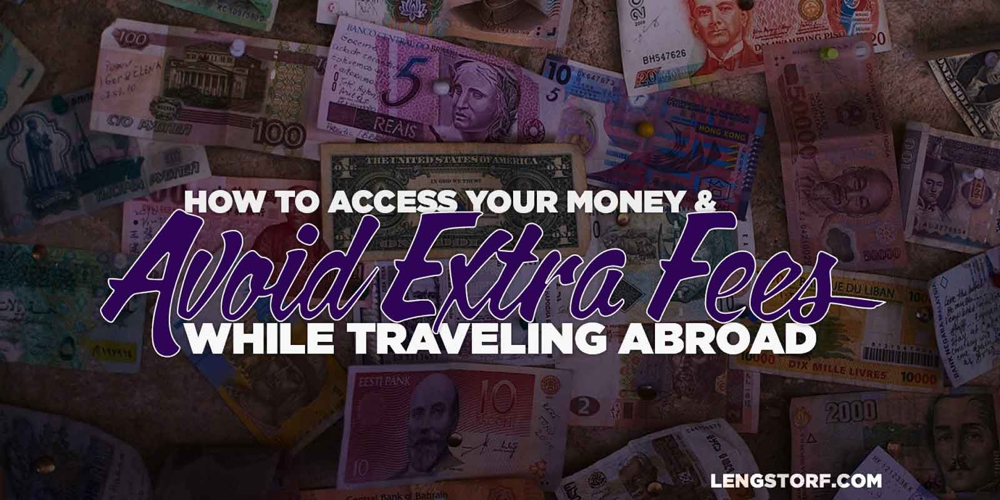

import { Image } from '$components';

Before you leave the country, you’re going to want to make sure that you can
access your money while abroad without paying outrageous fees.

It's your money — you shouldn't have to pay to use it.

By doing a little extra legwork ahead of time, however, you can easily avoid
foreign transaction and ATM fees, as well as set yourself up to _make_ money by
taking advantage of travel-friendly rewards programs.

<Image
  creditLink="https://www.flickr.com/photos/aigle_dore/8273660863/in/photolist-chEwR9-bH1iX8-bt4mNt-42PQoC-a2YSa6-62QVKf-bta55K-82xTtv-5EMAYS-dB7F8e-dK2oa7-aFDjPB-aYWk56-aFATbM-aFAaK6-aFAQEv-PNrwk-84wJAM-QxcaH-apUnh-3q1C3-82zjvr-bZvUDS-2Bvzr6-bta3kH-5rzm-abWteX-7HKuTk-h3Hnof-brd1K2-62LFqP-5dTR5Y-cMnty-dTUAhR-5p8w8o-2BUQXp-7jm7SP-aah9wX-8F5t1j-dSZe91-dUSc9a-a5SwX-dSK3tm-5CeF99-biaRHp-68vjKV-68zxeQ-5TWEfA-9C9vCS-aFAPtx"
  credit="Moyan Brenn"
>

  

</Image>

## Open a Bank Account without Foreign ATM Fees

A quick way to rack up enormous fees is to pull money out of a foreign ATM from
an account that charges foreign transaction fees. A lot of accounts will hit you
with an extra fee of up to $5 for each withdrawal — this is in addition to the
ATM fee itself, which can get spendy ($6 in Thailand, for example).

**Moving your spending money into a checking account without foreign ATM fees will save you hundreds of dollars each year,** because you'll always want to pull out money in the local currency when you arrive in a new country.

I'm only going to talk about the account I use myself, but The Points Guy has put together a good list of [other options][2].

### Schwab Investor Checking

I signed up for the Schwab Investor Checking account because I liked the idea of
an entirely online bank account. They let me deposit checks through my phone,
and I can transfer money to the account from any of my other bank accounts — for
free — using their transfer setup.

On top of this, the Investor Checking doesn't charge foreign ATM fees, the debit
card they send has a chip (more on this below), and they even reimburse the ATM
fees charged at the ATM.[^feereimbursement]

They also have killer chat support if you have questions — I once started out
with questions about setting up an automatic transfer and ended by asking a
bunch of Investment 101 questions. The agent was smart and super helpful; he
even gave me the name of a restaurant to try in Barcelona.

[Get details on Schwab Investor Checking and open an account.][3]

## Keep a "Local" Bank Account

If you get checks in the mail — whether it's from a client, a tax refund, or a
birthday card from your grandmother made out for the age you just turned — it's
sometimes handy to ask your contact person back home (I send mail to my parents,
but you can also get a virtual assistant or your accountant to handle this for a
fee).

For this reason I keep a Wells Fargo account open. I figure that way I can find
a branch anywhere in the US, which means my contact person, or myself if I'm
in-country for some reason, can quickly drop into a branch to deposit a check.

So far I've had very little reason to use this account, but for the once or
twice I have, it's been worth keeping it open.

## Use Credit Cards with No Foreign Transaction Fees

If you're not paying attention, you may get dinged for an additional 3% of
_every_ purchase made outside the United States on your credit card. That adds
up fast when you travel often.

However, there are a large number of credit cards without foreign transaction
fees. In this article, I'll talk about **the two credit cards I actually use.**
For a compiled list of all the cards available, NerdWallet has a [solid
roundup][4].

### Chase Sapphire Preferred

The Chase Sapphire Preferred card is my card of choice when traveling. The
[rewards are great][5], and the annual fee is cheap ($99). So far this year I've
already made enough in rewards to pay back the fee and then some, and since I
pay off my credit card balance in full every month, I'm effectively getting paid
to use this credit card.

There are no foreign transaction fees or currency exchange fees, and the rewards
system is specifically geared toward travelers.

On top of all that, it's a Visa card with a chip, so I've never had an issue
using it to pay — if the business accepts cards, this one will work.

[Learn more about the Chase Sapphire Preferred card.][5]

### Delta SkyMiles American Express

My backup credit card is the Platinum Delta SkyMiles American Express, which has
excellent benefits if you fly Delta frequently. There are pretty sizable mileage
bonuses if you hit set spending thresholds each year — you can get to the Silver
Medallion level almost without getting on a plane using this card — and it gives
you double miles for any Delta purchase, plus 1-to-1 miles-for-dollars rewards
for everything you spend on the card.

With this card's help, I've had Platinum status on Delta for a while now, and
the advantage of priority security line access alone is worth the membership fee
for the card.

In addition, there are no extra fees for using the card abroad — the only
challenge is that it's American Express, so it's not accepted everywhere.

[Learn more about the Platinum Delta SkyMiles American Express card and apply.][7]

## Bonus Tip: Switch to Chip Cards Before You Leave

The United States is behind the rest of the world in credit card security, but
[that appears to be changing soon][8]. The rest of the world, for the most part,
uses chip and PIN cards.

If you're planning to travel outside the US, a magnetic stripe card is likely to
confuse the hell out of the kid making your coffee, so it's a good idea to get
chip cards before you go.

Fortunately, thanks to the impending chip card switch-over in the US, many banks
are already issuing chip cards, and the ones who aren't will probably do so if
you ask.

I called about all of my credit and debit cards before I left, and had no issues
getting a chip card issued in most cases. The exceptions were
Discover[^discover] and my local credit union. The rest of my cards were quickly
reissued — without changing the card number — and I had switched over to chip
cards within a week.

## A Little Upfront Prep Will Save You Hundreds of Dollars

By taking a bit of time to get your money organized in a way that doesn't cost
you extra to access while traveling, you can save yourself a huge amount of
headache (and dollars) once you've set out on your journey.

[^feereimbursement]:
  I think there might be a minimum balance requirement before ATM fees are reimbursed. They don't charge any ATM fees on their end at any point, though.

[^discover]:
  I'm still convinced that the customer service rep I talked to was playing Candy Crush instead of actually researching chip cards.

[1]: https://www.flickr.com/photos/aigle_dore/8273660863/in/photolist-chEwR9-bH1iX8-bt4mNt-42PQoC-a2YSa6-62QVKf-bta55K-82xTtv-5EMAYS-dB7F8e-dK2oa7-aFDjPB-aYWk56-aFATbM-aFAaK6-aFAQEv-PNrwk-84wJAM-QxcaH-apUnh-3q1C3-82zjvr-bZvUDS-2Bvzr6-bta3kH-5rzm-abWteX-7HKuTk-h3Hnof-brd1K2-62LFqP-5dTR5Y-cMnty-dTUAhR-5p8w8o-2BUQXp-7jm7SP-aah9wX-8F5t1j-dSZe91-dUSc9a-a5SwX-dSK3tm-5CeF99-biaRHp-68vjKV-68zxeQ-5TWEfA-9C9vCS-aFAPtx
[2]: http://thepointsguy.com/2014/02/the-top-11-checking-accounts-for-avoiding-foreign-atm-fees/
[3]: http://www.schwab.com/public/schwab/banking_lending/checking_account
[4]: http://www.nerdwallet.com/blog/top-credit-cards/no-foreign-transaction-fee-credit-card/
[5]: https://creditcards.chase.com/credit-cards/sapphire-preferred-card.aspx
[7]: https://www304.americanexpress.com/credit-card/skymiles/25330
[8]: http://www.forbes.com/sites/leoking/2014/10/21/is-the-us-finally-accelerating-a-move-to-chip-and-pin/
