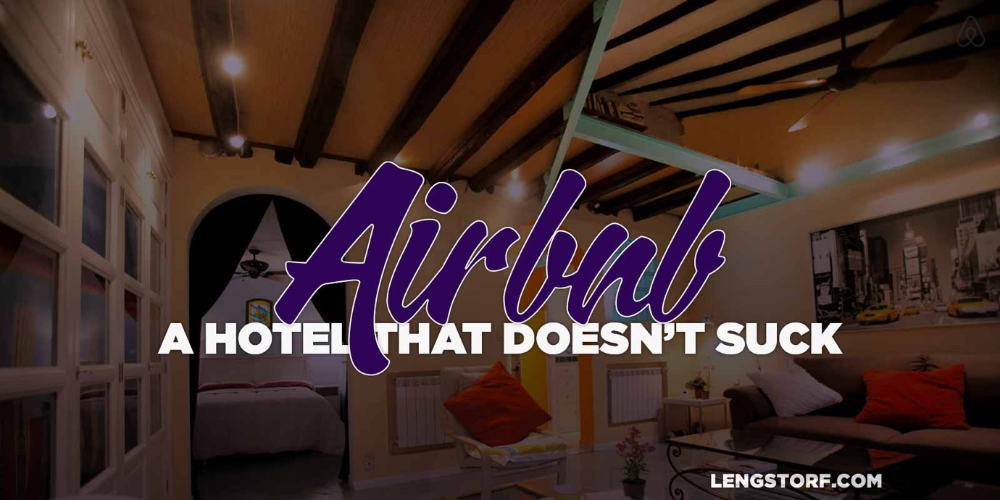
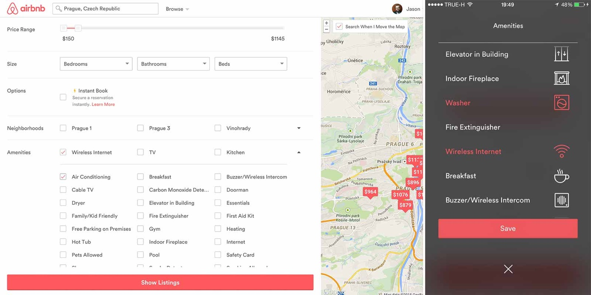
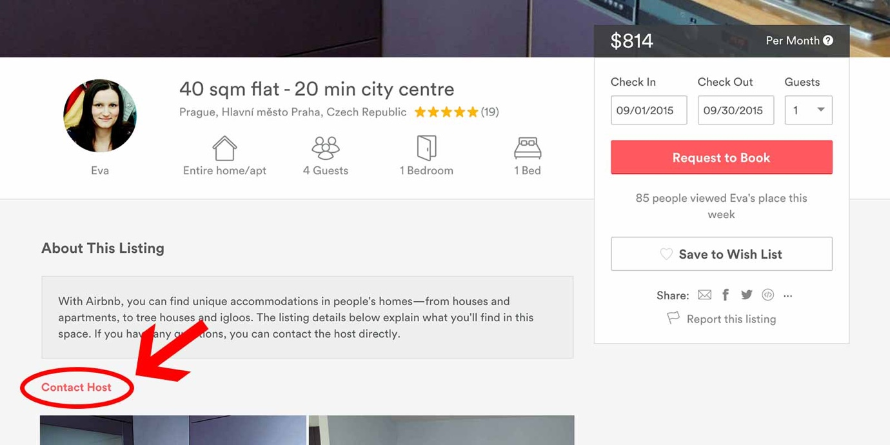

import { Image } from '$components';

[Airbnb][1] is near the top of my list of the greatest things to happen to the
world in the last ten years.

The [sharing economy][2] has made it incredibly easy to save money by renting
other people's unused things. Airbnb and competitors like [VRBO][3] do this by
allowing people to rent out their extra space — from a spare room to an empty
home — to other people.

<Image
  caption="This photo is from a listing I booked in Madrid. (Thanks Enrique!)"
  creditLink="https://www.airbnb.com/rooms/991697"
  credit="Airbnb"
>

  

</Image>

## Airbnb: A Hotel that Doesn't Suck

Finding a hotel that doesn't smell like industrial-strength cleaner is
expensive. And finding one that's comfortable enough to live in for a long
period of time is difficult.

Airbnb offers the ability to find a place to stay that feels less like a filing
cabinet for tourists and more like a _home_.

**(If you've never stayed at an Airbnb before, you can [get $25 off your first rental using this link][1].)**

Getting the most out of Airbnb can be tricky. But it's not hard.

## Define What Matters

Before you start traveling, you'll want to come up with a list of what you need
in order to be happy.

Remember: **long-term travel is very different from a weekend stay.** Something
that might not bother you on a quick trip, such as a shaky internet connection,
will be a big problem if you're there for a month.

Be honest with yourself about what you need in order to feel at home.

For me, the list is pretty short:

* I want an entire place to myself — shared rooms are for very short stays only
* The wifi needs to be fast and reliable — without it, I can't work
* The bed needs to be comfortable and at least queen-sized[^bed]
* Temperature control for the room is essential — I can't sleep when I'm too hot
  or cold
* The location needs to be within walking distance of both good restaurants and
  coffee shops with wifi
* Having a washing machine in the unit is ideal since I only have 5 days' worth
  of clothing (in a pinch, I can do without this)

Everything else is negotiable. By figuring out what my non-negotiable items are,
I can quickly remove options that would stress me out while I was there.

### Set Your Filters Appropriately

Airbnb has a very simple search interface, but if you're not paying attention it
may look like you're only able to search for a date range and what kind of room
you want.

If you click the "more filters" button, though, **you can filter by amenities**
ranging from wireless internet and air conditioning to a gym or a doorman.

<Image
  caption="Airbnb’s amenity filters on desktop (left) and mobile (right) are easy to use."
  creditLink="https://www.airbnb.com/c/jlengstorf"
  credit="Airbnb"
>

  

</Image>

Do you like to cook? Make sure they have an oven.

Traveling with a dog? Check the "pets allowed" filter.

**Using the filters, you can quickly exclude any listings that don't meet your needs.**

### Confirm the Non-Negotiables with the Host

After filtering down the listings that definitely aren't what you're looking for, you'll probably have a few additional items on your list that you need to verify. **Send the host a message to ask any clarifying questions or to verify information about the listing.**

For example, I always verify wifi speed before committing to a place by asking
the host to run a [speed test][5].

Other things aren't selectable by the filters, such as the size of the bed, so
you'll need to check with the host about that as well.

### Get a Feel for Your Host Before You Book

Once you've decided that a place is probably a good fit, Airbnb encourages you
to book immediately — don't do this.

<Image
  creditLink="https://www.airbnb.com/c/jlengstorf"
  credit="Airbnb"
>

  

</Image>

Instead, **use the small "contact the host" link below the "About This Listing" box to send a message to the host** — including the dates you want to book — without making a commitment. You don't want to put money down before you're sure the host is responsive and able to answer any questions you have clearly.

### Read the Reviews

Both the person renting the space and the person who owns the space are
encouraged to review each other after a stay, so you're able to read what fellow
travelers thought about the space.

**Reading reviews can help you spot potential problems before you book.** Keep
an eye out for red flags like issues contacting the host, problems with
amenities that you care about, or comments about the general neighborhood.

The number of reviews (and cumulative ratings) are also a good indicator of
whether you're dealing with someone who frequently has renters or if it's
someone who may lack experience in dealing with guests.

I've stayed with both types of people and enjoyed the space, but there's
something to be said about the comfort of booking a listing with dozens of
five-star reviews.

### Find Your Ideal Hotel-to-Home Ratio

There are certain aspects of the hotel experience that are really pleasant:
knowing your room will be cleaned each day, having fresh towels, and so on.

**If you ask for it ahead of time, you can often arrange to have the good parts of a hotel-like experience in your Airbnb rental.**

One thing to be aware of is cleaning. A lot of rentals don't have a cleaning
service, so if you're staying for longer than a couple weeks, you'll either have
to clean it yourself or work out a deal with the owner to provide cleaning
services.

I usually ask if there's a cleaning service, and if not, I'll **arrange with the
landlord to have the place cleaned every week or two** while I'm staying there.

I didn't do this at my first couple locations, and it sucked. I hate mopping
floors and changing sheets, so I'm more than willing to pay a little extra to
have it done for me.

### Speed Things Up with a Message Template

You can **save time by creating a template for contacting hosts** that
introduces yourself and communicates your non-negotiable items.

For example, here's the message I send to each host before I book:

> Hi!
>
> My girlfriend, Marisa, and I have been looking at your listing, and we love
> it!
>
> We are spending all of 2015 traveling around the world, renting Airbnb
> apartments in the cities we want to visit.
>
> We're both so grateful that people like you have opened your homes to
> travelers, because without you, our adventure wouldn't be possible. So thank
> you!
>
> We're very interested in renting your apartment, but I wanted to ask a couple
> questions first:
>
> First, we both work from our computers and will be working while we travel.
> Since our jobs rely on an internet connection, could you please let us know
> how fast and reliable the wifi connection is at your apartment?
>
> If you're not sure how fast it is, could you please search Google for "speed
> test by ookla" and click the first result? On that site, click the "Begin
> Test" button to check the connection's speed.
>
> Second, since we're planning to stay for an extended period, we're interested
> in negotiating additional cleaning fees so we could have the apartment
> serviced every two weeks. Would that be a possibility?
>
> [ ADD A PERSONAL NOTE ABOUT THE AREA AND/OR THE LISTING HERE ]
>
> Thanks again. We'll look forward to hearing from you!
>
> Jason & Marisa

## Save (More) Money

If you pay $1,500/month in rent, that's about $50/night to stay in your own
apartment. (This, of course, isn't even the [full price you pay to live in your
apartment][6].)

A hotel, by contrast, is probably going to cost at least $100/night unless it's,
well, _gross._

**Airbnb has never failed to find me a place to stay that was cheaper than a
hotel room, and I've nearly always found a place that cost less per night than
my rent in Portland.**

But it turns out you can save even more by being on top of your booking and
taking advantage of Airbnb's price breaks.

### Longer Stays Cost Less

By default, Airbnb shows the cost of a listing per night. For example, at the
time of writing, [this listing in Atlanta][7] costs $82/night if you book it for
six nights.

However, **if you book the same listing for a week, the cost drops** to
$71/night.

**If you book for a month, the cost drops further** to $51/night.

Not all Airbnb listings have breaks for longer stays, but when you search for
longer stays, the ones that offer breaks are easy to spot by their lower prices.

If you can stay put for a month, you stand to save a bundle by taking advantage
of Airbnb's price breaks.

### Book Way in Advance for Better Cheap Options

There's only one of each place, so when it's booked, you're out of luck.

The nice listings with low prices will be the first to go, so if you're sure of
your travel plans way ahead of time, you should **book early to make sure you've
got your pick of the best locations.**

## Airbnb Is the Perfect Solution for Extended Travel

No one wants to spend all their time living in hotel rooms. Using Airbnb is a
great way to live like a local would — after all, you're borrowing a local's
home — and avoid the temporary feeling that can lead to homesickness.

This, in combination with the potential to save _a lot of money_, is why I'm
convinced **Airbnb is the perfect tool for [location-independent][8] workers.**

(Don't forget: [sign up for Airbnb with this link get $25 toward your first rental][1].)

[^bed]:
  I travel with my partner Marisa, and we found out the hard way that one of us — not naming names — is a sleep-puncher.

[1]: https://www.airbnb.com/c/jlengstorf
[2]: http://en.wikipedia.org/wiki/Sharing_economy
[3]: http://www.vrbo.com/
[4]: https://www.airbnb.com/rooms/991697
[5]: http://www.speedtest.net/
[6]: /cost-of-living-remotely
[7]: https://www.airbnb.com/rooms/5234548
[8]: /how-to-become-location-independent
