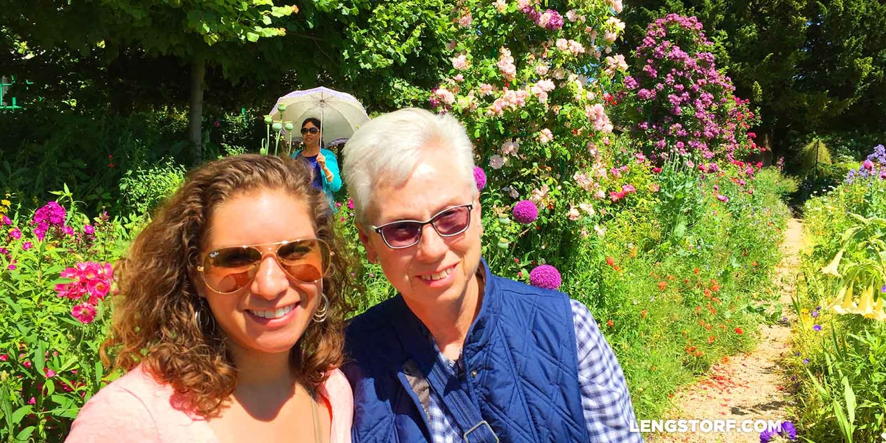

import { Image } from '$components';

In my worst nightmare it goes something like this:

I'm standing somewhere significant. Maybe historical, or cultural, or just
_totally fucking majestic._ The sort of place your well-traveled friends tell
you no but seriously you _have to see it._

It's the sort of moment camera companies have trademarked. Before now the thing
I'm looking at was only an _understanding_ of a place in my head, but now it's
becoming an experience; a memory: the image from Wikipedia grows a Z axis and I
can touch it and there's a smell and now I can give you directions to here
complete with landmarks and everything.

I inhale deeply through my nose. _This is exactly the kind of shit that makes
travel worth—_

My reverie is shattered by a tiny old woman in a sleeveless floral blouse and a
white visor who elbows past me to take a photo of the "Sortie / Exit, Toilettes
/ Washroom" sign.

A British tour group forces me forward, each of them labeled with a neon
Post-It™ note signifying which bus brought them here. A middle-aged woman is
digging in her purse in the middle of the path, preventing anyone from going
around her, which has infuriated her husband up ahead to the point he's now
standing in the middle of the path with his hands cupped around his mouth
screaming _get out of the damn path, Emily, no one can get around you_ as a
queue builds on either side of him.

A Japanese kid is switching out absurdly expensive optics on his DSLR and taking
macro shots of a fencepost, which doesn't bother me except that I know his
photos of nothing are better than any photo I will take in my lifetime.

Behind me, a meaty shoulder or belly or breast presses into the back of my arm,
and in front of me a child who is far too young to have any hope of remembering
this family outing is _melting the fuck down_ because he's the only one of us
sane enough to realize that being here, on this path, in this place, is the
worst kind of hell.

This gorgeous outdoor space starts to feel small, and the press of tourists is
taking all of my oxygen. I suppress the urge to [Barry Sanders][1] my way to the
nearest exit.

<Image
  caption="Monet’s water garden — home to the famous water lilies."
  credit="Jason Lengstorf"
>

  

</Image>

## Fear and Self-Loathing in Claude Monet's Garden

Last Tuesday I lived my nightmare.

In the early afternoon, I climb out the back of a van and into an enormous
parking lot[^village] to join a queue of art- and/or flower-enthused travelers
who've made the trip to get a glimpse of Monet's botanical muses.

We enter through a small gate at the southwestern corner of the property. Inside
the gate, there's a ticket booth and high hedges all around — no peeking, I
guess. Marisa's mom bought some package online that lets us skip the line and
duck through the hedge.

As weather for standing in a garden goes, this afternoon in Giverny is just
about perfect. It's about 20°C under a bright blue sky with what Bob Ross would
certainly describe as "happy little clouds" hovering over the Seine in the
western sky.

<Image
  caption="The view from a hill just outside Giverny, France."
  credit="Jason Lengstorf"
>

  

</Image>

The garden is huge. Maybe a little bigger than a football field[^pitch] and
crosshatched with paths that lead through intensely colorful landscaping that
overflows with flowers I can't identify[^flowers] in colors I didn't know
flowers could be.

Monet's garden is a special place. And not just because it was the inspiration
for a large number of his paintings — this is a place where it just feels good
to _be_ for a while.

### And the Locusts Descend...

Yet, for all the beauty that the garden has to offer, there will be no peace or
reflection here.

By my estimation, roughly 30% of the global population is stuffed inside the
walls of Monet's garden, all jockeying for selfie-space along the garden paths.

Dozens of old women[^oldwomen] from every corner of the globe totter along the
path, asking each other how their cameras work and (loudly) discussing the
scene:

_Aren't these gorgeous?_

_What?_

_The flowers!_

_The flowers?_

_Yes!_

_What about the flowers?_

_Aren't they gorgeous?_

_What's gorgeous?_

And so on.

Teenage girls who've slipped away from their parents make doe-eyes and
duck-faces for strangers on Instagram.

A young couple detains me and holds up foot traffic so I can take their picture
in front of the main path. Four times.

### ...Sayeth the Locust

_I fucking hate tourists,_ I think to myself as I crouch down in front of a
flower that sort of looks like a popcorn ball to take a close-up with a shallow
depth of field. Those tend to get more likes, I've found.

<blockquote class="instagram-media" data-instgrm-version="7" style=" background:#FFF; border:0; border-radius:3px; box-shadow:0 0 1px 0 rgba(0,0,0,0.5),0 1px 10px 0 rgba(0,0,0,0.15); margin: 1px; max-width:658px; padding:0; width:99.375%; width:-webkit-calc(100% - 2px); width:calc(100% - 2px);">
 
 

<a href="https://www.instagram.com/p/4AUts8zK9K/" style=" color:#c9c8cd; font-family:Arial,sans-serif; font-size:14px; font-style:normal; font-weight:normal; line-height:17px; text-decoration:none;" target="_blank">A post shared by Jason Lengstorf (@jlengstorf)</a> on <time style=" font-family:Arial,sans-serif; font-size:14px; line-height:17px;" datetime="2015-06-16T21:26:06+00:00">Jun 16, 2015 at 2:26pm PDT</time>

</blockquote>

I smile apologetically at the people waiting behind me as I usher Marisa and Jil
into position for a mother-daughter photo. Marisa keeps talking, so I have to
try three or four times before she's not pulling a goofy face in the photo.

When a baby bird I think is a black swan starts jumping from lily pad to lily
pad, I [take a video][2] and point it out to Jil and we discuss what type of
bird it is. The ladies next to us start trying to take a video — _what button do
I push again?_ — and point it out to each other and start calling it a baby
duck, which I decide is wrong and hold against them as ignorant
Americans.[^bird]

Marisa and I decide to skip Monet's house[^house] and duck outside the walls to
buy ice cream. We find a spot in the shade to sit down and I silently judge all
the other fatties on tour buses eating ice cream.

## The Trouble with Tourist Traps

I cringe at the thought of waiting three hours to ride [the London Eye][3]. At
[Sacre-Cœur][4], I came as close as I've ever been in adult life to starting a
physical altercation with some overly-touchy peddler.[^touching]

By default, I recoil from anything that would be called an "attraction" when I
visit a new city.

The way I see it, these are the places that — once, long ago — had significance,
but have now been roped off and sanitized and crammed full of souvenir shops to
the point that, really, they're not anything like what they were when they
became significant.[^edinburgh]

Anything with any value to a city's tourism board quickly becomes the Attraction
[of Theseus][5]: if an historically significant site, incrementally, has all its
parts replaced by informational plaques and concession stands, is it still the
same historically significant site?

<Image credit="Jason Lengstorf">

  

</Image>

### And Yet...

Despite the issues with tourist traps, there's no denying that some of this
stuff really does have historical significance. And really — significance aside
— some of it is just _really fucking cool_ to see up close.

The Eiffel Tower is probably one of the top 5 most recognizable structures in
the world. Almost everyone can sketch a rough approximation of what it looks
like.

But, goddammit, standing on [Passerelle Debilly][6] facing SSE at 23:00 is still
breathtaking, no matter how many times I've seen the photos online before.

So for all the venom and vitriol I spit at tourist attractions, I'm still
susceptible to the sense of wonder and awe that made these places attractions in
the first place.

## Building a Better Mouse Trap

On Tuesday, back in Monet's garden, I started solving problems in my head.

_These paths should be made one-way to avoid this clusterfuck._

_Why are half the paths closed?_

_They should let us pay more for a ticket where only 25 people get to go in at a
time._

My claustrophobia and impatience grew in intensity, and my solutions became more
extreme.

_You should have to pass a basic camera competence exam to get into this place._

_Everyone should be allowed three photos before moving further down the path._

By the end I was more or less a Marvel supervillain:

_Humanity has failed to make tourism work. To fix tourism, we must kill all
tourists.[^exceptions] This is the only way._

<Image
  caption="The waterlilies Claude Monet painted."
  credit="Jason Lengstorf"
>

  

</Image>

## Coming to Terms with Tourism

So I'm here, standing on a bridge over the world's most famous waterlilies,
fuming over the crowds and the chaos and the commercialization of history. I
feel cheated because I can't _truly_ enjoy this experience with all these other
jerks pushing their way past me.

The hypocrisy of it all sneaks up on me. I feel a little sick.

_I'm one of them._

I came here to look at this place. To take iPhone photos and tell my Facebook
friends I'm here.

Honestly, I'm probably less qualified than many of these people: they might be
able to name a few Monet paintings — maybe they know more about this painter and
his garden than his first name. Really I just came because Jil wanted to go and
I wanted to make an effort and keep an open mind.

But really, at the core, I'm only one Tommy Bahama button-down removed from the
guy next to me. We're both foreigners. We both speak no French and have bad
American habits and probably offend[^offense] nearly half the locals we meet. We
wanted to see the best things the world has to offer, and this particular piece
of the globe has been deemed noteworthy — so here we are.

### We're Not So Different, You and I...

My self-consciousness about being an outsider makes me quick to put some
distance between myself and tourists. I don't want French people to look at me
and immediately peg me as an American[^american] and assume I'm just some
tourist.

More importantly, I don't want to _be_ just some tourist.

So, sure, maybe the people in this garden with me will spend their vacations
eating burgers because _coq au vin_ sounds too exotic, and maybe they'll never
leave Champs-Élysées unless it's in the back of a tour van. Maybe they won't
even bother trying to speak French.

None of that makes me better than they are.

When I sit next to an American couple and pretend not to speak English so I
don't have to talk to them, that's not making me _more_ worldly; it's further
isolating me.

<Image
  caption="Get the Monet. Dolla dolla bills, y’all."
  credit="Jason Lengstorf"
>

  

</Image>

## In Search of Authenticity

I want to "live like a local" — it's been this [location independence
experiment's][7] _raison d'être_[^french] from the start — but my eagerness to
have an "authentic" experience built a wall between me and other travelers.

I want to be seen as The Right Kind of Traveler™: when I meet someone from
another country, I want to become the example they offer up as an exception to
the rule during a discussion of how awful American tourists are.

But if I let my desire to live as locally as someone can for a month become a
default avoidance of anything that could be called "tourist activities", I'll
miss out on a huge percentage of the world's beauty and history.

Just because it's popular doesn't mean it's not worth doing.

## Authentic Tourism

Outside Monet's garden, Jil asks me, "Did you have a good time?"

Our ride home is pulling into the parking lot, near the bench where we were all
told to meet at 14:30. We hurry to polish off our ice cream cones and buy a
bottled water for the drive. The older couple we rode up with looks exhausted —
"...can't wait to get to Provence so we can finally slow down and relax," the
man is saying to his wife, who is flipping through the photos she's taken today.

<Image
  caption="Marisa and Jil in Monet’s Garden."
  credit="Jason Lengstorf"
>

  

</Image>

Jil lives for this stuff: tomorrow she'll be waiting outside a comfortable hotel
in the shadow of the Eiffel Tower at 05:30 for a bus tour to Normandie in the
morning, back in the late afternoon to haul ass to Musée d'Orsay before closing,
off to the Eiffel Tower to see it sparkle at 23:00 on the dot, and in bed right
away so she can get up at 04:00 to do it all again the next day.

I get exhausted just _reading_ her itinerary.

But I can see on her face that this — standing on the bridge Claude Monet
painted in 1899 — this is a _moment_ for her. Walking through Monet's house, she
could feel Monet in those rooms; she was sharing space with one of her favorite
artists.

The meaning — the emotion — that this trip held for her was beyond anything I
could ever hope to feel about a house or a garden.

I can't hold that against her. I can't hold that against any one of these people
here to see something significant from human history.

"This was great, Jil."

She smiles and thanks me for putting up with the crowds. Then she asks if I want
to go to Normandy tomorrow at 05:30. (I don't.)

But I'll go to Versailles[^versailles] the day after. And then we'll go to a
local bar I like where we're the only people who don't speak French. Because I
don't have to choose: I can be a tourist sometimes without ruining my chances at
experiencing local hangouts.

So, quick: take my picture in front of this moment. I want all my friends to
know I had a like _life-changing epiphany_ in Paris.

That shit gets retweeted like crazy.

[^village]:
  Under which I assume used to stand a very charming village.

[^pitch]:
  And just a tad smaller than a football pitch.

[^flowers]:
  Though — let's be honest — I can only identify maybe a half-dozen flowers without help from Google.

[^oldwomen]:
  The relationship between septua- and octogenarian human females and botany has a distinctly moth:flame character to it. This was something I had always considered a kind of good-natured stereotype. At least until I entered the garden to find a field of blue and silver hair, about 1.5m tall, swaying slightly in the breeze.

[^bird]:
  It was actually a [baby rail][8] (I think). Which I didn't know was a type of bird.

[^house]:
  Presumably, it was filled with doors, tables, chairs, and a fucking gift shop.

[^touching]:
  Can we all agree that you just _don't touch strangers?_ [**NO TOUCHING!**][9]

[^edinburgh]:
  The castle in the center of Edinburgh, Scotland is a great (?) example of this. All the cannons are covered in high-gloss paint. The dungeons are gift shops now. There's a concession stand. It feels about as authentic as an Olive Garden.

[^exceptions]:
  Except me, of course.

[^offense]:
  Mostly because we're ignorant and — despite our best efforts — just clueless about the proper approach to certain situations. Sometimes because we're painfully, obviously American and bulling through the world's china shop. And every once in a while because I can just be a dick when I'm hungry.

[^american]:
  They do. Every time. Usually before I even open my mouth. Serious question: do I look _that_ American?

[^french]:
  Something I hadn't realized when I first arrived in Paris was the astonishing number of French words and phrases that have been [ported directly to English][10]. I knew _raison d'être_ was French; I _didn't_ know that (just in the As and Bs of the American lexicon) we'd borrowed "aperitif", "armoire", "belle", "boulevard", "bourgeois", "bouquet", and "brunette".

[^versailles]:
  The grounds at Versailles were incredible, but the palace itself was awful because _holy shit_ the crowds. If there was anything worth seeing there, I couldn't make it out over the sea of phone screens and miscellaneous objects waved by tour guides to keep their groups from disappearing into the mêlée. 0/10 would not return.

[1]: https://www.youtube.com/watch?v=U5Iv9q9QI1g
[2]: https://www.facebook.com/video.php?v=839353302801239
[3]: https://www.londoneye.com/
[4]: http://www.sacre-coeur-montmartre.com/english/
[5]: https://en.wikipedia.org/wiki/Ship_of_Theseus
[6]: https://en.wikipedia.org/wiki/Passerelle_Debilly
[7]: http://lengstorf.com/remote-work-travel/
[8]: https://www.google.com/search?q=baby+rail+bird&safe=off&source=lnms&tbm=isch&sa=X&ei=ZyeEVaDlO4HaUdKos4gM&ved=0CAcQ_AUoAQ&biw=1440&bih=801&dpr=2
[9]: http://www.reactiongifs.us/wp-content/uploads/2013/05/no_touching_arrested_development.gif
[10]: https://en.wikipedia.org/wiki/List_of_French_expressions_in_English
