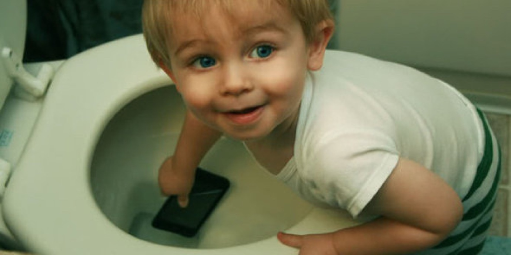
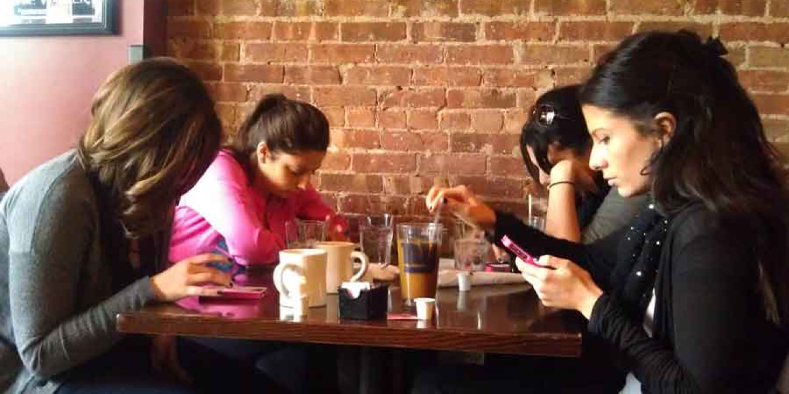
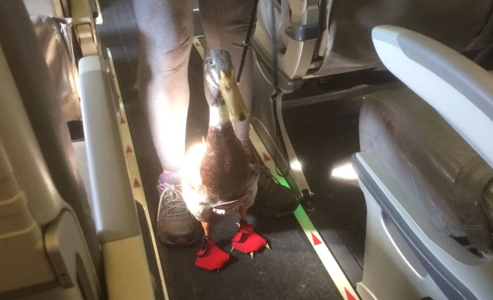

import { Image } from '$components';

"So these three statisticians go duck hunting.

"They've got the shotguns and the duck calls and the waders and the decoys, and
they head out into a marsh and wait.

"After a little while, they see some ducks, and the first statistician stands up
to take a shot. He shoots — _BLAM_ — but the duck keeps flying; he's missed high
by about a foot.

"The second statistician is ready, and he takes a second shot — _BLAM_ — but the
duck's still flying; the shot missed low.

"The third statistician jumps up and... he, uhhh..."

I'm looking at my phone now. My friend's mother just liked one of my photos on
Facebook. How anticlimactic. She likes _every_ photo I post, so it's kind of
like getting a participation trophy.

When I look up, the table is staring at me expectantly.

"What?" I ask.[^punchline]

## Phones (and Toddlers) Are Dicks

<Image
  align="right"
  caption="“Oh, you still needed this? ...yeah, I’m not sorry.”"
  creditLink="http://imgur.com/gallery/sO1Ok"
  credit="chaselye"
>

  

</Image>

My friends are getting to the age where some of them are married and have kids.

Some of the kids are old enough to talk.

And they do. Frequently.

> **FRIEND:** We've been looking at remodeling the basement, but we think we're
> going to—
>
> **TINY VOICE:** MOM MOM MOM THERE'S A DOG MOM DID YOU MOM DID YOU SEE THE DOG
>
> **FRIEND:** Just a minute, honey. We're going to hold off until next—
>
> **TINY VOICE:** I WANT TO PET THE DOG MOM MOM CAN I PET THE DOG
>
> **FRIEND:** Sweetie, I need you to be quiet for a minute. We're holding off
> until next Spring so we don't have to deal with the—
>
> **TINY VOICE:** MOM MOM CAN I HAVE MY JUICE
>
> _FRIEND digs in cooler for a juicebox. 30 minutes pass. Interruptions continue. TINY VOICE becomes so insistent that FRIEND exits the table briefly._
>
> _It becomes clear, finally, that FRIEND wants to remodel the basement, but will wait until Spring to avoid extra heating costs since they're planning to replace the insulation. No further discussion is possible because TINY VOICE needs to be put down for a nap._
>
> _FRIEND goes home._

Barbecues aren't that much fun anymore, really.

But these days, neither is the bar. Or dinner. Or other kid-free events.

The jokes and [silly arguments][1] and general banter is all different now.
Staccato bursts of conversation are all interrupted by flashing lights and
three-second bursts of muzak.

> **FRIEND 1:** Two-thirds of a thought.
>
> **TINY ROBOT:** _!_
>
> **FRIEND 2:** New thought started in awkward silence.
>
> **FRIEND 1:** Interruption to finish original thought.
>
> **TINY ROBOT:** _!_

To see a group of friends in a bar isn't much like watching humans who care
about each other interact. It's like watching four people sit alone at a
communal table.

## Alone at a Table Full of Friends

<Image
  align="left"
  caption="Dinner was great; I finally caught up on my Twitter feed!"
  creditLink="https://grooverpr.wordpress.com/2014/03/29/topic-of-the-week-cell-phones-conversations/"
  credit="grooverpr"
>

  

</Image>

Here's a true story: I was in Chiang Mai a few months back, and Marisa and I
made a game of timing how long it took for various tables of 3+ college students
to actually speak to each other. The game was boring; they almost never spoke to
each other.

There was one table — two guys and two girls — who never spoke at all. One of
the girls didn't even look at her friends; she spent the whole meal taking
selfies at severe downward angles. The other girl photojournaled the entire meal
and presumably starved to death because she never got around to eating anything.
The guys buried their heads in an iPad game and Snapchat.[^snapchat]

## We Let 'Em Get the Hooks In

The change was slow for most of us. Almost imperceptible. Sometime in 2009 we
became abruptly aware of a dozen unread notifications in our pockets and our
stomachs went through the taffy puller because _things were happening_ and we
were missing them all.

Along the way someone[^fomo] came up with the term FoMO and it started getting
tossed around as a psychological disorder.

And — like magic — being a total dick to your friends became a psychological disorder, in the same way that bringing a duck[^supportanimal] onto a plane somehow became medically valid.

<Image
  caption="Daniel, the emotional support duck."
  creditLink="https://www.washingtonpost.com/news/animalia/wp/2016/10/20/daniel-the-emotional-support-duck-takes-his-first-plane-ride-soars-in-popularity/"
  credit="Mark Essig"
>

  

</Image>

### We Want to Be Everywhere

There aren't more things happening in the world now than there were thirty years
ago. We're just able to see more of it happening in real time.

In a practical demonstration of "ignorance is bliss", our parents and
grandparents never tasted the bitter anguish of realizing that nerds from the
U.S. just [challenged Japan to a mech-suit battle][2] last week _and you didn't
hear about it until today._

But we unfortunate residents of The Future™ weren't so lucky. Fate, with a
mirthless grin and malevolently glittering eyes, thrust us into a world where
Periscope and Facebook and a [24-second news cycle][3] exist.

Our only weapon in this struggle against cultural irrelevance is a constant
IV-drip of information, fed through our eyeballs and fingertips.

Armed with the latest smart\_\_\_\_\_, we doggedly pursue Total Awareness. Legends
are told of an elite few who know all things _before_ they start trending on
Facebook. These multi-screen samurai pursue 100% coverage of global occurrences
with Neeson-esque determination.[^samurai]

### So Where Are We, Exactly?

At the corners of our vision, just beyond the edge of what we can identify
without turning our heads, another world is dimly lit with blue light,
collecting dust and falling into disrepair.

But that world doesn't matter now. We _know_ that world; it's the other things
that we need to keep tabs on.

We already _know_ our friends, and their stories.[^stories] We already _know_
all our family's dirty secrets.

What's exciting about the things we already know?

Nothing. _Nothing_ is exciting about the things we know.

You know what _is_ exciting? Kid Rock acting like an ignorant hillbilly. _What
drama and intrigue!_ And you know what else? Donald Trump on an escalator. If
that's not a memory that will bring you some small comfort in the final hours of
your life, you're probably dead inside.

So Grandma can just hold her damn horses if she wants to spend the day with us;
we're dealing with matters of critical import, here.

<Image caption="#thestruggleisreal">

  

</Image>

## The Things That Matter

We work endlessly — thanklessly — to keep drinking from the information firehose
spraying from this pitiless world we live in. No one will sing songs of our
dedication and perseverance. The history books won't mention our names.

But we'll know what we've accomplished.

In our old age, we want to look fondly back on a lifetime of accomplishment and
contentment. Happy memories of happy days, where we did things that truly
mattered to us.

Mom's kinda-dry turkey dinner just doesn't make that cut. Sorry, Mom, but
there's a _real struggle_ happening here. You're just too old to understand.

It's not that we don't love our friends and family — we do. Dearly.

It's just that we aren't 100% sure there's not something out there that we might
love _more._ So we have to keep our options open[^options] and stay diligent.

Otherwise we're just cheating ourselves, right?

We may not be able to communicate our feelings without emoticons. We may not
have spoken to our parents in weeks. Our friends may only know us as That Guy
Who Plays on His Phone Through Lunch.

But we saw [this video][4] the day it came out. And [this one][5].

Clearly, our sacrifice was necessary.

[^punchline]:
  The third statistician jumps up and starts fist-pumping and yelling, "Yeah! We got him, boys! We got him!"

[^snapchat]:
  He was looking at snaps of beautiful women doing nothing: talking to the camera, pointing their cameras at what they were eating, waving and laughing. The two girls he was with were incredibly good-looking. They had food they could show him. They had (perhaps most importantly) agreed to hang out with him in person. I wanted to shake him: "Son, do you even understand what you're doing wrong, here?"

[^fomo]:
  According to [_Boston Magazine_][6], credit for FoMO ("Fear of Missing Out") goes to [Dan Herman][7], though it was really popularized by Patrick McGinnis in a 2004 op-ed on the subject. This will be on the quiz.

[^supportanimal]:
  Or pig, or mini-horse, or peacock. It's so absurd that you have to wonder if it's an attempt at satirizing rich white women with tiny dogs to help with their depression, or this subversion of cloying airline policy is being carried out by a subset of hipsters who decided mustaches weren't ironic enough.

[^samurai]:
  Of course, no one can prove that the fabled Ultrainformed exist. They've never been spotted in the wild, and only surface for mere moments at a time under the guise of various throwaway Reddit accounts.

  The hopeful among Millennials (a.k.a. the Informationally Forsaken) speak of the Ultrainformed as possible saviors from our ignorance; the cynical write them off as the Illuminati; my grandpa says we should just close the fucking computer and go outside already.

[^stories]:
  For the last time, Dave: we've all heard your goddamn Mariah-Carey-in-the-elevator story. Nobody cares.

[^options]:
  "Yeah, yeah, I'd love to hang out, but I can't actually commit to anything. There's a possibility that something better than your shitty party will come up, and I want to keep my options open. I'll show up if I show up."

[1]: https://medium.com/funny-stuff/the-fine-art-of-bullshit-c09f7bbb391e
[2]: http://twistedsifter.com/videos/usa-challenges-japan-to-giant-robot-duel/
[3]: http://www.theonion.com/article/media-landscape-redefined-by-24-second-news-cycle-2213
[4]: https://www.youtube.com/watch?v=tvsV6nlLe1g
[5]: https://www.youtube.com/watch?v=VLEfrulUEcs
[6]: http://www.bostonmagazine.com/news/article/2014/07/29/fomo-history/
[7]: http://www.danherman.com/The-Fear-of-Missing-Out-(FOMO)-by-Dan-Herman.html
