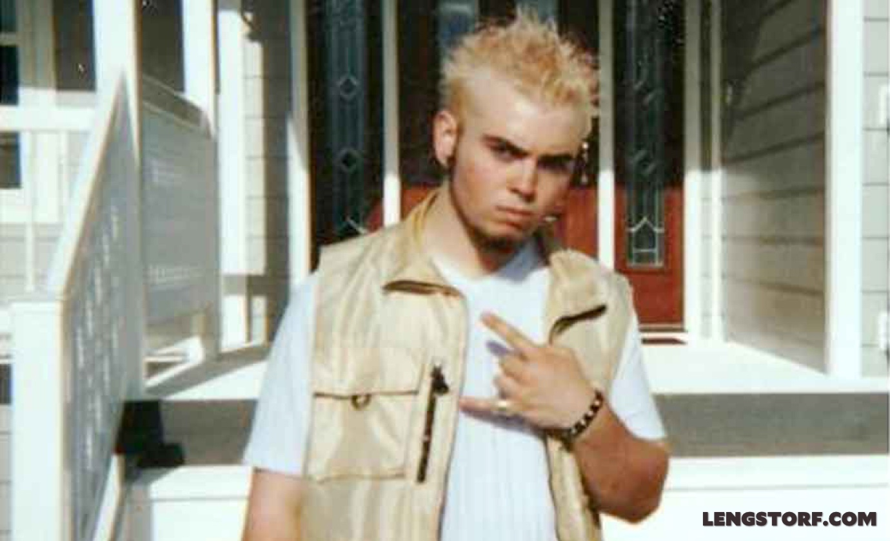
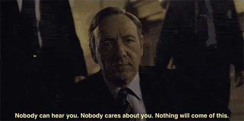
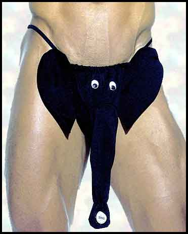
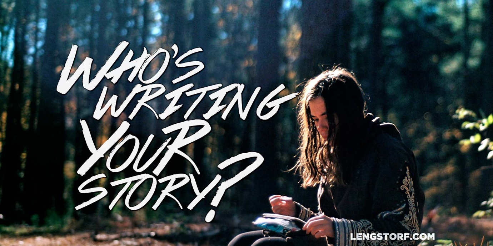
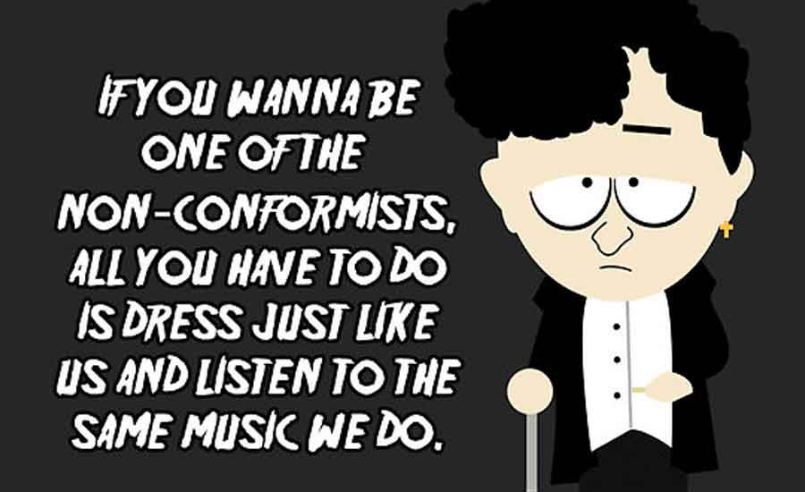
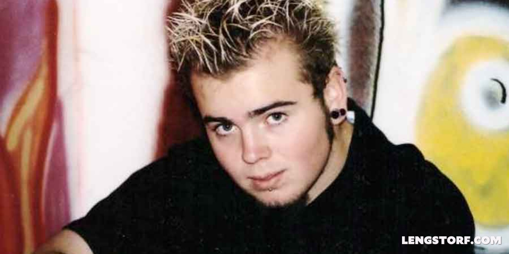
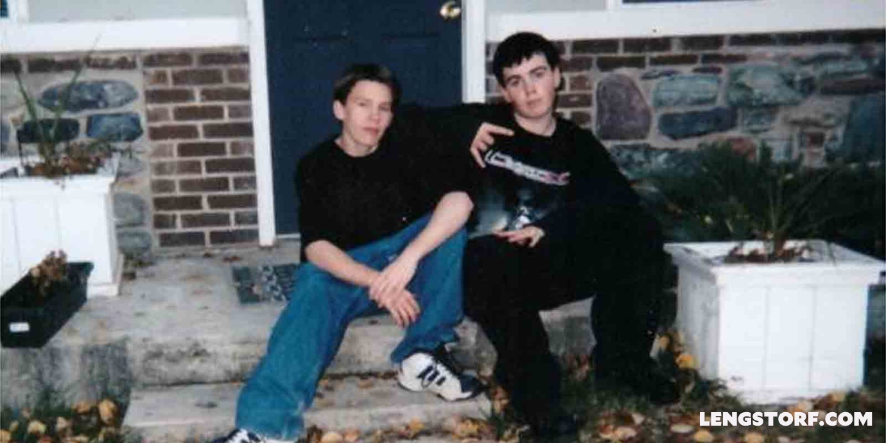
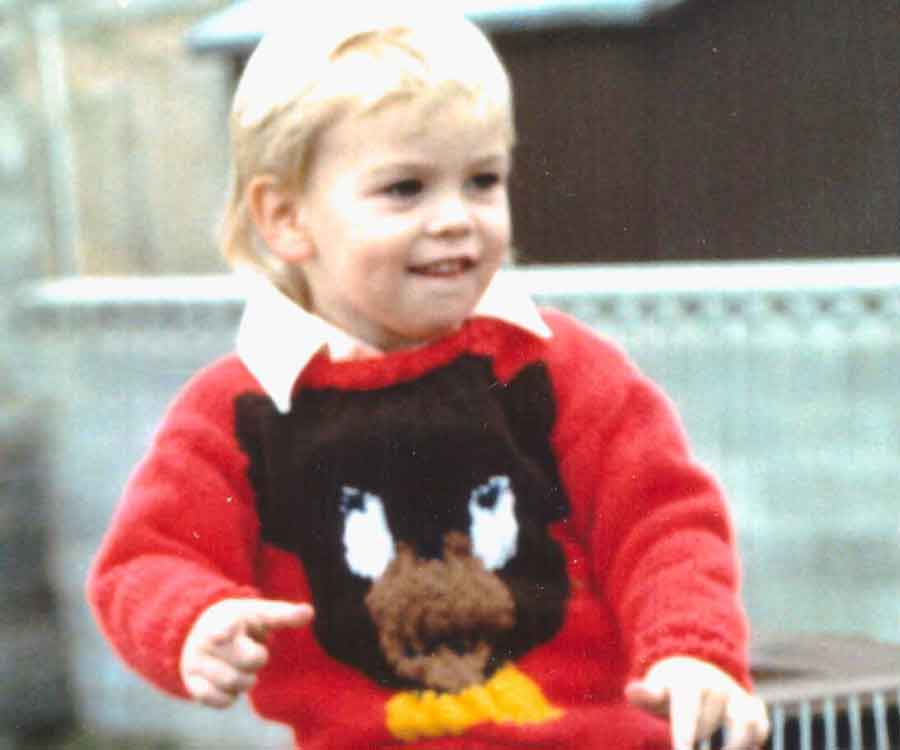
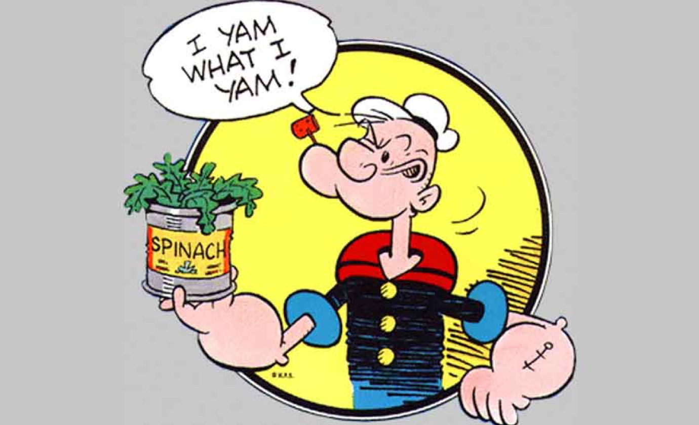
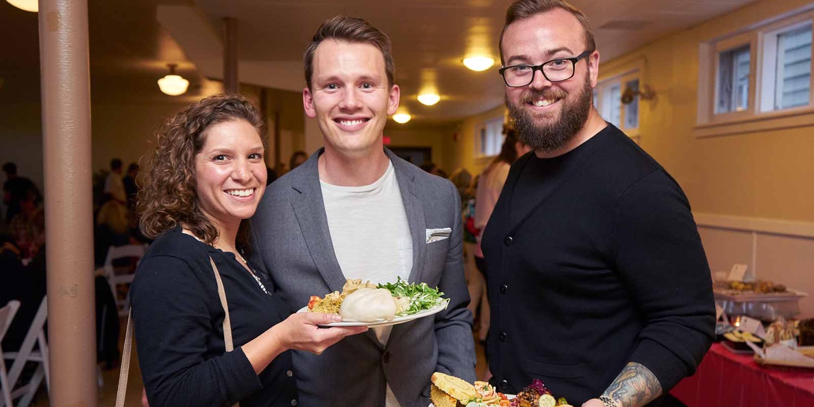

import { Image } from '$components';

At fourteen, I felt a lot of rage.

In retrospect, my anger wasn't much more than the vinegar-and-baking-soda
aftermath of my first waves of conscious individualism breaking against jagged,
hormonal shores.

<Image
  align="right"
  caption="This is the face of struggle."
  credit="Lengstorf Family Archives"
>

  

</Image>

But at the time, my rage felt like my only defense against the countless
injustices I was forced to endure[^injustices] and the cruelty of a world out to
keep me from feeling any real joy.

I was angry because it felt like things were out of my control. I was debris
swept away in a flood — a helpless, hapless bystander caught in a cosmic battle
that had nothing at all to do with me: the victim of cruel happenstance.

**The world was happening _to_ me, and I felt helpless.** So _of course_ I was
pissed; helplessness has got to be in the Top 5 for Reasons People Get Angry.

## Discovering Logical Thought

Somewhere around fifteen or sixteen, my great-aunt sent me a copy of [_The
Fountainhead_][1], which started me down a philosophical rabbit-hole.[^aynrand]
I read [_Illusions_][2] and [_Zen and the Art of Motorcycle Maintenance_][3]. I
read generation-defining pop-philosophy in [_Fight Club_][4] and learned about
the true nature of not giving a fuck in [_Factotum_][5] and realized I'd never
even come close to hitting bottom from [_Jesus' Son_][6].

This reading led to questions, which led to [deep conversations with a
friend][7], which led to critical[^non-critical] insights, and — finally — to
actual changes in my behavior.

Suddenly, after a few minutes' logical thought, I realized two things that
drastically changed my life:

### 1. No one is out to get me.

There's no dark force or diabolical villain working to make my life harder. It
was hard to swallow, but I realized that **I'm just not that important.** In
fact, hardly anyone thinks about me _at all._

It's easy to imagine that I have critical importance and will therefore face
critical opposition, but that's an extraordinarily myopic view of things.

The truth is that — while I am the most important person in _my_ world — I
barely register in the broader scope of _the_ world.

Probably 95% of the human beings I pass on the street receive zero attention. Of
the 5% I _do_ notice, I only notice a single feature ("Cool shoes!" "Nice ass!")
and they're forgotten the instant they leave my line of sight.

<Image
  creditLink="http://www.imdb.com/title/tt1856010/"
  credit="House of Cards"
>

  

</Image>

Who am I to think I'm somehow deserving of everyone's attention when I barely
give them any thought at all?

To roughly 7,348,999,994 of the 7,349,000,000 people on the planet, I either
don't exist or don't matter enough to occupy short-term memory.[^peoplewhocare]

I'm not a target. I'm not being singled out for cruelty.

**I'm not a victim.**

### 2. No one is coming to save me.

If my story has no villains, it's safe to assume there aren't any heroes,
either.

As fate would have it, I'm not a fragile, extraterrestrial secret
weapon[^fifthelement] or a [severely damaged government experiment on the
run][8] — **I'm just a person.** My interests are all fairly commonplace, my
talents are all borderline commodities, and my opinions are the mutant,
amalgamated offspring of the opinions of authors and mentors I've paid attention
to while I've been alive.

The only unique thing about me is the _precise_ arrangement of my interests,
talents, actions, and opinions. Otherwise, everything I am, do, and believe is
more or less standard-issue.

So there's no need to save me; I'm not vital to the future of our planet. **No
one is going to "rescue me" from my life.** I won't be [discovered in a drug
store][9] and propelled to stardom.

**I'm on my own.**

## The Empty Director's Chair

On its face, this may sound bleak: I'm all alone and no one cares.

But this is actually _great_ news. It was probably the best news I'd ever
received as a teenager.

I spent most of my youth terrified of looking foolish. And when I wasn't worried
about looking foolish, I was convinced that I would get in trouble if I made the
wrong decision.

**When I realized no one gave a shit about me, life became immeasurably
easier.** I could strip down to one of those novelty thongs where my penis
becomes an elephant trunk and sprint through a town hall meeting belting out the
latest Taylor Swift single at the top of my lungs and _no one would care._

<Image
  align="right"
  caption="Baby, I’m just gonna shake, shake, shake, shake, shake..."
  creditLink="http://www.teddygirl.com/elephant-gstring.html"
  credit="TGL, Inc."
>

  

</Image>

Sure, people would laugh, and someone would definitely put it on YouTube, but no
one would _really_ care. I'd be a momentary amusement, and then I'd fade right
back into the anonymous social landscape.

This made it far easier to do things that were less ridiculous, like taking a
chance on making it as a touring musician, or quitting my full-time job to give
freelancing a shot.

My whole life, I'd believed that [people were watching me][10], and that some
unseen hand was shoving me along a path I had no control over.

But I was wrong: **there was no one making decisions about my life.** Except me,
I guess — assuming I worked up the guts to make any decisions.

If my life was a movie, up until this point there'd been no director. I'd been
carried along by the unstoppable current of time, but uncaptained, rudderless,
drifting.

Unless I chose to act heroically, my movie had no hero. No villains unless I
acted villainously. Unless I climbed in and took charge, the director's chair
was — and would remain — empty.

<Image>

  

</Image>

## Who's Writing Your Story?

After I assumed responsibility for my own life, everything changed.

**The world didn't happen _to_ me anymore. _I happened to the world_.**[^cheesy]

I started steering myself away from the things that frustrated and depressed me,
and toward things that excited and motivated me. It's been a long road, and I'm
still working on it today. I expect I'll probably still be working on it when I
die.

I started seeing immediate improvement: my life was now my choice, and I didn't
feel like a victim of anything. It wasn't pleasant to admit that a relationship
ended because I acted like a dick, or that a project failed because I let
everyone down and slacked, but **making my own mistakes was _way_ better than
feeling helpless against the whims of a malevolent universe.**

### Getting in My Own Way

Comfortably at the helm of my personal narrative, I immediately started closing
doors and adding restrictions.

What kind of man was I?

I was the type of man who didn't buy into bullshit corporate puppetry and
advertising-driven entertainment.

<Image
  align="right"
  creditLink="http://southpark.cc.com/clips/154322/non-conformist-coffee"
  credit="South Park"
>

  

</Image>

I was the type of man who questioned all authority and made my own path.

I was the type of man who wouldn't be lumped in with a group or clique.

I, free thinker.

I, beacon of logical reasoning.

I, renegade individualist.

I, prisoner of silly, self-imposed roles.

## Who Are You?

When I graduated high school, my parents took my whole family to Florida. It was
half-intended as a graduation gift, and half-intended as a long-overdue family
vacation. We went to Universal Studios and Disney World. Daytona Beach. Some
enormous waterpark I can't remember the name of.

<Image
  align="right"
  caption="“As you’ve probably already guessed by my hairstyle, I hate everything. Especially you.”"
  credit="Lengstorf Family Archive"
>

  

</Image>

**And I — bound by my staunch opposition to corporate profiteering, herd
mentality, and enjoying anything popular — made sure I was miserable the whole
time.**

It was hot and muggy in the way Florida is usually hot and muggy, but I wore
long sleeves and black pants the whole time. While my brother and sister carried
their tubes to the top of a big-ass whirlpool-looking deathtrap, I sulked in the
shade.[^sulking]

The entire premise of my family's vacation violated my identity. It was an
affront to the core of my being.

Except, of course, that my parents' choice for a family vacation spot had
exactly _nothing_ to do with my identity, and **I was really just letting some
dude in a Mickey Mouse costume ruin family time simply by standing nearby.**

That's a lot of power to give a stranger wearing a giant rubber head.

### The Cages We Build for Ourselves

Brick by brick, I'd built a wall between what was and was not acceptable for
Someone Like Me.

Someone Like Me listens to death metal.

Someone Like Me would _never_ shop at Walmart.

Someone Like Me loves [Jhonen Vasquez][11].

Someone Like Me doesn't love Jhonen Vasquez anymore because Hot Topic started
carrying his comics.[^jthm]

I was proud of the wall at first, because it created a clear separation between
"us" (me) and "them" (the sheeple).

**Building the wall was my tiny way of asserting a tiny bit of dominance over
the tiny shadow I'd cast on the Earth.**

<Image
  caption="<a href='https://nategreen.org'>Nate</a> and me showing the world just how cool we were."
  credit="Lengstorf Family Archive"
>

  

</Image>

But here's the thing: a wall is a wall.

Before, I was trapped by the imaginary Malevolent Universe that ensured my life
happened _to_ me.

**Now, I was trapped by the imaginary Someone Like Me who ensured only a tiny
subset of all available choices were ever seriously considered.**

## The Identity Snowball

When I was born, I was a tiny spark of consciousness.

I had no memories. I knew nothing. All I cared about was whether I was hungry or
sleepy.

When something happened, I had no frame of reference. I could only observe,
consider it as an isolated event, and make a decision about what that meant to
me in that moment.[^infantdecisions]

<Image
  align="left"
  caption="No agenda, no prejudices — just a sweet bear sweater."
  credit="Lengstorf Family Archive"
>

  

</Image>

There was no subtext or personal politics. **Things were what they appeared to
be. How could a thing be more than it is?**

As I grew, I learned language and fear and prejudice and opinion from my
environment. Cat peed on me when I was four? Now I hate cats. Dog bit me? I'm
scared of Dalmatians.

My friends teased me about my Looney Tunes t-shirts, so that stuff was for
babies. My mom knew the words to [_Tubthumping_][13], so it was clearly too
mainstream for me to listen to.

The slow accumulation of experiential biases continued until **I'd become so
mired in my identity that I could no longer see an event as A Thing That
Happened**; now it was inextricably linked to things I'd seen or heard before,
opinions I'd adopted or developed, and my own historical stance on events of
this type.

My tiny spark of consciousness had grown into a hulking snowball of opinions and
filters and fears and prejudices, and it was growing larger every day. There was
no such thing as an isolated incident anymore.

**I wasn't asking myself what I should do in response to an event; I was asking
myself what Someone Like Me would do in response to that event.**

Yet again, I was out of the director's chair and letting something else make my
decisions for me.

## How to Melt the Snowball

At 28, I was invited to try wake surfing.

I'd always hated water: I nearly drowned on multiple occasions[^drowning] when I
was really young; I had a chip on my shoulder about being too cool for sports
(especially water sports); but mostly I was chubby, pasty, and generally
uncomfortable in anything but long sleeves and pants.

**I made the decision to hate water before I can remember.** As a result, I'd
spent nearly twenty years flatly refusing any activity involving water because —
through the filter of my projected identity: Someone Like Me — water activities
were stupid.

So my knee-jerk reaction was to refuse. Someone Like Me wouldn't do it, so of
course I won't do it.

But then — at the insistence of my then-girlfriend — I started examining that
refusal. Did I _really_ dislike water sports, or was it just something I'd told
myself years ago and never since questioned? **Was I cutting myself off from
activities I might really enjoy because of something my idiot teenaged self had
decided due to body issues and anti-conformity complexes?**

I decided to test it: I'd go wake surfing, and if I hated it, my dislike for
water sports was justified.

But if I liked it, **I needed to reevaluate my opinions about the world.**

### Taking Back Control from My Past Selves

Wake surfing was a blast.

I've since learned how to surf, snorkel, and kayak.[^kinda] Each time, I was
participating in water-based activities — the ones I'd always told myself I
hated — and each time, I had a blast.

How many other decisions was I letting my pre-teen self make? My teenage self?
My twenty-two-year-old post-rockstar-aspirational self?

I had been cheating myself out of dozens — if not _hundreds_ — of experiences
because I'd let my unexamined emotional detritus hobble me.

**Was I really in control of my life if a fifteen-year-old grudge against water
was holding me back from things I truly enjoyed?**

### I Am What I Am

In the aftermath of the wake surfing incident, I've started running all my
decisions through a
do-I-really-feel-that-way-or-am-I-listening-to-my-idiot-teenaged-self-again
filter.

<Image
  align="right"
  creditLink="http://popeye.com/"
  credit="Popeye the Sailor Man"
>

  

</Image>

I doubt I catch all of them. Good ideas still snag on my emotional barnacles
more often than I'd prefer.

But I'm trying to keep my identity lean and adaptable. I've got new
[Popeye-esque mantra][14], even:

**I am who I am — not who I was — and I'm working to become who I want to be.**

So far, at least, I feel happier than I've ever felt — and significantly more
in-control of my life.

<Image
  caption="<a href='https://marisamorby.com/'>Marisa</a>, Nate, and me at a <a href='http://www.precisionnutrition.com/'>Precision Nutrition</a> charity potluck. Big smiles brought to you by a low emotional bullshit quotient."
  creditLink="http://www.precisionnutrition.com/"
  credit="Precision Nutrition"
>

  

</Image>

**I'm free to become the hero of my story.** To take control of my part in its
outcome. To try anything that might make me a better person.

Most of all, I'm free to let my past experiences make me lighter — they're there
to show me what I _don't_ need to carry, after all.

[^injustices]:
  An abridged list of injustices endured by fourteen-year-old Jason Lengstorf:

  * A mother who forced the removal of a tongue ring, despite the fact that it cost a week's pay and several hours of subterfuge in order to get someone to do the piercing in the first place.
  * Girls who were mysteriously repelled by the black hair, zipper-and-safety-pin-laden clothing, death metal t-shirts, and generally shitty attitude of a _really nice guy_ (which they'd know, if they would stop being jerks and overlook all that so they could get to know him).
  * Internet commenters who couldn't seem to grasp that the Insane Clown Posse is just _terrible_, despite mountains of empirical evidence. Also, why were those idiot juggalos on the Eminem fan forum, anyways? [Fucking magnets][17], right?

[^aynrand]:
  Yes, I've read Ayn Rand. Yes, the books made me think and influenced me in certain ways. No, I don't want to hang out, Glenn Beck.

[^non-critical]:
  There were also non-critical insights: I realized that I was smarter than everyone else on the planet; I solved all the world's problems (short version: "Everyone should just think and act _exactly_ like me."); I discovered rhetoric's more sinister uses and brutally terrorized my less-eloquent teachers.

[^peoplewhocare]:
  The six people I'm pretty sure think about me regularly: me, Marisa, Nate, my parents, and Nadia (whose job involves making sure I'm still alive and accomplishing things).

[^fifthelement]:
  _Leeloo Dallas [mul-ti-pass][18]._

[^cheesy]:
  No matter how I try to say this, it feels cheesy. I feel like some doofy motivational speaker trying to pump up an audience whenever I share this idea. But shifting that power dynamic changed everything in my life, so fuck it: [call me Zig][19].

[^sulking]:
  I was probably doing something _totally unique_, like writing emo lyrics or reading Chuck Palahniuk.

[^jthm]:
  When I got a JtHM tattoo at seventeen, I never imagined the sort of people who would — in their thirties — recognize and start a conversation with me because of said tattoo. I imagine it feels the same for people who got Disturbed tattoos.

  Or maybe not. Maybe they're _stoked_ about the folks still down with the sickness twenty years later.

[^infantdecisions]:
  My go-to responses were "crying" and "not crying".

[^drowning]:
  Turns out it's bad news to be both A) recklessly inclined to jump into large bodies of water and B) the opposite of buoyant.

[^kinda]:
  I say "learned" loosely. I stood up on a surfboard a couple times, figured out that a snorkel is _not_ a giant straw for drinking ocean water quickly, and dumped a kayak in the shallows while an older couple looked on and laughed.

[1]: http://amzn.to/1T2FuaG
[2]: http://amzn.to/1eSrpPt
[3]: http://amzn.to/1MMo4jH
[4]: http://amzn.to/1IkeUXC
[5]: http://amzn.to/1KQ4Dq0
[6]: http://amzn.to/1IGLrV4
[7]: http://www.2FTAT.com
[8]: https://en.wikipedia.org/wiki/River_Tam
[9]: https://en.wikipedia.org/wiki/Lana_Turner
[10]: https://medium.com/project-grownup/the-real-life-truman-show-1cd6b2aa9c34
[11]: https://en.wikipedia.org/wiki/Johnny_the_Homicidal_Maniac
[12]: https://nategreen.org
[13]: https://youtu.be/2H5uWRjFsGc
[14]: https://en.wikiquote.org/wiki/Popeye
[15]: https://marisamorby.com
[16]: http://www.precisionnutrition.com/
[17]: https://youtu.be/OvmvxAcT_Yc
[18]: http://www.imdb.com/title/tt0119116/quotes?item=qt0464059
[19]: http://www.forbes.com/sites/kevinkruse/2012/11/28/zig-ziglar-10-quotes-that-can-change-your-life/
