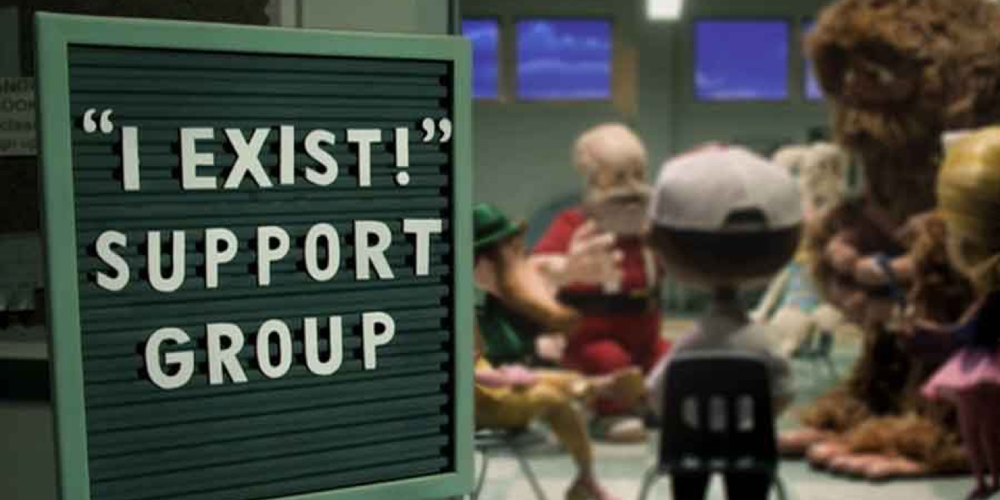
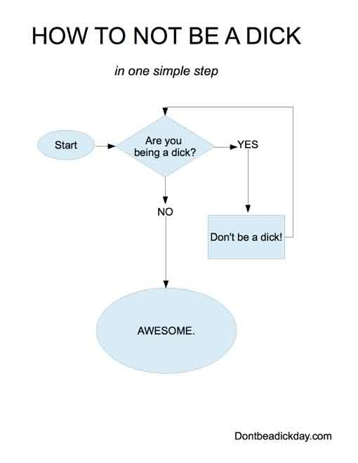

import { Image } from '$components';

Marisa is a few months into her new career as a [freelance copywriter and
editor][1].

She has a literature degree[^degree] and hundreds of thousands of words under
her belt. She's written for [large][2] [publications][3]. She's created an
information product and the marketing to go with it.

I'm telling you this to establish a fact: Marisa is extremely well-qualified to
work as a copywriter. Anyone who hires her will be very happy with the result.

**But despite all her qualifications, her freelance career was slow out of the gate. The skill was there, but the clients weren't piling up.**

Why?

## 100% of Becoming a Freelancer Is Sales

If you spend more than a few minutes skimming [the freelance Subreddit][5],
you'll likely see at least a half-dozen posts from freelancers who are
struggling and unhappy because they don't have steady work.

These are all qualified people[^reddit] who could easily handle freelance
contracts. And yet they're stuck without work, or forced to race to the bottom
on sites like Upwork.

But these people aren't _freelancers_ — they're employees without bosses.

**Freelancers are — first and foremost — salespeople.**

### You Can Only Get Hired If Someone Knows You Exist

<Image
  align="left"
  caption="Does anyone know you’re here?"
  creditLink="http://www.trustcollective.com/portfolio/content/bent_drpepper.htm"
  credit="Bent"
>

  

</Image>

The truth about freelancing is that getting hired as a freelancer has exactly
_nothing_ to do with your abilities as a freelancer.

Here's an analogy to try and put this in perspective:

> Say I need a deck built. I haven't done anything resembling construction or
> woodworking since I made a lopsided toothpick box in seventh grade shop class,
> so I'm walking in pretty blind here.
>
> I start by asking people I trust: my dad, who's had things built before; my
> friends who own houses; a buddy who used to work construction. Do they know
> anyone I could ask about building the deck?
>
> After people I trust, I might put the word out through whatever channels are
> available to me. A call for help on Facebook or Twitter. Maybe someone knows
> someone.
>
> Then I consult the internet at large. Are there any reviews? Who's the best
> deck-builder in my city?
>
> In the end, I'll have a list. Or, more than likely, one of my trusted sources
> will have a recommendation, and I'll just go with that unquestioningly — why
> doubt the endorsement of someone I trust?
>
> So here I am, a deck contract awarded, and I know nothing about my contractor
> except that my friend Troy likes him.

**A freelancer's skills mean jack shit in the decision-making process for most clients.** You know that cheesy cliché, "It's not _what_ you know; it's _who_ you know"?

It's a cliché for a reason.

## 100% of Building Client Relationships Is Skill

"But wait," you say, "there's so much more to freelancing than sales!"

Of course. But none of that matters if you're not selling.

Where sales stop mattering is _after_ the sale is made. **Once you've won a
client, gotten a deposit, and started a project, your sales ability can't help
you anymore — you're on the hook to be good at your job.**

Your talent as a freelancer will make clients happy, and it will keep them
coming back. Plus, it creates referrals — which we'll come back to in a few
minutes.

## Selling Feels Gross

Look: I hate selling. _Hate it._

**Accosting a friend or stranger and asking for money feels presumptuous, invasive, and greasy.**

<Image
  caption="Selling shouldn’t make you feel like this guy."
  creditLink="http://www.forbes.com/pictures/efik45ejedd/pay-attention/"
  credit="Forbes"
>

  

</Image>

I've never made a cold call in my life.[^coldcalls] I've sent fewer than a dozen
unsolicited emails asking for business. I get anxiety thinking about approaching
someone who has no idea who I am and trying to convince them I'm worth money.

The power dynamics are weird; the approach puts me at a social disadvantage, and
forces me to work extra hard to prove I know something. I would never buy
something from a stranger I've never heard of before; why would I expect anyone
to buy from me when I'm a stranger?

### You Still Have to Own Your Position

I don't like approaching someone cold, but I have no issue whatsoever telling
someone what I do — what I _am_.

**It's critical to fully own your ability to do the job you're telling people you can do.** If you don't trust yourself to be outstanding at your job, why should anyone else?

Before I started freelancing full time, I waffled on what I was. Was I a guy who
worked at Kinko's and made the odd website on the side? Or was I a web designer
working to bootstrap a new freelance business?

I felt like an impostor telling people I was a web designer. They'd think I was
a liar if they walked into Kinko's and saw me there, right?

But that's not a healthy way to look at things. When I was younger, this wasn't
an issue for me: sure, I worked at Pizza Hut part-time, but I was a _musician_
first and foremost. My band didn't make much money, but we practiced a few times
a week and played a show every month or so.

For some reason, it was much easier to tell people I was a musician than to tell
them I was a web designer.[^roles]

Maybe it was easier to call myself a musician because I had a group of friends
to be part of my band, and as a freelancer I was just a guy working alone on my
couch.

Maybe it was because being a freelancer seemed more important, and I was more
afraid of failure.

Whatever it was, something made me uncomfortable about saying the phrase, "I am
a freelance web designer."

### Confidence Is Critical

When I finally quit my job at Kinko's to become a full-time freelancer, my
confidence instantly shot through the roof. I had [set myself on fire][6], and
it was time to put up or shut up.

<Image
  align="right"
  caption="You have to believe in yourself, or no one else will."
  credit="Jason Lengstorf"
>

  

</Image>

**As soon as I felt like a "real" web designer, I immediately started landing more business.** I don't think this was a coincidence.

It's a bit of a chicken-egg problem: in order to have confidence about our
abilities, we feel like we need clients; but in order to get clients, we need to
have confidence in our abilities.

I wasn't trying to sell people my services, mind you. I simply felt more
confident saying, "I'm a web designer, and I can build awesome websites."

People sensed my confidence, and suddenly I was being approached more often
about jobs.

<Image>

  

</Image>

## How to Sell Without Selling

Confidence doesn't solve all problems, though. I was getting approached for
jobs, but that was because people knew who I was.

But if I didn't like selling and wasn't cold-calling people, how did anyone know
who I was?

The way I see it, there are two ways to get new business as a freelancer:

1. Sell your services
2. Have other people sell your services for you

I wasn't all that comfortable with option 1, so I wanted to find a way to make
option 2 happen.

**I needed to create a killer referral network.**

### There's Still Some Selling Involved

Don't let me mislead you into thinking you won't have to do any selling —
that's, unfortunately, just not true.

You'll have to sell. But you can do a different, more comfortable kind of
selling.

**Instead of selling to strangers, start selling to your network.**

<Image caption="Never underestimate the power of word-of-mouth.">

  

</Image>

## Take Advantage of Your Network

For most people, there's a loose network of acquaintances and "buddies" spread
through the community, state, country, and/or world. Not necessarily people that
you keep in touch with daily, but the kind of people you speak to every month or
two — just to catch up.

### Be Willing to Ask for Help

When you talk to these folks, they'll inevitably ask you, "So what's new?"

If you're anything like me, the default answer might be to say, "Not much. I'm
working as a freelancer now, which is pretty exciting. How are you?"

This is factual, _but it could be much better._

Now, look: we're not trying to scam our friends into anything. But we _do_ want
to make sure our friends are aware of what we're doing, and that they could help
us do better.

So when our friend asks, "What's new?" we don't brush the question off. Instead,
we present a friendly, opt-in request:

> Well, my biggest news is that I've just start working as a freelance web
> designer, which is pretty exciting. The biggest challenge so far is finding
> clients, so if you know anyone who needs a website, I'd appreciate it if you'd
> drop my name or make an intro.

**You haven't asked for anything that puts your friend out. All you're doing is putting it in her head that she can help you out.**

Remember the deck analogy from earlier? People love to have the answers to other people's problems. **If my friend can connect me to someone who needs my services, she wins twice:** she helped me grow my business, and helped her other friend solve their website problem.

### You Don't Have to Wait for an Opening

You can also start this conversation. Email your acquaintances to catch them up
on things, including a nudge to send any potential leads your way.

That email is almost the same. It might look something like this:

> Hey, friend–
>
> I hope you're doing well! I wanted to drop you a line to see how things are
> going and catch up.
>
> _[Talk about things that are relevant: do they have kids? were they starting >
> something new last time you spoke?]_
>
> Things on my end are pretty exciting right now. My biggest news is that I've
> just start working as a freelance web designer. The biggest challenge so far
> is finding clients, so if you know anyone who needs a website, I'd appreciate
> it if you'd drop my name or make an intro.
>
> _[Catch them up on anything else in your life that you want to share here.]_
>
> Anyways, I hope you're having an awesome summer. I'll look forward to hearing
> from you!

This message isn't hiding an agenda. You're not trying to weasel something out
of a friend. You're simply sharing big life news and making it known that — if
they happen to hear someone needs a website — they can help you out by spreading
the word.

If you sent this message without the note about referring leads, it would still
be a meaningful message to you and your friend.

### Remember: These Are Your Friends

<Image
  align="right"
  caption="How not to be a dick."
  creditLink="http://dontbeadickday.com"
  credit="Wil Wheaton"
>

  

</Image>

The big goal, of course, is not to be a dick about this. You are _not_ going to
get good results by pestering everyone you know about buying a website to "help
you out" or whatever. That's multi-level marketing — are you a freelancer, or
are you hawking Scentsy candles?

**Before you send an email, make sure you wouldn't be upset if you received the
same email from your friend.** It's one thing to be made aware that someone is
looking for work; it's another thing entirely to be pumped for leads and/or
pressured into buying things.

You'll be fine if you just follow Wheaton's Law: **don't be a dick.**

## Grow Your Network

In addition to your existing network, make an effort to meet people — especially
people who are in the industries you'd like to work with.

This has the added benefit of building a community. You can help people in
whatever way you're able, and they'll be able to reciprocate as best as
possible.

### Attend Local Meetups and Professional Groups

<Image
  align="right"
  caption="In Missoula, running a small workshop in 2010."
  creditLink="https://www.meetup.com/Montana-Programmers/"
  credit="Montana Programmers"
>

  

</Image>

When I first started out, I started attending a small group called [MT Programmers][7] in Missoula. **I started to get involved, and through the people I met there, I was introduced to more and more people in the community** — more than a few of my first gigs came from these introductions.

Later, I spent money to attend conferences, and **I found myself surrounded by people who were focusing on their businesses and willing to spend money to get what they needed** — often, this meant they needed website help, so it naturally came up in conversation that we could help each other out.

### Bring Your Clients into Your Network

Every time I get a new project, I bust my ass to make sure the client is really happy with me. I know that **happy clients are worth _way more_ than just the value of a given project.**

Many of my clients became life-long friends. I've been invited to book launch parties, weddings, vacations, and more. This could never have happened if I didn't show that I'm a stand-up guy through my work.

From a financial perspective, lots of my clients came back later with additional projects. Far more of them referred friends and colleagues to me.

### Ask Clients for Referrals

Part of my wrapping-up process with clients is to send an email letting them
know that I don't advertise, and the only way I get new clients is by
word-of-mouth from my existing clients. I ask them — if they feel like I did a
good job and they're happy with my work — to please keep me in mind if they meet
someone else who needs a website.

I also offer a referral bonus as a token of my appreciation. It's not much —
$100 for any referral who signs on with me — but I like to send it over as a
token of my appreciation.

I make sure to send a personal note thanking the person for each referral as
well, except in the case of my highest-referring clients — they send too many
leads, so I'd be spamming them.

## Eventually You Can Stop Selling

After a couple years, **I had a large enough network that my referral stream was
too much for me to handle.** I received several inquiries a week from people who
were serious about web projects.

I was swamped. I had to hire subcontractors to help. I had a waiting list.

And **this meant I never had to go out and "do sales"** the way that freelancers
typically view sales. No cold calls or emails, no advertising, no proposals.
Just a steady stream of referrals — which is a different (far less awkward) type
of selling.[^dating]

## Freelancing Is for Conversationalists

Whether it's direct sales or leveraging a network for introductions, **your job as a freelancer is to generate conversations with people who may need your services.**

This means that your ability to speak in a clear and friendly manner is perhaps your most valuable skill. If you sound confident, and you don't seem like a dick, chances are you'll get the job over someone who seems unsure or comes off as abrasive.

**As unfair as it may seem, a freelancer with better conversational skills will likely win a job over a more competent freelancer who speaks poorly.**

## You Can Be Successful Without Selling

It's a slower road than hard selling, but you can successfully build a freelance
career only by networking.

1. Let your friends know what you're doing
2. Ask them to refer anyone who might need your services
3. Go out and meet people — especially if they're in your target demographic
4. Be helpful and confident
5. Kick ass for your clients
6. Ask them for referrals

I had a referral network after my first project, and it grew steadily with each
new project I took on. It seemed to me that most projects would lead to one
referral, and every once in a while a project would lead to a huge number of
referrals.

So if you hate sales, don't worry — you can still be a freelancer. You may need
to hold onto your day job a bit longer, but you can get there.

Just stay confident, ask for leads, and remember that your skills finish the job
and earn new referrals — so do good work.

[^degree]:
  I don't actually remember _exactly_ what her degree is. It's something to do with English, writing, and/or literature. Whatever it is, it's very relevant to writing professionally.

[^reddit]:
  Correction: 61% of Reddit users are actually [seven squirrels in a human suit][8].

[^coldcalls]:
  These work. I'm not saying you _shouldn't_ make cold calls. I just never liked the idea of becoming a telemarketer for my own services, so I worked around the problem.

[^roles]:
  This was especially odd given that I was always a mediocre musician at best, but web design came to me pretty naturally. Comparatively, my design skill set was stronger than my musical skill set almost immediately.

[^dating]:
  I think of it like dating, because to me it's kind of the same thing. I have _never_ had success approaching a stranger and wooing her. However, if I get introduced by a mutual friend, I feel far less awkward and there's a much higher chance that we'll hit it off.

  I think this happens because the introduction creates a reason for me to be there. My friend has vouched for me, and this means the conversation starts on level ground — I don't have to prove I deserve to be there, and the conversation can progress naturally.

[1]: https://marisamorby.com
[2]: https://www.themuse.com/author/marisa-morby
[3]: http://www.lifehack.org/author/marisa-morby
[5]: https://www.reddit.com/r/freelance/
[6]: /set-yourself-on-fire
[7]: http://www.meetup.com/Montana-Programmers/
[8]: http://www.squirreltruth.com/facts
