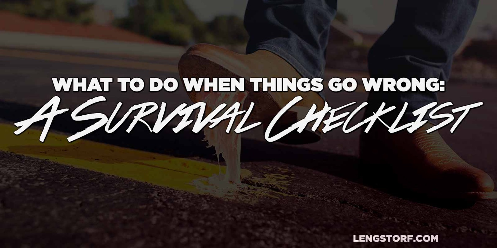
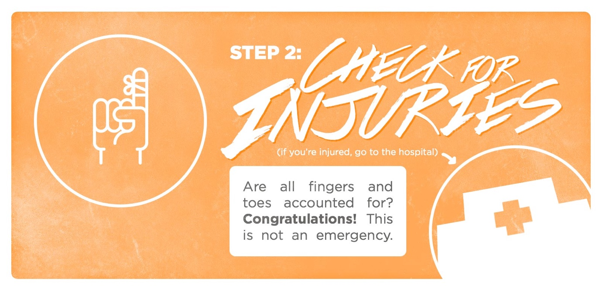
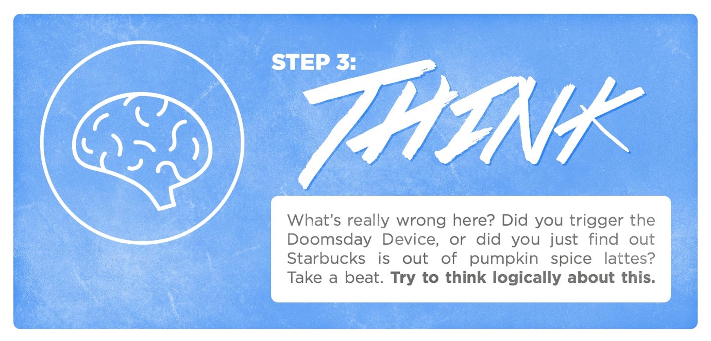
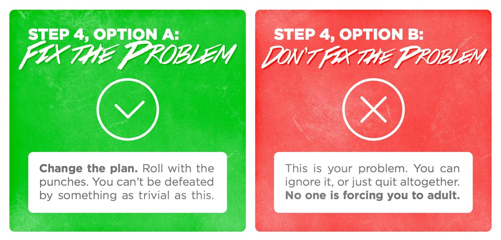

import { Image } from '$components';

It's 07:30 in London, but it feels like early afternoon. We're still functioning
on Chiang Mai time.

We have a flight at 12:15 to IST.[^ist] After poached eggs and toast in the
hotel restaurant, we drag our carry-on bags toward Liverpool Street Station.

[^ist]:
  Istanbul Atatürk Airport, which I can't say or read without picturing a Turkish father giving his son a loving punch on the arm, saying, "Atta Türk! Way to give 110% out there."

On the Picadilly Line, I check the reservation.

"I can't see which terminal we leave from."

Marisa pulls out her phone to check the reservation email and frowns. "It
doesn't say."

I try the flight number on Google. Departure time and duration is there, but no
terminal number. I pull up the Heathrow website to figure out which terminal the
airline typically leaves from. Atlasjet isn't on the list.

I'm at a loss. Maybe they operate under a different name...

## The Stupidity Tax

**In moments where everything seems to be right, but things aren't fitting together, I start over from the beginning.** Otherwise it's too easy to miss the little details causing problems.

<Image
  align="right"
  caption="This is not LTN."
  creditLink="http://mediacentre.heathrow.com/pressrelease/details/81/Retail-News-22/4546"
  credit="Heathrow"
>

  

</Image>

"Alright, let's figure this out. So we're on Atlasjet 6004 at 12:15 from LTN to IST, and—" That didn't sound right. LTN? Isn't Heathrow's airport code LHR?

Fuck.

Marisa's eyes doubled in size.[^eyes] "We're going to the wrong airport."

[^eyes]:
  One of the things I like most about Marisa is her big, beautiful eyes that say everything about how she feels, and loudly. I love it because I don't pick up on subtle hints or gestures. One of the great struggles in my life is trying to convince people that I'm not an asshole, but I definitely won't understand subtext unless it's incredibly heavy-handed, so you may as well just tell me what you want.

  Marisa saves me the pain and embarrassment of missing a signal with her eyes. They act as twin flashing LED displays to notify me of her inner state of being as it shifts throughout the day, like a train platform monitor to announce the comings and goings of her moods.

  But her eyes in surprise get even bigger. Even more expressive. Marisa's surprised face is only two huge searchlight eyes framed by an explosion of curly brown hair.

My stomach went anti-gravity, the way it does when you miss the last stair and time freezes in an Arctic blast of is-this-how-I-die terror.

We were already halfway to LHR.

"Let's get off at the next stop, " I said, more calmly than I felt. I checked the map above the door. "Acton Town. We'll just take an [Uber](https://www.uber.com/invite/vj8i1) and call the cost a stupidity tax."

I took a breath. What did this _actually_ mean?

It was 09:30 — almost three hours until our flight.

I checked driving directions from the Acton Town stop to Luton: a little under an hour.

From walking into the airport to the gate we were probably looking at 45 minutes tops. If the plane boards 45 minutes early, we should still have 30 minutes to spare.

So we were about to lose a hundred bucks to stupidity, but we were still making the flight.

As we stepped off the train, we were giggling. By the time we made our gate (with plenty of time) our cheeks were sore from smiling.

It wasn't funny, but it had to be funny; otherwise this sort of thing might ruin our day.

<Image credit="Jason Lengstorf">

  

</Image>

## A Survival Checklist for Unexpected Complications

Doing new things means making mistakes.

This is a good thing. A life without complications is a life without challenges, and I can't imagine anything more terrible or boring.[^boring]

[^boring]:
  You know that excitement you feel when you learn a new skill and get it right? Your first bike ride without training wheels; your first kiss; your first properly-fingered E chord — none of these would have been very exciting without the possibility and previous experience of getting it wrong.

> **BONUS:** The checklist is also available as an infographic. [Click here to view and/or download it.](/downloads/when-things-go-wrong-survival-checklist.jpg) Print it out, send it to a friend, or share it around on your social networks!

### Step 1: Breathe; This Is What We Trained For

<Image credit="Jason Lengstorf" border={false}>

  

</Image>

Any challenge will be strewn with small mistakes and setbacks. That's okay. We knew they were going to happen.

So when something goes wrong, and panic starts wrapping its icy fingers around our hearts, our first step is to stop and breathe for a few seconds.

We knew mistakes would happen. We're ready for this. We're excited, even: **now we get to _grow_.**

### Step 2: Determine the Severity of the Situation

<Image credit="Jason Lengstorf" border={false}>

  

</Image>

After a few breaths, do a quick pat-down to confirm the presence of all
phalanges and appendages. All body parts accounted for?

Look for blood. Wiggle all fingers and toes to check for pain.

Once we're sure of our own physical wellbeing, we should check the members of
our party for signs of bodily harm.

Check the surroundings for fire and other hazards.

If everyone's intact, we can relax: **this is not an emergency situation.**

### Step 3: Figure Out Exactly What Went Wrong

<Image credit="Jason Lengstorf" border={false}>

  

</Image>

In the absence of any real danger, we should pause and reflect on the situation.
Where are we? Where are we supposed to be?

What was the desired output, and what's missing between our current state of
existence and the goal?

Did we miss a flight?[^missedflight] Buy our train ticket for the wrong day?
Forget an outlet adapter?

[^missedflight]:
  I booked a flight for 06:00 — this was my first mistake. The night before, I set an alarm for 3:45. I figured I'd roll out of bed, put pants on, and get in a cab. I'd be over an hour early for the flight, which was plenty since I was flying Delta and had access to the priority security line.

  The next morning, Marisa woke up and went downstairs to use the bathroom. The door closed, and then: "_Jason!_"

  Certain the world was ending, I impulsively [checked my phone](/fomo) one last time.

  05:45. My alarm hadn't gone off because I'd set it for weekdays only and today was Saturday. My flight had likely just closed the boarding door. No chance of making it.

  I called Delta in a panic, sure that I had just forfeited the entire cost of the ticket and ruined my trip before it started. But they just rescheduled me for later that day since I checked in the day before.

  Instead of ruining the trip, I got an extra few hours of sleep, had a nice breakfast, and caught the next flight out. It didn't even cost me extra.

Rate the problem on its severity. A rabid wolverine in your room is a 10; a
forgotten neck pillow is a 1.

And remember to breathe; even a missed flight doesn't put us at risk of physical
harm.

### Step 4: Take Action (or Don't)

<Image credit="Jason Lengstorf" border={false}>

  

</Image>

Once we've determined what went wrong, we need to lay out our options for solving the problem.

Tickets can usually be corrected by talking to someone in customer service. Fees are easy to circumvent[^fees] if we keep the customer service rep on the phone long enough. Changed departure times are rarely an issue at all.

[^fees]:
  If we're 100% responsible for the mistake, though, we should pay it. Call it a stupidity tax and remember not to make that mistake again.

Typically, our options for moving ahead will fall into one of two categories:

1. Fix the problem
2. Don't fix the problem

#### Fix the Problem by Ignoring It

In many cases, we can go without whatever's gone wrong.

I once broke my phone at the beginning of a week-long road trip. I assumed I'd
die of either boredom or over-exposure to real human interaction, but after the
initial withdrawals[^phonewithdrawals] I barely noticed.

[^phonewithdrawals]:
  I'd idly draw a finger down the palm of my hand to refresh it. Food lost some of its flavor when I couldn't run it through the Lo-Fi filter. Several amusing thoughts went unshared, and I'll live with that pain for the rest of my life.

Ask: is this problem a problem because without this, everything falls apart? or is it just a thing that was on the agenda that [didn't go according to plan](/jazz)?

If it's the latter, consider letting it go. **Many problems don't need to be dealt with because they're not actually problems.**

#### Fix the Problem

If a problem isn't something we can ignore, we can now take advantage of our calmed-down, aware-that-no-one-is-dead-or-dying state of mind and lay out possible solutions.

Often, the fix is simple. Travelers may be surprised to learn that toothpaste and face wash can be purchased nearly everywhere in the world. Meetings can be rescheduled. Other restaurants have available tables.

Other times a fix is less pleasant: I once spilled a fresh latte onto the keyboard of a year-old MacBook Pro. It was my only computer, and therefore my only source of income. And it was definitely not going to survive this spill.

So I did what I had to do: I went to Best Buy and bought a new one.[^insurance] I fired it up, installed Dropbox, and waited for my files to download.

[^insurance]:
  Because the extra purchase protection is for suckers, amirite?

I was out most of a day and a couple grand, but — in the long term, at least — it could have been worse. I was still able to work, and after some grumbling and self-pitying, I went on living my life.

#### Don't Fix the Problem

Of course, we always have the option to leave the problem unsolved.

We can get angry. We can say scathing things to the people standing near us. We can blame them for the problem. Throw ourselves on the ground and kick and scream.

I mean, shit: we can even just lay down and die if we really want.

The important thing isn't _how_ we don't fix the problem; it's that we have the _choice_ to not fix the problem.

## Do You Know What "Gestalt" Means?

Any plan, trip, business, or relationship is made up of a long series of small events, each triggering the next like temporal dominoes.

<Image
  align="right"
  caption="Ko Phi Phi, Thailand"
  creditLink="https://divebooker.com/thailand-phi-phi-islands-eaz17497"
  credit="Dive Booker"
>

  

</Image>

But _unlike_ dominoes, a plan can continue if one of the small events goes
wrong. A forgotten swimsuit doesn't negate a Croatian beach vacation. A phone at
the bottom of the ocean doesn't make [Ko Phi Phi](https://goo.gl/RgyqiK) any
less beautiful. And a missed conference call doesn't ruin a project.

Unless we choose to let things be ruined, of course.

### Put a Little Sunshine on It

Our memories — our stories — are made up of many smaller pieces.

If we lose sight of the gestalt of our memories and mire ourselves in minor
injustices and petty inconveniences, we miss out on the great stories that we're
living through.

https://youtu.be/wvwVkllXT80

Remember the movie
[_Little Miss Sunshine_](http://www.imdb.com/title/tt0449059/)? If we break the
scenes apart and look at them individually, it would be a pretty terrible series
of unfortunate events. But as a whole, it's a funny story that makes us laugh
and smile.

### The Problems Remind Us How Well It Ended

A few inconveniences along the way don't _ruin_ the story; they _enhance_ it. No
one likes a story where the main characters are perfect and nothing goes wrong —
that's not interesting, and we can't emotionally identify with flawless
people.[^superman]

[^superman]:
  This is why movies about Superman are almost always disappointing. A dude with no weaknesses, superhuman powers, and no dark spots on his soul is hard to love.

Stories engage us because the protagonists overcome something. So when little
things go wrong in our plans, we shouldn't be upset that the experience is
ruined — we just got handed a twist for our story.

The indifferent employee at the ticket counter becomes a villain. The lost
luggage and subsequent washing of underwear in a hotel bathroom sink becomes a
comic aside.

**These little challenges aren't the end of the story; they're the plot points that make the happy ending more satisfying.**

## Control What You Can and Live with the Rest

Plans will change. Surprises will surprise. Shit will happen.

**Our job isn't to be the controller of our stories; our job is to act as narrator.**

We get to choose which angle the story will be told from. Are we going to choose
to tell a sad story about how hard we have it? Or will we tell a feel-good story
about overcoming obstacles with a happy ending?

The events may sometimes be out of our control, but the choice of how to deal
with those events never is.

**Further reading: [Stop Glossing Over the Good Stuff](/how-to-be-positive)**
