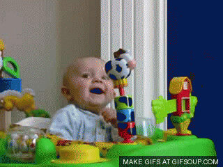
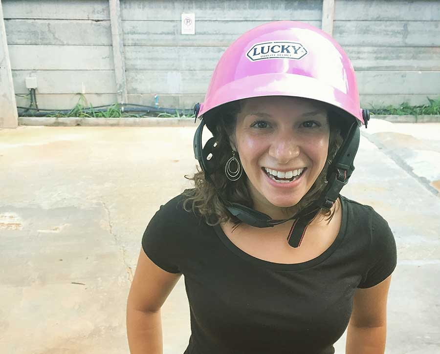
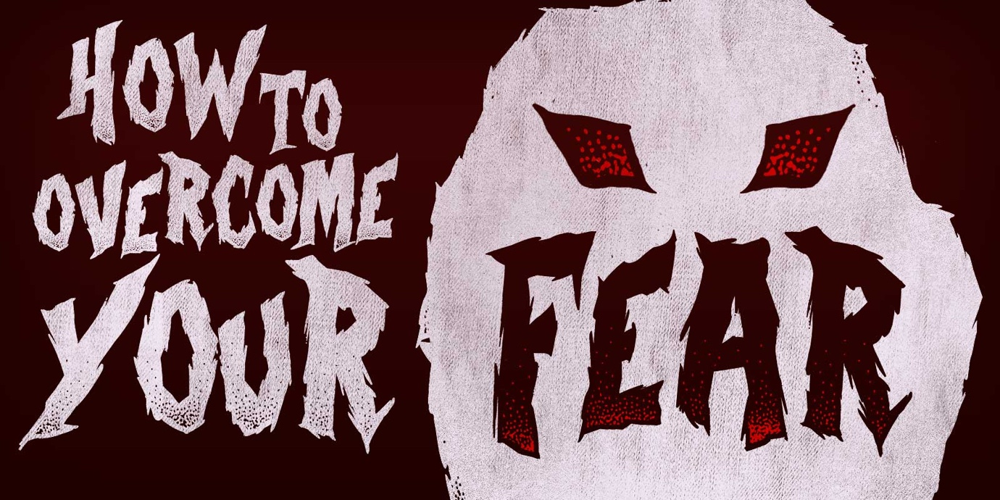

import { Image } from '$components';

In the United States, an average 63 people are killed by lawnmowers every year,
[according to the CDC](http://1.usa.gov/1YTn8ic). Another 37 die from hot tap
water.

Over [33,000 Americans died in car crashes](http://1.usa.gov/1YTniGj) in 2013
alone.

But I can't find hard evidence of someone dying of embarrassment after [going in
for a kiss](/fear), or suffering serious blood
loss[^bloodloss] because their presentation was a bust.

[^bloodloss]:
  Unless you count selling plasma for food money, I guess.

Our fear response appears to be backward — at least from a logical standpoint —
because far more people are afraid of public speaking than mowing the lawn or
taking showers.

So what the hell is going on here? Why are we afraid of safe things, and
cheerfully cavalier about things that are _actually_ dangerous?[^sharks]

[^sharks]:
  For example, I'm not bothered at all by taking selfies — even though **selfies are 150% more likely to kill me than a shark attack**, according to a [recent report](http://cntrvlr.com/1YTmuB8) — but if something brushes my leg while I'm swimming, you can bet I'll be out of the ocean with all the [speed and grace of Scooby and Shaggy](http://bit.ly/1QTRGKS).

Research has provided an answer, and if we use it to our advantage, **we can use science to overcome our fear of... well, _anything_.**

We don't even need to be brave to pull it off.

## We Want New — But Not _Too_ New

[According to research](http://bit.ly/1iT4fL6), animals (and people) "appear to
be attracted towards mildly novel stimuli, and to avoid extremely novel
stimuli." What this means is that we don't like being bored, but we also don't
like things that fall too far outside our comfort zones. In other words, **when
something is too unfamiliar, we find it scary.**

<Image align="right" caption="It’s only scary when it’s new. Afterward, we can laugh at it.">

  

</Image>

But repeated exposure to "novel stimuli" removes the novelty — put simply, it
becomes old news.

**Anything we're exposed to frequently will eventually lose its power to frighten us.** That's why there are people who juggle chainsaws or casually eat lunch on steel girders forty stories high or voluntarily stuff themselves inside subterranean Petri dishes to be hurled through a hole in the ground at ear-popping speeds.

### Is this actually scary, or is it just new?

When I think about talking to a stranger, I feel a surge of fear. Asking someone
for a favor, or — worse — trying to introduce myself to someone who I hope will
be a new friend, fills me with an abstract kind of terror.

But when I run disaster scenarios in my head, there's nothing that could
_really_ go wrong. Short of freak disasters[^panophobia] — lightning strikes,
embolisms, sudden and catastrophic failures of the building's load-bearing walls
— there's just not much worth fearing.

[^panophobia]:
  It's too exhausting to be afraid of everything. Now I refuse to recognize any concern that wouldn't get you past a school nurse. "I have to go home because we're in the Pacific Northwest and there's a [superquake](http://nyr.kr/1Z2vlAE) that scientists say is overdue," just isn't going to get you out of homeroom.

**Discomfort in a new situation trips an alarm, and I feel afraid — even though there's nothing that poses a credible threat to my safety.** My fear is irrational. I'm just in an unfamiliar setting, and my idiot lizard brain[^lizard-brain] is interpreting that as a threat.

[^lizard-brain]:
  My idiot lizard brain's other offenses include convincing me to stay on my couch all day because I was sad, making a family-sized delivery pizza order online to avoid human contact, and cooing soft rationalizations in my ear as I ate the entire thing.

## Road Rash and Rationale

Upon arriving in Koh Samui, Marisa and I rented a scooter. It was the rainy
season, so the roads were wet and we were being pelted by raindrops. About 20
minutes into our first ride — which we were both enjoying — I misjudged a turn,
panicked, and crashed the scooter in a parking lot.

A half-dozen Thai kids swarmed out to help, and after a quick run through [the
survival checklist](/when-things-go-wrong), Marisa and I
climbed back on the bike and headed off again, sporting matching bloody elbows
and knees.

Only now, we were terrified.

Given that it was our first time on the bike, this set a bad precedent: as of
that moment, 100% of scooter rides resulted in pain and humiliation for us. And
that made us both far more reluctant to get back on the scooter again.

<Image
  align="right"
  caption="Marisa, somewhere between “sphincter-clenching” and “anxiety”."
  credit="Jason Lengstorf"
>

  

</Image>

But — out of necessity[^errands] — we got back on the bike. And our familiarity
with riding improved. I felt more confident after three or four rides, and had a
better idea of how the bike would move underneath me.

[^errands]:
  We had set out to get dinner and groceries, and had nothing to eat at the apartment yet. So we had to stop into a local market, still bleeding, to order food. The woman running the food stand brought us water to clean ourselves up, then lectured us about scooter safety and pointed us to another booth to get Betadine. It's comforting to know that moms are the same everywhere.

And Marisa,[^marisa] after a dozen or so rides, slowly ratcheted down from
"abject terror" to "mild panic" to "sphincter-clenching" to "anxiety",
ultimately landing at an uneasy truce.[^truce]

[^marisa]:
  Marisa's fear was enhanced by the fact that I was driving, so she was blindsided by the crash. In addition to the fear of crashing, she was also kept in suspense by her absence of control.

  So when I call her a scaredy-chicken, I do so with an asterisk.

[^truce]:
  Much like the cautious cooperation between adversaries united against a common enemy, or the suspicious alliance between my mother and the internet.

Is the scooter less dangerous today than it was three weeks ago? Hardly. But are
we scared to ride it? _Not at all._

**Constant exposure to our fear dulled it to the point of meaninglessness.**

<Image credit="Jason Lengstorf">

  

</Image>

## Make Your Fear Boring

Part of being incredibly adaptable is that humans get bored. Thrill seekers need
a bigger risk each time to get the same rush. This holds true everywhere: very
few of us can do exactly the same thing every day without feeling
under-stimulated.

This can be bad news in some cases — for example, the adrenaline junkie upping
the ante until he puts on one of those
[suicidal squirrel suits](http://bit.ly/1JLs7pM) and all but guarantees he won't
see thirty — but our tendency to ultimately find _everything_ boring after a
while can be used to our advantage.

**Our ability to become bored by virtually any stimulus can cure us of our fears.** All we have to do is take baby steps toward our fear until we've knocked all its teeth out.

### Who's scared of a corpse in their bed?

There's a director[^apocryphal] who's famous for making horror movies. When he
was a kid, **he was _terrified_ of dead bodies.** But he didn't want to be ruled
by this fear, so he decided to do something about it.

**He hung a photo of a corpse at the foot of his bed.**

He had to stare at the photo before he went to sleep, and first thing when he
woke up in the morning.

[^apocryphal]:
  I'm telling this story without attribution because I can't for the life of me remember who it's about. It may have been an author and not a director. It may be apocryphal. It's also possible I made this up entirely.

**And after a while, it stopped scaring him.** The dead guy in the photo was
just a part of the scenery. An aspect of the room's decor. A mere fact among the
multitude of facts in his life.

He wasn't scared anymore, because he spent so much time with the thing he feared
that it lost its power to frighten him.

## Seeking Fear a Little Bit at a Time

We don't need to suddenly become brave. There's no need to face our fear head-on
with no warm-up and only our force of will to support us.

**To overcome our own fears, we only need to spend more time exposing ourselves to things that scare us a little bit — until they're not scary anymore.** Then we go a little bit further and do it again.[^slow-progress]

[^slow-progress]:
  This is the same kind of incremental progress that you hear business consultants talking about: "get 1% better each day" and so on. It's the same concept, just applied to a different area of our lives — though eliminating fear will go a _long way_ toward improving your business.

An example of this that I love is Jason Comely's
[Rejection Therapy](http://bit.ly/1JJ8C11).

Comely, after realizing he was hamstrung by his fear of rejection, decided to go
out and _purposefully_ get rejected at least once a day.

By doing this, he [took away his fear's power](/name-your-fear). Each rejection — asking a stranger for a ride,
requesting a discount at the store — made Comely a little more familiar with
rejection, and after a while rejections became emotionally boring.

The idea that someone might turn him down was no longer a source of
gut-wrenching panic; **rejection was just one possible outcome that would,
ultimately, have no long-lasting effects on his life.**

We can overcome our own fears in the same way:

* If you're afraid of striking up conversations with strangers, say hello to at
  least one person standing next to you in line every day.
* If ignoring email terrifies you, set aside at least one hour a day to [put
  your phone in airplane mode](/scheduling-maximum-productivity).
* If you're scared that you can't hack it as a remote worker, set aside time
  each week to work in a coffee shop or coworking space to get the hang of the
  location-independent working style.

**Whatever your fear is, choose a small action that scares you a little — and [do it every day](/do-it-every-day).**

## You Have to Rule Your Fear — Not the Other Way Around

The world is full of unfamiliar experiences. And, as we've seen, **something that is unfamiliar will usually seem scary — at first.**

Whether you're nervous about [becoming a remote worker](/how-to-become-location-independent), scared of leaving the country, or simply uncomfortable with trying new foods, you have a choice: **you can see your fear as a challenge for you to overcome, or you can see your fear as a cage that you have to live in until you die.**

And when overcoming your fear is as simple as exposing yourself to it until it
becomes boring, the only _truly_ scary thing is that some people still choose
the cage.
