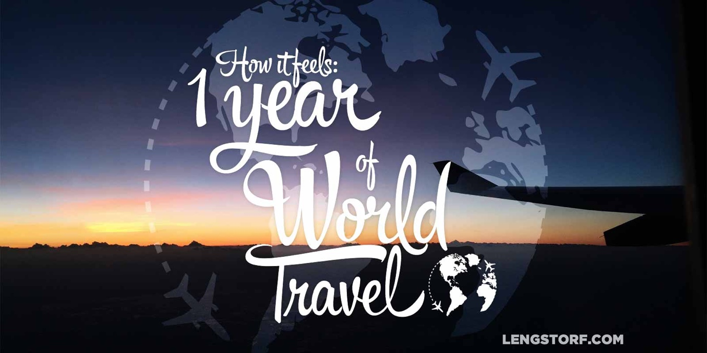
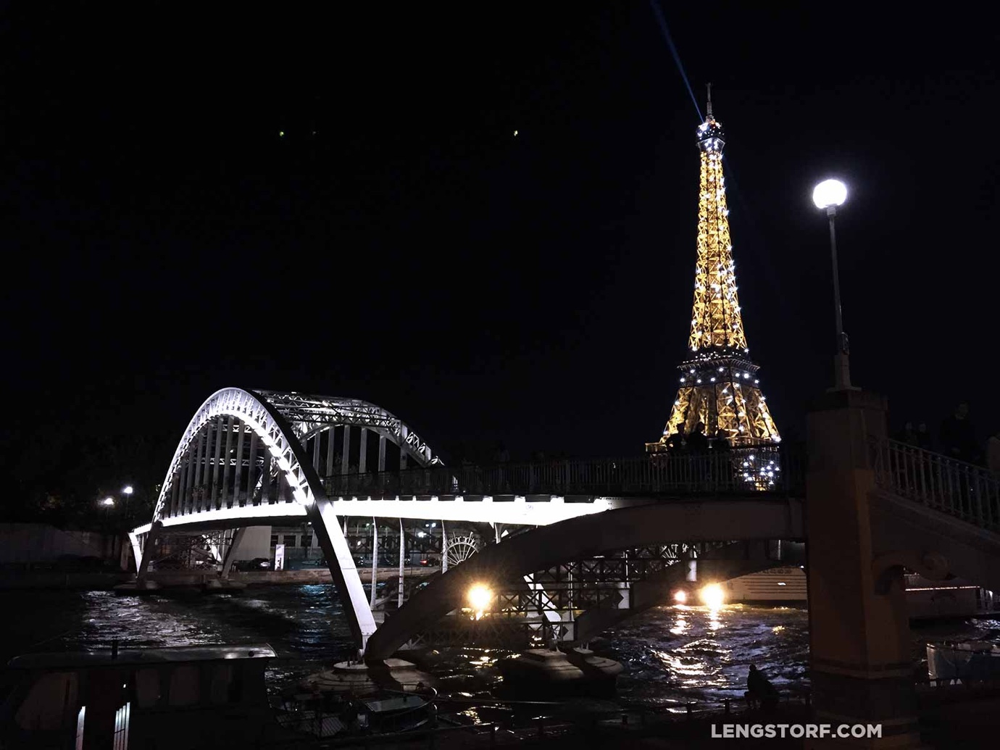
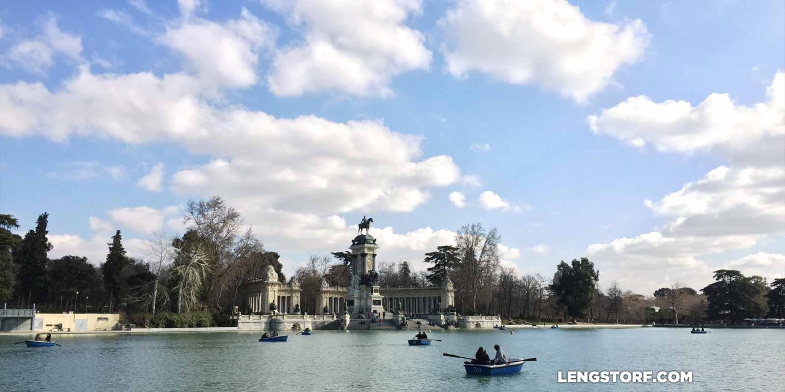
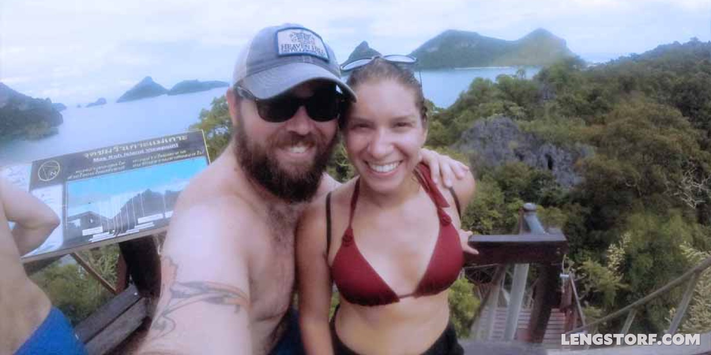
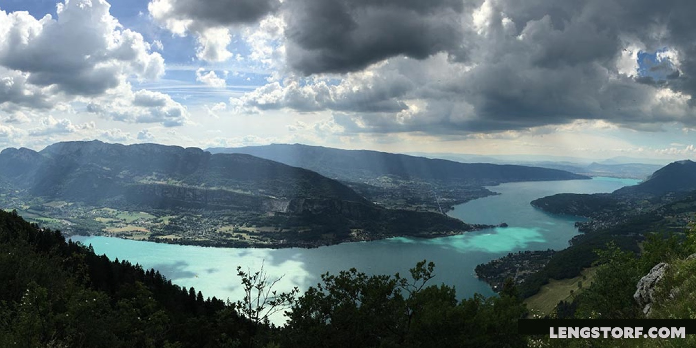
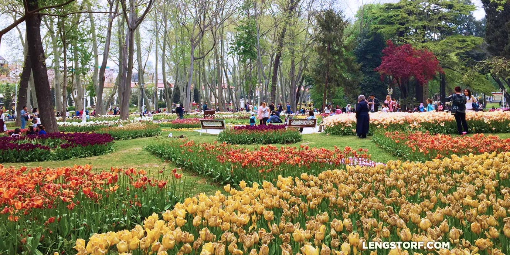
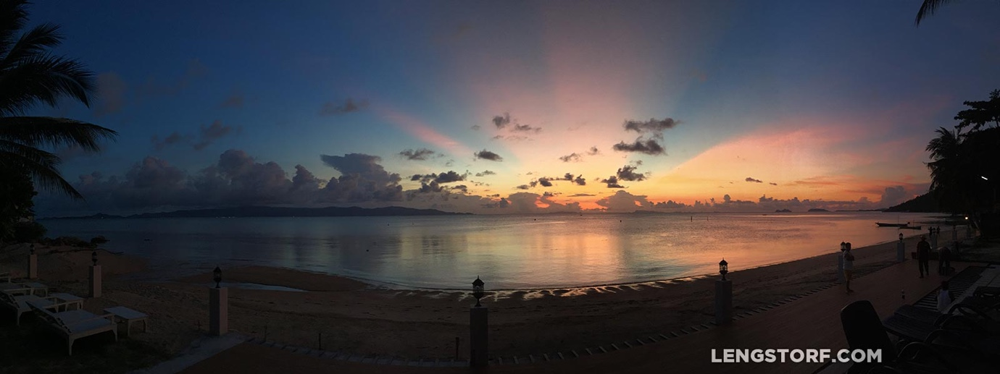
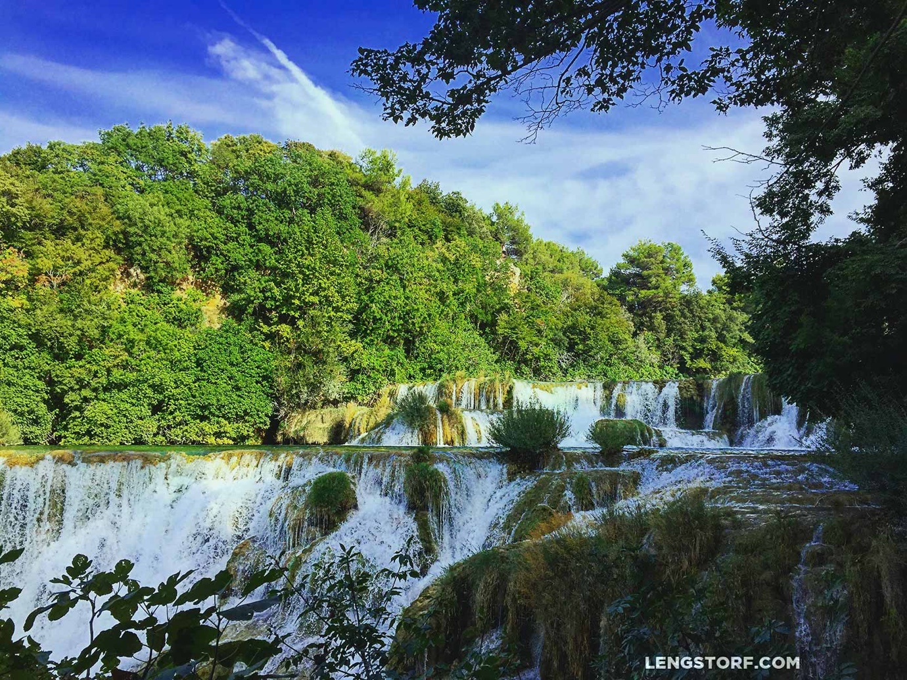

import { Image } from '$components';

A year ago I stepped off a plane in Milan, Italy, carrying everything I owned in
two small bags. I'd just given up the lease on my apartment, and I had no
intentions of getting another one.

For the last year, I've worked as a freelancer[^work] and traveled the world in
search of food, adventure, perspective, and . . . well, mostly food.

[^work]:
  Most of my income this year came from software and design work. I also made several public speaking appearances, took on consulting clients for both business and personal development, and wrote a few articles.

I'm purposefully writing this post without a clear goal. I just wanted to
free-associate what I've done in 2015 as a way to surface what I remember most,
what I saw, and what left an impact on my life.

<Image
  caption="I’ve been living abroad for a full year now while earning a living. And if you’ve ever dreamed of doing the same thing, <a href='/remote-work-course'>I want to help you</a>."
  credit="Jason Lengstorf"
>

  

</Image>

## 2015 in (Mostly Useless) Stats

1. Continents visited: 3
2. Countries visited: 9
3. Average hours per week on the computer: 35.63[^computer-time]
4. Productivity (working vs. non-working computer time): 92%
5. Hours spent watching Netflix: 131
6. Hours spent dealing with email: 90
7. Hours spent in meetings: 40[^meetings]
8. Debt eliminated: 100%[^cost-of-living] — I really wasn't kidding when I said
   [it's cheaper to travel than to lease an apartment](/cost-of-living-remotely).
9. Blog posts written: 34
10. Books written: 1

[^computer-time]:
  Computer time was measured using RescueTime, which I started using the second week in February. I've logged 1,639 hours since the week starting February 15 (46 weeks), so my math was `1639 ÷ 46 = ~35.63`.

[^meetings]:
  This might be my favorite stat for the whole year. Because on one hand, _holy shit!_ I spent one full working week in on video meetings in 2015. But on the other hand — compared to previous years — _holy shit!_ _I only spent one full working week in meetings in 2015!_

[^cost-of-living]:
  Even without the [potential tax breaks for long-term travelers](/remote-work-travel#hypothesis-5-living-abroad-for-an-extended-period-of-time-means-big-tax-breaks), this year of travel meant _huge_ savings for me. Because I spent the majority of the year in countries with a lower cost of living, like Thailand and Croatia, I ended up spending a lot less over the course of 2015.

I haven't actually told anyone about my new book yet. So... you heard it here
first!

The book is called [_Untethered_](http://www.amazon.com/gp/product/B017SMEQ34),
and it's about the philosophy and practicalities of taking your show on the
road. If you have the ability to earn your living remotely — and if you don't,
[you definitely can](/how-to-become-location-independent) —
this book will help you transition from working remotely in a coffee shop down
the street from your office to working remotely in a coffee shop down the street
from the Louvre. It's a Kindle book, so
[get your copy on Amazon](http://www.amazon.com/gp/product/B017SMEQ34).

<Image credit="Jason Lengstorf">

  

</Image>

## Free-Form Musings About Traveling Permanently for One Year

### The world isn't as big or as varied as I thought it would be.

You can buy Coca Cola in a corner store everywhere in the world. Dove products,
Pringles, Nike, and Adidas, too.

People smile back when you smile at them. They tap you on the shoulder and hand
you something you dropped. They love to help other people learn to enjoy the
things they enjoy.

When I left, I'm not sure what I expected to find after deboarding the plane.
Maybe I was expecting to emerge into a bizarro-world version of real life, where
all the customs and social contracts were incomprehensible and strange. Maybe I
was expecting to feel like an anthropologist, standing apart from the indigenous
people, observing their odd customs and habits.

Really, I think I was just expecting things to be... _different_.

But when I came out at gate A4 and found myself staring into the glowing beacon
of a McDonald's menu, I realized the world is a pretty homogenous place these
days. I mean, shit: I'm in Vietnam right now, and there's a goddamn KFC two
blocks from my apartment.

<Image caption="Even the French were nice to me." credit="Jason Lengstorf">

  

</Image>

### People who complain about other countries being full of assholes are probably assholes.

Maybe I'm just leading a charmed life, but I have yet to encounter a country
full of rude people. But to read sites like TripAdvisor, you'd think everyone
who's not American is a rude, conniving scumbag trying to swindle you out of
your hard-earned travel fund.

I'm not a particularly warm and fuzzy person. I have Resting Dick Face,[^rbf]
which grows especially standoffish when I'm thinking. But I'm nice to people,
and I try to be respectful.

[^rbf]:
  This is the male equivalent of [Resting Bitch Face](https://www.youtube.com/watch?v=wIZybnmE4x8).

As a result, I've been treated with courtesy and respect everywhere I go,
whether it's a busy deli in New York or a street stall in Istanbul. Even when
I'm clueless and using charades as a last resort, people are patient and
helpful.

I think people want to be nice. But if you're a dick, or you give them the
feeling you don't respect them, their defenses go up.

So don't be a dick, and you'll probably have an awesome time while traveling.

<Image caption="La Sagrada Familia in Barcelona, Spain." credit="Jason Lengstorf">

  

</Image>

### Productivity is even easier on the road. (If you're willing to work.)

A standard-issue joke when I tell people I'm in places like Thailand goes
something like this:

> Man, I bet you have a hard time getting any work done when you're at the
> beach, right?

First, sure. It's pretty hard to work at the beach.

But why would I want to work at the beach? I'd rather get my work done, _then_
go to the beach.

And when you're on the other side of the planet from most of your clients, it
creates a unique opportunity: you're working while your clients are asleep, and
vice versa. If you [do a good job of planning](/effective-project-planning) the project, it creates an amazing
opportunity to _just get shit done_ and then do something else.

Using my [context-based scheduling approach](/scheduling-maximum-productivity), I was able to get all of my work
each week done in a little under 33 hours. Now, if we assume I sleep eight hours
a night, that means I have roughly 79 hours each week where I'm both A) awake
and B) not working, during which I can go to the beach, wander around to look at
the city, try a new restaurant, or do anything I want.

And, to be clear, that 33 hours covered my full-time freelance workload, my
writing time, and all my hobby projects.

It's physically uncomfortable to think about how much of my "working" time was
wasted prior to 2014.

<Image caption="Buen Retiro Park in Madrid, Spain." credit="Jason Lengstorf">

  

</Image>

### I'm not a fucking "digital nomad".

It became immediately clear to me upon leaving that I'm skittish about labels.
I've used the phrase "digital nomad" when referring to my lifestyle, but the
novelty is gone. It feels clique-ish — like calling yourself a "jock" or "goth"
— and creates this illusion that there's a secret Digital Nomad Society that
only the elite can join, which is about as far from the truth as you can get.

So I'll stick to what I was before I left Portland: a speaker, an author, a
coder, a designer, and a guy who's willing to travel absurd distances for the
promise of amazing food.

### The best way for me to travel is slow, with weekend sprints.

<Image
  align="right"
  caption="Ang Thong National Marine Park in Thailand."
  credit="Jason Lengstorf"
>

  

</Image>

In a day or two, you can only see the sights: a riproaring dash between photo
ops before collapsing into an exhausted pile of hidden money belts and camera
bags on the plane ride home.

In a week, you can start to feel if the city agrees with you. You can start to
see the edges of the real city showing through the tourist sheen, and the
newness starts to give way to the true character of the city. The grittiness and
noise of Hanoi might feel "real" and "authentic" for a few days, but after a
week you'll be pumping white noise and counting down the days until you breathe
fresh air again.

A month is where you start to understand if there's long-term potential. Are you
antsy? Are you acutely aware of how many days are left until you leave? Or are
you settling in, finding your spots, making friends?

My preference is to stay at least a month in each city to really get a feel for
it. However, it's impractical (and sometimes awful) to commit to a full month in
a city before you know anything about it.

I'm currently in Hanoi, Vietnam, and while it's a cool city, it just doesn't
really agree with me. I love the food, and I have an odd sort of appreciation
for the Chaos Mode traffic, but I'm also really bothered by the smog, the noise,
and the layer of grime that seems to coat everything here. If I had it to do
over again, I'd spend a long weekend here, during which I'd have realized that
Hanoi and I don't really get along.

<Image
  caption="One of our side trips: five days in Annecy, France."
  credit="Jason Lengstorf"
>

  

</Image>

The trick, then, is to set up in a city you like, and take smaller, satellite
trips for four or five days to nearby cities you'd potentially like to hit next.
We did this in Italy and Croatia, and learned that Naples is good for a day
trip, but Zagreb looks like somewhere we want to give a full month.

A long weekend is a blind date with a city. You won't always know if you love a
city in just a few days, but you can at least (hopefully) screen the places
where you'd be miserable.

<blockquote class="instagram-media" data-instgrm-captioned data-instgrm-version="7" style=" background:#FFF; border:0; border-radius:3px; box-shadow:0 0 1px 0 rgba(0,0,0,0.5),0 1px 10px 0 rgba(0,0,0,0.15); margin: 1px; max-width:658px; padding:0; width:99.375%; width:-webkit-calc(100% - 2px); width:calc(100% - 2px);">
 
 

 
 <a href="https://www.instagram.com/p/-fk8gOzK1w/" style=" color:#000; font-family:Arial,sans-serif; font-size:14px; font-style:normal; font-weight:normal; line-height:17px; text-decoration:none; word-wrap:break-word;" target="_blank">Today is Loi Krathong. Tonight, people will float their krathongs on the river to symbolize letting go of their anger. I can get behind that. #chiangmai #thailand</a>
 
A post shared by Jason Lengstorf (@jlengstorf) on <time style=" font-family:Arial,sans-serif; font-size:14px; line-height:17px;" datetime="2015-11-25T03:52:45+00:00">Nov 24, 2015 at 7:52pm PST</time>

</blockquote>

### Every city has a personality.

A place to live is a relationship. Each city has its own personality, and it's
incredibly important that its personality is compatible with yours.

When I left Montana for Portland, I had spent most of my disposable income
investigating cities that sounded sexy to me: New York, LA, San Francisco,
Austin, Seattle, Portland, Chicago. All of them seemed like a great potential
place to land.

But as I spent more time in each city, I noticed where the tensions were: New
York was too cold in the winter, and — along with San Francisco — too expensive
for my freelance income that wasn't going to get a cost-of-living adjustment
when I moved; LA was a hard pass — too much driving, too much attitude; Chicago
was _way_ too fucking cold most of the year; Austin I loved, but it was way too
hot; Seattle wasn't as walkable as I wanted it to be.

But Portland and I just clicked. It was small without lacking anything I could
imagine wanting. It was driven by a younger crowd that, for all its hipster
ridicule, is driven by doing one thing — whether that's making furniture, making
liquor, or making dinner — and doing it with more passion and care than I'd ever
seen. It was temperate, and the rain didn't bother me nearly as much as the
snow. It was more affordable (although I think that's changing now that the
word's out).

<Image  caption="Gülhane Parkı in Istanbul, Turkey." credit="Jason Lengstorf">

  

</Image>

As I've traveled around for the last year, I've loved seeing each new city's
personality. Some of them immediately felt like home: in Zagreb I felt the same
spirit that I felt when I first visited Portland; in Chiang Mai I saw a unique
blend of local businesses and western influence working together without turning
the city into a watered-down Disneyland for Expats™ version of itself; in
Barcelona I felt like _part_ of the neighborhood.[^bcn]

[^bcn]:
  Although I may be biased toward Barcelona. I met a business owner there, Humberto, who knew everyone and set us up with so many great introductions, recommendations, and experiences that it's hard to say if I would have seen the same personality had I not wandered into [Malamén](https://www.facebook.com/malamenbarcelona).

Other cities immediately rubbed me the wrong way: London had the sullen vibe of
people who really didn't want to live there, but needed to because "everything
happens in London"; Hanoi, Vietnam is loud and dirty and smoggy; Tamarindo,
Costa Rica is the antithesis of Chiang Mai, an absolute Disneyland for Expats™
that pushed out local culture in favor of building Costaricaland where white
people can escape America without leaving behind any of American culture.

Most cities, though, took time to show their personalities. I thought Istanbul
was awful my first day there, but as I saw more of it, I realized it was just
different from what I was used to — after a week, I was sad to leave because I
realized I'd completely misjudged it at first.

<Image
  caption="This is an untouched iPhone photo of the sunset in Koh Phangan, Thailand."
  credit="Jason Lengstorf"
>

  

</Image>

## Looking Forward to 2016

When I [originally planned to leave](/remote-work-travel),
the stated goal was a year without a lease, outside the US.

That year is over. So what do I do now?

At the moment, I think I'll just keep doing what I'm doing. The world is a big
place, and I still don't feel like I've seen very much of it. Marisa and I are
still having fun, and our list of things to see has only gotten _longer_ as
we've made our slow lap(s) around the planet.

<Image
  caption="One of the most beautiful places I've ever been: Krka, Croatia."
  credit="Jason Lengstorf"
>

  

</Image>

So for 2016, we're going to stay on the road. We don't _really_ have a plan yet,
but Japan is on the books for March/April. After that, maybe summertime in
Europe. South America when it gets cold again. Or maybe Africa.

Who knows? It's a big world. Let's go see what we can see.
