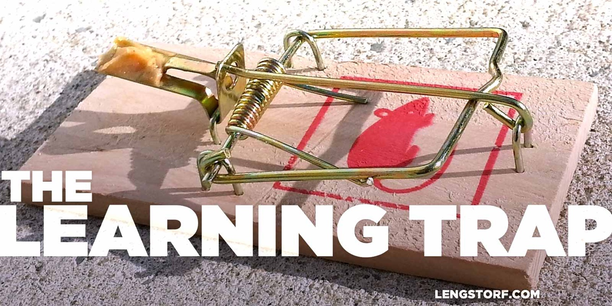
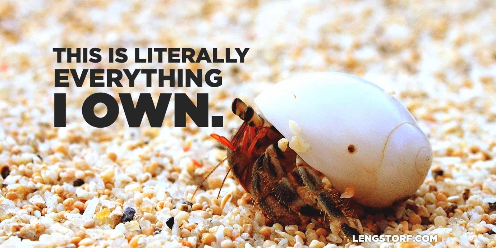

import { Image } from '$components';

I love learning. I want to know everything.

I deeply believe curiosity is what will eventually fix all the world's problems.

When I meet new people, I consider their curiosity as the biggest factor in
whether or not I want to spend more time around them.

But there's a catch.

New knowledge has an unintended side effect I can't seem to shake: **learning
new things always turns me into a gaping asshole.**

I call it The Learning Trap.

## The Standard Learning Progression

First, some context. According to a
[theory developed by Noel Burch](https://en.wikipedia.org/wiki/Four_stages_of_competence),
there are four stages of learning:

1. **Unconscious Incompetence.** We're bad at a thing, but we don't care because
   we don't know the thing exists in the first place. This is the "ignorance is
   bliss" part.
2. **Conscious Incompetence.** We're made aware that we are bad at the thing.
   Many of us stop here and adopt a
   this-is-stupid-and-anyone-who-disagrees-with-me-is-also-stupid
   attitude.[^everything-im-not-good-at-is-dumb]
3. **Conscious Competence.** With lots of practice and high levels of
   concentration, we can do the thing at a fair-to-middling level. This is how I
   feel about folding long-sleeved shirts.
4. **Unconscious Competence.** Also known as mastery, where we can do the thing
   without thinking about it. Easy examples include walking and speaking our
   native language.

[^everything-im-not-good-at-is-dumb]:
  "Rather than learn this thing, I shall publicly deride it, and adopt an air of smug superiority to shame its participants."

This is a generally-accepted representation of the learning process, as hashed
out by people much smarter than me, based on years of research.

## The Standard Learning Progression (Adjusted for My Shitty Attitude)

The Learning Trap lurks inside a different progression, however — one that
[Nate](http://thenategreenexperience.com) and I noticed as we've observed our
own behavior while learning:

1. **Clueless and Happy.** I have no idea that I'm stupid.[^ninety-nine]
2. **Self-Conscious and Defensive.** I am now aware that I'm stupid, and I'm
   pissed off that you pointed it out.
3. **Marginally Capable and Wholly Condescending.** _(a.k.a. The Learning
   Trap.)_ I know exactly enough to fake like I know what I'm talking about. It
   is now my mission to — in a condescending, self-congratulatory manner —
   ensure everyone around me is Self-Conscious and Defensive about this subject.
4. **Experienced and Unconcerned.** I know the topic well enough to realize
   there's no need for (and, really, no benefit to) forcing my knowledge on
   anyone.

[^ninety-nine]:
  This is the stage I'm currently in for roughly 99% of everything there is to know. It's on my bucket list to get that number down to 98% before I die.

Over drinks with [Phil](http://www.precisionnutrition.com/about/phil-caravaggio)
last year, I put the stages another way:

<blockquote class="twitter-tweet" lang="en">
The path of learning according to <a href="https://twitter.com/jlengstorf">@jlengstorf</a>: know nothing &gt; know a little &gt; insufferable asshole &gt; wisdom.
&mdash; Phil Caravaggio (@philcaravaggio) <a href="https://twitter.com/philcaravaggio/status/609198781154902016">June 12, 2015</a></blockquote>

## The Learning Trap: Travel Edition

In mid-2014 I knew nothing about world travel — full-on _Clueless and Happy_.
I'd taken two short European vacations, during which I'd been to Ireland and the
UK twice, plus a couple days spent in Amsterdam and Belgium.[^english]

Outside of those two trips, my only travel outside the US had been a couple
teenaged beer runs to Calgary.

[^english]:
  Worth noting is that I avoided any country where English wasn't more or less a first language.

Then I committed myself to [spend a year outside the United States](/remote-work-travel) — and smashed into _Self-Conscious and Defensive_ ego-first.

Naturally, I'd run my mouth off about the trip to almost everyone I knew. **People asked questions, and I wanted to punch every curious friend in the throat for drawing attention to my lack of answers.**

In the months between booking my ticket and boarding the plane, I read
everything I could find by other travelers to fill in the gaps in my knowledge.
I knew I'd need practical knowledge eventually, but I was happy to build a
theoretical base in the meantime.

<Image>

  

</Image>

The more I read, the more confident I became. I eased into _Marginally Capable
and Wholly Condescending_ like a comfortably broken-in pair of
shoes.[^dunning-kruger]

[^dunning-kruger]:
  There's some research supporting this. The [Dunning–Kruger effect](https://en.wikipedia.org/wiki/Dunning%E2%80%93Kruger_effect) describes the overconfidence felt by people with low competence. If you're borderline incompetent, you're prone to overestimate your own skill. You're also more likely to dismiss the expertise of others.

I was in The Learning Trap. Again.

**Armed with unverified research and limitless zeal, I unleashed an awareness campaign on everyone unfortunate enough to fall within earshot.**

"[Travel is cheaper than a lease](/cost-of-living-remotely)," I cried
from my high horse. "It's easier than ever to [become location independent](/how-to-become-location-independent)! Don't you understand?
[_Remote work is the future!_](/remote-work-everyone-wins)
You have to
[stop overworking or you're going to die](/overkill-cult)!"

And I didn't care that most people don't have any interest in selling everything
they can't carry and living like a nomadic hermit crab, because I was galvanized
by how un-fucking-believably _correct_ I was.[^discourse]

[^discourse]:
  **How to solve all the world's problems, by Jason Lengstorf:**

  The breakdown in public discourse today — about politics, books, music, or whatever — happens because most of us spend the majority of our time permanently mired in the _Marginally Capable and Wholly Condescending_ stage of learning.

  There's just Too Much Stuff™ to know, so we comfort ourselves by knowing a little bit. And knowing a little bit _is_ better than knowing nothing.

  _Unless knowing a little bit somehow convinces us that we know everything and should be considered experts when the time for important decisions arises._

  Unfortunately, because we all know a little, we're convinced of our Indisputable Rightness, and we either shout into an echo chamber of other people who have the same limited knowledge and who agree with us because they, too, are Indisputably Right; or we hit the brick wall of an opposing opinion that, like us, has (different) limited information and is similarly convinced of its Incontrovertible Correctness.

  The American media today is a great real-world example of what happens when an unstoppable force meets and immovable object: shit goes sideways.

  There are no experts anymore, because we burn them at the stake for questioning our Indisputable Rightness. Instead we sink to partially-informed mob justice because our tiny bit of knowledge convinces us that we, too, have Valuable Opinions, and since our Valuable Opinions stem from Indisputable Rightness, the experts are clearly in the pocket of Big Wrong and we can safely ignore them.

  There is no discourse anymore. There are only the Indisputably Right and the Incontrovertibly Correct, and neither side seems willing to do further research to recognize that maybe — just maybe — we're all working toward the same goals from different ends of the spectrum, and if we were to actually read the article attached to that headline that launched our most recent Twitter rant, we might realize both viewpoints arrive at somewhat compatible conclusions.

  Where public discourse would really benefit is if the semi-informed — which is you and me in roughly 99% of issues being discussed — would just _shut the fuck up_ and listen to people who have dedicated their lives to learning the things being discussed.

  If we're talking about software or travel or small businesses, I have lots of fairly well-informed opinions. But I don't know that I could even explain what macroeconomics _is_, let alone make informed choices about what's best for global trade.

  (Macroeconomics has something to do with global trade, right? I'm making that assumption because "macro" means big, and global trade affects the economy and is also big. I refuse to look this up because I think it's doing a pretty good job of demonstrating my point right now.)

  I want my opinion to matter. But sometimes it doesn't. And as much as it pains me to admit it, sometimes I need to sit quietly and let someone more knowledgeable do what's best — or start studying hard so I can make an _informed_ contribution.

<Image
  caption="You know what’s fun? Carrying everything you own with you at all times!"
  creditLink="https://www.flickr.com/photos/verzo/9353230567"
  credit="Roberto Verzo"
>

  

</Image>

For the record, I still _believe_ all those things, and I'm still advocating
them as much as possible. But now that I've clawed my way out of The Learning
Trap again, I'm far less likely to harangue a stranger in the line for coffee.

### How dare you not know that thing I just learned a few minutes ago?

My pedagogical reign of terror was the primary symptom of The Learning Trap.

**This happens when we 1) learn something, then 2) can't believe how we possibly never knew it before, and 3) immediately look with derision toward others who don't possess the knowledge we gained a few seconds earlier.**

<blockquote class="twitter-tweet" lang="en">
8:02: Learn new information.&#10;8:07: Overhear discussion re: new information.&#10;8:08: Condescendingly offer opinion formed six minutes earlier.
&mdash; Jason Lengstorf (@jlengstorf) <a href="https://twitter.com/jlengstorf/status/674980634490626049">December 10, 2015</a></blockquote>

I hadn't even boarded my first flight, but I already felt superior to everyone
around me who didn't know how great travel was.

## Climbing Out of the Trap

It's been [over a year since I started traveling](/one-year-of-world-travel); most of the glitter has washed off at
this point. I don't look at travel as an indicator of whether or not someone is
enlightened anymore — that's something my embarrassingly elitist self from a
year ago would think.

Instead, I look at travel the way I used to look at living in Portland vs.
living in Montana: some people prefer cities because they want more and better
restaurants, better walkability, or more nightlife; some people prefer small
towns because they like knowing everyone they pass on the street by name, quiet
nights with endless, starry skies, or having a forest in their back yard.

Some people find travel exciting and rewarding. Others find it stressful and
draining.

Neither group is wrong.

**There's no such thing as an incorrect personal preference — what _is_ wrong is trying to force a personal preferences down someone else's throat. And that's why The Learning Trap is so hard to escape.**

When I was first getting excited about travel, I couldn't imagine a world where
someone _wouldn't_ be excited about it. And that excitement made me forceful
with my opinions.

What I _thought_ I was doing was sharing something amazing with people who may
not have realized it yet.

What I was _actually_ doing was evangelizing something that, honestly — if
someone was interested — they'd've probably already fucking Googled it.[^google]

[^google]:
  And, as a result, they would most likely have the same information I had, because who clicks past the first page of Google results, anyways?

## We Don't Need Consensus

Travel was the latest in a long line of Learning Traps I've fallen into and
dragged myself out of, dirty and ashamed. In high school I was convinced metal
was the only _real_ music,[^filth] and people like Justin Timberlake were
everything that was wrong with the world.[^jt] I was once strongly in favor of
robot government. For a while I [went evangelical on my dad about coffee](/taste-doesnt-matter).

[^filth]:
  "Seriously, bro, you haven't heard _true_ musical genius until you've heard Danny Filth wax romantic about disembowelment in a falsetto shriek."

[^jt]:
  I don't feel that way anymore, JT. We should hang out.

In the _Marginally Informed and Wholly Condescending_ stage, it's easy to start
looking at our new ideas as necessary or non-negotiable. But that's less because
the idea is _actually_ vital — after all, I lived twenty-nine years blissfully
ignorant of the travel lifestyle before I started excoriating others for their
ignorance — and more because we're desperately trying to assure ourselves that
this new obsession is a good thing.

I need you to buy into my travel obsession because I need group acceptance to
make it okay for me to believe this. I don't want to be crazy.[^honey]

[^honey]:
  If I found out that rubbing honey on my balls made me happy, I would want everyone else to rub honey on their business, too. I'd tell myself it was because I wanted them to be as happy as I was, but in reality I'd be trying to force other people to validate my non-standard application of honey.

  Because if they don't, I'm not a visionary; I'm just a weirdo with sticky junk.

But with experience — reaching the _Experienced and Unconcerned_ stage — I
realized in every case that **consensus of opinion just doesn't matter.** The
thing I like works for me — whether or not anyone else agrees.

## Short-Circuit the Cycle

I still don't know how to skip the insufferable asshole part of learning
something new. If you figure it out, let me know — after you've gotten over the
insufferable asshole part of figuring it out, that is.

But I try to be more aware of what I'm doing now. I try to withhold my opinion
in conversations until I'm asked for it. I try to notice and squash derision
before it forms a smirk when someone doesn't know something I've already
learned. I try to remember that for every piece of information I have that
someone else doesn't, there are ten thousand things I _don't_ know.

It hasn't cured me — I mean, shit, I was probably condescending within this post
about trying not to be condescending — but the people who've known me longest
_have_ commented that I suck a little less to talk to these days.

And I'll call that a win.
