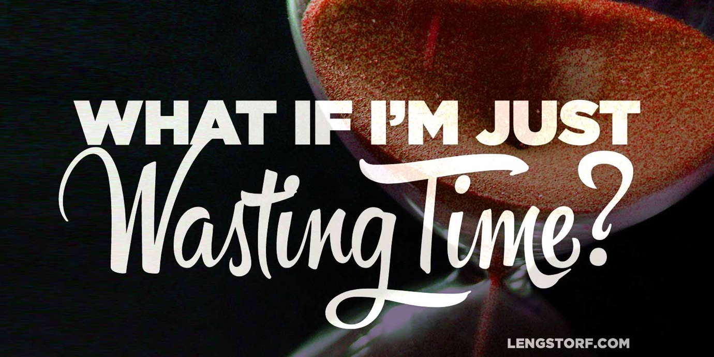

import { Image } from '$components';

At breakfast a few days ago, Marisa and I were talking about her transition into
[freelance copywriting](https://marisamorby.com) over the last year, and the
twists and turns she's dealt with along the way. There was a twinge of despair
around the edges of the conversation, and when I poked at it[^poke] she started
talking about time.

[^poke]:
  That's what you're supposed to do when you see that something is bothering someone, right? Poke at the sore spot?

<Image>

  

</Image>

"**I worry that I've already wasted so much time. What if I start working on one of these ideas and it doesn't work?** I'll be even further behind," she sighed, and gave me her best exasperated pout. **"I just don't want to waste any more time going in the wrong direction."**

For a brief, strange second I saw inside Marisa's mind.

> I'm in at the edge of a clearing ringed with orchids, a rainbow flowing
> through its center like a small stream. Near the edge, a unicorn drinks from
> the rainbow, glittering like David Bowie and humming
> ["Once Upon a Dream"](https://youtu.be/TXbHShUnwxY). It spots
> me, and pointedly looks toward the mouth of the rainbow.
>
> I follow its gaze, and I see a teal lake at the foot of a mountain. At the
> mouth of the rainbow, a mermaid with an explosion of curls stands guard, and I
> realize that the mountain isn't a mountain at all, but magical sand from a
> magical hourglass — Marisa's time.
>
> As I draw closer, the mermaid bristles and booms, "HEY. BACK THE FUCK UP. I'M
> PROTECTING THIS TIME."

And then I had one of those realizations that seemed so obvious in retrospect: Marisa, and I, and probably everyone else ever — **we were looking at time all wrong.**

## A Shift in the Realities of Time

Let's get deep(ly unscientific) for a minute and talk about time, as it exists
in our current realities.

Time flows through a mysterious hole in the universe, originating from a
much-debated wellspring just beyond our comprehension. So time rains down upon
us from the fourth dimension or whatever, and we're all given the opportunity to
use a finite amount of it — until we run out of time and die.

And that's where the fundamental misunderstanding comes in.

### We pretend time can be spent...

<Image
  align="right"
  caption="We seem to think we can save up our time until we’re ready to use it."
  credit="Jason Lengstorf"
>

  

</Image>

There's a delusion that, with an appropriate container, we can store our time
for later. We say things like, "I don't want to spend my time that way," and
imagine ourselves catching those unused hours in a jar, to be spent when we _do_
want to spend our time some way.

**We picture time as a liquid, like water, that can be dammed, diverted, stoppered, stored, labeled, and used at a later date.**

Over time, the most temporally responsible among us will boast shelves upon
shelves of bottled time, waiting for the right time to spend our carefully
stockpiled time. Aging it, so to speak.

### ...but that's not how time works.

A more accurate analogy for time is sunlight. Or wind.

The world spins, and depending on where we stand on it, we get so much sunlight
during the day. And if it's a windy day, the wind blows.

We can't store it. There's no bottle-aged sunshine. You can't crack open a can
of Blustery October Morning on a stifling July afternoon.

Time — like sunlight and wind — is a linear, nontransferable resource. It happens once, and then it's over. **Time passes and is lost, whether you "spent it" on something valuable or not.**

## The Two Possible Outcomes of Passing Time

With time's impermanence in mind, the idea that you can "waste time" by working
on "the wrong ideas" is ridiculous.

**Time will pass, whether or not you're working on something.**

The passing of time can provide two outcomes:

1. You receive new information about the world and where you currently fit best
   in it.
2. You receive no new information.

In one of these situations, we're putting time to work for us. In the other,
we're letting time pass — often under the pretense of "focusing only on what
matters" — and gaining nothing.

### Outcome #1: You receive new information about the world.

**If you work on _any_ idea — even the "wrong" ones — you will receive new information:**

* "Turns out I don't really like sales. I don't want to do that anymore."
* "I really enjoyed working with my hands when I took that woodworking class. I
  should do more of that."
* "I thought marine biologists just played with dolphins! Why am I scraping fish
  shit off an aquarium floor?"

This information can be used to refine how your future time is spent. **By
experiencing something new, you have improved your understanding of the world**,
and by extension, your ability to make better decisions.

### Outcome #2: You receive no new information about the world.

Thanks in no small part to the "only spend time on things that make your life
better" chorus all around us, there's a pressure to wait for the right idea
before putting in a solid effort.

**Doing nothing because you're waiting for the "right idea" _guarantees_ your time is thoroughly and completely wasted.**

You're still out the same amount of time as if you'd worked on something else,
except in this case _you've learned nothing_.

## Use Your Time Now — You Can't Use It Later

<Image
  align="right"
  caption="Cooking class in Rome. It’s hard to call this “productive”, but does that mean this time was wasted?"
>

  

</Image>

Our time is not like our bank balance. We can't live frugally and accrue tons of
time to spend later in life, after we've learned what we enjoy.

**We're born with a finite amount of time, and each day we lose 24 hours of it.**

When you refuse to start on something because you're worried you might waste
your time on it, you manage to both a) irrevocably waste your time, and b) make
no progress toward figuring out what the "right idea" may be.

## Pull the Trigger on New Projects and Learn Something

If we choose to sit and wait for "the right ideas" to come to us, we might wait
an awfully long time. However, if you're constantly working on something — even
if it ends up being the "wrong" idea — you'll learn things that will help you
find the right ideas that much more quickly.

So if you find yourself wanting to hold off on a new project because you're
worried it might be a waste of time, ask yourself two questions:

1. If I do this, will it prevent me from spending time on something that I
   _know_ is more important to me?
2. If not, what would I do with this time instead?

If you're not starting a new project at the expense of something valuable to
you, then the initial fear of "misspent time" is irrelevant — you don't have a
better place to allocate this time.[^thinking]

[^thinking]:
  "Trying to come up with a better use of my time," is not a valid excuse.

And if you don't start this new project — and you don't have something more
valuable to spend your time on — where will your time go instead? Idle
"research" on social media? Reading yet another article about finding your
passion[^fyp] or being more productive?[^productive] Some other clever disguise
for _completely_ wasting time?

[^fyp]:
  "I used to be miserable, just like you, until I found my passion, which is helping other people find their passion. You should buy my ebook on finding your passion so you, too, can find your passion — which is probably selling ebooks to other people about finding their passion."

  (Snark notwithstanding, I _do_ think you should [do what you love](/do-what-you-love).)

[^productive]:
  Productivity is important. I [talk about productivity](/scheduling-maximum-productivity) frequently. But there's a point where productivity research is like turning down sex because you're too busy masturbating.

<Image caption="Just a few of the many things I’ve “wasted” time on that weren’t my ultimate career path — each of which taught me something valuable I can apply to my life.">

  

</Image>

### There is no better way to spend your time than by gaining experience.

Don't worry about wasting time. It's spent no matter what.

**Instead, worry about _using time_.** Make sure the time that passes results in
new information and new experiences.

So go start that project that might be doomed. Build that side business that
you're nervous might fail. Take that class. [Take the trip.](/take-the-trip) _Take action._

It's certainly more temporally responsible than letting that time pass unused.

And — hey — you might just learn something.
