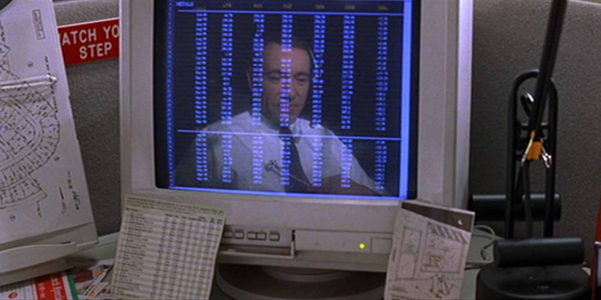
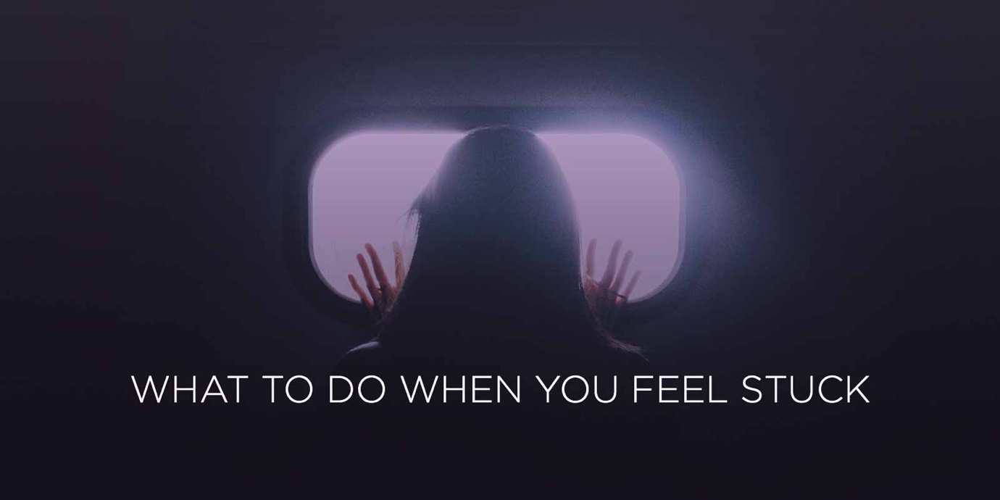
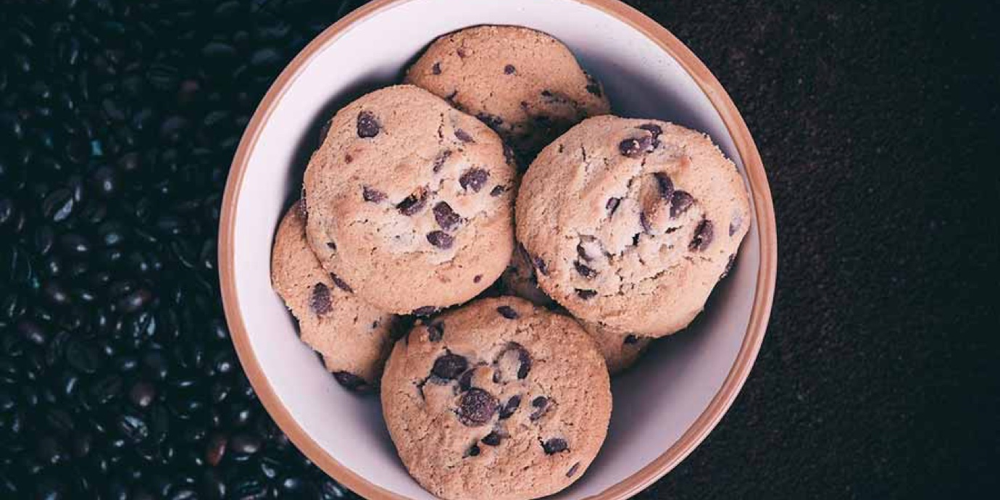

import { Image } from '$components';

Not so long ago, I was in a pretty dark place: my work had taken over my life,
and I had _zero_ balance. I was feeling lost, like I'd lost sight of who I was
supposed to be somewhere along the way.

**I had the sinking feeling that I was betraying a part of myself.** Somewhere
along the way, the innocent, hopeful, earnest kid living inside me — the one who
believed I could change the world and make a difference — had gone inside to
grab a snack at a truck stop, and I'd driven off without even glancing in the
rear-view.

**I felt hopeless — and ashamed**, because after all: who the fuck am I to
complain? I have _no right_ to complain about anything, ever.

But still — it felt like **something needed to change**, and in a big way. I
wanted to quit, disappear, change my name, and start fresh. I wanted to burn my
life down and start all over again.

**I didn't know what I wanted to be when I grew up, but it certainly wasn't this.**

But if not this, _what_ then? What _did_ I want to be when I grew up?

## When Life Starts to Feel Like a Cage

No matter how exciting or novel something sounds when we first start, **over
time it becomes the status quo — and that can make it feel oppressive.** Even a
dolphin trainer, at times, will forget how exciting it is to work with dolphins,
and instead feel caged in by the fish smell that doesn't wash out and its
deleterious effects on dating.

<Image
  caption="“I feel like I’ve been in a coma for the past twenty years.” – Lester Burnham"
  creditLink="http://www.imdb.com/title/tt0169547/"
  credit="American Beauty"
>

  

</Image>

So for those of us who don't feel like our jobs are all that exciting — say, the
computer programmers and administrative assistants and middle managers among us
— **it's easy to feel like our lives have fallen victim to mindless routine.**

**We feel like cogs in a machine, instead of people doing things that matter.**
We're casting our efforts into the gaping maw of anonymity, giving it everything
in our power, all the while suspecting that if we should collapse, a replacement
would step over our corpses to do the same thankless work before we'd even gone
cold.

### It feels like the only way out is to blow it all up.

In the darkest moments, **we fantasize about quitting** it all. Walk away from the life we've created and just start fresh. We could do something _better_. Something _important_. Something we'll be proud of.

We want to set fire to our old lives, hoping the flames will cleanse us of the restlessness and dissatisfaction and ennui, and from the smoldering rubble **we can emerge into a new life of fulfulling pursuits and meaningful contributions.**

Drastic measures start to sound appealing: a complete career shift; telling our bosses to go fuck themselves; faking our own deaths, buying a new identity on the black market, and living a quiet life on the outskirts of Topeka, Kansas as Pat Davis the shopkeeper.

We start to think there's a "next chapter" in our lives, and that it starts with a blank page. We start asking ourselves, "What do I want to be when I grow up?"

## Growing Up Means Fixing What's Inside First

As strong as it is, the urge to burn it down and start fresh is — at best — only a temporary fix. And more often than not, it does more damage than it repairs. Even in the best-case scenario, a complete nuke-and-pave of our lives only staves off the darkness for a while.

Inevitably, the newness of our new lives will wear off, and — assuming we haven't asked some critical questions of ourselves — we'll be just as unhappy in this new life as we were in the old one.

### Our lives aren't broken; they're out of balance.

It's tempting to interpret unhappiness as a signal that _everything_ is wrong. But, more often, only a few things are out of whack, and they're dragging all the good stuff down with them.

Thanks to a [deeply unhealthy working culture](/overkill-cult) in the western world — especially in the United States — we're encouraged to push hard toward the thing that sustains our living. Out of necessity, **other aspects of our lives drop down our todo list, and in many cases they're neglected entirely.**

As a result, **we're not living as whole people.** A whole person has depth and dimension, and that's what makes them interesting: the varied interests and experiences make their story unique and complex.

Someone who only does one thing becomes a one-dimensional character — and that makes their story uninteresting. And since [the primary audience for a story is the person living it](/stories.md), **it's a big problem if our story becomes uninspiring.**

<Image>

  

</Image>

## To Burn or Not to Burn?

When things seem darkest, **it feels like we have two choices**:[^dad-options]

1. **Suck it up and deal with our lives as they are.**
2. **Burn everything down and start over again.**

[^dad-options]:
  These are the options my dad used to give me when I was whining as a kid: "Look, you can either deal with it, or you can do something about it. But either way, shut the fuck up because I'm tired of hearing about it."

Fortunately for us, though, very few things in life are binary. And true enough, addressing nagging dissatisfaction in our lives falls on a spectrum.

**On one end of the spectrum, we can choose to accept our station in life, and make do with what we have.** This could be called "settling". Arguably, this is what most of us are afraid we're doing — and what's causing the darkness in the first place.

**On the far end of the spectrum is self-immolation: burn this fucker down, stomp out the embers, and rebuild.** This is, understandably, a terrifyingly risky proposition, and one that's pretty difficult to realize — especially if you have any kind of social ties.

### In the middle, there are options.

**Let's pretend that a happy life is a perfectly moist, crispy-on-the-outside-but-gooey-on-the-inside, warm-from-the-oven, chocolate chip cookie.** And that our job is to make the perfect cookie dough while we're alive.

<Image
  align="right"
  caption="If you want perfect cookies, learn what makes a cookie perfect."
  creditLink="https://unsplash.com/worthyofelegance"
  credit="Padurariu Alexandru"
>

  

</Image>

**The recipe itself is fairly straightforward**: you need eggs, sugar,
chocolate, butter, flour, baking soda, salt — maybe a little vanilla if you're
feeling naughty.

But **keeping that recipe balanced requires a deft touch.** After all, everyone
has a different Perfect Cookie™ — and there's no right or wrong answer. So we
all start somewhere in our teens or early twenties adding shit to a bowl and
stirring.

If we get the balance wrong, maybe the cookie dough is too dry. Or maybe there's
not enough flour and it's runny. Maybe we forgot the baking soda and our cookies
are coming out flat and uninspiring.

What should we do? Toss the whole bowl and try again? Eat the not-quite-right
cookies we've created?

Or maybe there's a third option: **fuck with the balance until things improve.**

If it's too runny, add flour. Too flat; add a touch more baking soda. Too doughy or crispy; play with the egg-to-flour ratio.[^bakers-note]

[^bakers-note]:
  Full disclosure: I have no idea what a proper egg-to-flour ratio is. I'm just repeating what Marisa — who is _actually_ good at baking — told me.

If things get way too out-of-hand, starting over is always an option. But all too often, **a small adjustment — just a bit more flour and minute or two off the cooking time — solves the problem and leaves us with _exactly_ the cookie we wanted.** (And, since we kept adding a bit more of everything to the recipe instead of starting over, we have more cookies altogether.)

## Create Real Change — Without Lighting Fires

Heavy-handed metaphors aside, there's something to be said for approaching the
problem as a matter of degrees instead of _true_ or _false_.

**If we're feeling stuck or unhappy, we shouldn't fantasize about burning it all down.** Instead, we should start asking the _really_ important questions:

### What could I be doing that would make me feel better?

We're feeling this way because there are things we're doing that are _not_
making us happy. This implies **that there are things we would rather be doing,
or that would be more fulfilling for us.**

What are those things?

### What am I neglecting that makes me feel this way?

Each of us has an internal barometer that lets us know when things are getting
stormy in our lives. Usually, **this is a warning signal that there's something
we think we should be doing that we're neglecting.**

Is there something in our lives that isn't getting the attention we think it
deserves?

### How can I add a little more of the things that matter into my life?

When we're out of balance, it means something is getting too much of our
attention, at the expense of other things that we find important. So where can
we cut back on the things that we're going overboard on?

**How can we carve out time for the things that really matter?** Do we need to
say no more often? Set better boundaries? Simply recognize that there's a
problem and be more mindful of it?

## How I Survived My Existential Crisis Uncharred

When I was feeling hopeless, like all the things I was doing were meaningless
and that I was somehow betraying myself, I decided to try the third option.

After asking myself some hard questions, I realized that **I could trace most of
my unhappiness to a couple root causes**:

1. I was spending _way_ too much time working, with zero downtime.
2. My smartphone had become an addiction that prevented me from fully engaging
   with anything that didn't come with a push notification.

**These two issues were behind everything else that was making me unhappy**: my
declining health, thanks to using work as an excuse to skip the gym; my hobbled
social life, since [my friends didn't want to put up with me ignoring them
through dinner](/fomo) to check email; my poor sleeping
habits; my weight gain; my sense of isolation — all of it was directly related
to the imbalances I'd created in my life.

### Right the ship instead of sinking it.

The guilt I felt for wanting out of my life was a sign I _knew_ — even at my
lowest point — that my life was pretty good. **My urge to escape was a knee-jerk
reaction to discomfort, not a rational desire to escape an unhealthy life.**

So I decided to attack the two root causes of my unhappiness instead of the
whole of my existence.

**First, I [got serious about managing my time](/scheduling-maximum-productivity).** I broke my smartphone
addiction by turning off notifications and leaving it in Airplane Mode when I
was out with friends. My clients didn't notice, but my friends started calling
me again.

**Second, I started to [take real time off from work](/better-productivity-work-less).** Creating a little space to be
away from work — despite my certainty that I'd end up unemployed and living on a
friend's couch — didn't have any measurable impact on my career, but it made a
_huge_ impact on my happiness.

These two changes addressed the majority of my issues, and left me feeling far less unhappy about my situation.

Even better, they helped me create the time I needed to start thinking about the third issue that nagged at me: **what could I do that would make a difference, instead of just making a dollar?**[^difference]

[^difference]:
  This one took me longer, but I think I've found the right answer for me. I'll be talking a lot more about this in the very near future — [get notified when it goes live](/productivity-habits) (you'll also get a compilation of my most productive habits).

## What to Do Right Now

If you're feeling stuck, unmotivated, or otherwise lacking direction or focus, I
have a challenge for you. Instead of choosing to burn it all down or settle for
what you've got, take the third option:

### 1. Break the negative spiral by calling out the good.

If you catch yourself thinking negative thoughts about your situation, cut that negativity short by short-circuiting the pattern: **stop what you're doing and call out three things in your life that make you happy.**

These can be anything: getting to the gym, spending time with family, working on a certain aspect of your job, or anything that makes you feel good.

Do this in a way that requires effort on your part. **Say it out loud, write it down in a journal, or [put them somewhere public](https://twitter.com/intent/tweet?url=https://lengstorf.com/i-want-to-start-over&via=jlengstorf).**

### 2. Come up with ideas to help you do more of the good.

**For each of the things that makes you happy, come up with an idea to incorporate more of that thing into your recipe.** For example, if you enjoy spending time with family, could you create a no-screens-allowed meal once a week?[^family-meal]

[^family-meal]:
  This is an idea I _love_. When I have friends or family in my area, I love to set up an early dinner where we all cook together, spend time talking, laughing, and just being together — all without phones or computers or television. It's only a few hours, and it only happens a couple times a month, so it's _very_ easy to justify taking three hours on the weekend to spend with the people I care about. This has been one of the brightest spots in my life since I started doing it.

**These ideas can be anything, as long as they're something you can _actually do now_.** No abstract thoughts, here. Instead of, "be more present with my family," try, "I'll shut down my laptop and turn off my phone by 7:30pm tonight so I can spend some quality time with my family."

Big ideas are hard to follow through on; small actions are easy.

## How Will You Fix Your Recipe?

If you've been feeling unsatisfied with where you're at right now, what are you
going to do about it? Are you going to burn it down? Deal with it? Or are you
going to **take the third option and start playing with the balance** to get it
right?

[Put your ideas in public.](https://twitter.com/intent/tweet?url=https://lengstorf.com/i-want-to-start-over&via=jlengstorf) Remember: **three things that make you happy in your life right now, and one idea for incorporating more of each thing in your life.**

Here's to delicious cookies for all of us.
