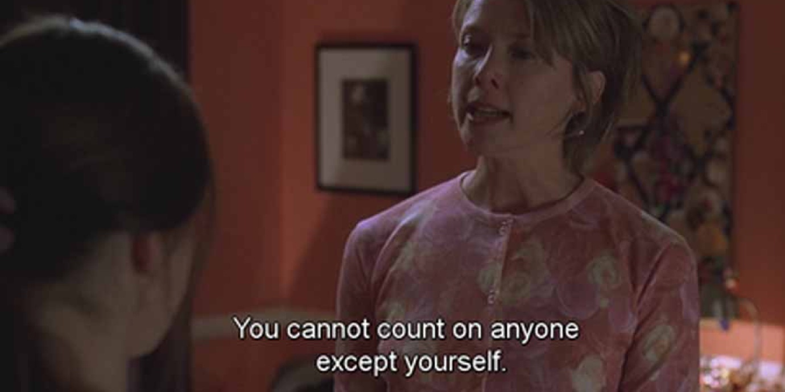
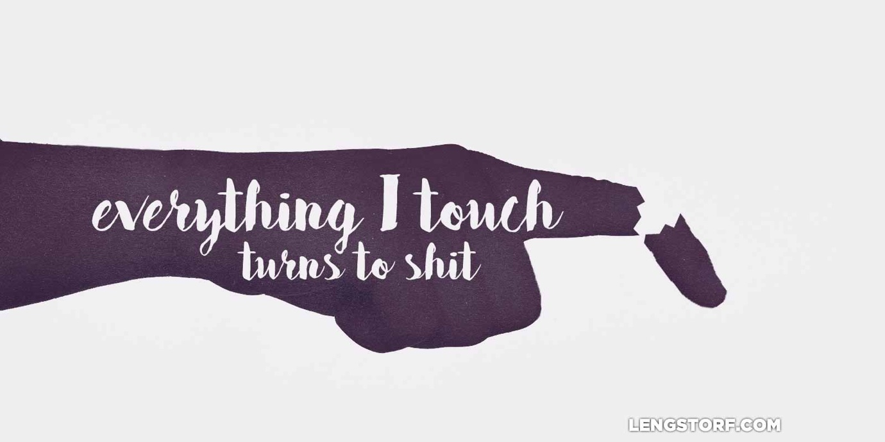

import { Image } from '$components';

I was nineteen or twenty, working at a pizza place for this Really Nice Guy™
named Tim.[^disclaimer] I was a manager, sort of. I worked six hour shifts,
three or four days a week, and I'd be the last one to close the restaurant,
count the till, and drop off the day's earnings at the bank.

[^disclaimer]:
  I'm changing the names of people and businesses here, because some of these people still talk to my mom.

The employees at Cheesy Express Pizza came in three flavors: a) people so dim
and solipsistic it's surprising they survived to adulthood; b) people barely
scraping by, shipwrecked by their own bad decisions or the bad decisions of
others; and occasionally c) someone really bright who stayed a month or so
before trading up to something better.

I told myself I'd trade up soon, but I was terrified that I landed squarely in
the first two categories.

My time at Cheesy Express came during my Rockstar Period,[^rockstar] and I'd
regularly ask Tim to give me two weeks or more off work so I could go on tour.
Tim agreed, being a Really Nice Guy™.

[^rockstar]:
  This is what my dad calls it. To most people, it was my Why-Is-That-Idiot-Wearing-Eyeliner-and-Jeggings Period.

Afterward, I'd slink back into work leaking PBR from my pores and still wearing
smudged eyeliner, and I'd put in my three or four shifts for another couple
weeks before asking for more time off.

---

It was after the second tour, or maybe the third, when I came home to find a
letter in my room from Tim, sent in an official Cheesy Express envelope. There
was no note inside; just a pink slip.

What injustice! What cruelty! What cowardice!

I hated Tim. No, it wasn't Tim's fault; Tim was a Really Nice Guy™. It was _his
wife!_ _She_ made him fire me. And actually, you know what? Fuck Tim, too,
because he didn't stick up for me.

<Image
  align="right"
  caption="This is my second reference to <em>American Beauty</em> in as many posts."
  creditLink="http://www.imdb.com/title/tt0169547/"
  credit="American Beauty"
>

  

</Image>

_The world is a cold place,_ I reminded myself. _You can't count on anyone but yourself._

My wisdom comforted me. I threw the pink slip away and wondered how much longer
it would take for my last paycheck to show up in the mail.

---

Getting fired was just the latest in an ever-growing series of events where the
world shit on me. Everything I touched, it seemed, either fell apart or actively
set out to hurt me.

I was cursed and the world was broken. I found equal parts solace and sadness in
the knowledge that I was the only sane human. Like, _in the whole world_.
Everyone else _had_ to be crazy — that was the only way I could explain how
terrible everything was.

I made it my mission to let everyone know about it. If I was going to be made a
victim, at the very least I'd be an unpleasantly loud one.

A cycle started: I'd try my hand at something new, it would inevitably fall
apart, and I would — retroactively — see how forces had conspired against me
from the very start to ensure I'd fail.

<Image credit="Jason Lengstorf">

  

</Image>

I had the Antimidas Touch.

I was doomed.

Resignation crept in and started whispering in conspiratorial tones, "Hey, man,
you want the easy way out? All you gotta do is let me take over."

---

Cheesy Express Pizza was part of a string of menial jobs I worked in hopes of
landing a single paycheck before I quit or got fired and went on tour with my
band again.

At another one of these jobs — another pizza place — I worked with an older guy,
Dave. Dave was a Lifer.[^lifer] He'd been a line cook since the restaurant
opened, happily putting in his shifts and occasionally buying beer for the
underaged dishwashers. He was odd and cheerful and he loved Phish and subjected
everyone in the kitchen to their countless live recordings as if we could pick
out the nuances in the [vacuum cleaner solos](https://youtu.be/1v4dIZNXfsE).

[^lifer]:
  It's always hard to tell if a Lifer is doing this job because they truly enjoy it and can't imagine another way to make a living, or if they just got the job and decided, "This is good enough," and never gave it a second thought, like the pioneers who stopped halfway to California and decided, "Fuck it. It probably doesn't get any better than this, and anyways my feet hurt. Let's call this place Nebraska and plant corn."

At this stage in my life I was humorless and angry and growing steadily more
convinced that I'd never find happiness or success, thanks in no small part to
the curse of the Antimidas Touch.

And Dave — either out of an earnest desire to help or the simple pleasure of
fucking with me — would dig into my psyche during our shifts together.

"What's wrong, my man? You always look so put out," he'd ask as he stirred a
ten-gallon vat of tomato sauce.

I'd glower at him as I weighed out five-ounce dough balls and rolled them. "It's
all fucked, Dave. Everything I touch turns to shit."

Dave chuckled a little, looked at me with a glint of something like pity, and
nodded, more to himself than to me.

Long after I'd assumed his silence meant we were done talking, he started
talking again.

"A man walks into the doctor's office and says, 'Doctor, something is really
wrong with me.'"

Dave pantomimed as he continued, "The man taps his knee and says, 'This hurts.'
He taps his shoulder — 'This hurts too!' — then his head, and complains, 'And
this — I hurt everywhere!'

"The doctor nods thoughtfully. 'Son, I think I know what's wrong with you,' he
says, after a pause. 'Your finger's broken.'"

I assumed Dave was high again, and chose not to engage him further.

---

It would be years before I'd get the joke.

Tim didn't fire me because he was a coward or a mean person; he fired me because
I was shitty employee, and I was abusing his kindness.

I wasn't cursed; I started everything under the assumption it was already
doomed, and because of that I'd subtly nudge it toward failure.

When I met new people and decided they hated me,[^new-people] I'd keep my guard
up and make sure we never had the chance to become friends.

[^new-people]:
  And since they hated me, it was safe to pre-hate them. Not because they'd done anything, but because they _would_ do something. Eventually.

So, sure, everything I touched _did_ turn to shit — but only because I worked so
damn hard to ensure a shitty outcome.

---

As I write this, it's about mid-morning in Whitefish, Montana. Dave is probably
stirring a ten-gallon vat of tomato sauce, listening to Phish, and making
cheerful conversation with a sullen teenager.

I don't know if he told me the broken finger joke as a roundabout teachable
moment, or if my complaining about a cursed touch simply called it to mind.

I don't know if it matters; I missed the point when he told me, anyways.

I'm a decade late, Dave. But I get it now.

_My finger was broken._
