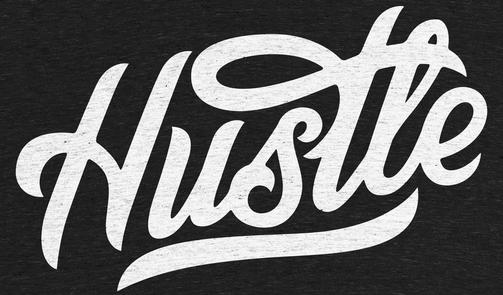
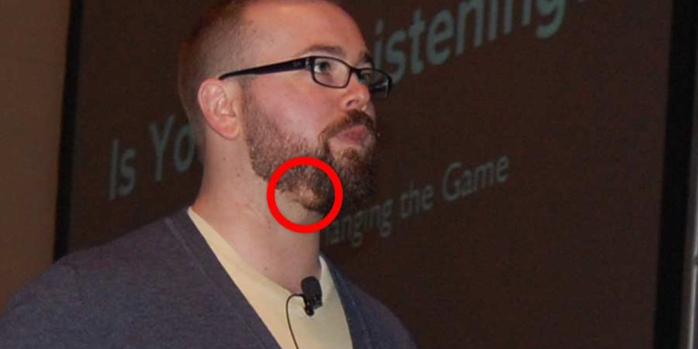
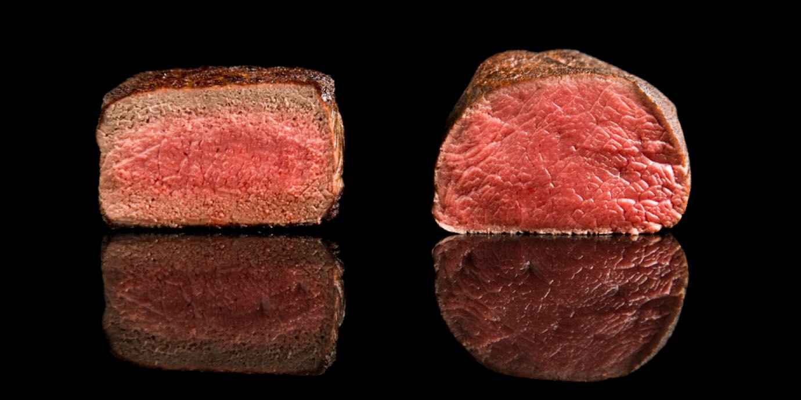
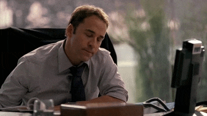
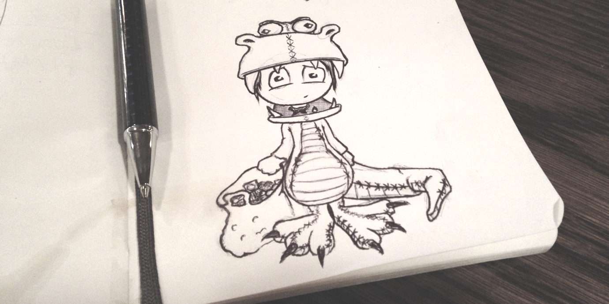

import { Image } from '$components';

There's this idea in American culture[^worldwide] that's so pervasive we tend to
accept it as fact:

[^worldwide]:
  As I've traveled the world, I've realized this isn't _just_ an American problem: everywhere I go, I see signs of the [Overkill Cult](/overkill-cult) at work.

> In order to get ahead, you've got to be willing to hustle harder than everyone
> else, and grind it out through long hours and late nights.

We see it everywhere, celebrated as the highest virtue: t-shirts and posters
that just say HUSTLE in a cool, hand-lettered font.

<Image
  caption="This design is really cool, but what type of culture is it reflecting?"
  creditLink="https://cottonbureau.com/products/hustle"
  credit="Nick Slater"
>

  

</Image>

### Hustle & Grind can be poisonous if it's not balanced.

I hustled _hard_ for over a decade: I started multiple businesses, grew my
client network, and built a reputation for myself.

I powered through when I felt exhaustion creeping in. _What's a few hours of sleep now_, I chided myself, _compared to becoming wildly successful in the future?_

I stayed on my grizzly[^grizzly] through weekends and holidays and late nights.

[^grizzly]:
  It's not offensive for me to say that because I'm part bear. Plus I have bear friends, and I asked them and they're totally cool with it.

And while I was ostensibly successful — I had a little money, I'd earned a
little recognition — I was also seeing real consequences: I gained a _lot_ of
weight, I rarely saw my friends or family, and then there was the curious matter
of [_my fucking beard turning white and falling out in patches_](/overkill-cult).

<Image caption="Stress-induced <a href='https://en.wikipedia.org/wiki/Alopecia_areata'>alopecia areata barbae</a>. I’m not a doctor, but that’s what was going on here.">

  

</Image>

**To hustle without clear goals and defined downtime is just as dangerous as unchecked sloth.**

To grind without limits — without sanity checks in place — will bring us as many
setbacks as it will advantages.

## The Truth: We Should Hustle Enough and Grind a Little

If I'd never hustled, I wouldn't have my current skill set or network. If I
hadn't been willing to grind through tough problems, I might have given up a
long time ago.

So I'm not in any way advocating the abandonment of hustling to get ahead, or
grinding to finish the hard things.

### But without limits, Hustle & Grind hits a point of diminishing returns.

Hustle & Grind is a critical part of "making it" — especially as an entrepreneur or freelancer. However — and this is a _huge_ however — **there comes a point where you've hustled enough; any additional hustling will do very little to move the needle, but will do a _lot_ to harm your mental and/or physical wellbeing.**

Consider this: when you're cooking a steak, you need to apply heat to make it
delicious. But if you continue to apply the heat past a certain point, you're
only damaging the meal; the additional heat doesn't make the steak more edible,
but it _does start to decrease how delicious that steak will taste_.

<Image
  caption="Would you prefer a steak that’s cooked just the right amount? Or one that’s cooked to the point of being chewy, dry, and flavorless?"
  creditLink="http://modernistcuisine.com/2013/01/why-cook-sous-vide/"
  credit="Modernist Cuisine"
>

  

</Image>

The secret to a delicious steak is finding the sweet spot between "not cooked"
and "overcooked" — the point where it's not too much, and not too little, but
_juuuuuuuuuuust right_. **The Goldilocks Zone.**[^gz]

[^gz]:
  This is also the term used by scientists to describe [the required planetary conditions for sustaining life](http://science.nasa.gov/science-news/science-at-nasa/2003/02oct_goldilocks/), and by the [_Mythbusters_](http://www.discovery.com/tv-shows/mythbusters/videos/the-goldilocks-zone/) to describe the amount of explosives that's not too underwhelming, but not so overboard that it blows everything to hell.

That Goldilocks Zone varies from person to person. I like my steaks just a hint
shy of medium-rare; my dad would happily take a bite out of a live cow; my mom
prefers her beef served _a la_ brick of charcoal.

### How to feel productive and avoid burnout: aim for the maximum results possible without decreasing your overall happiness.

The same applies for Hustle & Grind. There's a Goldilocks Zone where the effort
being made yields great results, and the reward and enjoyment for making that
effort is high.

With too little effort, we might feel restless or lazy.

Too much, and we start to burn out — without much extra output to show for it.
And while "too much" is going to mean something different for everyone,[^limits]
that limit exists for all of us.

[^limits]:
  For example, I know I'm good for about 6 hours in 90-minute bursts, with actual breaks in between. If I try to power through in a dead sprint, I've got _maybe_ 4 hours before I start to collapse in on myself.

If we want to be truly happy — to _really_ get that life we all set out to make
for ourselves through our work — **we have to find our Goldilocks Zone: where we
make enough progress to feel that our efforts are paying off, and where we get a
huge amount of satisfaction from the work.**

## How to Find Your Goldilocks Zone at Work

**Avoiding burnout at work is one of the best ways to keep your morale, productivity, and energy levels high.**

<Image
  align="right"
  caption="Ari Gold — the ultimate terrible coworker."
  creditLink="http://www.hbo.com/entourage"
  credit="HBO / Entourage"
>

  

</Image>

If we overdo it, we end up grumpy, unenthusiastic, and generally unpleasant —
but on the other hand, if we don't feel challenged enough, we can feel useless,
bored, and underutilized, which is just as toxic in a work environment.

This is why **finding the Goldilocks Zone is _critically important_ to the wellbeing of companies and workers alike.** And since everyone has a different ideal range, finding your Goldilocks Zone is not a simple "do this, not that" answer.

There are, however, some ideas you can keep in mind to make things easier.

### Make the maximum possible impact in the minimum possible time frame.

The secret of the Goldilocks Zone is feeling like you did good, meaningful work,
and that you still have time and energy left to dedicate to other parts of your
life.

**If you work too long or too hard, you end up in zombie mode.** The stress
creeps in that there are other parts of your life that are being ignored.

**If you don't work long or hard enough, you feel like you're not contributing.** That creates stress because a key factor in how meaninful our
lives feel is a sense of contributing something.

A good way to find the Goldilocks Zone is to [create a clear plan](/effective-project-planning) for what should be done, then [schedule your day to maximize productivity](/scheduling-maximum-productivity) so you can get through the plan quickly.

**Creating a plan and executing it efficiently is a three-way win**: you have a
clear idea of what should be done, the sense of accomplishment that comes from
doing it, and extra free time to spend in any way you choose because you worked
efficiently.

### Follow through with non-lucrative hobbies.

Practice guitar. Cook. Go camping. Learn to ride a unicycle. Join an ultimate
frisbee team. Take up hand-lettering. Build furniture. Plant a garden. Play
pickup games of basketball. Learn to throw a pot. Draw something.

**There's an incredible joy in doing something that exists strictly for its own sake.**

Our jobs have stakes: if we do them, we eat and pay our bills and have money to
go out; if not, we struggle and scrape and stress out.

But there are no stakes for me drawing a kid dressed up like a dinosaur. So if I
do it, it's being done purely for the smile it'll put on my face.

<Image
  caption="Her Halloween haul was <em>huge</em>."
  credit="Jason Lengstorf"
>

  

</Image>

Having a hobby with no reward beyond the thing itself gives us something to look
forward to _after_ work. It's a stress-free activity to give us the chance to
unwind and disconnect from the worries and burdens of our jobs.[^science]

[^science]:
  Ironically, [getting enough leisure time makes us _better_ at our jobs](/better-productivity-work-less). So when we say that we're too busy to take a break, we're actually working against our goals and _decreasing_ our effectiveness.

#### Remember: hobbies are not wasted time.

One of my biggest challenges with avoiding overwork is the fear of wasting time.

I think to myself, _If I'm not working, what the hell else will I do?_

And when my only hobby was what I did for work, that was a fair question. I'd
end up sitting restlessly, watching Netflix, feeling guilty that I wasn't
working because _this_ felt like a colossal waste of time.

But with a hobby, I've got something to look forward to. My time out of work has
purpose.

And that makes it _far easier_ to stop working when it's time to stop working.

## Are You Working in the Goldilocks Zone?

How do you disconnect from work at the end of the day? What are your hobbies?
Are you still excited to go to work when you wake up in the morning?

Share your experiences with burnout and the Goldilocks Zone at work
[on Twitter](https://twitter.com/intent/tweet?url=https://lengstorf.com/goldilocks-zone-avoid-burnout&via=jlengstorf).
