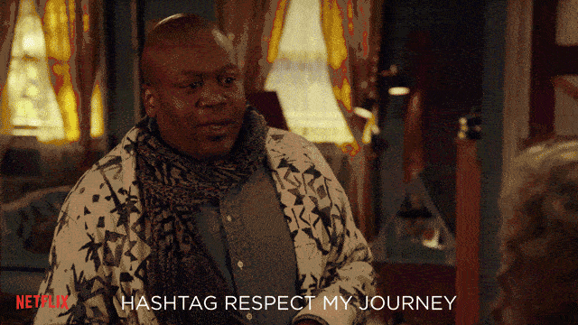

import { Image, Tweetable } from '$components';

Last week I sent out a newsletter about balance.[^newsletter]

[^newsletter]:
  I send about half of my content only to people on my newsletter list. You can make sure to get the extra stuff by [signing up for the list here](https://lengstorf.com/work-happier/).

The email centered around finding _your own_ perfect balance, rather than the
idea that there's a perfect, externally-defined balance out there somewhere.

I got quite a few responses back, but one in particular stuck out to me. It came
from a guy named Alex Mullan, who recently started a new fitness company called
[MASSthetics](http://massthetics.net/). He's still in his first year, and that's
keeping him in a dead sprint:

> On a day-to-day basis, I have very little balance.
>
> At this stage of growing my biz, I spend 8-14 [hours a day] working (for the
> most part), take 1.5–2 hours to train, eat, [...] and fill in any remaining
> time with my girlfriend. **Alex Mullan**

That's a pretty brutal schedule, and Alex knows it.

<Image
  align="right"
  caption="Alex looks like he might know a thing or two about fitness."
  creditLink="http://muscle-insider.com/"
  credit="Muscle Insider"
>

  

</Image>

He tries to offset this rough day-to-day schedule with the occasional day off,
weekend trip, or computer-free day, but that doesn't always work out.

"In reality", he says, "I’m not as adept at doing so as I’d like to be."

There's some cognitive dissonance at play. **On the one hand, Alex knows he
should be taking more time to relax**, spend time with the people he cares
about, and give himself room to recharge.

**But on the other hand, he's made this huge bet on himself as a business
owner**, and, as he says:

> When you rely on yourself to generate income and a living, it’s tough to shut
> off. Especially in the early stages when there’s not as much stability as
> there will be down the road.
>
> If you could, **what would you tell yourself about balance during your first year of full-fledged entrepreneurship?**
>
> **Alex Mullan**

This is a good question — and a _hard_ question — and I liked it so much I asked
Alex if he'd mind me answering on the blog rather than in email.[^spoiler]

[^spoiler]:
  **SPOILER:** He was into it.

## What Would You Tell Yourself About Balance During Your First Year of Entrepreneurship?

In my life, I've had multiple "first years": I got my first taste of
entrepreneurship as a touring musician; after I realized I probably wouldn't
make it as a rockstar, I started over as a freelance web designer; later, I took
a shot and started my own web agency.

**One thing that was consistent across all three experiences was my total
obsession with what I was working on.** I didn't just have a new project; I
_was_ my new project.

I had a schedule that was similar to the brutal hours Alex is putting in now,
and if you'd told me there was another way, I'd have scoffed and written you off
as "not hungry enough".

<Image
  align="right"
  caption="This kid is <em>not</em> interested in my “old man’s view” of the world."
  creditLink="http://artisticvisionmt.com/"
  credit="Artistic Vision"
>

  

</Image>

So the rest of this post is written with two caveats:

1. The Jason writing this post is _not_ the same Jason who was married to his
   projects during each one's first year, and
2. If I actually _could_ go back and give myself this advice, I'm almost certain
   I'd tell myself to fuck off.

But, with the benefit of hindsight, I _do_ have some ideas that I wish I could
have internalized sooner.

### 1. Not all motion is progress.

I have a guilty conscience when I sit still. This still happens today.

**The idea of sitting down, doing nothing, when there's "something productive" I
could be doing instead, makes me itchy.**

But there are two _huge_ problems with that idea, so let me deconstruct what I
just said and point out the flaws.

#### I'm almost never "doing nothing".

These days I harp on [the importance of downtime](/goldilocks-zone-avoid-burnout) and [not creating problems where none exist](/slaying-dragons).

At the core of that line of reasoning is a shift in perspective:

<Tweetable quote="Time spent on hobbies, friends, and rest is NOT wasted time." />

Younger me made an extremely dangerous leap: **I had decided that _any time not
spent on work_ meant I was "doing nothing", and was therefore wasted time.**

This is an extremely corrosive view of the world. It implies that the only thing
in my life worth effort or attention is work — and even my 23-year-old
workaholic self would have called that view unhealthy.

However, until I dug down to [Find the Why](/find-the-why)[^refocus] behind my view that
non-working time was as good as wasted, I would have defended that belief — and
all the appalling consequences — as a virtue that made me _good_ at being an
entrepreneur.

[^refocus]:
  In [Refocus](https://getrefocus.com/), Nate and I harp on the idea of "Finding the Why". At the root of almost everything I've ever done that was damaging or self-destructive, I found an unanswered Why at the bottom of it. As soon as I asked myself why I was doing it, I was able to see a solution.

Which, of course, [it wasn't](/overtime-hurts-productivity).

<Image
  caption="Staring at the screen doesn’t mean things are happening."
  creditLink="http://movies.disney.com/the-incredibles"
  credit="Disney / The Incredibles"
>

  

</Image>

#### There's not always "something productive" to be done.

Another problem with my guilt over not being productive 100% of the time is the
simple fact that **there's not always something productive to do.**

If you're any good at business, you'll end up with days where you've emptied
your inbox, caught up on your projects, and sent out all your sales material.

And once you hit that point, there's not really anything else to be done.

Sure, you can find ways to "stay busy", but are they moving the needle? Or are
they just preventing you from catching your breath?

**Sometimes the most productive thing you can do is shut your goddamn computer
and stop thinking about work**; your subconscious needs room to roll ideas
around if you're going to actually _grow_ the business, after all.

### 2. Your business is not different or special.

**We all think we're special.** Especially those of us who were raised to
believe that we're unique snowflakes with unlimited potential and the mandate of
heaven to really do something great with our lives.

And **that leads us to believe that the advice we give to other people doesn't
apply to us, or to our situation.**

Sure, _most people_ need time off to recover, but _I'm different_.

<Image
  align="right"
  caption="You wouldn’t understand because I’m unlike anyone who’s ever existed and all of my experiences are totally unique. Obviously."
  creditLink="https://www.netflix.com/title/80025384"
  credit="Netflix / Unbreakable Kimmy Schmidt"
>

  

</Image>

Yeah, _most businesses_ grow best by building a great team and making sure there
are no bottlenecks, but _my business is different_ and _only I_ understand how
it really works.

I spent years telling people — especially myself — that my agency needed me in
order to function properly. But I sold it in 2014. It's been a couple years now,
and the company's revenue is still going up — so clearly I wasn't as much of a
lynchpin as I thought.[^opposite]

[^opposite]:
  In fact, I was kind of the opposite. My insistence that my way was the only way actually worked to _demotivate_ my team. They all assumed I was going to make major revisions to any work they did — a sort of pointless tinkering I told myself was a "quality check", but was really just a way to make sure that everything was _mine mine MINE_ — and that meant that their work was ultimately meaningless. So why would they be interested in putting in their best effort?

In fact, if I would have realized this and let my team help me back in the early
days of the agency, maybe I never would have been [so stressed out that I got
sick](/overkill-cult) and felt the need to sell the agency
in the first place.

### 3. Try not to learn everything the hard way.

**I am surrounded by smart people.**

As a musician, a freelancer, and an agency owner, I met people who had made more
progress toward the same goals — record label folks, musicians with deals, more
successful freelancers, agency owners, business consultants, and more — who were
all happy to share their stories about where they'd been, what they'd learned,
and what they wished they'd known when they were in my position.

These folks had _mountains of information_ that was applicable and helpful to me
as I grew my business.

**All of these people were extremely bright, incredibly generous with their time and knowledge, and kind enough to offer me a helping hand as I was learning a new set of skills.**

And — in keeping with my identity as a special little snowflake who knew my
circumstances were "different" — **I ignored them all.**

I spent an embarrassing amount of time bashing my head against the wall, mere
inches from a door that multiple people were trying to point out to me, and I'd
condescendingly wave them off and say, "Yeah, yeah" — _bash_ — "I hear what
you're saying" — _bash_ — "but I _need_ to do it this way" — _bash_ — "and
besides I've pretty much got this handled right now."

## The Checklist: What I Wish First-Year-of-Business Me Would Have Known

1. **Not all motion is progress.** "Keeping busy" doesn't mean you're more
   successful, and taking time to recover is not a sign of weakness.
2. **Your business is not different or special.** The way you would do it is not
   the only way. The sooner you learn that "my way" and "the right way" aren't
   the same thing, the happier you'll be.
3. **Try not to learn everything the hard way.** When someone who's further
   along down the path you're on offers you their personal experience, don't
   dismiss it out-of-hand. You just might save yourself some heartache.

## What would you tell yourself about balance during your first year of business?

Or, if you don't own a business, what do you wish you'd known during your first
year of a job that took _all_ of your time and energy?

**[Tell me your lessons learned on Twitter.](https://twitter.com/intent/tweet?text=%40jlengstorf)**
